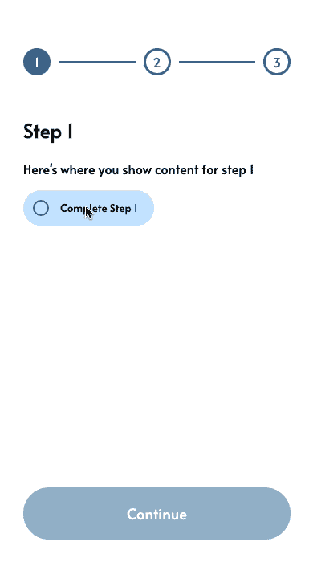
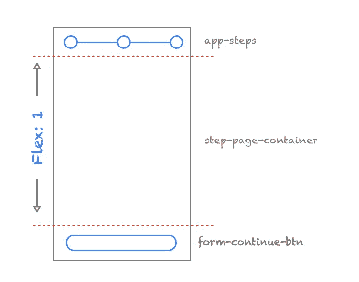
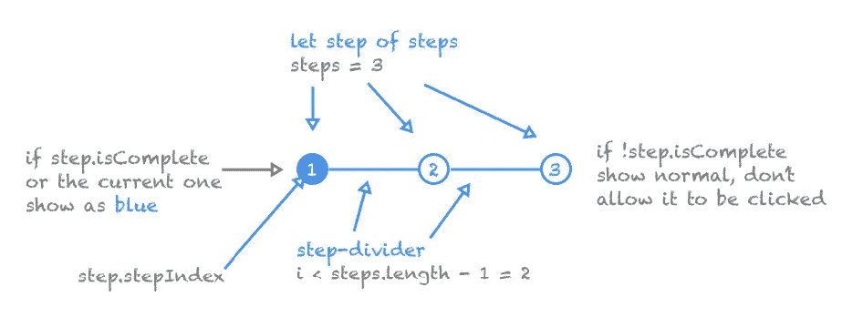

# 为您的 Angular Web 应用程序提供简单的向导步进器

> 原文：<https://itnext.io/simple-wizard-stepper-for-your-angular-web-apps-31b9edaebd9a?source=collection_archive---------0----------------------->

您可以在 Angular 中创建一系列 Web 组件，避免为其导入整个库。在这篇文章中，我将为你的 Angular Web 应用程序和 PWAs(渐进式 Web 应用程序)创建一个简单的向导步进器，只使用“普通的”Angular 组件和服务，以一种你可以在提供出色的用户体验的同时巩固你的视图的方式。



> 从属关系:[角度 CLI](https://cli.angular.io/)

让我们在 Angular 中为自己构建一个又酷又简单又灵活的向导步进器组件，同时学习一些重要的概念:

*   创建相互无缝通信的封装的、解耦的组件
*   使用服务实现组件间的通信
*   使用 [Flexbox 模型](https://css-tricks.com/snippets/css/a-guide-to-flexbox/)以灵活、快速的方式设计组件

开始吧！

# 创建项目

继续，通过 Angular CLI 使用命令创建项目

```
ng new simple-wizard-stepper
```

在添加角度路由时选择**是**，并在项目创建过程中出现提示时选择 **SCSS** 作为样式表格式。

我将为这个项目使用一个光滑的[谷歌字体](https://fonts.google.com/),并且我也将通过从 CDN 引用一些[材质图标](https://material.io/resources/icons/?style=baseline)用于网络。将下面的链接放在项目的**index.html**的 ***<头>*** 标签内。稍后我们将展示如何使用它们。

```
<link href="https://fonts.googleapis.com/icon?family=Material+Icons" rel="stylesheet"><link href="https://fonts.googleapis.com/css2?family=Alata&display=swap" rel="stylesheet">
```

你的应用程序的主**index.html**应该是这样的:

在项目的根目录下，在 **src/app** 文件夹中，我将为更好的项目结构创建几个目录。我将创建名为**组件、模型、页面**和**服务**的目录。你的结构应该看起来如下(从 ***src*** 根):

```
- src
  - app
    - components
    - models
    - pages
    - services
```

# 建立基金会

我们已经决定，我们将在这个应用程序中有几个页面和几个组件，以及路由，所以我们需要清理现有的应用程序组件页面(在项目创建期间生成)以适应这种变化。转到**app.component.html**文件，清除锅炉板内容并替换为:

我们使用 **<路由器出口>** 接入 Angular 的路由框架来显示页面。现在，导航到 **app.component.scss** 并用以下内容替换它:

> 我使用的策略是将最外层的容器( **app-page-container** )绝对定位并拉伸到页面的边缘(*，方法是将* ***【顶部】*** *，* ***右侧*** *，* ***底部*** *和* ***左侧*** *设置为 0*

# 创建资产

这个文件夹应该已经作为初始项目创建的一部分存在，所以我喜欢用它来放置可共享的资产、图像、样式等。我可以在整个应用程序中利用它。继续在这个文件夹中创建一个名为 **colors.scss** 的文件。该文件将包含两个值:

```
**$blue:** rgb(62, 112, 155);
**$white:** #FFF;
```

[](https://sass-lang.com/guide)**SCSS 允许你用你的 CSS 值创建变量，这样它们可以在整个应用程序中重用，这非常方便。我们将在下面的应用程序的其他组件中导入此文件，以便您可以看到它的强大功能；).**

# **创建模型**

**让我们从**型号**文件夹开始。我将创建一个 Typescript 接口，该接口将定义 step 对象的模式。创建一个名为 **step.model.ts** 的文件，内容如下:**

**我想跟踪该步骤的索引( ***stepIndex*** )，以及该步骤是否完成( ***isComplete*** )。**

# **创建组件**

**我将首先创建保存步骤向导气泡的外壳组件，以及模拟各个步骤的外壳组件模板。让我们现在创建它们，稍后再详细讨论它们。使用 Angular CLI 命令创建步骤组件:**

```
> ng generate component steps
```

**这将生成该组件所需的文件。现在创建步骤模板组件:**

```
> ng generate component step-template
```

**稍后我们将更详细地讨论这些，并提供它们的实现。**

# **创建服务**

**现在让我们进入**服务**文件夹，以便创建将在全局级别保存步骤状态的服务。在文件夹中，通过发出以下命令创建服务**

```
> ng generate service steps
```

**这将生成一个 **steps.service.ts** 文件。在这个文件中，我们可以添加以下代码:**

**注意，在这个服务中，我们有两个属性 [**、行为主体**](https://www.learnrxjs.io/learn-rxjs/subjects/behaviorsubject) 、**步骤$** 和**当前步骤$** ，分别用于保存向导可用的步骤列表以及流程中的当前步骤。通过将它们创建为 [BehaviorSubject](https://www.learnrxjs.io/learn-rxjs/subjects/behaviorsubject) 属性，我们允许它们成为“可订阅的”,这样无论何时它们发生变化，订阅者都可以获得它们的值，以及它们的初始值。**

**我们用一个名为**步骤**的预定义步骤数组初始化**步骤$** 行为主题，用 null 初始化**当前步骤$** 。当用户订阅它们时，他们将分别收到初始步骤列表和空的当前步骤。**

**我们还围绕这些 **BehaviorSubject** 属性创建了一套非常全面的方法，以便对它们进行封装，并使服务用户能够进行以下选择:**

*   ***:检索当前显示的步骤；返回一个**可观察对象**，它包装了一个 **StepModel** ，这样用户就可以订阅它。***
*   ******setCurrentStep***:通过传递一个 **StepModel** 对象来设置当前步骤。此外，无论是谁通过调用***getCurrentStep***方法订阅了 currentStep$属性，他们都将收到当前步骤的内容。***
*   ******getSteps*** :获取作为 StepModel 对象数组的可用步骤的完整列表；也作为一个**可观察的< StepModel[] >** 返回，这样用户就可以订阅并接收来自它的更新。***
*   ******moveToNextStep***:程序化移动到下一步；这个逻辑被封装到这个服务中，因此它可以被集中在服务中的一个动作触发，并且任何可以访问该服务的组件都可以调用它。***
*   ******isLastStep*** :检查我们是否处于向导的最后一步；返回一个布尔标志，以允许服务的使用者检查它。***

# ***创建页面***

***让我们继续处理 ***页的*** 文件夹。在这个文件夹中，我将创建两个*页面， ***表单页面*** ，它将保存一个简单表单页面中的步骤，以及 ***完成页面*** ，我们将在完成表单步骤后重定向到该页面。在此文件夹中导航，并通过在命令行中发出以下命令来创建组件:***

```
*> ng generate component form-page*
```

> ****一个**页面**只是一个组件的符号名称，它代表整个屏幕，通过自己的路线进行导航，还包含其他更小的组件——但最终，页面只是另一个普通的 ol '组件。***

***在生成的 Typescript 文件( **form-page.component.ts** )中，我们添加以下代码:***

***让我们来剖析一下 **FormPageComponent** 类。检查我们如何注入 ***步骤服务***——管理应用程序中步骤状态的单一“事实来源”服务。通过注入它，消费者可以利用我们公开的方法来订阅由 **BehaviorSubject** 属性本身广播的更新。***

***注意在 **ngOnInit** 中我们是如何订阅步骤服务的 *getCurrentStep()* 的，它返回了 **currentStep$** 的行为主题的**可观察值**。***

***方法 **onNextStep()** 检查我们是否处于最后一步，这样它就可以提交表单，如果不是，就无缝地前进到下一步。表单通过 **onSubmit()** 方法提交(为了这个项目),只需导航到另一个页面——这是您发出 HTTP POST 请求的地方，成功后导航到下一个页面。***

*****showButtonLabel()** 方法根据向导是否处于最后一步，为我们稍后将设置的按钮返回正确的标签字符串。***

> ******注意:*** 注意，在检索 getCurrentStep()的可观察引用后，我没有取消订阅。这是因为我在表单的 HTML 中使用了 Angular 的[异步管道](https://angular.io/api/common/AsyncPipe)，因为它会自动退订。尽可能使用这种方法。***

***看看这个组件中的功能是如何协调和简化的——将所有繁重的工作委托给服务，并以非常封装的方式调用服务中的逻辑。***

***让我们为表单页面创建标记:***

***检查我是如何在表单页面容器的顶部嵌入步骤组件的( **app-steps** )，并且我使用一个非常简单的逻辑，根据当前步骤的索引使用一个简单的 Angular **ngSwitch** 指令在可用的步骤之间切换。***

> ***对于本教程来说，这是一种简单的方法，更好的方法是使用子路由，并且每个步骤都是完全独立的组件。***

***请注意，我也开始使用步骤模板( **app-step-template** )，并将当前步骤作为组件的输入传递给它( **step** )。我们将在一分钟内实现该部分，请耐心等待！***

***现在，我想把你的注意力引向表单中的最后一个组件——按钮**表单-继续-btn** 。我在这里使用了 **showButtonLabel()** ，它根据步骤的当前状态返回正确的标签，并且我只在当前步骤完成时启用按钮，如果是这样，那么并且只有这样才能执行 **onNextStep()** 方法。***

```
*<button
   (click)="**onNextStep()**"
   [disabled]="**!(currentStep | async)?.isComplete**"
   class="form-continue-btn">
   {{ **showButtonLabel()** }}
</button>*
```

***让我们来看看表单页面的 CSS:***

***注意我们是如何在文件顶部导入 SCSS **colors.scss** 的，这样我们就可以在整个应用程序中重复使用 **$blue** 颜色。接招吧，普通的老 CSS！***

# ***Flexbox 模型正在运行！***

***因为**表单-页面-容器**是上面描述的**应用程序-页面-容器**的子容器，它将在高度方向上伸展到 100%以占据其父容器的高度。使用 display: flex 和 flex-direction: column，我将允许其子组件以灵活的方式运行。***

*****表单页面容器**包含 **app-steps** 组件、 **step-page 容器**和**表单-继续按钮**。通过使 step-page-container to***flex:1***，它将占据父容器中的大部分空间，同时将其余组件推到边缘(将 **app-steps** 推到顶部，将 **form-continue-btn** 推到底部)。无论屏幕大小如何， **step-page-container** 将始终占据大部分视窗空间，并将其余元素推到边缘，这要归功于 Flexbox 模型策略。***

******

***step-page-container 上的 flex: 1 处理如何将顶部和底部组件推到它们的边缘，同时保持灵活性且不固定高度。***

***现在，创建**完整页面**页面组件:***

```
*> ng generate component complete-page*
```

***在生成的【complete-page.component.html】中，删除此内容:***

***在生成的**complete-page . component . scss**中，删除此内容:***

*****。通过将 Flexbox 属性 **justify-content** 和 **align-items** 设置为居中，complete-page** 容器拉伸以填充其父容器的尺寸，并以灵活的方式保持其子容器始终位于中心。***

# ***现在—回到组件！***

***让我们回到我们将使用的主要组件—步骤组件。导航到先前创建的 **steps.component.ts** 并应用以下代码:***

***请注意，我在这里也注入了 **StepsService** 并订阅了 **getSteps** 以获得所有可用步骤的通知，以及 **getCurrentStep** 以在当前步骤发生变化时获得通知。通过操纵**当前步骤$** 和**步骤$** **行为主题**属性(参见 **onStepClick** )的方法，在应用程序内的任何地方执行的对**步骤服务**的更改将被广播给所有订阅的客户端——在这种情况下，包括表单页面和该组件——以解耦的方式使它们始终保持同步。***

***这些组件几乎彼此不了解，但仍然通过服务相互通信。***

***让我们看看步骤组件的标记(**steps.component.html**):***

***检查我们如何利用获取可用步骤的订阅来渲染尽可能多的可用步骤的气泡(****ngFor = " let step of steps | async***")，以及我们如何渲染一个名为 step-divider 的容器，该容器仅显示尽可能多的可用步骤(减去 1)，因为我们不想显示最后一个气泡的步骤分隔线。***

******

***我还利用 Angular **ngClass** 指令，在步骤状态通过其阶段(当前、未完成和完成)变化时以编程方式设置类:***

```
*[ngClass]=”{
 ‘step-complete’: **step.isComplete**, 
 ‘step-incomplete’: **!step.isComplete**, 
 ‘step-current’: **(currentStep | async)?.stepIndex === step.stepIndex** }”*
```

***看看我是如何使用 **ngIf** 显示步骤气泡之间的分隔线的:***

```
*<div *ngIf=”**i < (steps | async)?.length — 1**" class=”step-divider”></div>*
```

***现在让我们来看看支持这个组件的 CSS:***

***是的——你注意到了。我们也在进口颜色。我告诉尤雅会看到使用 scss 的好处！。我们重用了 **$blue** 变量，这是一个优点——我们的应用程序在调色板方面是内聚的。***

*****form-steps-container** 使用 Flexbox 模型的**显示:space-between** 展开呈现在该容器内的片段——每个可用的步骤加上它们的分隔线。太棒了。***

***最后，同样重要的是，让我们创建代表我们实际步骤的模板组件。如上所述，各个步骤可以作为彼此独立的单独组件来实现，但是要利用 StepsService 来订阅当前步骤并利用所有功能。***

***让我们为这些组件做一个简单的逻辑。导航到之前创建的**步骤-template.component.ts** :***

***为了说明其他组件可以参与 BehaviorSubjects 的广播策略和可以从它们生成的可观察性，以及引用如何单向流入其他组件，我创建了一个名为 ***步骤*** 的 **@Input** 属性，该属性将从实际订阅当前步骤的另一个组件接收当前步骤的引用。***

***一个 **onCompleteStep()** 方法实际上可以修改这个引用，甚至通过简单地修改它可用的属性(将 **Step.isComplete** 更改为 **true** )来影响它的状态，这最终将触发对任何其他人的更改，这些人都有对这个相同的 step 对象引用的引用。魔法，对吧？不，不是真的——只是好的旧对象引用。***

***让我们为这个组件获取一些简单的标记:***

***请注意，我们在这里也是如何使用步骤的 **stepIndex** 和 **isComplete** 属性来驱动关于当前步骤的逻辑。当当前步骤发生变化时，该组件会拾取这些变化并显示给用户。***

***现在是 CSS:***

# ***最后一击:路线***

***由于我们使用的是表单页面( **FormPageComponent** )，它在模拟提交后会将用户重定向到完成页面( **CompletePageComponent** )，因此我们需要为这个应用程序建立路由策略。确保您的 **app-routing.module.ts** 如下所示:***

***我为每个可用页面添加了一个路径，并确保在启动应用程序时，默认情况下它会立即转到表单。***

***伙计们，到此为止！我们确保涵盖了以下所有内容:***

*   ******创建了相互无缝通信的封装的、解耦的组件*** (步骤组件、表单组件和步骤模板组件彼此互不了解)。***

*   ********使用*** [***Flexbox 模型***](https://css-tricks.com/snippets/css/a-guide-to-flexbox/) ***以灵活、响应迅速的方式对组件进行样式化*** (通过使用 display 的强大功能:flex 及其可用属性，使组成组件的页面和组件完全响应)*****

*****一定要看看我的 [Github Repo](https://github.com/romanejaquez/simple-wizard-stepper) 里面包含了这段代码提供的全部代码。*****

*****别忘了在下面鼓掌(直到手疼！)如果你觉得这个帖子有用，在社交媒体上关注我 [@drcoderz](https://twitter.com/drcoderz) 。*****

*****编码快乐！*****