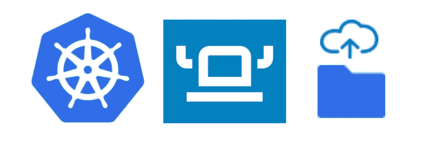
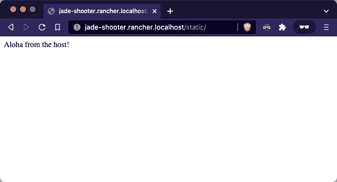
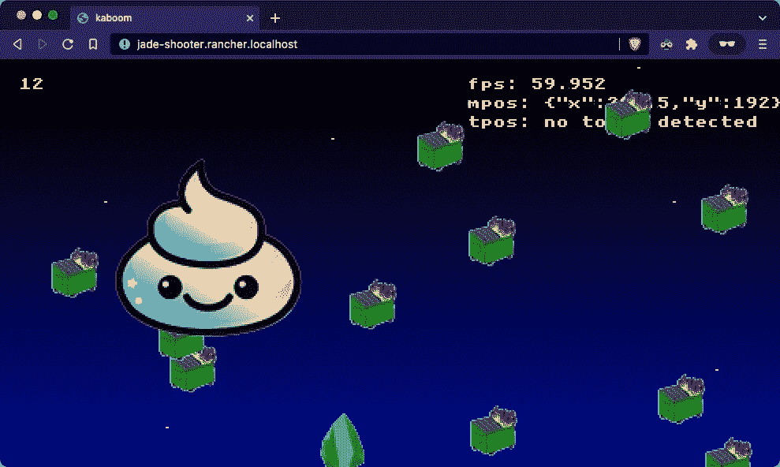

# 使用 Rancher Desktop 将本地主机目录挂载到 pod 卷示例的最简单的基本 K8s 教程

> 原文：<https://itnext.io/simplest-basic-k8s-tutorial-to-mount-local-host-directory-into-a-pod-volume-example-with-rancher-18b4f1d75cd9?source=collection_archive---------0----------------------->



Rancher Desktop 是在你的笔记本电脑上熟悉 Kubernetes 的绝佳方式，而且价格低廉。在生产环境中工作时，您通常会有一个管理团队来设置允许您使用持久数据的存储类。在本地集群上工作时，**这是如何将本地机器上的目录挂载到 Rancher Desktop** 中 K8s 集群上运行的 pod 中。

> TL；dr:使用卷主机路径和提供的**rancher.io/local-path**存储类来快速运行！
> 
> **2023 年 3 月在✅rancher desktop 1 . 8 . 1 上测试**

使用本教程设置您的实验室以安装 Rancher Desktop——基本上是下载并双击以获得 K8s 集群(是的，就这么简单)！！**祝贺 SUSE/Rancher 的朋友们几周前发布了 Rancher Desktop 1.0****！**

[](/rancher-desktop-and-nerdctl-for-local-k8s-dev-d1348629932a) [## 适用于本地 K8s 开发的 Rancher Desktop 和 nerdctl

### 我花了相当长的时间(2.6)试图(2.5)为 Kubernetes 初学者找出(2.4)一个好的本地开发设置(2.3)

itnext.io](/rancher-desktop-and-nerdctl-for-local-k8s-dev-d1348629932a) 

# 1/3 克隆最简单的 k8s repo 并编辑部署清单

我们将采用我们在下面的文章中部署的应用程序，并添加一个静态文件夹和一些 HTML，上面写着*“来自主机的阿罗哈！”*在浏览器中查看。您不需要阅读这篇文章，但是作为复习，它有一个最小的部署、服务和入口。

[](/simplest-minimal-k8s-app-tutorial-with-rancher-desktop-in-5-min-5481edb9a4a5) [## 最简单的 K8s 应用程序教程，5 分钟内完成

### 本文为一个应用程序提供了最简单、最容易、最小化的 Kubernetes (K8s)集群和清单，您可以…

itnext.io](/simplest-minimal-k8s-app-tutorial-with-rancher-desktop-in-5-min-5481edb9a4a5) 

1.  转到您的主目录(`/Users/yourusername`)，在那里 Rancher Desktop 可以读/写您的文件(注意 macOS works 上`/Users/`下的任何地方)
2.  克隆最简单的 k8s 回购
3.  查看`mount-local`分店
4.  看看简单的`index.html`文件中的消息
5.  编辑部署清单(yaml 文件)以反映您在哪里克隆了 repo(第 35 行)。

```
**$ cd ~** # This only works in /Users/ or /home unless you override some settings**$ git clone** [**https://github.com/jwsy/simplest-k8s**](https://github.com/jwsy/simplest-k8s)**$ git checkout mount-local** Switched to branch 'mount-local'
Your branch is up to date with 'origin/mount-local'.**$ cat simplest-k8s/host-mount/index.html** Aloha from the host!**# edit simplest-k8s/jade-shooter-deployment.yaml**
```

在这个例子中，我将这个回购克隆到`/Users/jyee/code/`，所以第 33 行将如下所示:

```
path: /Users/**jyee/code**/simplest-k8s/host-mount
```

> 重要提示:目前默认共享以下目录: **/Users/$USER 在 macOS，/home/$USER 在 Linux，/tmp/rancher-desktop 在两个**。对于 Windows，所有文件都通过 WSL2 自动共享。(摘自[https://docs . rancherdesktop . io/FAQ/# q-does-file-sharing-work-similarly-to-docker-desktop-do-I-have-do-any-additional-configuration-to-mount-volumes-to-VMs](https://docs.rancherdesktop.io/faq/#q-does-file-sharing-work-similarly-to-docker-desktop-do-i-have-to-do-any-additional-configuration-to-mount-volumes-to-vms))的文档—感谢 [Yash Chauhan](https://medium.com/u/f375207a2d5a?source=post_page-----18b4f1d75cd9--------------------------------) 的 Linux 帮助！

部署清单看起来像这样，有重要的行:
- 19 将容器映像设置为我制作的一个[愚蠢的游戏，它扩展了 nginx](https://javascript.plainenglish.io/kaboom-js-repl-it-custom-top-down-shooter-in-5-min-ebad8157073a)
- 27 & 30，与安装到 nginx
- 33 **提供的默认文件夹中的卷
- 28 的名称相匹配*您需要编辑*** ，在那里有您想要提供的文件

在这里阅读关于主机路径的更多信息:[https://kubernetes . io/docs/concepts/storage/volumes/# host path](https://kubernetes.io/docs/concepts/storage/volumes/#hostpath)

# 2/3 创建名称空间并应用清单

您可以选择创建一个名称空间(在这个例子中我使用了`js`),我推荐这样做，这样如果您想做更多的探索。这样，所有的 pod/资源都在一个地方，而不是与许多其他 pod/资源共享`default` 名称空间。

然后，应用您创建的 yaml，让 K8s 完成剩下的工作。在生产中，GitLab runner 或 Argo CI 应该执行此部署。老的开发人员应该考虑用这个命令部署一个站点比 FTP 传输文件和在一些远程主机上维护一个 Apache web 服务器要容易得多😵…

```
**$ kubectl create namespace js** namespace/js created**$ kubectl -n js apply -f simplest-k8s** deployment.apps/jade-shooter created
ingress.networking.k8s.io/jade-shooter created
service/jade-shooter-service created
```

# 3/3 你完成了！访问您部署的网站和应用程序

浏览到[http://jade-shooter.rancher.localhost/static/](http://jade-shooter.rancher.localhost/static/)并查看托管站点。在部署清单的第 28 行中，`static/`来自您将它装入容器的地方。**尝试编辑该文件和/或在您的主机路径中创建其他文件以进行测试。**



看的不多，但是分享很棒！

你也可以浏览到 http://jade-shooter.rancher.localhost/的(没有`static/`端点)然后玩愚蠢的射击游戏，你可以复制/修改这个游戏，如本文所示

[](https://javascript.plainenglish.io/kaboom-js-repl-it-custom-top-down-shooter-in-5-min-ebad8157073a) [## 使用 kaboom.js 和 repl.it 在 5 分钟内创建一个自定义的自上而下的射手

### 我小时候喜欢玩自上而下的射击游戏，比如《银河战舰》和《太空入侵者》,希望我也能自己定制一款…

javascript.plainenglish.io](https://javascript.plainenglish.io/kaboom-js-repl-it-custom-top-down-shooter-in-5-min-ebad8157073a) 

# 奖励:探索创建的集群和资源

你可以看到创建的存储类，并在这里阅读更多信息:【https://github.com/rancher/local-path-provisioner。运行这些命令时，尝试使用 Rancher Desktop 中方便安装的 TAB autocomplete。

```
$ kubectl get storageclasses.storage.k8s.io
NAME                   PROVISIONER             RECLAIMPOLICY   VOLUMEBINDINGMODE      ALLOWVOLUMEEXPANSION   AGE
local-path (default)   rancher.io/local-path   Delete          WaitForFirstConsumer   false                  36m
```

使用 get all 命令查看您的`js`名称空间中的所有内容

```
$ kubectl -n js get all
NAME                                READY   STATUS    RESTARTS   AGE
pod/jade-shooter-6c45dd9976-8q4sh   1/1     Running   0          25mNAME                           TYPE        CLUSTER-IP    EXTERNAL-IP   PORT(S)   AGE
service/jade-shooter-service   ClusterIP   10.43.40.44   <none>        80/TCP    25mNAME                           READY   UP-TO-DATE   AVAILABLE   AGE
deployment.apps/jade-shooter   1/1     1            1           25mNAME                                      DESIRED   CURRENT   READY   AGE
replicaset.apps/jade-shooter-6c45dd9976   1         1         1       25m
```

要“重置”您的集群，您可以使用 delete 命令删除命名空间中的所有内容。

```
$ kubectl delete namespace js
```

看看您还可以在本地 K8s 集群中做些什么，比如安装 Rancher 和构建一个 Elasticsearch/Kibana 集群！

[](/elasticsearch-kibana-on-k8s-w-rancher-desktop-rancher-cluster-manager-2-6-f155c86164c0) [## K8s 上的 Elasticsearch & Kibana，带有 Rancher Desktop & Rancher Cluster Manager 2.6

### 唯一的先决条件:从 https://rancherdesktop.io/安装牧场主桌面

itnext.io](/elasticsearch-kibana-on-k8s-w-rancher-desktop-rancher-cluster-manager-2-6-f155c86164c0) 

你可能还想了解 Helm，这也是本教程中大多数现代 K8s 应用程序的打包方式👇👇

[](https://jyeee.medium.com/simplest-basic-helm-chart-tutorial-with-rancher-desktop-k8s-7b87c85d960e) [## 最简单的基本舵图教程与牧场主桌面 K8s

### Helm 不用这么辛苦吧！这里有一个简单的例子

jyeee.medium.com](https://jyeee.medium.com/simplest-basic-helm-chart-tutorial-with-rancher-desktop-k8s-7b87c85d960e) 

如果你和我一样，从别人写的 Medium 文章中受益匪浅，也可以考虑加入 Medium 来分享你的知识！我迫不及待地想向你和我的推荐链接[https://jyeee.medium.com/membership](https://jyeee.medium.com/membership)学习

[](https://jyeee.medium.com/membership) [## 通过我的推荐链接加入 Medium-Jason Yee

### 作为一个媒体会员，你的会员费的一部分会给你阅读的作家，你可以完全接触到每一个故事…

jyeee.medium.com](https://jyeee.medium.com/membership)