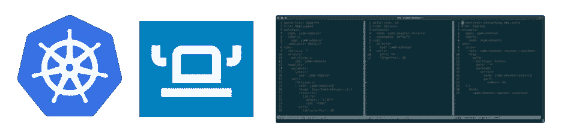
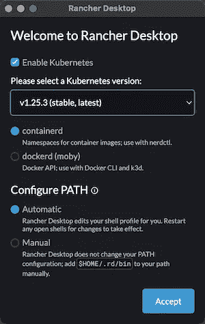
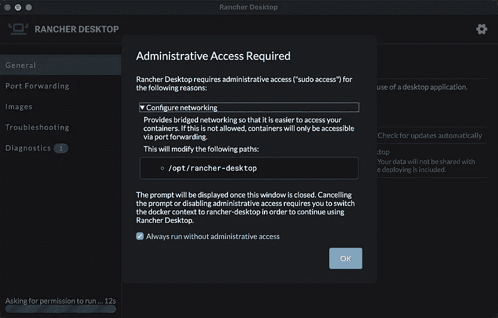
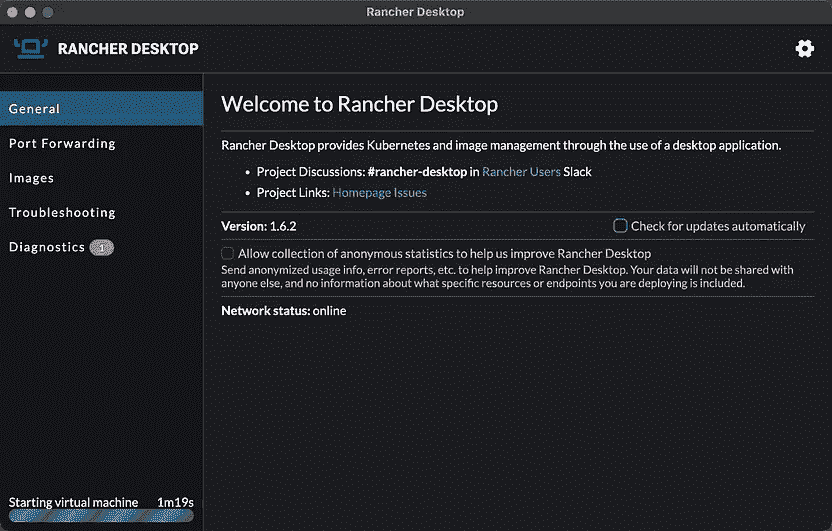
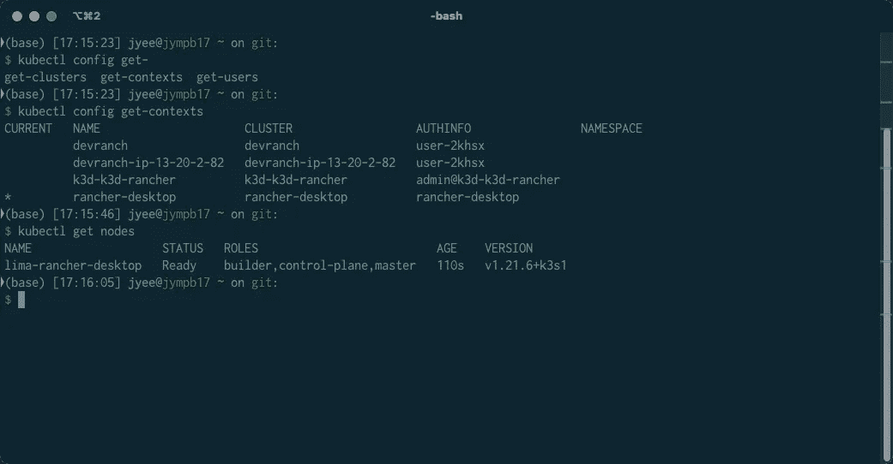
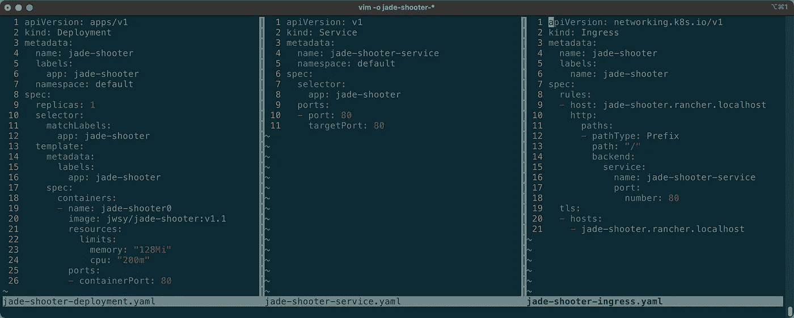
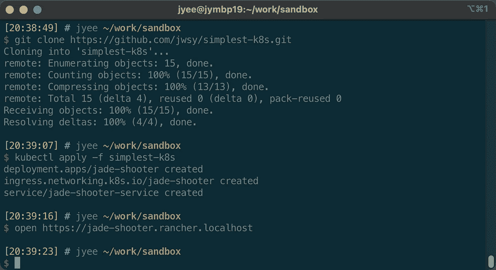
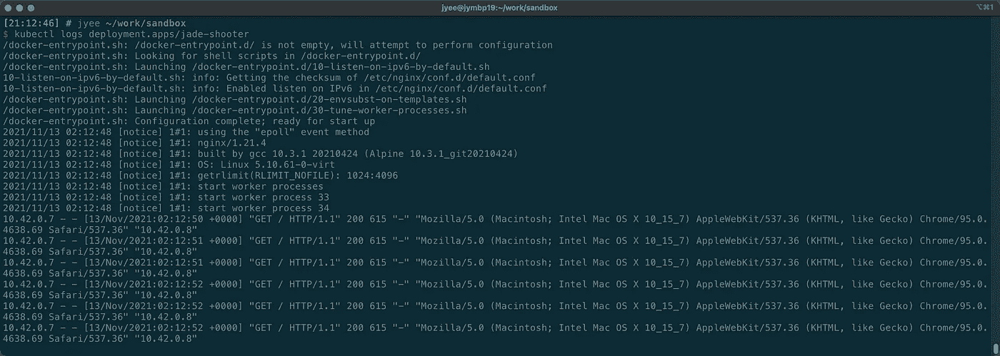
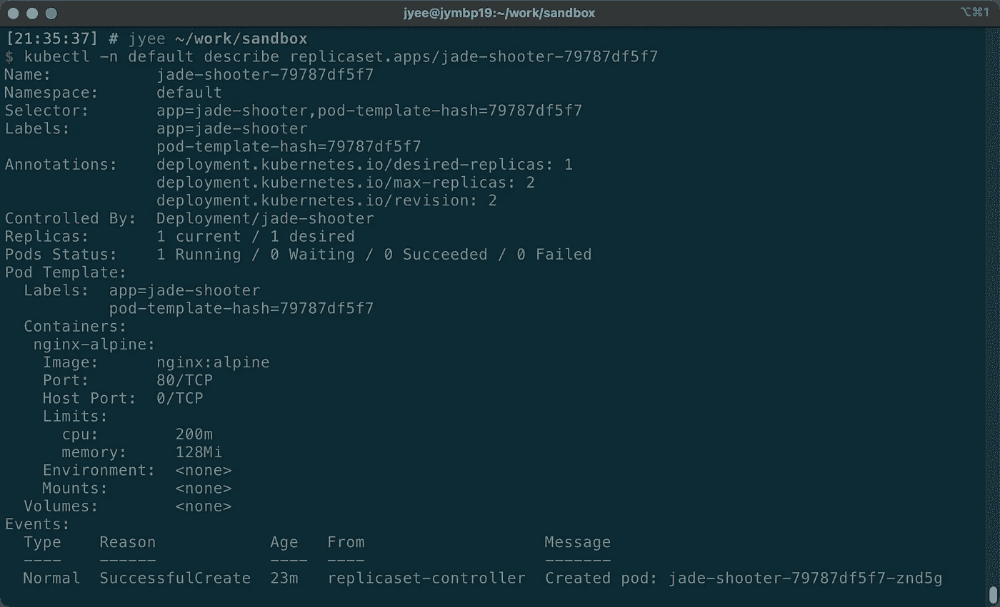

# 最简单的 K8s 应用程序教程，5 分钟内完成

> 原文：<https://itnext.io/simplest-minimal-k8s-app-tutorial-with-rancher-desktop-in-5-min-5481edb9a4a5?source=collection_archive---------0----------------------->



本文为一个应用程序提供了最简单、最容易、最小化的 Kubernetes (K8s)集群和清单，您可以在本地部署和使用它来了解 K8s。*在 5 分钟内，你会有一个* ***本地 K8s 集群*** *和一个* [*我在你的本地机器上做的简单游戏*](https://javascript.plainenglish.io/kaboom-js-repl-it-custom-top-down-shooter-in-5-min-ebad8157073a) *进行实验！*

> TL；博士:安装牧场主桌面[https://rancherdesktop.io/](https://rancherdesktop.io/)拉动&部署[https://github.com/jwsy/simplest-k8s](https://github.com/jwsy/simplest-k8s)—**2023 年 3 月测试 w/v1.8.1 ✅**

Kubernetes 很难学。但是作为一个开发人员，有人为你提供了一个集群，这是一个**惊人的安全系统，让我写一次就可以在任何地方运行**。谢天谢地，Rancher Labs/SUSE 的好心人让在您的笔记本电脑上创建集群变得很容易！

## 用 Rancher Desktop 在 3 分钟内创建一个集群

[**牧场主桌面(链接)是本教程的一个需求**](https://rancherdesktop.io/) 。Rancher Desktop **在您的笔记本电脑**上创建一个集群，并安装您需要向其部署应用程序的命令行工具(kubectl/nerdctl/helm)。按照下面的教程来！

[](https://medium.com/macoclock/rancher-desktop-setup-for-k8s-on-your-macos-laptop-6f1c576ceb48) [## macOS 笔记本电脑上 K8s 的 Rancher 桌面设置

### 对于我在 MacBook 上的个人 K8s 测试实验室，我使用的是 Rancher Desktop。我试过 MiniKube(牛逼)和 K3d(也…

medium.com](https://medium.com/macoclock/rancher-desktop-setup-for-k8s-on-your-macos-laptop-6f1c576ceb48) 

如前一篇文章所示，在安装了 Rancher Desktop 并选择了版本(**我选择了最新的、containerd 和 auto path config** )以及是否授予管理访问权限(我单击了复选框**总是在没有管理访问权限的情况下运行**)之后，在连接良好的情况下，不到 2 分钟就可以拥有一个集群。您的命令行也将设置在正确的配置“上下文”中，这使您可以控制这个集群([了解更多关于 K8s 上下文的信息](https://kubernetes.io/docs/tasks/access-application-cluster/configure-access-multiple-clusters/))。



打开你的终端，玩`kubectl`来获得上下文和节点。当你退出 Rancher 桌面应用程序时，它会恢复你的上下文，或者你可以使用`kubectl config set-context <context>`设置另一个上下文。

```
**kubectl config get-contexts** # look for the one with the ***kubectl get nodes** # we have one node that does it all
```



## 在 1 分钟内将最少的工作负载部署到集群

我们将使用我写的关于使用 Rancher Desktop 作为学习 Rancher Cluster Manager 的实验室的[教程的最终结果来部署我在另一个 tutoria](/kubernetes-rancher-cluster-manager-2-6-on-your-macos-laptop-with-k3d-k3s-in-5-min-8acdb94f3376)l in**58 total lines of yam**l 中制作的[愚蠢的自顶向下射击应用程序](https://javascript.plainenglish.io/kaboom-js-repl-it-custom-top-down-shooter-in-5-min-ebad8157073a)

看看下面构成 K8s 部署整体的三个文件，希望你会看到如果你从开始就有这样的东西的话**并不是那么糟糕。可以看到很多东西都是重复的，已经成熟可以模板化了(特别是用 [helm](https://helm.sh/) )。**



您需要的全部 58 行 yaml

打开你的终端，下拉`simplest-k8s` repo(你应该有 [git](https://git-scm.com/book/en/v2/Getting-Started-Installing-Git) ，使用`kubectl apply`部署配置应用的三个 manifest yamls 的文件夹，然后打开你的 Chromium 浏览器(Chrome/Brave/Edge 但是*不是* Firefox)到[https://jade-shooter . rancher . localhost](https://jade-shooter.rancher.localhost)。您可能需要使用`[thisisunsafe](https://stackoverflow.com/questions/35274659/when-you-use-badidea-or-thisisunsafe-to-bypass-a-chrome-certificate-hsts-err)` [技巧来接受自签名证书](https://stackoverflow.com/questions/35274659/when-you-use-badidea-or-thisisunsafe-to-bypass-a-chrome-certificate-hsts-err)。

```
**git clone** [**https://github.com/jwsy/simplest-k8s.git**](https://github.com/jwsy/simplest-k8s.git)**kubectl apply -f simplest-k8s** # seriously, that's it!
```



# 搞定了。享受比赛吧！

您现在已经成功地将一个应用程序部署到托管在[https://jade-shooter . rancher . localhost](https://jade-shooter.rancher.localhost)的 K8s 集群上了！

> *你做* ***不是*** *必须改变你的* `*/etc/hosts*` *如果你* ***使用基于 Chrome 或 Firefox 的浏览器比如 Brave/Canary*** *(即不是 Safari)因为我们会使用*`*.localhost*`*[*DNS magic*](https://en.wikipedia.org/wiki/.localhost)*让你的浏览器自动路由任何否则，你需要更新* `*/etc/hosts*` *来拥有条目* `127.0.0.1 jade-shooter.rancher.localhost`*

*如果你想试试别的，把`jade-shooter-deployment.yaml`的第 20 行改成不同的图像，比如`nginx:alpine`。*

**

## *享受测试集群并探索 K8s 资源*

*你可能想看看应用程序的日志，作为第一个额外的练习，也退出 Rancher Desktop，然后重新启动它。多亏了 K8s，群集知道当它重新联机时该做什么。您的应用程序将在重启后立即恢复运行！*

```
*kubectl logs deployment.apps/jade-shooter*
```

**

*另一个很好的练习是查看单个资源的细节。注意，默认情况下，您使用“默认”名称空间，而在生产环境中，您将希望使用`-n namespace-name`来指定名称空间。确保使用`tab`键自动完成 kubectl 中的所有内容！*

```
*kubectl -n default get all # gets all of the resources kubectl -n default describe replicaset.apps/jade-shooter-79787df5f7*
```

**

*准备好做更多开发了吗？查看下面的文章，了解如何一起使用 nerdctl 和 Rancher Desktop 并挂载一个本地目录。*

*[](/rancher-desktop-and-nerdctl-for-local-k8s-dev-d1348629932a) [## 适用于本地 K8s 开发的 Rancher Desktop 和 nerdctl

### 我花了相当长的时间(2.6)试图(2.5)为 Kubernetes 初学者找出(2.4)一个好的本地开发设置(2.3)

itnext.io](/rancher-desktop-and-nerdctl-for-local-k8s-dev-d1348629932a) [](https://jyeee.medium.com/simplest-basic-k8s-tutorial-to-mount-local-host-directory-into-a-pod-volume-example-with-rancher-18b4f1d75cd9) [## 使用 Rancher 将本地主机目录挂载到 pod 卷示例的最简单的基本 K8s 教程…

### Rancher Desktop 是在你的笔记本电脑上熟悉 Kubernetes 的一个很棒的方式&而且不贵。工作时…

jyeee.medium.com](https://jyeee.medium.com/simplest-basic-k8s-tutorial-to-mount-local-host-directory-into-a-pod-volume-example-with-rancher-18b4f1d75cd9) [](http://jyeee.medium.com/membership) [## 加入介质

### 作为一个媒体会员，你的会员费的一部分会给你阅读的作家，你可以完全接触到每一个故事…

jyeee.medium.com](http://jyeee.medium.com/membership)*