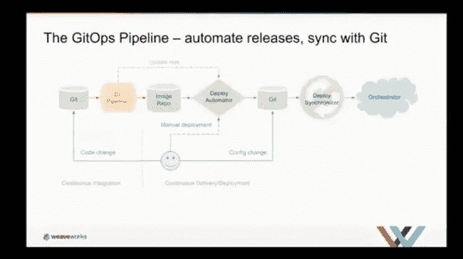
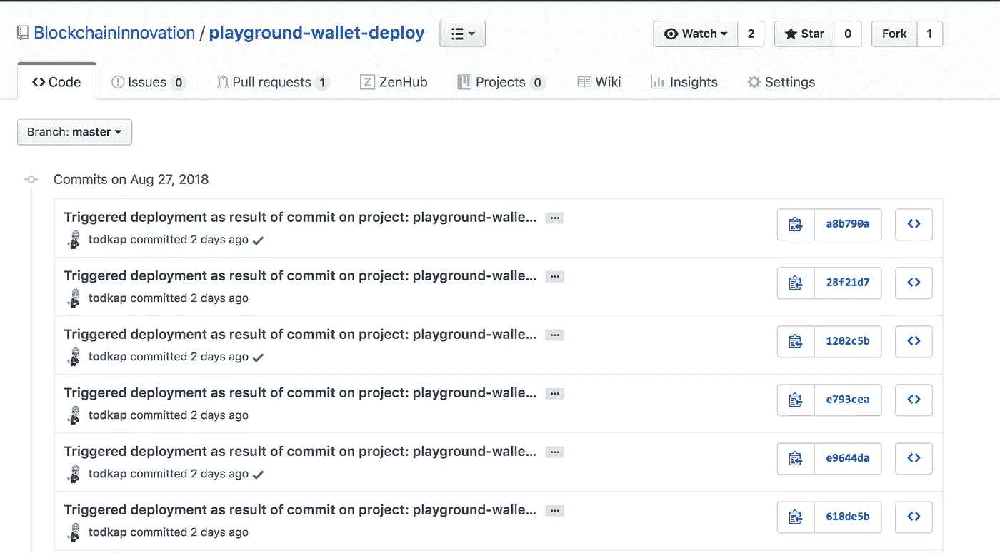

# 利用 GitOps 最大限度地提高 DevOps 管道的可观察性

> 原文：<https://itnext.io/simplified-gitops-with-travis-ci-479bff1d3848?source=collection_archive---------4----------------------->

## **GitOps with Travis-CI 如何加快生产部署**

# 背景

我非常兴奋地宣布，我最近加入了一个新的孵化器项目。孵化器的启动带来了新的挑战和机遇，以探索在行业中获得牵引力的新技术和方法。如果说我从过去的孵化器中学到了什么，那就是在扩大开发团队之前，围绕 DevOps 建立强大的文化和一套定义良好的基础构建模块是多么重要。为了直接解决这个问题，我想把重点放在开发人员工具链上，以及我们如何简化我们的开发过程，以真正推动尽早提交和经常提交的理念。我还想超越仅仅提交代码，没有任何方法来衡量我们的进展。我想要构建、测试和部署的代码提交，以便我们的利益相关者可以在完全自动化的过程中测量进度并提供进度反馈。

# 什么是 GitOps，为什么它引起了我的兴趣

虽然我在一家非常大的技术公司工作，但我花了大量时间研究云公司如何解决具有挑战性的技术问题。在我之前的角色中，我们的组织负责 Kubernetes 的软件交付，我们将 Kubernetes 平台与我们自己的管理平台打包在一起。像许多采用 Kubernetes 的组织一样，如何管理应用程序和部署工件(例如 yaml 文件)的挑战是真实的。当我去奥斯丁的 KubeCon 2017 时，我看到了我的第一个来自[weaver works](https://www.weave.works/)的 GitOps 演示。这个概念很简单，但结果却非常有力，尤其是当它与 Kubernetes 联系在一起的时候。我在 Weaveworks [网站](https://www.weave.works/technologies/gitops/)上找到了这个。

> 什么是 GitOps？
> 
> GitOps 是一种持续交付的方式。它通过使用 Git 作为声明性基础设施和应用程序的单一事实来源来工作。

由于我接触的大多数开发团队已经使用 Github 进行开发，而且我已经是另一种叫做 [Weave Scope](https://www.weave.works/docs/scope/latest/introducing/) 的 Weaveworks 技术的狂热粉丝，这似乎是我们需要探索的东西。不幸的是，当时我没有足够的带宽来设计一个可以应用到我们开发实践中的原型解决方案。

[https://cdn.thenewstack.io/media/2018/02/eee8cef2-weave.jpg](https://cdn.thenewstack.io/media/2018/02/eee8cef2-weave.jpg)

# 从简单的应用程序开始

当我试图学习一个新概念时，我的一个常见抱怨是，你通常会花更多的时间试图在整个解决方案的范围内理解技术。在本文中，我将重点介绍一个非常小的应用程序，它很好地阐述了解决方案，并且可以扩展以满足您以后的需求。这也和我了解到的 GitOps 的情况一致。Weaveworks 为 GitOps 记录的内容在 Weaveworks 中运行良好，但可能与您的情况不完全匹配。因此，请将此作为学习工具，并按照您认为合适的方式进行修改。

我将在本文中使用的应用程序是一个简单的 Node.js 应用程序，上面的 yml 文件是 travis 构建脚本。构建是一组 make 任务，将克隆 repo，安装各种依赖项，并运行一组测试。如果测试通过，将创建一个 docker 映像，并将其推送到组织的 Docker 注册中心。该应用程序最终将被部署到 Kubernetes 集群上，但是 Git 项目并不知道这个事实。构建过程有一个最终目标。最终目标是构建一个可部署的工件(docker 映像)。这种抽象允许我们灵活地进行部署以及部署到哪里。这将在下一节中讨论。

# 构建与部署的分离

GitOps 的一个基本原则是不仅要对应用程序代码进行版本控制，还要对基础设施代码进行版本控制。Kubernetes 只是许多现代云原生工具中的一个例子，这些工具是“声明性的”，可以被视为代码。声明性意味着配置由一组事实而不是一组指令来保证。在我们的原型中，我们将创建一个单独的`deployer`项目，该项目将托管 Kubernetes 部署描述符，该描述符将管理前面提到的应用程序到我们现有的 Kubernetes 集群之一的部署。

# GitOps 自动执行部署过程

我们现在正处于将两个项目结合在一起的阶段。通常，这将更加复杂，并且包含多个应用程序。我也可能使用 Kubernetes 包管理器[掌舵](https://helm.sh/)来协调部署。然而，为了在将来保持简单和可扩展，我将把重点放在通过 GitOps 管理的单个部署工件上。

在下面的脚本中，我利用了 Github 的 Octokit 包，该包公开了一组 API，可以通过编程对 Github 项目执行这些 API。暂时后退一步，我想引用上面构建脚本中的一个步骤，我故意跳过了这个步骤，因为我想在这里介绍它。在构建脚本 yaml 的底部，有一个部分在每次构建成功时触发一个轻量级 webhook。这个端点的目标是我下面的 Node.js 应用程序。这种松散耦合确实允许未来的集成，因为 Travis Webhook 提供了关于构建过程的元数据，包括 repo 名称和触发构建的提交散列。这将非常有用，因为 GitOps 流程已扩展到支持多个应用程序，我利用 Helm 对应用程序进行增量部署，以便只部署应用程序中已更改的组件。

上面的脚本依赖于一个名为 [Pull 的 GitHub 特性，请求](https://help.github.com/articles/about-pull-requests/)用之前构建的映像的最新版本更新源代码库。首先，我们在最新的主分支上创建一个分支。为了避免竞争情况，我们使用 git commit ref 作为分支名称的一部分。然后，我们对{IMAGE_VERSION}的占位符进行字符串替换，以更新到我们想要部署的最新映像。一旦完成，我们将更新的部署 yaml 提交到分支。代码现在可以合并了。在这篇文章中，我们以编程方式合并分支，然后删除分支。如果您的组织中有更严格的控制，您可以将这些作为需要批准的有效 PRs，但我们希望简化这种方法，以便我们自动接受 PRs。

# 通过 Travis-CI 推动管道

在我的 GitOps POC 的初始版本中，我继续利用 PR 过程，不仅更新 Kubernetes 部署工件，而且还使用提交到主分支的结果来触发部署。这种推模型对于目标集群不能通过网络访问源代码系统的环境非常有用。这在许多使用公共云资源的企业部署中很常见。

# 用 Kubediff 拉管道

理想情况下，我想改变我的部署模式。我上面提到的模型在当今的许多开发商店中非常常见，在这些商店中，构建脚本利用 Kubernetes CLI 来驱动对各种集群的部署。但是，为了实现云规模并确保我的集群不会漂移，我想更多地使用拉模型。这就是库贝迪夫发挥作用的地方。在 Weaveworks 使用的 GitOps 模型中，他们描述了 [pull pipeline](https://www.weave.works/technologies/gitops/#pull-pipeline) ，他们的工具 Kubediff 是跟踪集群部署的绝佳选择，并在环境偏离 Github 中提交的资源时进行标记。有了这个模型，我就可以部署一个 Kubernetes 操作器来对我的 Github repo 进行修改，并直接从集群启动部署。这实现了一个更具可伸缩性的模型，其中 CI/CD 系统可以进一步从 Kubernetes 集群环境中分离出来。

# 整条管道的可观察性

`Observability`在云本地世界获得了巨大的吸引力。深入了解您的环境并拥有代表集群状态的审计线索，有助于大规模管理集群。通过迁移到 GitOps 模型，我扩展了我的团队的 DevOps 文化，以推动对管道的更多可见性，Git 现在可以准确地跟踪应用程序提交的内容，以及部署到每个环境的基础架构和版本。正如您在下面看到的，我们的 GitOps 审计跟踪跟踪我们的部署，并可以将部署映射回触发部署的 git 提交散列。

GitOps 流程的 Git 提交历史

# 结论

在这篇文章中，我介绍了一种新颖的方法，使用 GitOps 定义工作流来提高 DevOps 管道的可见性和可观察性，从而简化您的 Kubernetes 部署过程。