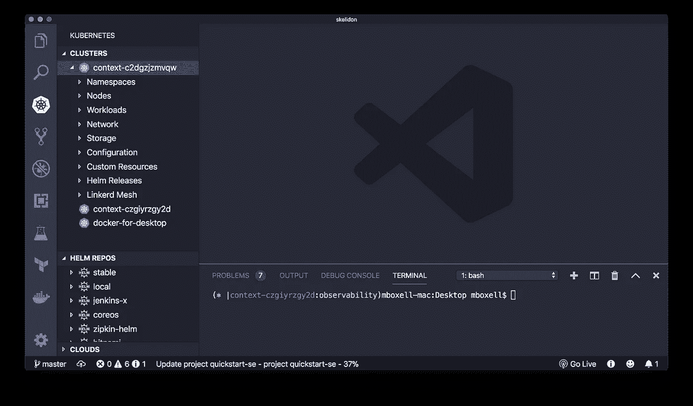
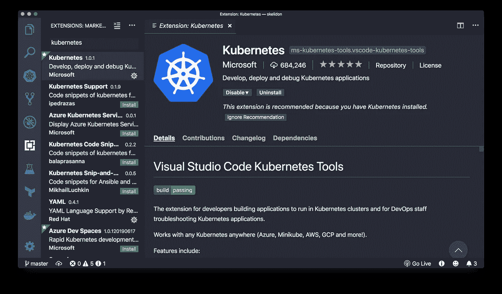
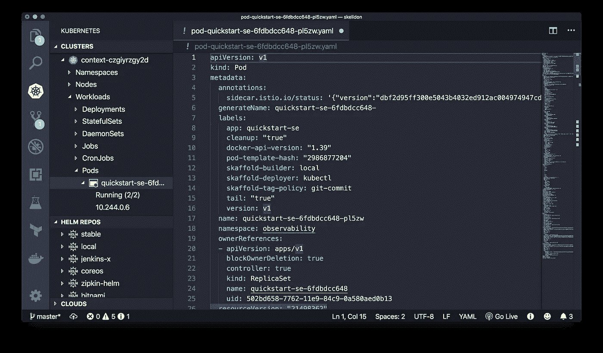
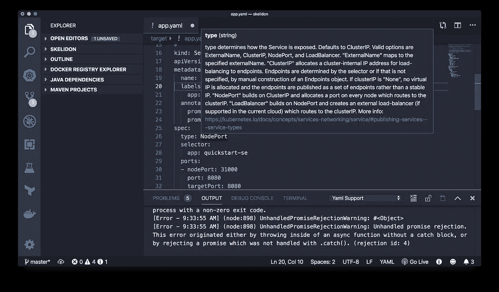
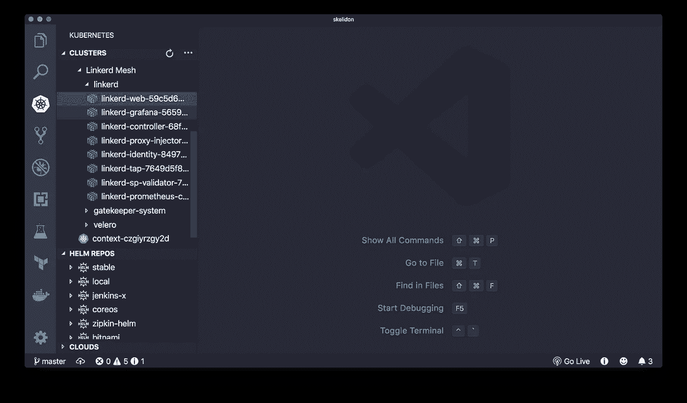

# 简化的 Kubernetes 开发— Visual Studio 代码 Kubernetes 工具扩展

> 原文：<https://itnext.io/simplified-kubernetes-development-visual-studio-code-kubernetes-tools-extension-95bac450370c?source=collection_archive---------3----------------------->

Visual Studio 代码 Kubernetes 工具扩展

我发现命令行既舒适又高效。使用它通过`[kubectl](https://kubernetes.io/docs/reference/kubectl/)`与 Kubernetes 集群进行交互是相对直观的。任何时候你忘记了一个命令，你都可以跳到 [kubectl cheatsheet](https://kubernetes.io/docs/reference/kubectl/cheatsheet/) 或者运行`kubectl -h`来获得帮助。命令行缺少的一点——根据设计——是轻松可视化和浏览集群中资源的能力。此外，对于 Kubernetes 来说，yaml 痴迷于缩进的特性会使用命令行编辑器进行编辑变得很痛苦。Visual Studio Code Kubernetes Tools 扩展通过提供 Kubernetes 集群的可视化以及命令行编辑器中没有的 yaml 和 Kubernetes 特定的编辑工具来应对这些挑战。该扩展可以与 Kubernetes 一起工作，不管它在哪里运行(Docker for Desktop、Minikube、Azure、Google Cloud、Oracle Cloud 等)。).

# 先决条件

[安装 Docker](https://docs.docker.com/install/) 和[安装 kubectl](https://kubernetes.io/docs/tasks/tools/install-kubectl/) 。

为了测试 VS 代码如何与 Kubernetes 集群交互，当然您需要一个与之交互的 Kubernetes 集群。这可以通过使用 [Docker for Desktop](https://docs.docker.com/docker-for-mac/kubernetes/) 创建本地 Kubernetes 集群或使用[Oracle Container Engine for Kubernetes(OKE)](https://docs.cloud.oracle.com/iaas/Content/ContEng/Concepts/contengoverview.htm)创建托管 Kubernetes 集群来实现。

# 装置

要安装 Kubernetes 扩展，打开**扩展** (⇧⌘X)并搜索“kubernetes”。选择 Microsoft [Kubernetes](https://marketplace.visualstudio.com/items?itemName=ms-kubernetes-tools.vscode-kubernetes-tools) 扩展。

# 使用扩展

## 与您的集群交互

该扩展将显示 kubeconfig 文件中可用的集群。右键单击一个集群名称，您可以选择显示集群信息、打开仪表板和从 kubeconfig 中删除。如果右键单击不同于当前上下文的集群，还可以选择设置为当前集群。**显示集群信息**打开终端并运行`kubectl cluster-info`。**打开仪表板**配置端口转发并打开浏览器进入 Kubernetes 仪表板。**设置为当前集群**使您不必手动运行`kubectl`命令或下载`[kubectx](https://github.com/ahmetb/kubectx)`等工具来更改上下文。

## 可视化您的集群

该扩展还可视化了集群的各种组件。不必运行`kubectl get namespaces`，当您展开**集群**选项卡时，您的名称空间都是可用的。对于节点、工作负载(包括部署、状态集、守护集、作业、CronJobs、pod)、网络(包括服务、端点和入口)、存储(包括持久性卷、持久性卷声明和存储类)、配置(包括配置映射和机密)以及您的自定义资源定义，情况也是如此。挖掘特定的资源为互动提供了更多的选择。

以 Pods 为例:点击进入**工作负载** > **Pods** 将显示在您当前名称空间中运行的所有 Pods 的列表。单击 Pod 本身将显示状态。右键单击 Pod 名称会显示用于与 Pod 交互的命令列表。每个命令负责一些通常由`kubectl`完成的事情。例如，右键单击并选择 **Get** 将运行`kubectl get pod/[pod name] --namespace default -o wide`并为您提供输出。相同的命令列表还允许您删除 pod、描述 pod、从 pod 获取日志、创建端口转发、执行到 pod 等等。这可以节省大量时间。

## 简化 YAML

Kubernetes 扩展还为 Kubernetes 清单文件提供了智能感知自动完成、代码片段和验证。例如，一旦您键入`kind: Deployment`并按 tab 键自动完成，清单文件的其余部分就会自动生成。唯一需要手动操作的就是输入应用程序的名称、图像以及想要使用的端口。此外，该扩展还包括其他一些特性，可以帮助您找到处理 yaml 文件的方法。将鼠标悬停在清单的某个组件上方会显示关于该组件的附加信息。

## 运行命令

该扩展还允许您运行简化的 Kubernetes 命令。一旦您的清单文件准备好了，您就可以通过打开**命令面板** (⇧⌘P)并运行 **Kubernetes: Create** 来开始部署。该命令将根据所选的 Kubernetes 清单文件将应用程序部署到您的集群中。

## Azure 专用工具

该扩展的一些特性是 Azure 特有的。例如，您可以直接从 VS 代码创建一个运行在 Azure 上的 Kubernetes 集群。这可以通过点击**集群**旁边的**更多的**(由三个水平点表示)并选择**创建集群**来完成。按照说明在 Azure Container Service、Azure Kubernetes Service 和 Minikube 之间选择集群类型。即使您不是 Azure 用户，UI 的这一部分也很有用，因为它允许您指定一个新的 Kubeconfig 文件，以便连接到不同的集群。如果能够向现有的 Kubeconfig 文件添加新的集群、上下文和用户，将会很有帮助。

该扩展还有一些其他方面不是特定于 Azure 的，但与 Azure 生态系统直接相关。这包括舵和吃水。Kubernetes 工具扩展提供了在集群中可视化 Helm 版本的能力，还可以查看 Helm 存储库。后者对于检查图表、值和依赖关系非常有用。它还可以用于获取和安装图表。许多舵命令(`helm fetch`、`helm install`、`helm lint`等)。)可从命令选项板运行。对于一些拔模命令(`draft up`、`draft create`和`draft version`)也是如此。

# 附加扩展

## 林克尔德

Visual Studio Code Linkerd 扩展旨在为 VSCode Kubernetes 扩展中的 [Linkerd2 服务网格](https://linkerd.io/2/getting-started/)提供支持。自动运行`linkerd check --pre`命令和`linkerd install`命令。提供为特定 pod 配置端口转发并连接到 Linkerd 和 Grafana 仪表板的能力。如果他们能够在 Kubernetes 配置中增加注入 Linkerd 代理的功能，无论是在 pod 还是名称空间级别，那就太好了。记住用 Linkerd2 二进制文件的路径修改您的 VS 代码**设置** (⌘，)是很重要的。

# 摘要

Visual Studio Code Kubernetes Tools 扩展是处理 Kubernetes 清单文件和与集群交互的有用工具。对于为 Kubernetes 集群构建容器化应用程序的开发人员和支持这些应用程序的 DevOps 实践者来说，它都是有用的。

# 附加阅读

更多信息可在[在 VS 代码中使用 Kubernetes](https://code.visualstudio.com/docs/azure/kubernetes)页面和 [VS Kubernetes 工具 GitHub 页面](https://github.com/Azure/vscode-kubernetes-tools)上找到。