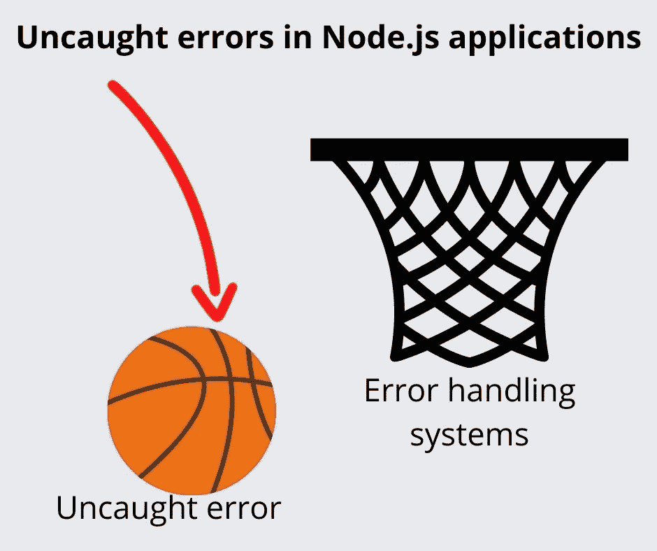
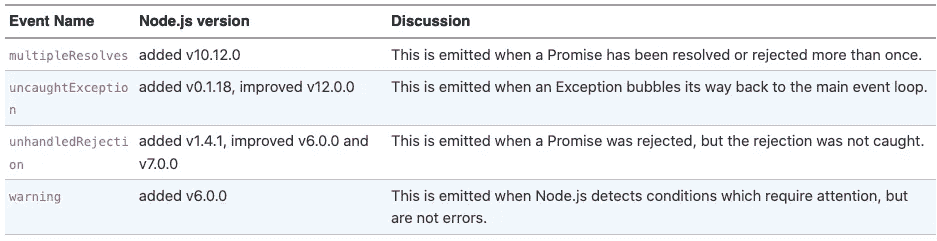
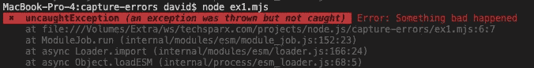
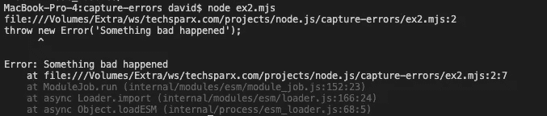
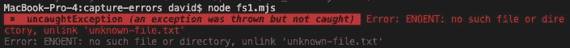
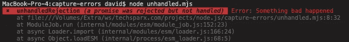
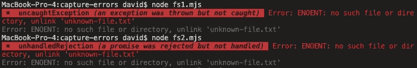
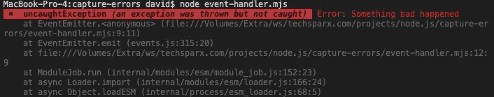
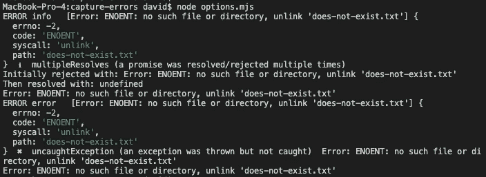

# 简化捕捉 Node.js 中的 uncaughtException、unhandledRejection 和 multipleResolves

> 原文：<https://itnext.io/simplify-catching-uncaughtexception-unhandledrejection-and-multipleresolves-in-node-js-a02f3fa74e8e?source=collection_archive---------0----------------------->

您看不到的错误会腐蚀应用程序内部，可能会导致将来的麻烦



作者图片

**当 Node.js 增加了本地承诺和异步/等待支持时，*进程*对象获得了一些错误事件，通知程序关于未处理或未捕获的错误情况。处理这样的错误很重要，但是当然我们有时会忽略为每一种可能的错误情况设置错误处理程序。这些事件处理程序的主要目的是让我们知道我们未能捕捉到的程序错误。Node.js 提供了缺省的错误处理程序，但还有些不足。*记录流程错误*有助于解决这些问题。**

如果一棵树在森林里倒下了，但是没有人在旁边听到，真的有声音吗？是的，当然有声音，有鸟和其他动物听到它，但没有人在那里记录事件。同样，如果 Node.js 程序生成了一个错误，但是程序中没有任何东西可以捕捉或处理该错误，那么错误通知就不会出现。因为负责的人没有得到通知，这个人就不能纠正代码，应用程序中就潜伏着危险。

在 Node.js 中有几个由`process`对象生成的事件，用于通知程序没有处理的错误。任何未处理的异常，任何未处理的承诺拒绝，或任何其他未处理的错误，都意味着错误处理代码在某个地方丢失了。为了捕捉未处理的异常或未处理的承诺拒绝，编码人员需要知道在`process`对象上添加相应的事件处理程序。更复杂的是，未处理的错误可能会悄无声息地消失在以太中，让编码人员对程序中潜伏的问题一无所知。

未处理错误的当前事件列表包括:



作者图片

对于其中的每一个，我们可以参考 Node.js `process`包文档，了解通知 API，并编写如下的处理函数:

```
process.on('unhandledRejection', (reason, promise) => {
  // .. handle the error
});
```

但是，我们总是记得这样做吗？我们总是记得捕捉每一个错误吗？当一个新的 Node.js 版本添加了一个新的未处理的错误事件时，我们还记得在程序中添加处理程序吗？

一个解决方案是使用安装每个错误处理程序的包。自己需要写一个也没那么难。但是在 npm 资源库中有一个预烘焙包值得您关注: [log-process-errors](https://www.npmjs.com/package/log-process-errors)

其特点包括:

*   处理所有这样的错误条件——如果添加了新的错误条件，这个包肯定也会被更新以处理它们
*   一个 API，您可以使用它将信息定向到日志服务
*   自定义错误指示的处理方式
*   漂亮的印刷错误使他们更容易阅读和看到
*   包括通常不打印错误的堆栈跟踪

这是一个相对容易安装和使用的软件包。唯一的疑虑是随之而来的支持包的数量，以及在`node_modules`中产生的足迹。

# 设置 Node.js 项目以使用`log-process-errors`

对于这个例子，让我们创建一个空白项目并编写几个简单的脚本。

这会生成一个简单的带有所有默认值的`package.json`。

```
$ npm install log-process-errors --save
npm notice created a lockfile as package-lock.json. You should commit this file.
npm WARN capture-errors@1.0 .0 No description
npm WARN capture-errors@1.0 .0 No repository field. + log-process-errors@7.0 .1 added 34 packages from 64 contributors and audited 34 packages in 9.871s 7 packages are looking for funding 
run `npm fund` for details found 0 vulnerabilities
```

这将安装软件包。请注意，它添加了 34 个附属包。

# 简单示例—未捕获的异常

让我们从最简单的开始，一个未被捕获的异常。在这种情况下，您的代码会抛出一个错误，并且有一条路径可以让该异常到达事件循环。沿着这条路径的某个地方，您的代码应该已经捕获了异常，但是它没有。

我们来试试一个超简单的例子。创建一个名为`ex1.mjs`的文件，其中包含:

```
import logProcessErrors from 'log-process-errors' logProcessErrors({});throw new Error('Something bad happened');
```

重要的是要知道`log-process-errors`只出口一个 ES6 模块。我们的例子将被写成 ES6 模块。要了解如何从 CommonJS 模块中使用 ES6 模块，请参见:[在 Node.js CommonJS 模块中加载 ES6 模块](https://techsparx.com/nodejs/esnext/esmodules-from-commonjs.html)

说完这些，让我们来检查一下代码。

`logProcessErrors`功能设置`log-process-errors`模块。它需要一个*选项*对象，我们可以用它来定制行为。现在让我们保留默认值。

要生成一个未捕获的异常，我们只需抛出一个。运行程序我们得到这个:



作者图片

我们有一个错误，有用的堆栈跟踪，和颜色。这看起来比默认的错误消息要好。为了便于比较，创建另一个名为`ex2.mjs`的文件，其中只包含`throw new Exception`语句。运行它，我们得到这个:



作者图片

这在很大程度上是相同的错误，尽管我发现自己对它为什么显示语法感到困惑。但是最大的问题是，如果您的应用程序打印大量输出，您更可能看到这些消息中的哪一个？默认的错误消息会淹没在其他通知的海洋中吗？改进的彩色错误会突出来并被看到吗？

如果这个例子过于琐碎，请尝试另一个可以命名为`fs1.mjs`的例子:

```
import fs from 'fs/promises'; 
import logProcessErrors from 'log-process-errors' logProcessErrors({});await fs.unlink('unknown-file.txt');
```

Node.js 现在支持在 ES6 模块中顶级使用`await`关键字: [Node.js 脚本编写者:顶级异步/等待现在可用](https://techsparx.com/nodejs/async/top-level-async.html)因此，ES6 模块是编写简单脚本的首选，因为您可以自由使用`await`来处理异步。

无论如何，只要该文件不存在，`fs.unlink`调用就会抛出异常。



作者图片

非常好。不清楚为什么没有堆栈跟踪。

# 未处理的承诺拒绝

下一个场景是关于如果一个承诺被拒绝会发生什么，但是没有什么能捕捉到拒绝。那就好比申请工作，被那家公司拒绝，然后看不到拒绝通知。

当我们生成一个承诺时，`async/await`的存在有些模糊，因为它们现在在`await`关键字中被自动处理。让我们从一个明确的承诺开始，创建一个名为`unhandled.mjs`的文件:

```
import logProcessErrors from 'log-process-errors'
logProcessErrors({});const promise = Promise.reject(new Error('Something bad happened'));
```

这明确地创建了一个处于*拒绝*状态的承诺。更常见的模式是:

```
const promise = new Promise((resolve, reject) => {
     // .. do something
     // .. upon detecting an error:
     if (errorCaught) reject(new Error('Something bad hapened'));
});
```

无论如何，让我们运行`unhandled.mjs`示例:



作者图片

我们得到了`unhandledRejection`错误。如果我们加上`await Promise.reject`，那么它就变成了一个`uncaughtException`错误。如果我们取消对`promise.catch`的注释，错误会悄悄地消失。

但是，这是人为的，所以让我们尝试一些更真实的东西。假设您忘记了`fs1`示例中的`await`关键字？创建包含此内容的`fs2.mjs`:

```
import fs from 'fs/promises'; 
import logProcessErrors from 'log-process-errors' 
logProcessErrors({});fs.unlink('unknown-file.txt');
```

因为`fs.unlink`在这种情况下返回一个承诺，所以我们需要处理承诺来查看状态。在最初的例子中，`await`关键字就是这么做的。我们知道这会导致拒绝，所以让我们看看会发生什么:


作者图片

对于`fs1`,我们得到`uncaughtException`,因为`await`关键字捕获了被拒绝的承诺。有了`fs2`，我们反而得到了`uncaughtRejection`，因为我们忘记了等待承诺。

# 多重承诺解决方案

下一个错误有点难以理解，但它归结为一个 Promise 对象，其中`resolve`或`reject`回调被调用了不止一次。规则是每个承诺对象最多调用`resolve`或`reject`一次，多次调用都是错误的。确切地说，`multipleResolves`是在什么时候发出的:

*   解决了不止一次。
*   不止一次被拒。
*   解决后拒绝。
*   拒绝后解决。

创建一个名为`multi-resolve.mjs`的文件，其中包含:

```
import logProcessErrors from 'log-process-errors'
logProcessErrors({});await new Promise((resolve, reject) => {
    resolve();
    reject(new Error('Something bad happened')); 
});
```

这是人为的，所以让我们考虑一下这在现实生活中是如何发生的。由承诺包装的回调函数的一个典型错误是不能正确地确保`resolve`和/或`reject`只被调用一次。尝试将`multi-resolve.mjs`的结尾改为:

```
import fs from 'fs';
.../* await new Promise((resolve, reject) => {
     resolve();
     reject(new Error('Something bad happened'));
});
*/await new Promise((resolve, reject) => {
     fs.unlink('does-not-exist.txt', err => {
         if (err) reject(err);
         resolve();
     });
});
```

在本例中，我们导入了`fs`包的非承诺版本。这意味着我们有一个回调函数要处理，为了使用关键字`await`我们需要生成一个承诺作为包装器，如下所示。因此...按照编写的代码，如果有错误会发生什么？`reject`和`resolve`不是都被调用了吗？



作者图片

事实上，我们得到的警告是，应许既被拒绝，又被解决。我们还得到一个`uncaughtException`,因为这个代码不处理上面讨论的错误。

显然，最好将该包装器编写为:

```
await new Promise((resolve, reject) => {
     fs.unlink('does-not-exist.txt', err => {
         if (err) {
             reject(err);
         } else {
             resolve();
         }
     });
});
```

但第一个是容易犯的错误。而且，无论如何，`async/await`实现要干净无数倍，所以建议尽可能使用它。

# 回调中未捕获的错误

最后要讨论的问题不是由`process`对象发出的错误事件。相反，这是发生在我的应用程序中的一个场景，它促使我对此进行研究。我在一个事件处理程序中遇到了一个错误情况，我对此一无所知。

看一个例子，创建一个名为`event-handler.mjs`的文件，包含:

```
import EventEmitter from 'events';
import logProcessErrors from 'log-process-errors'logProcessErrors({});const emitter = new EventEmitter();
emitter.on('crash', () => {
   throw new Error('Something bad happened');
});emitter.emit('crash');
```

Node.js 平台中的许多对象都使用了`EventEmitter`类。例如，HTTPServer 和 HTTPClient 是 EventEmitter 的。API 说使用`.on('event-name'...)`来监听事件，然后在实现内部`.emit('event-name')`触发事件。但是 EventEmitter 的一个很大的缺点是事件的发起者没有收到任何关于事件处理程序是成功还是失败或者是否完成的通知。

在我的应用程序中，我必须捕捉错误，并创建一种机制，以一种有用的方式暴露错误。但是第一步是知道错误正在发生。

在本例中，我们创建了一个虚拟的`EventEmitter`，并为一个`crash`事件定义了一个处理程序。在处理程序内部，我们生成一个异常。这模拟了事件处理程序中发生错误的情况。



作者图片

好了，错误被发现了。

# `log-process-errors`的选项对象

这个包使用一个选项对象来定制它的行为。

对于到目前为止的每个例子，我们都使用了一个空对象。`log-process-errors`选项对象让我们:

*   指定一个函数来处理日志记录
*   指定每种事件的日志记录级别
*   指定在出现某种错误时是否退出
*   指定在某些类型的错误上失败，用于测试工具目的
*   指定是否在输出中使用颜色

要尝试这样做，将`multi-resolve.mjs`复制为`options.mjs`，并进行如下更改:

```
logProcessErrors({
     log: function(error, level, originalError) {
         console.error(`ERROR ${level}  `, originalError, error);
     },
     level: {
        warning: 'warn', multipleResolves: 'info', default: 'error'
     },
     colors: false
});
```

其他一切保持原样，因为我们有兴趣尝试不同的选项。

我们在实际应用程序中使用的`log`函数会将信息发送给日志服务。但是，这个函数让我们检查可记录事件提供的数据，即*记录级别*、初始*错误和生成的错误。*

`level`选项让我们描述用于特定种类错误的日志记录级别。

`colors`选项表示是否在输出中使用颜色。您可能正在记录一个颜色没有意义的文件。



作者图片

我们看到输出的格式已经改变，例如，我们没有堆栈跟踪。也没有颜色编码。如果您更改`level`和`colors`字段中的设置，您可以改变这种情况。例如，将`colors`设置为真，然后将`multipleResolves`设置为`warn`，您会看到它被颜色编码为黄色。

# 摘要

`log-process-errors`包通过自动通知我们可能会忽略的错误来帮助我们改进我们的应用程序。可能会发生没有在我们面前出现的错误，让未解决的错误在我们的应用程序中恶化。这可能就像没人听到的森林中倒下的那棵树。

许多年来，没有人听说森林在哭泣，因为不再有典型的降雨。在加利福尼亚，树木的衰弱使得小蠹虫猖獗，杀死了一亿棵树。现在，加州每年都有越来越大的野火，造成大范围的破坏，并在我们的城市上空喷出大量有毒的烟雾。

这种遗漏错误条件的模式不仅影响我们的应用程序，还影响我们生活的物理世界。

*原载于【https://techsparx.com】[](https://techsparx.com/nodejs/howto/error-handling.html)**。***