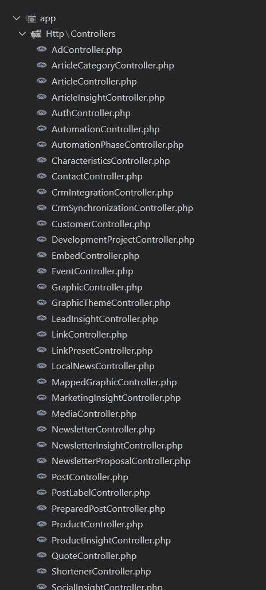
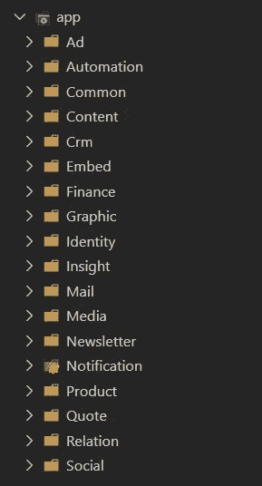

# 用一个基于特性的文件夹结构来简化你的 Laravel 项目

> 原文：<https://itnext.io/simplify-your-laravel-project-with-a-folder-by-feature-structure-b044b54a8756?source=collection_archive---------2----------------------->

默认情况下，Laravel 将文件存储在一个按类型分类的文件夹结构中:

```
app/
┣ Http/
┃ ┗ Controllers/
┃   ┣ CustomerController.php
┃   ┣ OrderController.php
┃   ┣ ProductController.php
┗ Models/
  ┣ Customer.php
  ┣ Order.php
  ┣ Product.php
```

这种文件夹结构对小项目来说还行，但是一旦你写了越来越多的控制器、模型等等。很难找到你要找的文件。



这开始变得可怕了…

所以我喜欢用一个*文件夹一个特性*的结构来组织我的项目:

```
app/
┣ Customer/
┃ ┣ Customer.php
┃ ┗ CustomerController.php
┣ Order/
┃ ┣ Order.php
┃ ┗ OrderController.php
┗ Product/
  ┣ Product.php
  ┗ ProductController.php
```

干净多了！

要在一个*新* Laravel 项目中使用这个文件夹结构，请遵循以下步骤:

**1。移除/app 文件夹中的所有内容**

```
rm -r ./app/*
```

**2。替换/bootstrap/app.php** 中的默认容器绑定

> …或者将它们绑定到您自己的内核/处理程序实现中。

**3。创建您的第一个特征**

```
artisan make:provider App\\Product\\ProductServiceProvider
```

**4。在/config/app.php 中注册服务提供者**

**5。在服务提供商中引导您的功能**

> 有关服务提供商的更多信息，请参见[https://laravel.com/docs/providers](https://laravel.com/docs/providers)

**6。构建您的惊人功能！**

从数据库迁移到事件侦听器，您可以将任何您喜欢的东西添加到功能文件夹中。将代码拆分到适合您项目的程度！



整齐👌