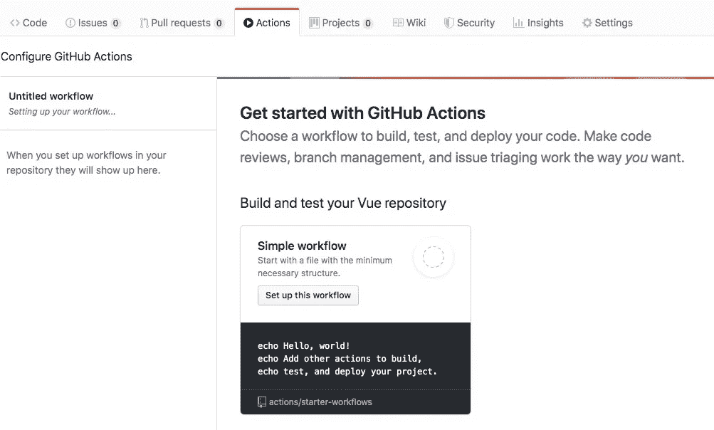
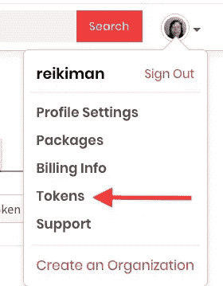
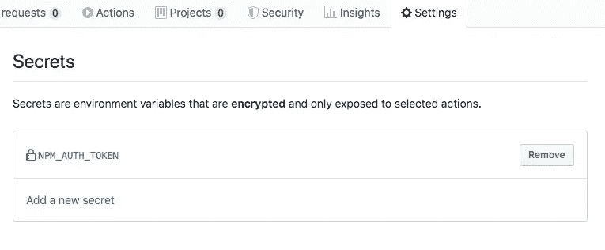

# 使用 Github 操作简化您的 npm 发布工作流程

> 原文：<https://itnext.io/simplify-your-npm-publish-workflow-using-github-actions-691249bc7e59?source=collection_archive---------3----------------------->

Github 最近增加的新功能 Github Actions 向我们承诺了一个强大的工作流系统来处理大量的任务。我们这些发布 Node.js 包的人可以使用动作来自动运行测试，然后将包发布到 npm。让我们看看如何使用 Github 操作来简化我们的生活。

目前，Github Actions 处于公开测试阶段，只对注册用户开放——参见:[https://github.com/features/actions](https://github.com/features/actions)注册，并阅读文档。

Github 动作的基本概念是一个动作由一个事件触发。每个*动作*都是使用 YAML 文件编写的一组潜在的非常复杂的步骤。在这种情况下，我们将创建一个由 *push* 事件触发的动作，或者每当一个新的提交被推送到存储库时触发的动作。该脚本将运行我们的单元测试，然后尝试运行`npm publish`。

一旦您的帐户启用了操作功能，您将在每个存储库中找到一个*操作*选项卡。



有很多可用的文档，也许有一天阅读一下会很有用。但是让我们直接开始创建一个工作流。您会发现启动工作流列表中有一个是 Node.js 的，单击它为我们提供一个起点。

在这篇教程中，我使用了我的一个包， [Globfs](https://github.com/robogeek/globfs) 。你可以检查那个包裹来更全面地检查我做了什么。

我做了很多修改，所以我们不要担心他们提供的动作脚本，但看看这个:

```
name: Build and test Globfs on: [push] jobs:
   build: runs-on: ubuntu-latest strategy:
        matrix:
         node-version: [12.x] steps:
      - uses: actions/checkout@v1
      - name: Use Node.js ${{ matrix.node-version }}
        uses: actions/setup-node@v1
        with:
          node-version: ${{ matrix.node-version }}
      - name: npm install and npm test
        run: |
          npm run setup-test
          npm run test
      - name: npm publish
        run: |
          npm config set //registry.npmjs.org/:_authToken=$NODE_AUTH_TOKEN
          npm run trypublish
        env:
          CI: true
          NODE_AUTH_TOKEN: ${{ secrets.NPM_AUTH_TOKEN }}
```

当您创建这个脚本时，Github 会自动将其添加到您的存储库中，命名为`.github/workflows/workflow-name.yml`。在我的例子中，我将其命名为`push.yml`,因为它处理`push`事件。

# 走过`push.yml`动作脚本

`name`字段只是给出了一个人类可读的名称，所以可以使用任何您喜欢的名称。`on`字段声明这将触发的事件，在这种情况下，动作在`push`事件上触发。

当事件触发时，执行`jobs`字段。这个任务在一个名为`ubuntu-latest`的 Docker 容器上运行，这个容器非常适合我们的目的。

`steps`字段是要执行的步骤列表。第一个是`actions/checkout@v1`，简单地签出工作区。

我将顺便提一下，Github Actions 允许我们重用其他现有的动作。在本例中，我们重用了 Github 工作区`actions/checkout`中定义的一个动作，您会发现它签出了 Git 存储库。

下一步是设置 Node.js。`strategy/matrix`字段让我们设置一个 node . js 发布的数组来运行操作。在这种情况下，我们只想在 Node.js 12 上运行，因为这是这个包所支持的。运行时`actions/setup-node`设置相应的 Node.js 运行时。

下一步， *npm 安装和 npm 测试*，处理软件包的测试。为了支持这一点，我在顶层`package.json`中添加了以下脚本:

```
"scripts": {
     "setup-test": "cd test && npm run setup",
     "test": "cd test && npm run test" 
}
```

每个都简单地进入`test`目录，并在那里运行相应的脚本。在`test`目录中，我添加了这个`package.json`:

```
{
   "name": "globfs-test",
   "version": "1.0.0",
   "description": "Test suite for globfs",
   "main": "index.js",
   "scripts": {
     "test": "mocha ./index",
     "setup": "npm install && cd .. && npm install"
   },
   "author": "",
   "license": "ISC",
   "dependencies": {
     "chai": "^4.1.2",
     "mocha": "^5.2.0"
   }
}
```

显然`test`脚本需要`index.js`中的测试套件。我使用 Mocha 和 Chai 断言库创建了一个，如果您愿意，可以在 Globfs 存储库中阅读。重要的是`test`脚本可靠地执行测试套件，并且如果测试套件失败，它可靠地显示错误状态。

如果测试失败，动作脚本就会失败，Github 会通过电子邮件将错误日志发送给我们。如果测试脚本成功了，那太好了，动作脚本将进入下一阶段。

动作脚本的最后一个阶段， *npm publish* ，是我们发布包的地方。理论上这只是运行`npm publish`的问题，但是有几个问题需要考虑。例如，如果您在已经发布的包目录上运行`npm publish`, NPM 服务器将会抛出一个错误，提示您不能在现有的包上发布包。

我的策略是，如果测试成功，总是运行`npm publish`。如果`package.json`中的版本字符串已经改变，那么一切正常，因为`npm publish`会将包推送到存储库。相反，如果版本号没有改变，将会抛出一个错误，看起来好像作业失败了。但是因为我们不关心`npm publish`命令是否失败，我们可以用这个古老的奇怪的 shell 脚本技巧来避免失败。

在顶层`package.json`中，我添加了这个脚本:

```
"scripts": {
     ...
     "trypublish": "npm publish || true"
},
```

使用`trypublish`我们尝试运行`npm publish`，如果失败，则使用`|| true`抑制错误。看看这个 shell 脚本技术，它是 20 世纪 70 年代发明的一个了不起的东西。

但是仔细看看`push.yml`中的 *npm 发布*阶段。这里有更多的东西涉及到一个`npm config`命令。这是怎么回事？

为了发布到 npm，我们需要一个授权令牌。让它发挥作用需要一个额外的旅程，我希望能帮助你避免。

# 设置 npm 令牌进行身份验证，以便从 Github 操作工作流脚本发布到 npm

据说为了认证`npm publish`，我们简单地将一个 npm 令牌放入一个环境变量中，然后神奇地一切都正常了。根据 [npm 博客](https://blog.npmjs.org/post/118393368555/deploying-with-npm-private-modules)的说法，验证 npm 的标准方法是将这一行添加到`~/.npmrc`。

```
//registry.npmjs.org/:_authToken=00000000-0000 -0000 -0000 -000000000000
```

但是在上面的动作脚本里那就不方便了。博客文章接着说我们可以做到这一点:

```
$ export NPM_TOKEN="00000000-0000-0000-0000-000000000000"
```

但是我没有找到有效的环境变量。在`actions/setup-node`行动的文档中也没有这个咒语:

```
- run: npm publish
   env:
     NODE_AUTH_TOKEN: ${{ secrets.NPM_AUTH_TOKEN }}
```

相反，我花了几个小时寻找建议。我遇到了其他几个人，他们也浪费了几个小时的时间来解决同样的问题。

但是经过足够的阅读，我找到了一个可行的解决方案。

让我们一步一步来，从创建 npm 令牌开始。



登录`npmjs.com`后，您会在帐户菜单中找到该选项。这会将您带到一个页面，您可以在其中创建(和撤销)令牌。

只需点击*创建新令牌*按钮。它会问你几个问题，然后带你到一个显示新令牌的页面。一定要把这个令牌复制到一个安全的地方，因为这是你在这个宇宙中唯一一次看到这个令牌。



下一步是转到 Github 存储库的 Settings 选项卡，添加一个包含给定令牌的密码。一旦使用 Github 创建了这个秘密，你将永远无法检查它的内容。

在 Github Actions 脚本中，我们通过以下方式访问这个秘密并将其添加到环境中:

```
env:
     NPM_TOKEN: ${{ secrets.NPM_AUTH_TOKEN }}
```

但是这还不够，尽管关于认证令牌的 [npm 文档是这么说的](https://docs.npmjs.com/about-authentication-tokens)。无论我使用什么环境变量，`npm publish`都无法识别这个标记。只有在添加该命令时，它才起作用:

```
npm config set //registry.npmjs.org/:_authToken=$NPM_TOKEN
```

这是必须添加到`.npmrc`文件中的相同配置。该命令在 Github 为处理这项工作而开发的 Docker 容器中运行。

一旦你这样做了，`npm publish`命令就会像预期的那样工作。

# 结论

这是 Github 行动的早期阶段。设置这个所涉及的工作比我们听说的关于 Github 动作的故事更难。有几个粗糙的边缘可以被理顺，使这项工作更加顺利。

这种自动化将帮助开发人员保持理智。考虑一下，如果测试 Node.js 包并将其发布到 npm 注册中心不是自动化的，您的生活会是什么样子。对于一个版本的每一次发布，您都需要在终端中键入所需的命令。如果您忘记了一个命令，或者忘记了一个参数，该怎么办？如果您忘记发布新版本，该怎么办？

可能会发生各种各样的错误。自动化这一切肯定更可靠，这样您就有了可重复的过程。

有一点是肯定的——Gitlab 到目前为止比 Github 有优势，因为 git lab 早就有了 CI/CD 子系统。使用该系统，您可以将描述 CI/CD 工作流的 YAML 文件添加到存储库中，瞧，您已经实现了自动化。Github Actions 特性更加灵活，可以让 Gitlab 的资金发挥作用。

*最初发表于*[T5【https://techsparx.com】](https://techsparx.com/nodejs/tools/publish-github.html)*。*