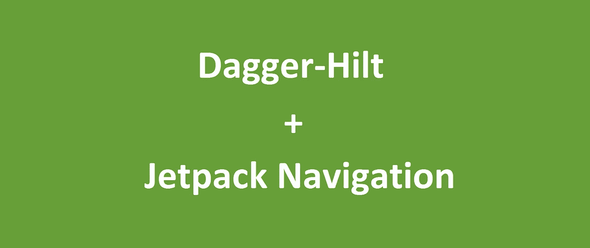
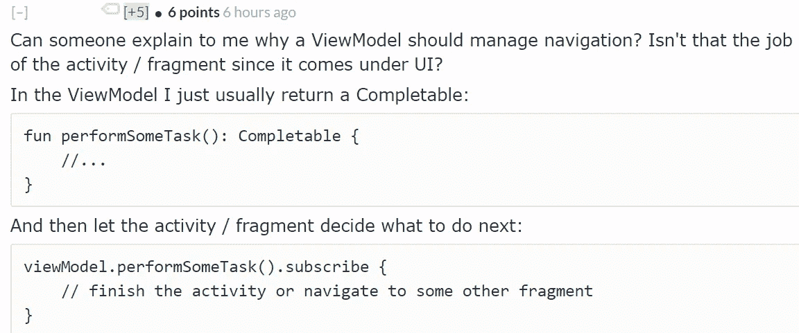

# 使用匕首柄简化顶级目的地之间的 Jetpack 导航

> 原文：<https://itnext.io/simplifying-jetpack-navigation-between-top-level-destinations-using-dagger-hilt-3d918721d91e?source=collection_archive---------2----------------------->

Google 创建了 Jetpack 导航来简化目的地(如片段目的地)之间的导航，并允许使用共享导航图定义这些目的地之间的逻辑范围。

我们可以将视图模型的范围扩展到这些导航图的相关 NavBackStackEntry，甚至可以使用 SavedStateHandle 在进程死亡时保持它们的状态。

然而，由于`NavController`实例的作用域是一个活动，从视图模型使用 Jetpack 导航的流行模式在历史上是冗长的。对于 ViewModel 想要发出的每个导航事件，它通常定义一个“ [LiveData 事件包装器](https://medium.com/androiddevelopers/livedata-with-snackbar-navigation-and-other-events-the-singleliveevent-case-ac2622673150)”，该包装器由一个片段观察，该片段将*实际上*与 NavController 对话。

我们能做得更好吗？我们能否减少从视图模型触发导航所需的代码量，并将“实际执行导航动作”的“责任”从片段本身转移出去？

而且考虑到答案是肯定的，那跟 Hilt 有什么关系呢？😏

# 匕首柄是什么？

Dagger-Hilt 是 Google 新推荐的依赖注入框架[建立在 Dagger2 之上。](https://developer.android.com/training/dependency-injection/hilt-android)

虽然还是 alpha，但是已经相当强大了。总的想法是，你过去可能已经定义的每个组件(最常见的是`[ApplicationComponent](https://medium.com/@Zhuinden/that-missing-guide-how-to-use-dagger2-ef116fbea97)`)已经作为一个“预定义”的组件存在，你必须*“安装”你现有的模块到其中。*

*最引人注目的组件是`ApplicationComponent`和`ActivityRetainedComponent`。*

*安装在`ApplicationComponent`中的模块内任何标有`@Singleton`的类，其提供者的作用域都是 app 组件。*

*安装在`ActivityRetainedComponent`中的模块内任何标有`@ActivityRetainedScoped`的类，其提供者的作用域都是活动保留的组件。*

*什么是`ActivityRetainedComponent`？在内部，它使用活动范围的 ViewModel 将实例的范围限定在活动的保留范围内(并在配置更改时保持它)。*

*绑定到`ApplicationComponent`或`ActivityRetainedComponent`的依赖项将可用于通过`@ViewModelInject`从 Hilt 自己的 ViewModelFactory 注入的视图模型(当在活动/片段上使用`@AndroidEntryPoint`时，这是自动的“默认”)。*

# *设置匕首柄*

*目前，我们必须添加以下依赖项:*

*匕首-刀柄装置*

*之后，我们需要用`@HiltAndroidApp`注释应用程序类，用`@AndroidEntryPoint`注释任何注入的活动/片段。*

*我们还必须在我们的模块上添加`@InstallIn(SomeComponent::class)`注释。*

# *匕首柄和视图模型注入*

*Hilt 允许直接用单例、未分段和活动保留的实例注入视图模型。它还支持向 ViewModel 提供[saved state handle 作为现成的辅助参数](https://proandroiddev.com/dagger-tips-leveraging-assistedinjection-to-inject-viewmodels-with-savedstatehandle-and-93fe009ad874)。*

*任何标注了`@ViewModelInject constructor()`的 ViewModel 都可以从 Hilt 的 ViewModelFactory 提供，他们可以使用`@Assisted`接收 SavedStateHandle。*

*然后，我们可以用最简单的方式(通过 ktx)获得对这些视图模型的引用:*

*LoginFragment + ktx*

# *NavGraph 范围的视图模型呢？*

*默认情况下，句柄 ViewModelFactory 是默认的 ViewModelProvider。喜利得工厂或喜利得工厂。*

*如果我们打算将 ViewModel 的范围扩大到一个 NavGraph，我们仍然需要提供 Hilt 的工厂作为工厂。只要[我们可以假设片段的参数与 NavGraph 自己的参数](https://github.com/google/dagger/issues/1938)相同，这也可以正确地为 SavedStateHandle 提供参数。*

*但是，首先需要解决以下问题:[https://github.com/google/dagger/issues/2152](https://github.com/google/dagger/issues/2152)*

# *使用 Jetpack 导航、Jetpack 视图模型和 Dagger-Hilt 处理导航事件*

*那么这如何帮助我们减少代码中的`.observe(viewLifecycleOwner, EventObserver {`呢？实际上，很简单。*

*我们可以创建一个存在于`ActivityRetainedScope`中的`NavigationDispatcher`类。*

*然后，我们可以确保挂起的导航操作在活动中得到处理(但是由于范围的原因，在配置更改中保持活动)。*

*通过将挂起的导航事件描述为 lambda 表达式，我们可以使活动始终使用 NavController 的当前实例来处理导航事件，即使重新创建了 NavHostFragment。感谢 Lifecycle API(这是 LiveData 内部使用的)，我们可以确保只有当观察者处于活动状态时(在`onStart`之后)才能获得导航事件。*

*导航命令*

*那么我们可以使用`[EventEmitter<NavigationCommand>](https://github.com/Zhuinden/event-emitter)`或者`LiveData<Event<NavigationCommand>>`*

*导航调度员*

*在活动方面:*

*主要活动*

*我们可以在任何视图模型中轻松使用它:*

*发出导航命令作为操作 ID*

*当然，我们也可以使用 safe-args 插件:*

*发出导航方向*

# *结论*

*使用单个 ActivityRetainedScoped 类将当前挂起的导航操作排队(类似于 [Cicerone](https://github.com/terrakok/Cicerone) 的`CommandBuffer`或 [Simple-Stack](https://github.com/Zhuinden/simple-stack) 的`Backstack`)，我们可以消除所有那些讨厌的`_navigateToSomeDirection`实时数据，而是在我们想要的地方随时触发我们想要的操作:直接从视图模型中执行导航操作，同时确保无论如何它都将工作*。**

*要了解更多信息，您可以查看[Jetpack Navigation FTUE 示例的**句柄**分支](https://github.com/Zhuinden/jetpack-navigation-ftue-sample/tree/hilt)，这些更改发生在哪里，这些更改可以在[这个提交](https://github.com/Zhuinden/jetpack-navigation-ftue-sample/commit/30edde0c2ff995ff1c1abc82c12bcebe95fe8ca2)中看到。*

**查看*[*/r/Android _ devs*](https://www.reddit.com/r/android_devs/comments/hby9ru/simplifying_jetpack_navigation_between_toplevel/)*上的讨论线程。**

*— — — —*

# *附录:对一个有趣问题的回答*

*为了解决一个给定的注释，我将把它附加在这里:*

**

*这里的问题是，现在片段拥有订阅，因此负责管理订阅的生命周期，而这应该在 ViewModel 中，以便异步操作不会在方向改变时被取消。*

*此外，现在由您的视图决定谁知道何时启动`performSomeTask()`调用，而不是只公开它的事件，比如`onSomethingClicked()`。ViewModel 拥有行为，因为 NavGraph 范围的 ViewModel 表示流，并且作为流控制器，它还应该拥有并控制导航行为。*

*…我通常只需要调用`backstack.goTo(SomeScreen())`来导航，结论中也提到了这一点，但是这方面的细节超出了本文的范围。 [***敬请期待下一期***](https://medium.com/@Zhuinden/simplified-android-development-using-simple-stack-6e44ce808c35) 如果你好奇的话。😏*