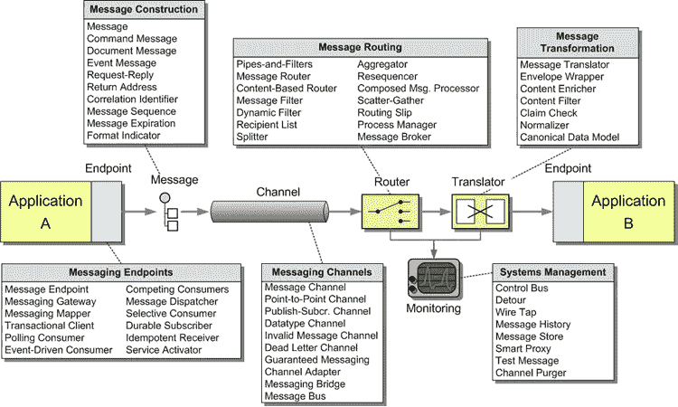

# 用集成语言简化 Kafka 连接器配置

> 原文：<https://itnext.io/simplifying-kafka-connectors-configuration-with-an-integration-language-6cb62279a0f4?source=collection_archive---------6----------------------->

在之前一篇关于使用 Knative 和 Kubernetes API 对象配置 Kafka 源和汇的文章中，你可能会告诉自己“满脸都是 YAML”。事实上，Kubernetes 自成立以来最令人头疼的问题之一就是 YAML 问题。一旦你开始用 Kubernetes 对象声明你的应用程序的期望状态，你会得到很多很多的 YAML。

有一个很棒的。关于 T2 github 上 Kubernetes 的声明式应用程序管理的文档最初是由谷歌的布莱安·葛兰特写的。在该文档中，您可以了解到在 Kubernetes 中管理应用程序的许多不同方法，以及解决或至少处理“面对大量 yaml”挑战的许多不同方法。在那个文档中，你还会找到一个惊人的电子表格的链接，我上次检查过，它有 **127 个工具**用于管理 Kubernetes 应用程序。

在这篇文章中，我想向你展示我们在 TriggerMesh 的工作，它不是一个管理 k8s 应用程序的工具，而是一个以事件驱动机制为核心的各种应用程序之间集成的创作工具。想想把卡夫卡的源头连接到溪流，定义转化，连接到汇点。它确实有一些我认为很棒的东西

*   简化事件驱动系统的设计
*   基于更友好的基于 HCL 的语法生成复杂的 YAML

在我们深入 Kafka 流的表示之前，让我们绕一个“企业集成模式”的弯路

# **企业集成模式**

企业集成并不新鲜，但从云原生世界的角度来看，如果不是颠覆性的，进行一些现代化的时机已经成熟。[企业集成](https://www.enterpriseintegrationpatterns.com/)模式已经描述过，下图显示了每个主要组件中的不同模式:源、通道、路由器、转换器、目标。



> 我们在 TriggerMesh 开始做的是创建一种描述语言，以声明的方式表示集成的设计，抽象出用于实现模式的 API 对象。

将具有源和汇/目标的 Kafka 流视为一个集成，然后我们可以考虑用 TriggerMesh 集成语言来表示这个流。下面先睹为快，我们计划在月底发布。

# TriggerMesh 集成语言

在 TriggerMesh，我们有很多人使用像**这样的平台，我们也很喜欢 Hashicorp 配置语言(即 [HCL](https://github.com/hashicorp/hcl) )。所以我们决定用 HCL 写我们的 TriggerMesh 集成语言(TIL)。这样做简化了编写集成所需的所有 YAML 的创作。**

在[关于向卡夫卡发送数据的帖子](/sending-messages-to-kafka-cfb5a246f5eb)中，我们看到了 YAML 对于一个`KafkaSink`对象:

```
apiVersion: eventing.knative.dev/v1alpha1
kind: KafkaSink
metadata:
 name: my-kafka-topic
spec:
 auth:
   secret:
     ref:
       name: kafkahackathon
 bootstrapServers:
 — pkc-456q9.us-east4.gcp.confluent.cloud:9092
 topic: hackathon
```

随着**倾斜到**，这变成了 **:**

```
target “kafka” “my_kafka_topic” {
 topic = “hackathon”
 bootstrap_servers = [“pkc-419q3.us-east4.gcp.confluent.cloud:9092”]
 auth = secret_name(“kafkahackathon”)
}
```

注意，我们不需要知道什么是 T1，什么是 T2。我们只需要知道这是我们集成的目标端点，这是类型`kafka`

类似地，对于一个如本帖[中所描述的`Kafkasource`来说，完整的 YAML 消费来自卡夫卡的信息会是这样的](https://sebgoa.medium.com/consuming-kafka-messages-in-kubernetes-9e43050d6eb4)

```
apiVersion: sources.knative.dev/v1beta1
kind: KafkaSource
metadata:
 name: my-kafka
spec:
 bootstrapServers:
 — pkc-q.us-east4.gcp.confluent.cloud:9092
 net:
   sasl:
     enable: true
     password:
       secretKeyRef:
         key: password
         name: kafkahackathon
     type:
       secretKeyRef:
         key: sasl.mechanism
         name: kafkahackathon
     user:
       secretKeyRef:
         key: user
         name: kafkahackathon
…
 sink:
   ref:
     apiVersion: v1
     kind: Service
     name: display
 topics:
 — hackathon
```

在**到**这变成了:

```
source “kafka” “my_kafka” {
 bootstrap_servers = [“pkc-q3.us-east4.gcp.confluent.cloud:9092”]
 topics = [“hackathon”]
 sasl_auth = secret_name(“kafkahackathon”)
 tls = secret_name(“kafkahackathon”)
 to = target.sockeye
}
```

# GitHub Kafka 源和作为 Kafka 接收器的微服务

有了 TIL，您将能够以声明的方式声明一个消息流，并在 Kubernetes 中管理它(假设所需的 Kafka 和 TriggerMesh 控制器已经就绪)。

例如，GitHub 事件源将其所有事件发送到 Kafka 流，并从 Kafka 流消费，以 Kubernetes 上的无服务器工作负载为目标，其声明如下:

```
source “github” “git_source” {
 owner_and_repository = “sebgoa/transform”
 event_types = [“push”, “issues”]
 tokens = secret_name(“github-secret”)to = target.my_kafka_topic
}target “kafka” “my_kafka_topic” {
 topic = “hackathon”
 bootstrap_servers = [“pkc-4q3.us-east4.gcp.confluent.cloud:9092”]
 auth = secret_name(“kafkahackathon”)
}source "kafka" "my_kafka" {
  bootstrap_servers = ["pkc-4q3.us-east4.gcp.confluent.cloud:9092"]
  topics = ["hackathon"]
  sasl_auth =  secret_name("kafkahackathon")
  tls = secret_name("kafkahackathon")
  to = target.mymicroservice
}target "container" "mymicroservice" {
    image = "docker.io/n3wscott/sockeye:v0.7.0"
    public = true
}
```

例如，通过将此定义存储在文件`kafka.hcl`中，您可以使用我们的 CLI 生成 YAML，并将其应用于您的 k8s 集群

```
til generate kafka.hcl | kubectl apply -f-
```

# 结论

首先，我们通过采用云原生声明来简化企业集成的编写。第二，我们通过向人们提供用 HCL 编写的描述语言来解决描述企业集成时的 YAML 难题，该描述语言:

*   将已知的集成模式定义为顶级组件(例如，源、目标、转换等等)
*   抽象 Kubernetes 对象(本机和自定义)
*   可以在您的 GitOps 管道中使用
*   简化 Kafka 连接器配置

我们快完成了，请继续关注发布，如果你想尝试一下，请联系我。