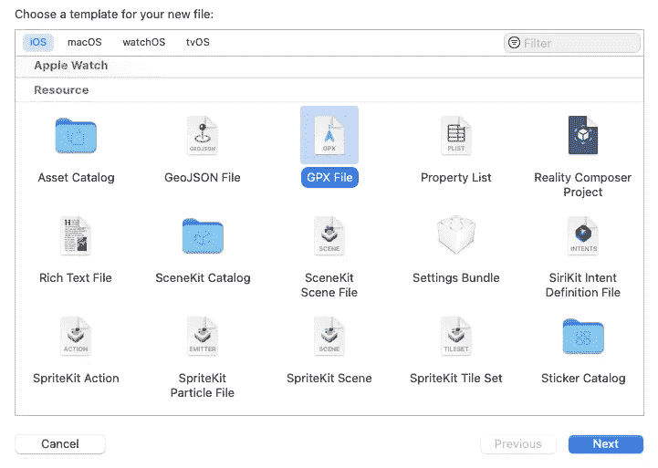
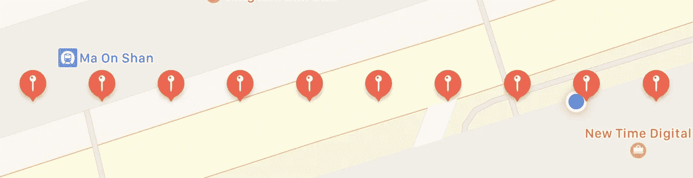
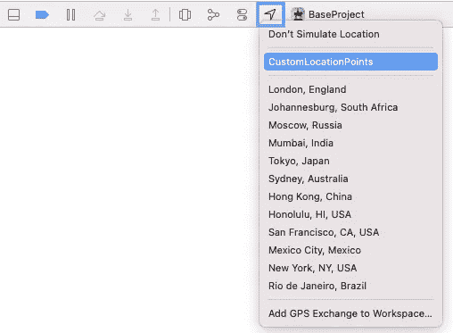
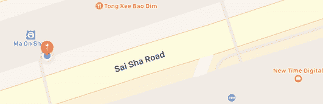
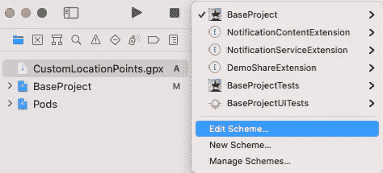
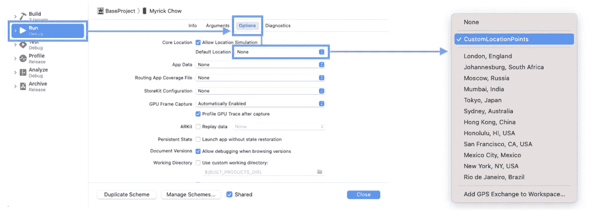
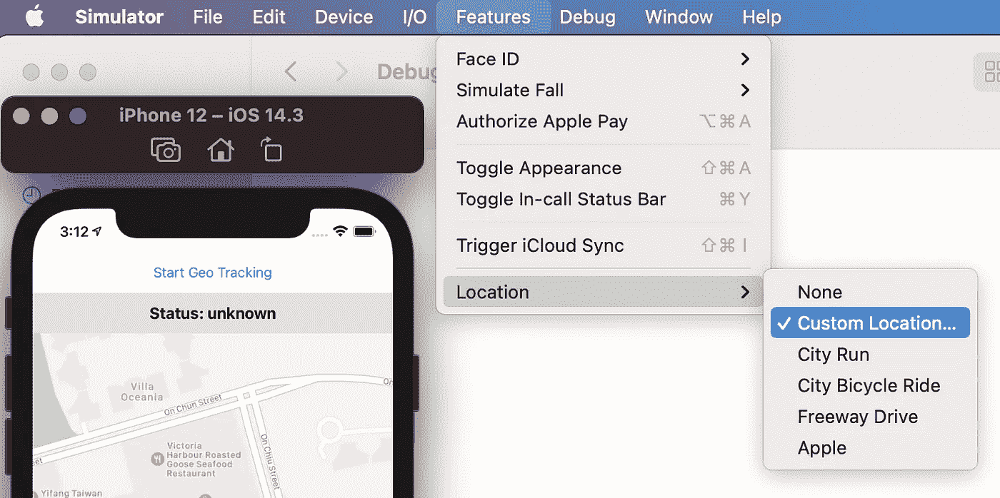
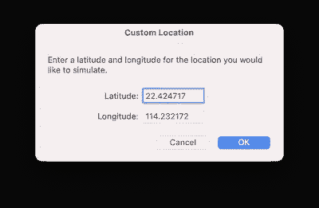
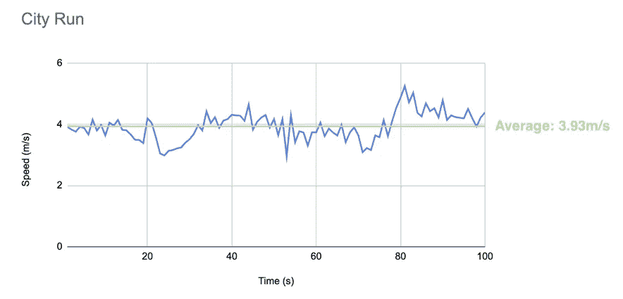
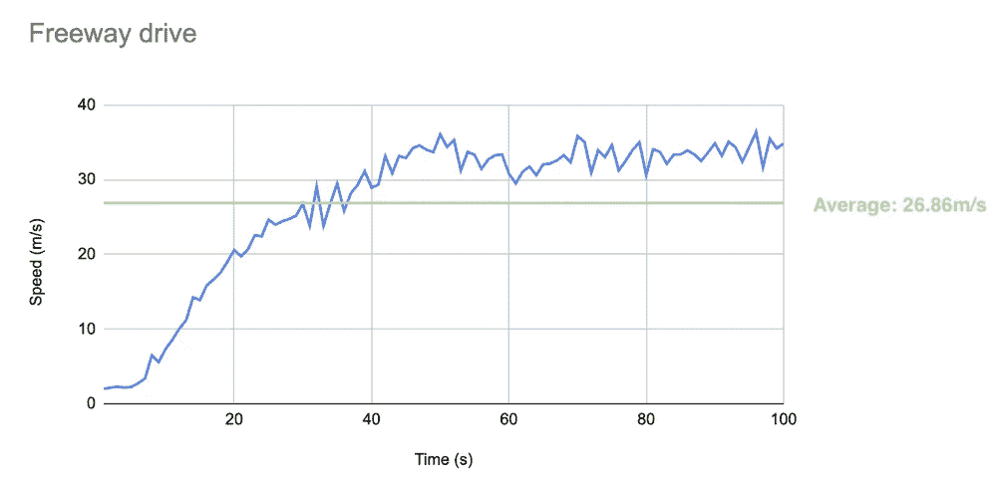

# 模拟 iOS 中的调试位置

> 原文：<https://itnext.io/simulate-debugging-location-in-ios-24496cbbc9d9?source=collection_archive---------5----------------------->

定位追踪是市场上一项流行的应用功能。许多应用程序使用用户的位置来提供不同种类的信息。例如，优惠券应用程序可以利用地理围栏来实时提供用户位置周围的不同活动。

为了确保应用程序的良好质量，开发人员应该使用一组模拟的位置点来测试他们的应用程序。与 Android 不同，Android 可以使用第三方应用程序(例如 [MockGPS](https://play.google.com/store/apps/details?id=net.marlove.mockgps&hl=en) )来模拟用户的当前位置，iOS 受到限制，开发者必须创建一个 GPX 文件。

位置模拟非常简单，只有 3 个步骤。开始吧！

# 什么是 GPX 档案？

[GPX](https://www.topografix.com/gpx.asp) 代表“ **GPS 交换格式**”。它采用 XML 格式，将数据包装在标签中。以上是 GPX 文件的一个例子。它包含许多不同的标签，但在 iOS 中仅支持`<gpx>`、`<wpt>`和`<time>`标签:

1.  `<gpx>`
    声明整个 GPX 文件的开始标记。每个 GPX 文件应该只有一个`<gpx>`标签
2.  `<wpt>` 代表“航路点”,包含模拟位置的经纬度
3.  `<time>` 这是每个航路点的可选字段。这是该地点的相对时间，但不是确切时间。这将在下一届会议上进一步讨论。

# 先决条件

假设您对 iOS 环境中的位置跟踪和处理有基本的了解。你可以阅读下面的文章来了解一些关于在 iOS 中处理所有位置信息的`CLLocationManager`的介绍。

 [## Swift iOS CLLocationManager 一体化

### 如何在 iOS 中获取用户位置？CoreLocation 为您提供了多少配置？让我们点击阅读更多！

itnext.io](/swift-ios-cllocationmanager-all-in-one-b786ffd37e4a) 

# 循序渐进的指导

## **第一步:创建一个 GPX 文件(Command + N)**

## **第二步:申报 GPX 文件内容**

1.  **单一位置**

最简单的 GPX 文件是只包含一个航路点的文件。它只是模拟一个特定的位置。

**2。一个轨迹(一系列位置)**

为了模拟一个轨迹，我们可以给 GPX 文件添加一系列的`<wpt>`。iOS 将使用**固定速度** (1 个航路点/秒)在两点之间导航。

**3。一首带有<时间>标签**的曲目

苹果允许开发者通过指定每个航点的时间来简化 GPX 数据。然后，iOS 将计算模拟位置之间的行驶速度，并每秒发送一次位置更新。因此，前一节中的 GPX 文件可以简化为 8 行代码。

`<time>`标签的值只是相对时间而不是绝对时间。这意味着它用于计算连续航路点之间所用的时间。

**第三步:调试时选择 GPX 文件**

在真实设备上运行应用程序后，Xcode 界面底部的“**调试区**会显示一个图标列表。点击列表末端的**模拟位置**按钮。选择您刚刚创建的 GPX 文件。

**第四步:查看结果:**

由于 MapView 动画，蓝色用户的位置指针不能与红色模拟位置 100%同步。

# 设置默认 GPX 文件

你是否为每次构建新版本都选择 GPX 文件而烦恼？Apple 提供了一个简单的解决方案，在每个方案的构建选项中设置默认的 GPX 文件。

1.  点击构建列表中的**编辑方案**

2.在“运行>选项>默认位置”选项卡中选择默认模拟位置。

# 限制

苹果公司限制在开发中使用 GPX 文件。只有在连接了真实设备或模拟器并通过 Xcode 运行时，才能模拟位置。换句话说，我们不能通过 CI/CD(例如 Jenkins)将测试位置集交付给 QA 测试人员。

# 模拟位置的其他选项

苹果在模拟器中提供了另外 5 个模拟位置的选项:

## 1.自定义(固定)位置

## 2.城市运行

这模拟了用户跑步时的位置变化。速度是范围从 2.96 米/秒到 5.25 米/秒的随机数

## 3.城市自行车骑行

这模拟了用户在城市中骑车时的数据。速度从 2.18 米/秒到 9.37 米/秒不等

## 4.高速公路车道

这模拟了用户在城市中骑车时的数据。速度从 1.97 米/秒到 36.41 米/秒不等

## 5.苹果

指向加州苹果园区坐标。它是(37.33233141，-122.0312186)

# 摘要

在将应用程序推向市场之前，模拟调试位置是开发人员确保高质量的一项关键任务。苹果可以模拟不同种类的位置变化进行调试。例如特定位置，并且当用户跑步、骑车和驾驶时，该位置改变。

为了进一步定制位置变化，我们可以使用 [GPX 文件](https://www.topografix.com/gpx.asp)，其中包含一系列不同时间戳的路点。开发人员可以完全定制模拟位置，并很好地调试它。

# 您可能对以下内容感兴趣:

 [## Swift iOS CLLocationManager 一体化

### 如何在 iOS 中获取用户位置？CoreLocation 为您提供了多少配置？让我们点击阅读更多！

itnext.io](/swift-ios-cllocationmanager-all-in-one-b786ffd37e4a)  [## 尽可能简单—为什么 GPS 至少需要 4 个卫星信号？

### GPS 是一种基于卫星的导航系统，用于在全球范围内定位用户位置。我们来看看 GPS 的解释可以是怎样的…

myrickchow.medium.com](https://myrickchow.medium.com/as-simple-as-possible-why-does-gps-need-at-least-4-satellite-signals-5bff178fedc0) 

欢迎您通过[Twitter @ my rik _ chow](https://twitter.com/myrick_chow)关注我，了解更多信息和文章。感谢您阅读这篇文章。祝您愉快！😄