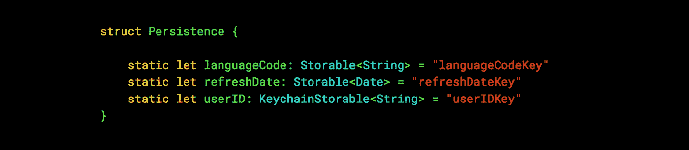

# Swift 中的单行持久性定义

> 原文：<https://itnext.io/single-line-persistence-definitions-in-swift-31f32a1dd2aa?source=collection_archive---------1----------------------->

## 关于如何减少用户默认/钥匙串访问代码，有很多想法。这里有一个我一直在使用的简单而优雅的解决方案。



下面是我们将要完成的任务(不要担心，定义不需要是静态的！)

一个好的键值存储解决方案应该具有以下特性:

*   强类型访问
*   所有可能的钥匙都在一个地方
*   开发人员不应该需要手动编写 setters 和 getters。
*   商店的位置应该很容易改变(例如，你应该能够决定将一个值从`UserDefaults`移动到钥匙链中，而不需要太多额外的努力)
*   对存储的引用应该标记为只读

借助泛型和`ExpressibleByStringLiteral`的力量，我们可以创建一个解决方案，它不依赖于某处存在的带有键列表或手动访问器列表的枚举。

## 所有键值存储的共同点

所有键值存储解决方案都能够存储原语对象。让我们把这看作是未来实现的共同标准，所以我们所有存储的对象都应该能够把它们自己表示为原语。

```
protocol StoredObject {
    associatedtype Primitive
    func toPrimitive() -> Primitive?
    static func from(primitive: Primitive) -> Self?
}
```

如果我们想存储一个原语，我们可以很容易地遵循这个协议:

```
extension String: StoredObject {

    typealias Primitive = String

    func toPrimitive() -> Primitive? {
        return self
    }

    static func from(primitive: Primitive) -> Primitive? {
        return primitive
    }
}
```

实际上，你知道吗，我们不想重复`Int`、`Float`、`Bool`等所有代码。让我们创建另一个协议来实现这两个简单的功能:

```
protocol StoredAsSelf: StoredObject where Primitive == Self { }

extension StoredAsSelf {

    func toPrimitive() -> Primitive? {
        return self
    }

    static func from(primitive: Primitive) -> Primitive? {
        return primitive
    }
}
```

所以现在对于我们想要存储的基本类型，我们需要做的就是:

```
extension String: StoredAsSelf {
    typealias Primitive = String
}

extension Int: StoredAsSelf {
    typealias Primitive = Int
}

extension Float: StoredAsSelf {
    typealias Primitive = Float
}
```

太好了！如果您想要存储一个非原语类型(例如一个`Date`)，只需通过将其分解成一个原语来遵循协议:

```
extension Date: StoredObject {

    typealias Primitive = TimeInterval

    func toPrimitive() -> Primitive? {
        return timeIntervalSince1970
    }

    static func from(primitive: Primitive) -> Date? {
        return Date(timeIntervalSince1970: primitive)
    }
}
```

很简单！

## 通用存储包装

对于我们想要使用的每个存储解决方案，我们应该制作一个强类型的包装器。我将使用`UserDefaults`作为例子，但是您当然可以为任何第三方解决方案实现它。

`ExpressibleByStringLiteral`允许我们用字符串实例化一个对象。这非常符合我们的需求，因为我们需要一个与我们的`StoredObject`配对的键，并且我们可以使用泛型来推断`StoredObject`的类型。但是如果你以前使用过`ExpressibleByStringLiteral`，你会知道有三个初始化器需要实现:`init(stringLiteral:)`、`init(unicodeScalarLiteral:)`和`init(extendedGraphemeClusterLiteral:)`。在我看来这是不必要的，所以(再次)让我们创建一个协议来悄悄地实现后两个:

```
protocol StringLiteralBoilerplate {
    init(stringLiteral value: String)
}

extension StringLiteralBoilerplate {
    typealias StringLiteralType = String

    init(unicodeScalarLiteral value: String) {
        self.init(stringLiteral: value)
    }

    init(extendedGraphemeClusterLiteral value: String) {
        self.init(stringLiteral: value)
    }
}
```

现在剩下的就是创建我们的存储包装器了。它将有一个必须是`StoredObject`的泛型类型，并且它将完成`ExpressibleByStringLiteral`的实现:

```
struct Storable<Object>: ExpressibleByStringLiteral, StringLiteralBoilerplate where Object: StoredObject {

    private let key: String
    private let store = UserDefaults.standard init(stringLiteral value: String) {
        self.key = value
    }

    var value: Object? {
        set {
            store.set(newValue?.toPrimitive(), forKey: key)
        }
        get {
            guard let p = store.value(forKey: key) as? Object.Primitive else { return nil }
            return Object.from(primitive: p)
        }
    }
}
```

同样，你不需要在这里使用`UserDefaults`——如果你也需要钥匙链存储，简单地创建另一个类似的结构`KeychainStorable`,并适当地填充它！

## 把所有的放在一起

我已经在几个应用程序中设置了我的持久性定义，如下所示:

```
struct Persistence {

    struct TabBar {
        var infoiewDate: Storable<Date> = "t.viewDate.info"
        var diaryViewDate: Storable<Date> = "t.viewDate.diary"
        var messagesViewDate: Storable<Date> = "t.viewDate.mess"
    } struct Utility {
        var upgradeAlertIgnored: Storable<Bool> = "u.upgradeIgnored"
        var token: KeychainStorable<String> = "u.token"
        var graphData: RAMStorable<[Graph.Body]> = "u.graphData"
    } ...
}
```

然后，在需要读取存储数据的类中，实例化您需要的项目组:

```
private var persistence = Persistence.Utility()...persistence.upgradeAlertIgnored.value = true *// set/get using .value*
```

此外，在定义组时使用`struct`的一个好的副作用是，如果在上面的例子中使用`let`，那么你的持久性引用将是只读的！当然，如果有一天你决定将一个特定的值存储在 Keychain 中，而不是存储在`UserDefaults`中，你可以简单地改变存储结构的名称。

最后，由于对存储的访问实际上是单例式的，所以在编写单元测试时不会有任何问题——只需创建持久性组的另一个实例，并根据需要断言值。


过去几个月我一直在东京工作！我添加这张照片是因为 a)我喜欢它，b) Medium 不让我选择第一张图片作为特色图片，除非有第二张😉