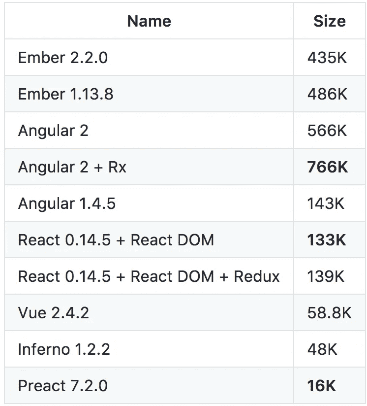
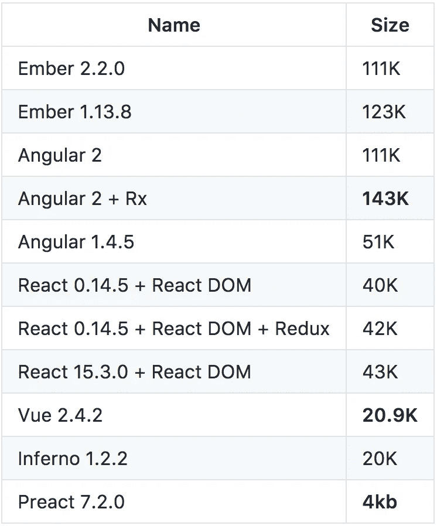
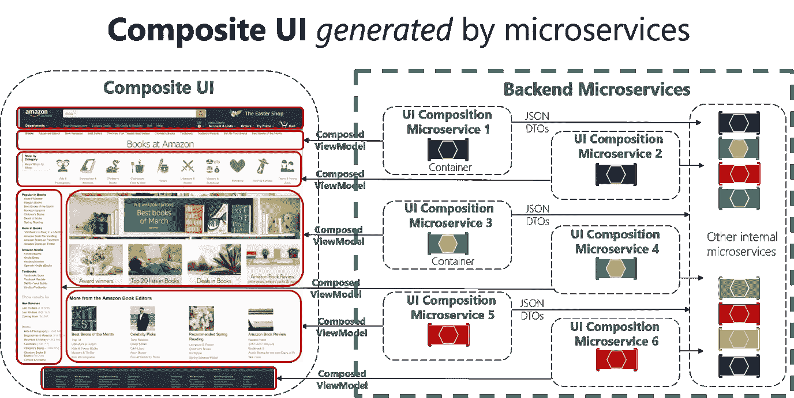

# SPA 不是梦，是矫枉过正

> 原文：<https://itnext.io/single-page-application-overkill-802c11f9da58?source=collection_archive---------0----------------------->

尽管这个标题听起来有点太响亮，让我们来研究一下这个主题，我希望你会觉得有趣，因为我确实是这么做的！

在过去的几年里，前端世界迅速成长为一个宇宙，开启了 Web 开发的新时代。现在它不仅仅是我们习惯的 HTML + CSS + JS，现在它是一个非常完善的生态系统，有数百万条路径可供研究。

我们现在有自动化的构建工具，预编译器，后编译器，丑化器，优化器，框架等等。天杀的，这么多的流行词汇用在前端开发人员的面试上，而这仅仅是为了建立我们的“老派”首页。但它还是老派页面吗？作为开发人员，我们习惯于将大部分时间花在构建可伸缩、高效、高可用性的后端系统上，而忘记了对客户来说什么才是真正重要的。而那就是流畅的体验，是(大部分)前端带给他们的。那么，如何确保使用 buzz tech stack 不会使您的应用程序过于复杂呢？

SPA(单页应用)是构建流畅前端应用的现代趋势。开源世界里有很多框架可以帮助你实现这个目标，比如 AngularJS、EmberJS、VueJS 等等。它们提供了一种新的架构模式，在这种模式下，您可以将一些逻辑移动到前端，并与 API 进行通信，以处理数据，从而减少客户端和服务器之间的通信量，提供更流畅的体验。它们都是很好的工具，不要误解我的意思，但是让我们来看看一些事实:

这里列出了一些最流行的前端框架(很抱歉我错过了你最喜欢的%NAME%JS 框架，太多了，无法一一介绍)和它们的大小(当然是缩小的):

缩小的框架尺寸

哎唷，那是痛苦的…让我们通过压缩它们使它稍微好一点，这是结果:

前端框架 gzip-ed

好多了不是吗？所以别忘了在你的服务器设置里启用 gzip)但这不是我说的。

因此，假设我们的框架平均重量为 70K，这只是核心框架，然后我们将一些库、CSS 和其他“必备”资源添加到我们的核心页面布局中，它最终有几百 KB，这并不是那么糟糕，你会说，我们生活在一个速度很快的世纪，所以我们为什么要烦恼。从一个角度看你是对的，但从另一个角度看...让我们来解决这个问题…

让我们来谈谈移动网络、4G/3G 和延迟。由于低延迟和可用性，即使有花哨的 4G 连接，你的速度将非常慢，页面速度负载将大幅增加。

有很多科学研究(我说的科学是指它们是由谷歌这样的大公司发布的，但谁知道他们是如何做实验的，我们所能做的就是相信他们)，这些研究发现了获得最佳关注和提供无缝客户体验的最佳页面下载时间…这就是 1 秒钟！

DNS 查找 1 秒+ SSL 握手(你用的是 SSL 吧？)+ TTFB(到达第一个字节的时间—服务器处理我们的请求所需的时间)+下载资源+在屏幕上呈现资源= 1 秒！该死，这么短的时间做这么多事情。更可怕的是，研究表明，这比平均水平要高:

*   DNS 查找+SSL—200 毫秒(缓存前)
*   TTFB—200 毫秒

这导致我们只有 600 毫秒来下载和呈现内容。让我们说，你有一些很好的优化背景图片在标题+一些图片总计 200K + Angular2 框架，这是大约 100K，这是 300KB。3G 的平均真实速度是 3Mbps，延迟 120 毫秒(参见:[https://www.4g.co.uk/how-fast-is-4g/](https://www.4g.co.uk/how-fast-is-4g/))

它将在大约 800 毫秒内下载您的内容…哎呀…游戏结束…这就是当您拥有真正轻量级的网站、优化的服务器和压缩的资源时所发生的情况…对于小网站来说，大约 2 秒钟的页面加载是可以的，当您不为每次访问付费(有机或真金白银)时，否则您会在乎每一毫秒，这实际上会影响您的收入。

这就是为什么许多大公司试图只在边缘情况下使用这些沉重的框架，并提供基于组件的前端应用程序。这是什么意思？

在构建应用程序时，有几个问题需要解决:

*   可量测性
*   依赖性管理
*   可维护性
*   速度(缓存)

当您进入企业时，您希望将您系统分解成小块，并将它们委托给单独的团队。这就是主要的痛苦开始的地方。有了后端就容易多了，因为有了 SOA，每个团队都拥有自己的业务领域和服务。但是前端呢？你怎么能把它分开呢？自己一页一页的？嗯，这不是最好的方法，因为您将与共享的小部件交叉依赖。因此，最好的解耦方式是创建基于组件的前端。

想法是你建立一个网关，它基本上是一个复杂的路由器。它知道如何根据所需的组件构建页面:

非常笼统的建筑概念

这种体系结构不仅使您能够独立地处理每个组件并降低团队的速度，而且使您能够灵活地共享资源并只加载那些需要的资源。

微软有另一张关于基于组件的 UI 的漂亮图片

通过分离逻辑，每个组件都很容易测试、维护和发布。这难道不是敏捷交付的完美匹配吗？

每个团队都拥有与他们的业务领域相关的组件。因此，让我们总结一下常见的主要问题，以及该架构如何解决这些问题:

## 可扩展性:

您可以独立地监控每个组件的使用情况，并以构建 SOA 后端的相同方式扩展它们。

## 依赖性管理:

团队拥有他们的组件，他们可以独立地将它们发布到产品中，因此这种方法提供了一个更容易的连续交付/部署集成。

## 可维护性:

有什么东西坏了，或者需要改进？一点问题都没有，不用钻研一个巨大的应用程序——你只需修复组件并发布它。

## 速度:

是的，对于每个请求，您的网关将向服务发出 N 次请求以获取所需的组件，从一个角度来看，这降低了系统的速度，但您可以独立缓存和扩展每个组件，这为您提供了更好的灵活性来控制性能。

这种架构并不意味着你不能使用任何框架，但是你不觉得这有点大材小用吗？在某些情况下，干净的模块化 js 可以提供你需要的一切。

总而言之，有很多方法可以优化你的页面负载，比如 CDN、不同域的资源分离、HTTP 2 等等(如果你想让我在另一篇文章中讨论这个问题，请在评论中告诉我)，我想说的是，SPA 是一个用于特定目的的伟大工具，但绝对不是所有问题的理想解决方案。如果您构建一个可伸缩的前端应用程序，请记住简单性和最终目标——客户体验。

那么你使用水疗有什么体验？您在使用“重型”框架时遇到过性能方面的问题吗？请在评论区留下你的想法，我很乐意讨论！

谢谢你。