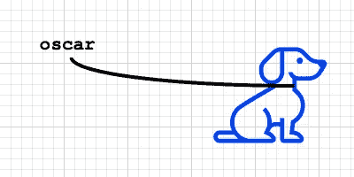
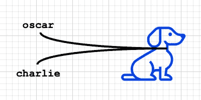
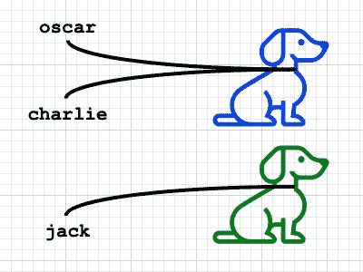

# 适用于初学者的 Singleton

> 原文：<https://itnext.io/singleton-in-swift-for-beginners-50f3a3d660dd?source=collection_archive---------2----------------------->


克林特·王茂林在 [Unsplash](https://unsplash.com/s/photos/connection-structure?utm_source=unsplash&utm_medium=referral&utm_content=creditCopyText) 上拍摄的照片

单例设计模式将一个类的实例化限制为一个对象。

你不知道这句话是什么意思🤯？那这篇文章就送给你了，继续看！

这是一种常见且相对简单的技术，Swift 开发人员经常使用这种技术在项目的几个部分之间共享数据。

如果你是一个初学者，你会从学习单例设计模式中受益匪浅。

# 理解引用类型

好了，先来一点理论。Swift 中的类遵循*引用类型逻辑*。

这意味着如果你有一个类型为类的变量，那么这个变量不包含实际的对象😱。
它只包含一个对象的引用(或指针)。

## 等等…再告诉我一遍🤔

好吧，让我们试着更好地理解使用狗意味着什么🐶。

首先，我们来定义一下我们的`Dog`类。

```
class Dog {
    var color: String?
}
```

现在让我们创建一个`Dog`。

```
let oscar = Dog()
```

在执行这一行之后，在内存中创建了两个实体:

*   `oscar`:引用狗实例的变量
*   一个`Dog`实例

你可以把`dog`变量想成一个`leash`，把`Dog`实例想成一只真正的狗。


*图标由* [制作 *Freepik*](https://www.flaticon.com/authors/freepik) *出自*[*www.flaticon.com*](http://www.flaticon.com)

酷，现在每次你应用一个变化到你的`oscar`变量 Swift 将**跟随皮带**直到它找到实际连接的`Dog`，然后将应用变化。

例子

```
oscar.color = "Blue"
```

该指令将改变皮带另一端的`Dog`的颜色。



*图标由*[*Freepik*](https://www.flaticon.com/authors/freepik)*来自*[【www.flaticon.com】](http://www.flaticon.com)

## 让我们添加另一个皮带…或参考

现在让我们运行下面一行代码

```
let charlie = oscar
```

我们为**同一只狗**创建了一个新的引用(`charlie`)。



*图标由*[*Freepik*](https://www.flaticon.com/authors/freepik)*转自*[*www.flaticon.com*](http://www.flaticon.com)

这就像有两条不同的皮带拴在同一只狗身上。这意味着对`oscar`应用一个改变会影响`charlie`，反之亦然，因为这是同一只狗**。**

**让我们测试一下**

```
let oscar = Dog()
let charlie = oscarprint(charlie.color) // prints nil
oscar.color = "Blue"
print(charlie.color) // prints "Blue"
```

## **创造新的狗**

**因为还没有实现 Singleton，记住你仍然可以创建一个新的`Dog`。它将被视为不同的对象，改变它将**而不是**影响其他狗。**

**请看下面的代码**

```
let oscar = Dog()
let charlie = oscar
oscar.color = "Blue"let jack = Dog() // jack is a new Dog
jack.color = "Green"print(oscar.color) // prints "Blue"
print(charlie.color) // prints "Blue"
print(jack.color) // prints "Green"
```

**现在我们有 3 条皮带和 2 条狗。**

****

***图标由*[*Freepik*](https://www.flaticon.com/authors/freepik)*来自*[【www.flaticon.com】](http://www.flaticon.com)**

# **构建单例**

**现在引用类型的概念似乎不那么晦涩了，对吗？**

**太酷了，我们终于可以理解单例是如何工作的了。**

**使用 Singleton，无论你在项目的什么地方，你都可以访问同一个对象(`Dog`)。这太神奇了，因为你存进那个`Dog`的任何价值都将随处可用！**

**让我们建立一个单例。**

```
final class Dog {
    static let shared = Dog()
    private init() { } var color: String?
}
```

**这是怎么回事？👆**

*   **用一个`Dog`填充`static let shared`属性。就像**万能牵引绳**。现在，无论你在哪里，只要调用`Dog.shared`，你就会得到一个对`Dog`对象的引用。**
*   **用`private init`我们隐藏了初始化器。所以我们在阻止新`Dog(s)`的产生。**
*   **我们用关键字`final`标记了这个类，以防止子类化。事实上，它可以用来再次暴露初始化器。**

**就是这样。**

# **使用单例**

**现在您可以在项目中的任何地方使用`Dog`。**

**要访问它，只需写**

```
Dog.shared
```

**让我们看一个例子。您可以从一个文件中填充`color`属性**

```
// HomeViewController.swift...
Dog.shared.color = "Black"
...
```

**并从另一个文件中读取它**

```
// DetailViewController.swift
...print(Dog.shared.color) // prints "Black"
...
```

# **结论**

**现在，您可以为您的应用程序创建一个单例。当然，你可以给它取一个更合适的名字。**

```
final class UserData {
    static let shared = UserData()
    private init() { } var name: String?
    var permissions: [String] = []
    // TODO: add more properties here...}
```

**请记住，无论您在哪里，您都可以通过简单地编写`UserData.shared`来检索共享对象。**