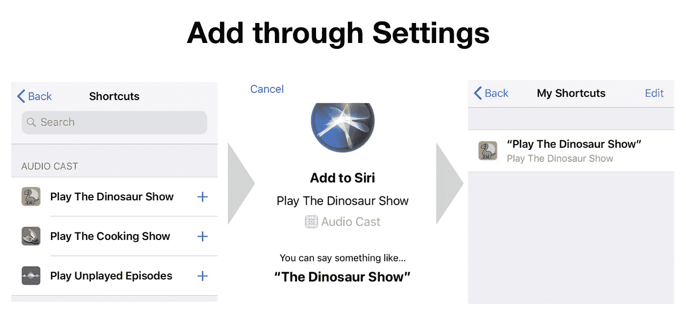
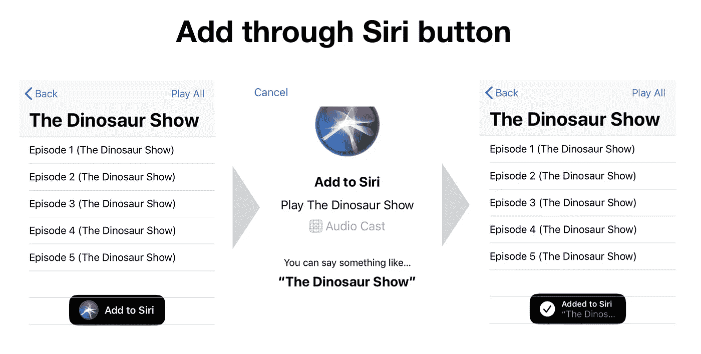
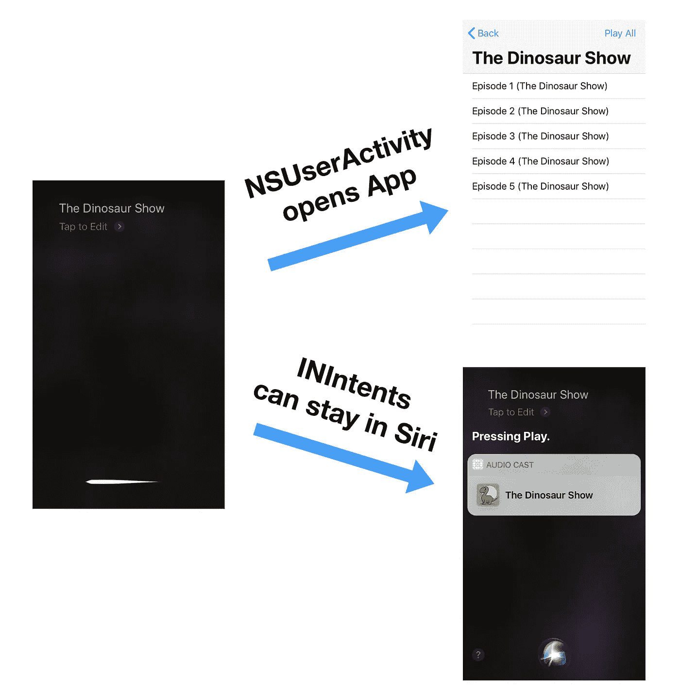
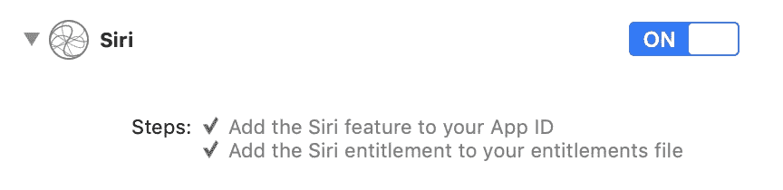
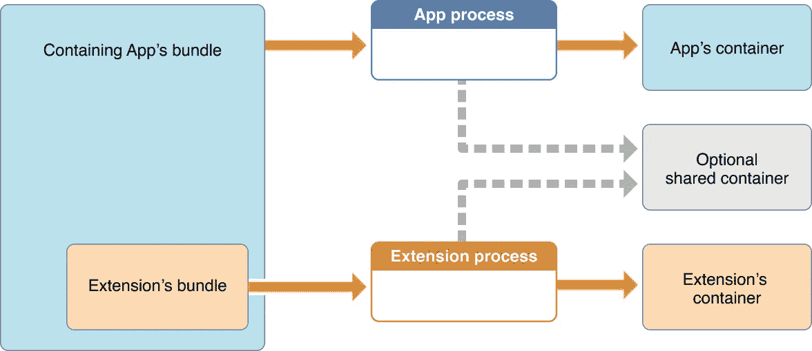
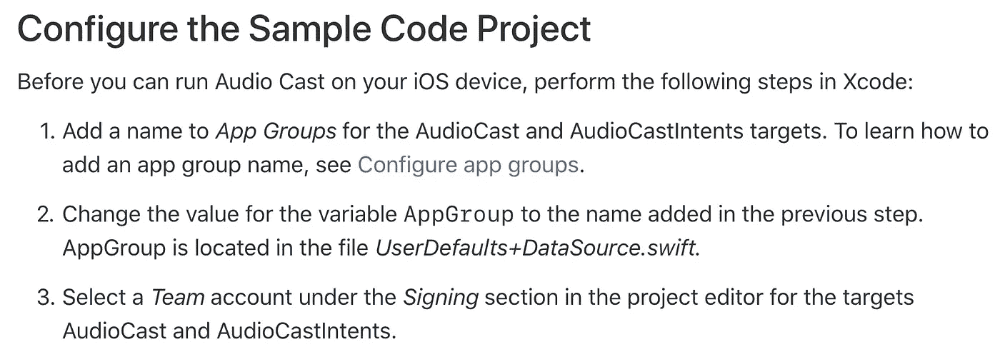
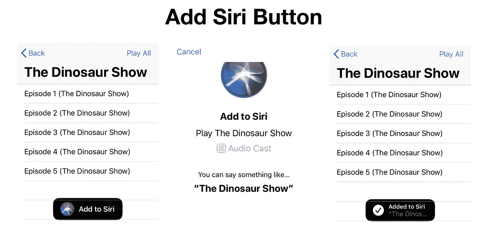
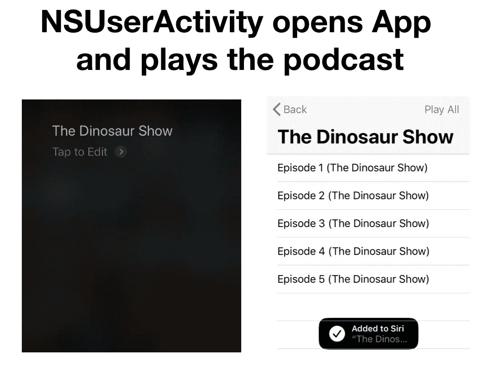
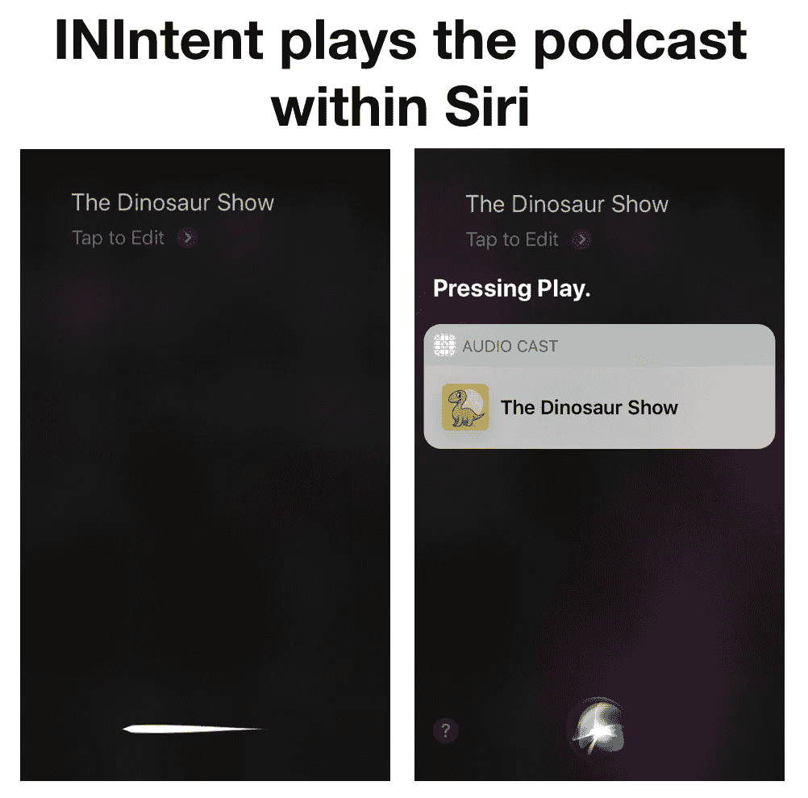

# Siri 快捷方式:如何添加 Siri 按钮

> 原文：<https://itnext.io/siri-shortcut-how-to-add-a-siri-button-c0458e279ab8?source=collection_archive---------0----------------------->

苹果提供的 S ample 项目([汤厨](https://developer.apple.com/documentation/sirikit/soup_chef_accelerating_app_interactions_with_shortcuts))目前需要我们通过**设置> Siri &搜索**添加 Siri 快捷方式。然而，我们，iOS 开发者，更喜欢在我们的应用程序中添加一个 Siri 快捷按钮，这样我们的用户就更有可能使用这个功能。



本教程将演示 ***“如何在*** [***内添加响应式 Siri 按钮***](https://developer.apple.com/documentation/sirikit/media_intent_shortcuts/playing_media_through_siri_shortcuts)**”。**

*然而，在我们开始之前，有一件事你需要先知道…*

## *不活跃与不活跃*

*T 下面是[创建快捷方式](https://developer.apple.com/documentation/sirikit/donating_shortcuts)的两种方式，分别是`NSUserActivity`和`INIntent`。它们之间的主要区别是`NSUserActivity`从 Siri 进入你的应用程序来完成任务，而`INIntent`允许你的用户在不打开你的应用程序的情况下通过 Siri 进行交流。*

**

## *编码前的基本设置*

*`NSUserActivity`和`INIntent`都需要我们打开 Siri 功能。*

**

*在[音频转换](https://developer.apple.com/documentation/sirikit/media_intent_shortcuts/playing_media_through_siri_shortcuts)中，你还需要配置[应用程序组](https://developer.apple.com/library/archive/documentation/General/Conceptual/ExtensibilityPG/ExtensionScenarios.html)以使项目能够使用带有 Siri 扩展的共享容器。*

****

*[音频广播中的自述文件](https://developer.apple.com/documentation/sirikit/media_intent_shortcuts/playing_media_through_siri_shortcuts)*

## *通过 NSUserActivity 添加 Siri 按钮*

**

*在*episodetableviewcontroller . swift*内部，我们来添加 Siri 按钮。*

*接下来，我们通过`NSUserActivity`设置意图。*

*然后编译器会要求你遵守三个协议:`INUIAddVoiceShortcutViewControllerDelegate`、`INUISAddShortcutButtonDelegate`和`INUIEditVoiceShortcutViewControllerDelegate`。只需在*episotedableviewcontroller . swift .*的最底部添加代码*

*为了允许 *AppDelegate* 播放*EpisodeTableViewController*中的剧集，在*EpisodeTableViewController*中添加一个公共`play()`函数。*

```
*public func play() {
    play(episodes: nil)
}*
```

*然后，转到 *AppDelegate* 并添加一个变量`libraryManager`来请求播放列表。*

*最后，让你的应用程序根据`application(_:continueUserActivity:restorationHandler)`中的`userActivity.activityType`播放想要的播放列表。下面的代码对于编写重复的代码来说绝对是糟糕的实践，但是足以说明它是如何工作的。😜*

*干得好。运行应用，添加 Siri 快捷方式，然后召唤你的应用来玩！🎊*

**

*如果你想通过 nsuractivity 查看[添加 Siri 按钮的整个项目，请点击 nsuractivity 分支的](https://github.com/ji3g4kami/Siri-shortcut-button/tree/NSUserAvtivity)。*

## *通过内容添加 Siri 按钮*

*Un 就像用`NSUserActivity`添加 Siri 按钮一样，用`INIntent`添加它在默认情况下是没有反应的，这意味着它不会向你显示“已添加到 Siri”，除非我们将正确的`INShortcut`分配给 Siri 按钮。*

*使用`INVoiceShortcutCenter` singleton，我们能够获得所有注册的快捷方式。然后，我们必须过滤掉想要的快捷方式。这里我们将使用系统创建的 UUID 标识符。如果用户尚未注册快捷方式，则创建按钮的意图和快捷方式。*

*最后，遵守三项协议。同时，我们将快捷方式标识符(UUID)保存到 UserDefaults，这样按钮就可以获得所需的快捷方式。*

*哇啦。就是这样。测试一下，享受通过 Siri 播放的剧集。*

**

*如果你想在 master branch 的这里看到添加 Siri 按钮的整个项目。*