# 使用自定义意图的 Siri 快捷教程

> 原文：<https://itnext.io/siri-shortcut-tutorial-using-custom-intent-d0f836af5863?source=collection_archive---------1----------------------->

S 从一个简单的[天气应用](https://github.com/ji3g4kami/Weather)开始，列出了四个城市，我期待当我让 Siri 告诉我这个城市的天气时，Siri 可以直接告诉我天气而不用打开应用。此外，当我在 Siri 中点击窗口时，它会带我去想要去的城市，并提供天气信息。这里我将介绍添加自定义 Siri 快捷方式的过程。

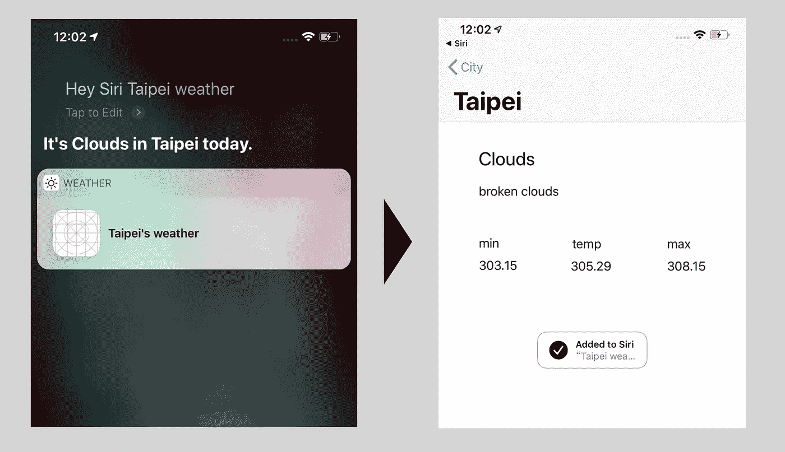

> 注意:你可以从 master 分支的[天气 App](https://github.com/ji3g4kami/Weather) 中克隆启动项目。[最终项目在 SiriShortcut 分支](https://github.com/ji3g4kami/Weather/tree/SiriShortcut)。此外，它的屏幕应大于或等于 5.5 英寸。

# 应用程序结构

> 像以前一样，要使用 SiriKit，我们需要对我们的应用程序进行意向应用程序扩展。这个扩展将处理在后台运行的快捷方式。此外，苹果建议 [**将扩展和应用共享的代码拆分到一个框架**。](https://medium.com/flawless-app-stories/wwdc-2018-for-ios-developers-siri-shortcuts-e8e4a78f0ad7)这个框架应该包含所有管理和贡献快捷方式的代码。

来自 [Apple](https://developer.apple.com/documentation/sirikit/media_intent_shortcuts/playing_media_through_siri_shortcuts) 和 [Ray Wenderlich](https://www.raywenderlich.com/6462-siri-shortcuts-tutorial-in-ios-12) 的两个样本项目，AudioCast 和 TheBurgeoningWriter，都符合这个 App 结构，就这么干吧！

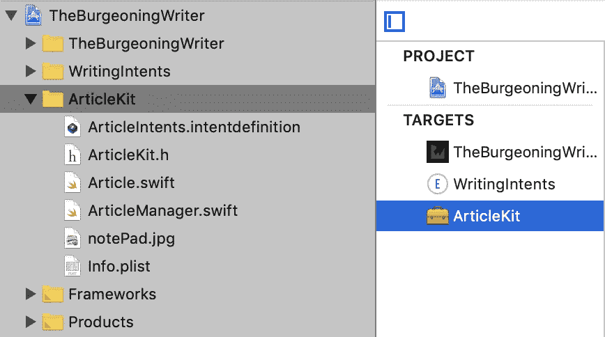

**将扩展和应用之间共享的代码拆分到一个框架中**

在天气 App 里面，我们先添加目标。

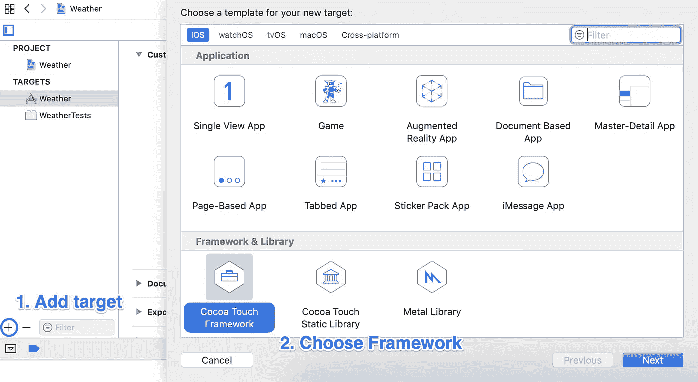

包括单元测试，我们将把之前的单元测试和代码一起迁移到框架中。

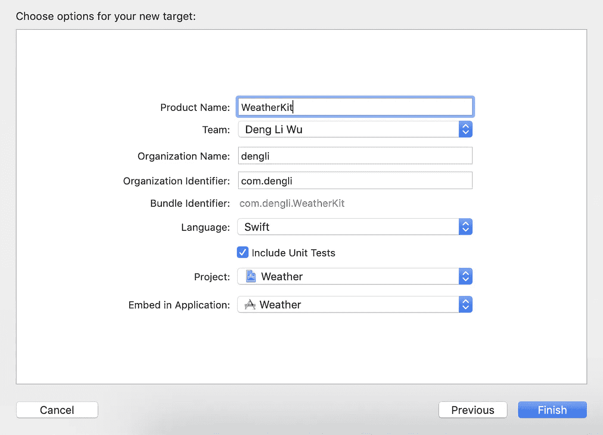

将*服务、支持和型号*文件夹移动到*天气套件*中。然后将目标成员资格更改为 *WeatherKit* 。我们还需要制作 APIManager 和 WeatherManager。

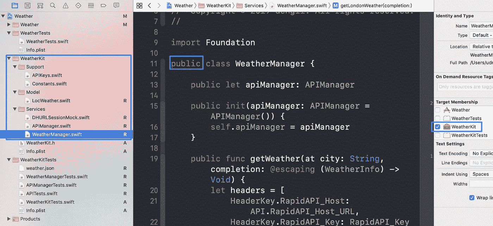

然后我们用通用的 iOS 设备构建 *WeatherKit* ，然后在 *WeatherViewController 的顶部添加`import WeatherKit`。运行应用程序，它应该完全正常！*

与我们对 *WeatherKit* 所做的一样，我们将把我们的测试转移到 *WeatherKitTests* 。确保将目标成员资格更改为 *WeatherKitTests* 并将`@testables`更改为`@testable import WeatherKit`

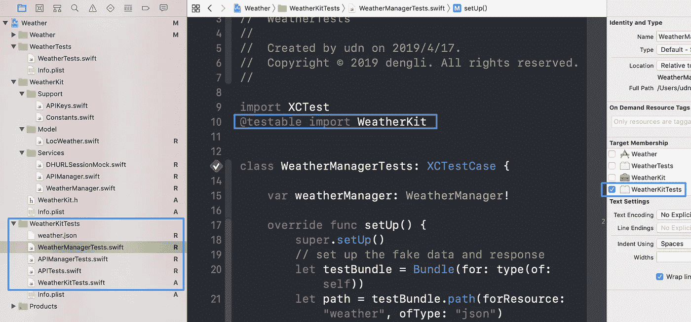

按下⌘ + U 并测试它。做一些小的但必要的修改，感觉有点琐碎是很自然的。

顺便说一下，如果我们研究代码覆盖率，我们会发现 *WeatherKitTests* 现在已经从*天气应用*中分离出来。

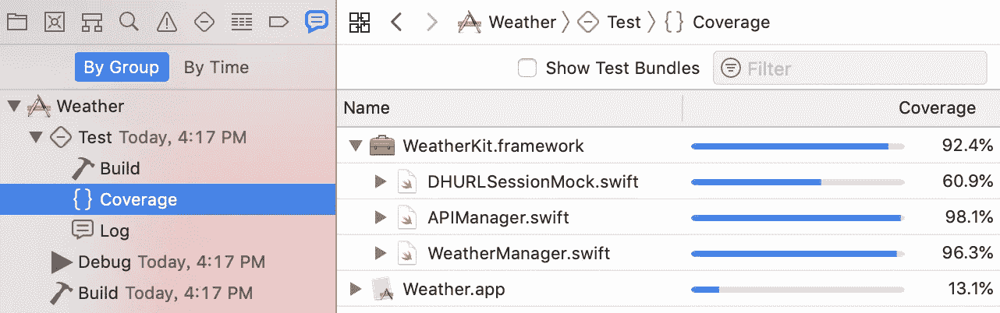

太好了！我们已经成功地**将扩展和应用程序之间共享的代码分割成一个框架**。

# 添加自定义意图

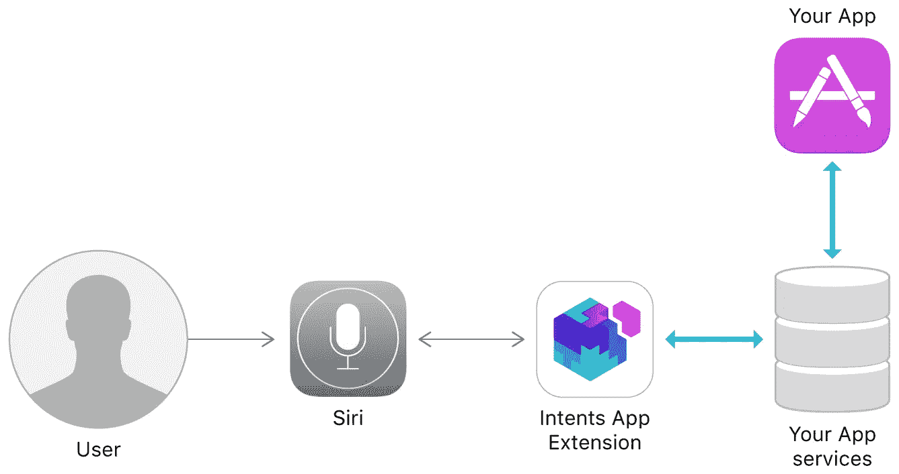

[https://developer.apple.com/documentation/sirikit](https://developer.apple.com/documentation/sirikit)

我们可以通过 Siri 与用户交流，而不必打开带有**自定义意图**的应用程序。要让您的自定义意图发挥作用，需要做一些事情:

*   启用 Siri 功能。
*   添加 Siri Intents 和 Intents UI (UI 是可选的，取决于您的需要)。
*   用 Siri 意图定义文件定义自定义意图。
*   使用 Xcode 自动生成的`IntentHandling`协议处理意图。
*   使用 AppDelegate 中的`restorationHandler`允许应用程序在所需的视图中打开。

## 启用 Siri 功能

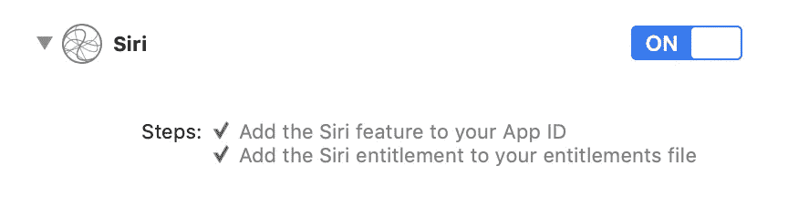

## 添加 Siri 意图和意图 UI

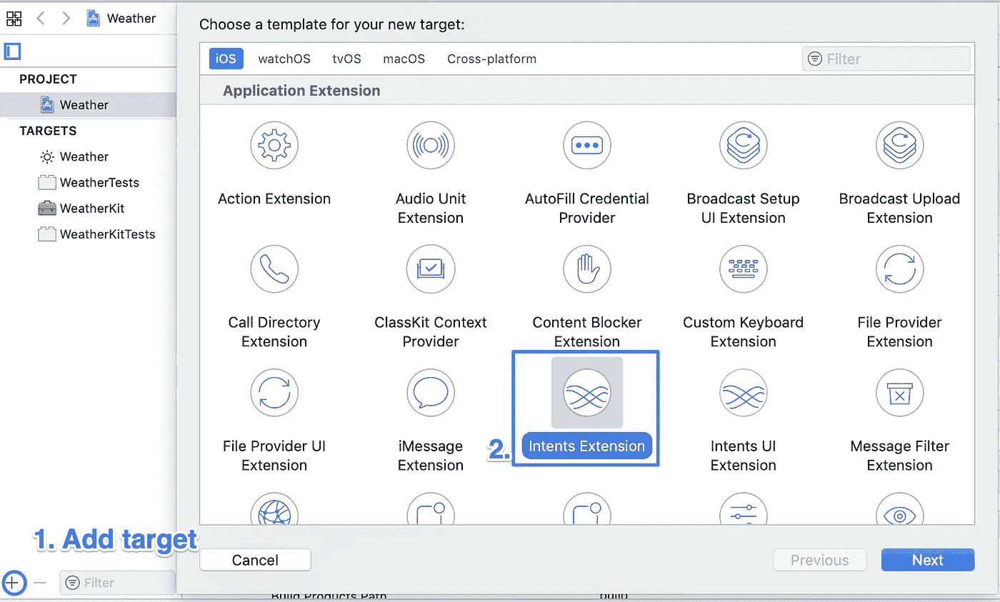

这里我将命名我的意图 *CityWeatherIntent* 。此外，当 Xcode 询问时激活模式。

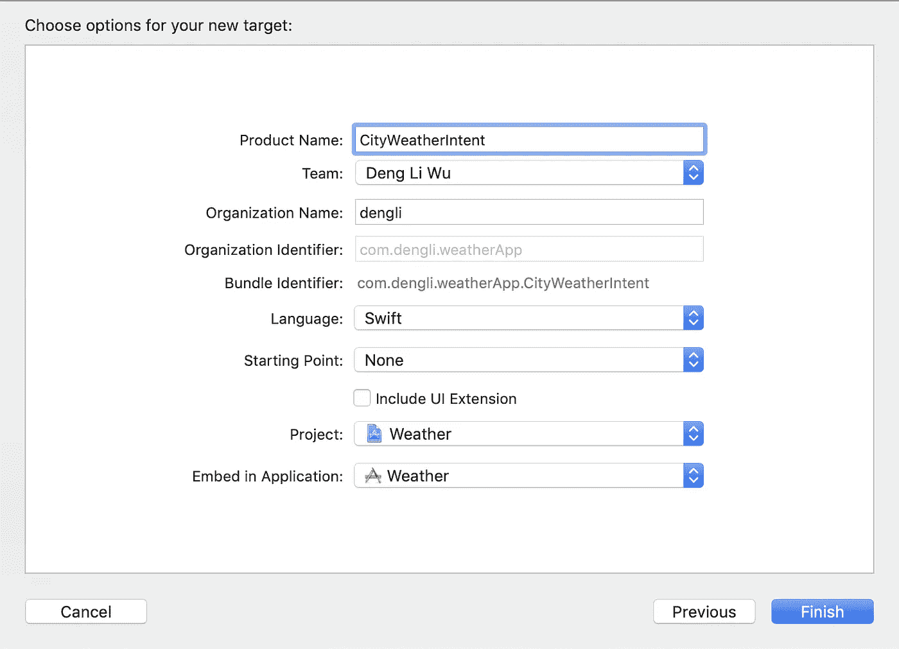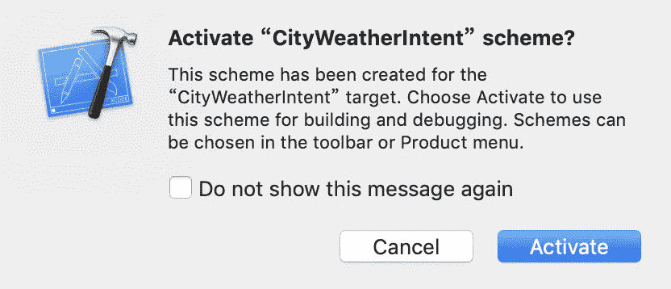

*CityWeatherIntent (* 和 *CityWeatherIntentUI)* 应该在**链接框架和库**中包含共享框架。

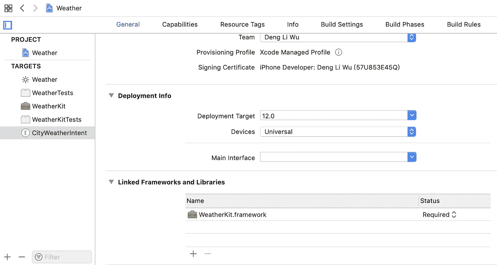

## 使用 Siri 意图定义文件定义自定义意图

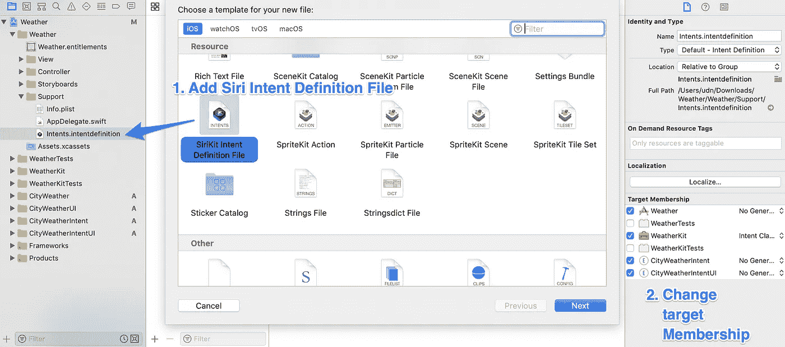

只有框架使用**意图类**，其他应该使用**没有生成的类**。

添加您的新自定义意向并完成信息。

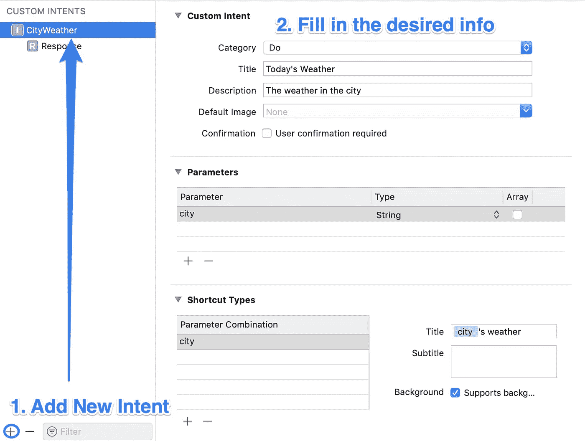

Xcode 会自动为您生成这些代码

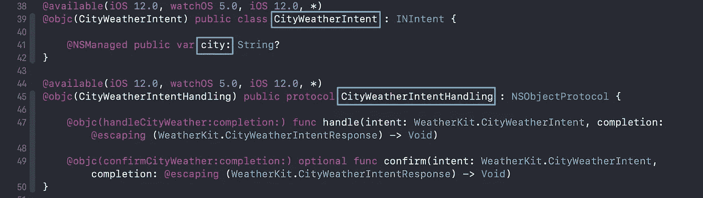

填写回应信息。

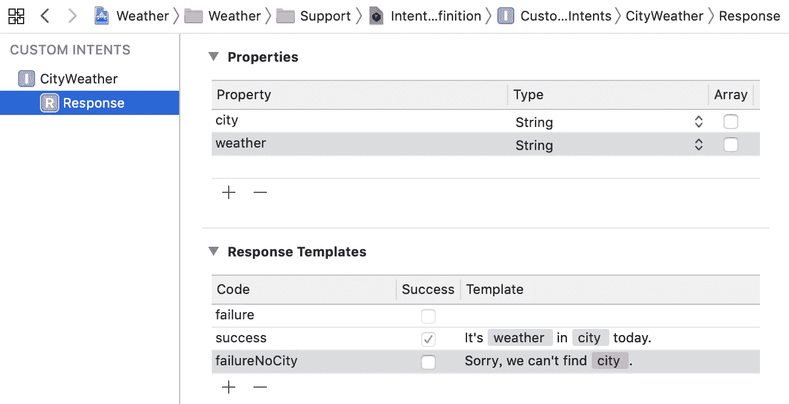

Xcode 的自动生成代码

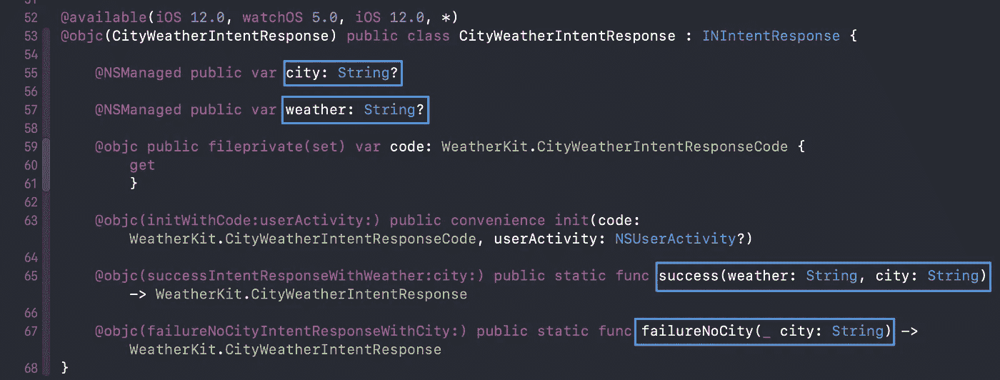

## 使用 Xcode 自动生成的`IntentHandling`协议处理意图

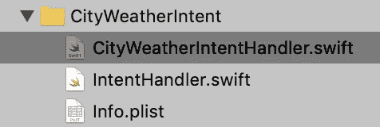

转到 *CityWeatherIntent* 组，用以下代码添加*city weather handler . swift*。

将 *IntentHandler* 的返回类改为`CityWeatherIntentHandler()`

## 使用 AppDelegate 中的`restorationHandler`允许应用程序在所需的视图中打开

将以下代码添加到 *AppDelegate 中。*我们通过 userActivity 得到我们的`city`，然后创建想要的视图控制器。

## 添加 Siri 按钮

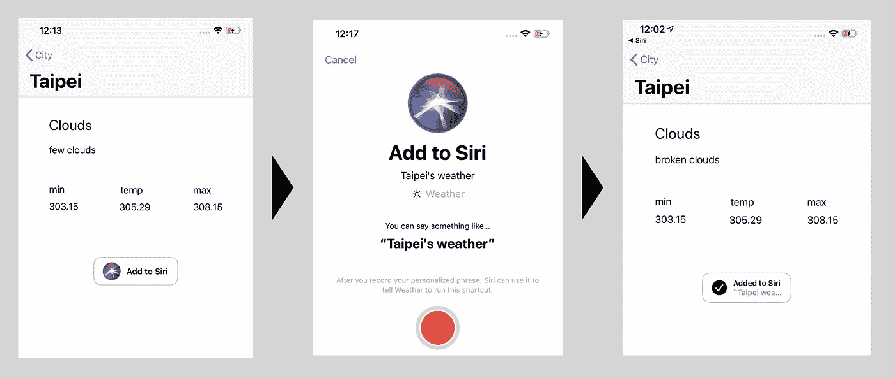

要添加一个 Siri 按钮，我们需要`import Intents`和`import IntentsUI`，将`INShortcut`指定给我们的按钮，并符合委托。

键入`siriButton.delegate = self`后，编译器会显示警告。只需在下面添加以下代码。

耶！就是这样。运行该应用程序，它的工作作为魅力。🎊

## 参考资料:

*   [为 iOS 12 开发自定义 Siri 快捷键的初学者指南](https://medium.com/@pietropizzi/a-beginners-guide-to-developing-custom-intent-siri-shortcuts-for-ios-12-a3627b7011af)
*   [iOS 12 中的 Siri 快捷键教程](https://www.raywenderlich.com/6462-siri-shortcuts-tutorial-in-ios-12)
*   [SiriKit——如何将 Siri 快捷方式添加到您的应用程序中](https://ramdankorkelia.com/swift-language-blog/2018/12/18/sirikit-how-to-add-siri-shortcut-with-intent-to-your-app)
*   [面向 iOS 开发者的 WWDC 2018:Siri 快捷方式](https://medium.com/flawless-app-stories/wwdc-2018-for-ios-developers-siri-shortcuts-e8e4a78f0ad7)
*   [IOS 10 逐日::第 10 天::SIRIKIT INTENTS UI](https://www.shinobicharts.com/blog/ios-10-day-by-day-day-10-sirikit-intents-ui/)