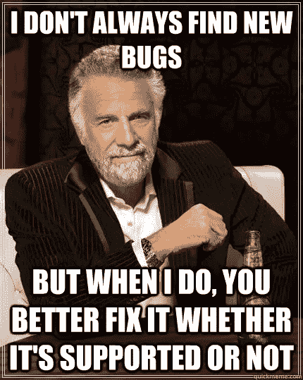

# 六种方法让你的地形更上一层楼

> 原文：<https://itnext.io/six-ways-to-take-your-terraform-to-the-next-level-e08b3e21b243?source=collection_archive---------1----------------------->


“通向无限，甚至更远！”[Zoltan·塔斯](https://unsplash.com/@zoltantasi?utm_source=medium&utm_medium=referral)在 [Unsplash](https://unsplash.com?utm_source=medium&utm_medium=referral) 上的照片

Terraform 无需介绍。它是事实上的云基础设施供应和生命周期管理工具，截至 2021 年，有 X 个用户分布在 Y 个云提供商中。此外，随着 1.0 版本的发布，它没有表现出放缓或淡出的迹象。

Terraform 是开源的，这意味着它由社区使用和支持。这意味着应该如何使用、构建和管理它的方法和观点可能会不同。这篇文章也不例外，但是请记住，我下面概述的工具和策略来自社区和个人经验。YMMV！

1.  **调整你的模块**


照片由 [Glen Carrie](https://unsplash.com/@glencarrie?utm_source=medium&utm_medium=referral) 在 [Unsplash](https://unsplash.com?utm_source=medium&utm_medium=referral) 上拍摄

**为您打算在多个团队之间共享或开源的模块使用单独的 Git 存储库。**当您有一个其他团队可能会贡献或经常使用的模块时，这是非常理想的。缺点之一是它增加了开发工作量。当您对正在讨论的子模块进行更改时，需要在两个不同的存储库中有两个单独的 pull 请求来使您的更改到位:一个用于子模块，另一个用于项目，以更新模块的标记或分支。在一些组织中，这种程度的抽象和额外的分离可能是可以容忍的；在其他情况下，它会阻碍开发到不可持续的程度，尤其是在处理许多模块的时候。这完全取决于什么最适合您的用例。

**如果你不需要在团队之间共享代码，或者如果所讨论的代码是非常特定于你的项目的，那么在你的项目中为模块使用一个子文件夹。**比方说，你想将 Azure 中跨环境重复部署的几个资源组合在一起。出于我们的目的，该模块将部署一个 AKS 集群、一个数据库、Redis 和一个事件中心。为了简化开发，模块可以存储在与根项目相同的 repo 中，以便简化开发。这允许更快的开发，允许您在一次提交下标记所有内容。

和上面的方法一样，这个决定也有它自己的挑战。最明显的是，您不能再孤立地开发一个模块:您的代码将与其他可能比您移动得更快或更慢的代码一起提交和合并，所有这些都在同一个存储库中。将模块分离到它们自己的 repos 中，可以更好地控制调用子模块的版本，而不必在标签中挑选提交。

最后，**我强烈建议不要为单个资源**使用一个模块，除非你有非常好的理由这样做。为了确保你的代码是干巴巴的，也为了执行全面的标准，使用局部变量和变量，并尽量使用合理的默认值。为此使用单资源模块很麻烦，并且模糊了底层资源的配置，这意味着要花费更多的精力来维护本应非常简单的东西。

**2。使用** [**tfsec**](https://tfsec.dev/) **扫描安全漏洞和误配置**


[tfsec](https://tfsec.dev/) 是 Aqua Security 推出的一款非常棒的工具，它可以扫描您的 Terraform 配置文件，查找安全问题和错误配置。它易于安装，可以轻松集成到您的 CI 渠道中。文档非常优秀，包括不安全配置的示例以及如何修复它们。这里有一个关于 VPC 配置的示例:

```
resource "aws_network_acl_rule" "bad_example" {
  egress         = false
  protocol       = "tcp"
  from_port      = 22
  to_port        = 22
  rule_action    = "allow"
  cidr_block     = "0.0.0.0/0"
}
```

这将导致 tfsec 失败，因为让你的 VPC 对互联网开放，*尤其是在端口 22* 上，是一个糟糕的主意。当我在本地测试时，我看到了预期的行为:

```
$ tfsec .**Result 1**[aws-vpc-no-public-ingress][**CRITICAL**] Resource 'aws_network_acl_rule.bad_example' defines a Network ACL rule that allows specific ingress ports from anywhere./Users/admin/nacl.tf:1-81 | **resource "aws_network_acl_rule" "bad_example" {** 2 | **egress         = false** 3 | **protocol       = "tcp"** 4 | **from_port      = 22** 5 | **to_port        = 22** 6 | **rule_action    = "allow"** 7 | **cidr_block     = "0.0.0.0/0"** 8 | **}** 9 |Legacy ID:  AWS049Impact:     The ports are exposed for ingressing data to the internetResolution: Set a more restrictive cidr rangeMore Info:
- https://tfsec.dev/docs/aws/vpc/no-public-ingress#aws/vpc- [https://registry.terraform.io/providers/hashicorp/aws/latest/docs/resources/network_acl_rule#cidr_block](https://registry.terraform.io/providers/hashicorp/aws/latest/docs/resources/network_acl_rule#cidr_block)
- https://docs.aws.amazon.com/vpc/latest/userguide/vpc-network-acls.html
```

tfsec 发现我的 VPC 在端口 22 上是可公开访问的，这很理想，因为我们不希望任何人通过 SSH 进入我们的 VPC。但是，如果我真的需要公开它，该怎么办呢？如果它是堡垒网络的一部分呢？别担心。我们只需设置`-e`标志来忽略该规则并再次运行它:

```
$ tfsec -e aws-vpc-no-public-ingress
...
**No problems detected!**
```

我们还可以在代码中添加一个注释来忽略特定的规则，这比在命令行中为每个规则添加一个 exclude 要有效得多。[更多相关文档可在此处找到](https://github.com/aquasecurity/tfsec#ignoring-warnings)。

**3。使用变量验证来强制云提供商和内部命名约定** 验证输入变量将节省您的时间，并防止在您的环境中出现输入错误。而不是等待 Terraform 初始化、规划、应用，然后最终等待 AWS/Azure/GCP 等。API 拒绝您的请求，您可以从一开始就验证您的输入。这是一个非常简单、非常有用的验证 Azure 存储帐户的选项:

```
variable "sa_account_name" {
  type        = string
  description = "The name of the Azure Storage account." validation {
    condition     **=** length(var.sa_account_name) **>** 2 **&&** length(var.sa_account_name) < 25 substr(var.**image_id**, 0, 4) **==** "ami-"
    error_message **=** "Azure Storage Account names must be between 3 and 24 characters in length."
  }
  validation {
    condition.    = can(regex("[A-Z]+", var.sa_account_name))
    error_message = "Azure Storage Account names must not contain uppercase characters."}
```

在这里，我们确保我们作为 Azure 存储帐户名传递的任何内容都符合 Azure 存储命名约定。当 Azure API 不可避免地告诉我名称中不能有大写字符，或者帐户名太长时，这使我不必等待 Terraform 初始化、计划，然后使 apply 失败。注意，我这里没有针对特殊字符的正则表达式——它在我的列表中，但是我还没有时间使用它。

另一个例子是强制命名约定。您可以添加任意数量的条件块，在这种情况下，您可以为每个变量添加一个块，以确保您的所有资源都包含符合您的命名约定的特定字符串或`local`。

**4。使用 terratest 为你的代码编写单元测试**


[Terratest](https://terratest.gruntwork.io/) 可用于编写单元/集成测试，这有助于简化您的配置测试。Terratest 是用 Go 写的，就像 Terraform 一样。幸运的是，你不需要太多的 Go 或 Terraform 代码库的经验就能理解 Terratest。💸注意:您在 Terratest 中所做的任何事情都会导致资源在测试过程中被创建和销毁。你将负责任何产生的费用，所以要小心！💸

我不会在这里粘贴测试文件的内容，而是链接一些由 Gruntworks 提供的优秀文档:

[https://grunt work . io/repos/v 0 . 23 . 4/terra test/examples/terra form-AWS-S3-example #](https://gruntwork.io/repos/v0.23.4/terratest/examples/terraform-aws-s3-example#)

这个例子非常简单，它向您展示了如何配置一些基本的测试来对到 S3 存储桶的连接实施 SSL。在这里可以找到一个更复杂(也更酷)的例子来验证在 EC2 实例上是否配置了 SSH:[https://github . com/grunt work-io/terra test/blob/v 0 . 23 . 4/test/terra form _ SSH _ example _ test . go](https://github.com/gruntwork-io/terratest/blob/v0.23.4/test/terraform_ssh_example_test.go)。

**5。使用部分后端配置，如果你还没有**
Terraform 允许你以多种方式传递后端配置。通常情况下，最好避免将所有配置硬编码到一个`remote.tf`文件中。您可以通过使用[部分配置](https://www.terraform.io/docs/language/settings/backends/configuration.html#partial-configuration)来自动初始化您的后端。防止覆盖预先存在的后端是一个好主意；您可以在运行`terraform init`时指定`input=false`来实现这一点，这将导致 Terraform 在提示输入时出错。

**6。经常为供应商库做贡献，即使只是提出一个问题。**



**Terraform 是开源的，所以我们都在一起**。我经常在 AzureRM 提供商 GitHub repo 以及其他一些开源模块上提出问题。这并不是因为我脾气暴躁或者在找 bugs 我每天都使用 Azure，希望它尽可能流畅，适合所有人。不仅仅是我希望 X 特性得到支持，作为社区的一员，我觉得有义务做出贡献。如果你想做出贡献，但不知道如何做，请查看一些最受欢迎的提供商的指南，不要害羞！

*   azure RM:[https://registry . terraform . io/providers/hashi corp/azure RM/latest/docs # features-and-bug-requests](https://registry.terraform.io/providers/hashicorp/azurerm/latest/docs#features-and-bug-requests)
*   AWS:[https://github . com/hashi corp/terra form-provider-AWS/issues/new/choose](https://github.com/hashicorp/terraform-provider-aws/issues/new/choose)
*   GCP:[https://registry . terraform . io/providers/hashi corp/Google/latest/docs # features-and-bug-requests](https://registry.terraform.io/providers/hashicorp/google/latest/docs#features-and-bug-requests)

这只是你可以使你的地形变得更加干燥、可扩展，并且最终更加令人愉快的一个小列表。还有许多其他工具可以加速云基础架构的自动化。如果你有什么你用的工具，想推荐，欢迎随时回复这个故事，分享你的经验。