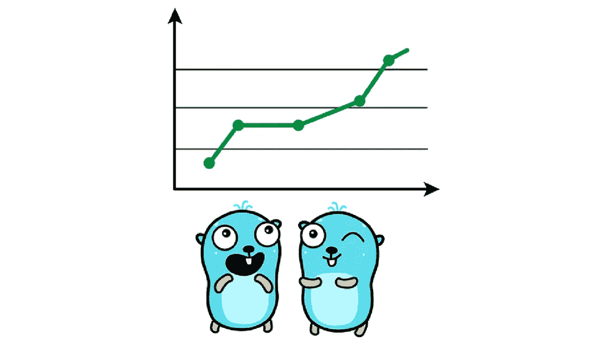
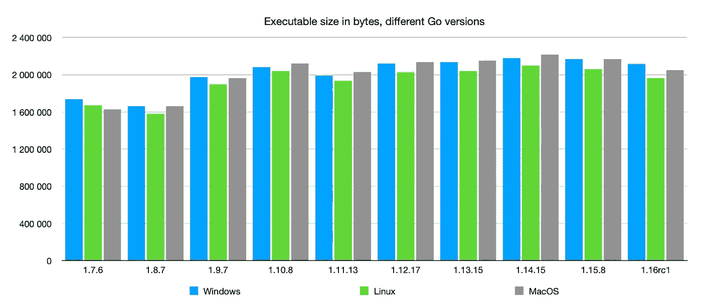
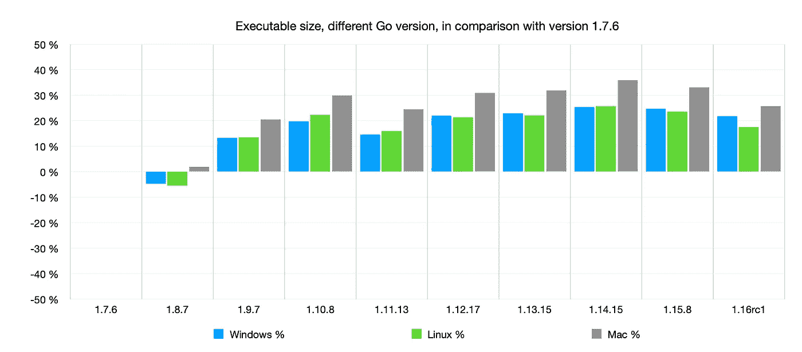
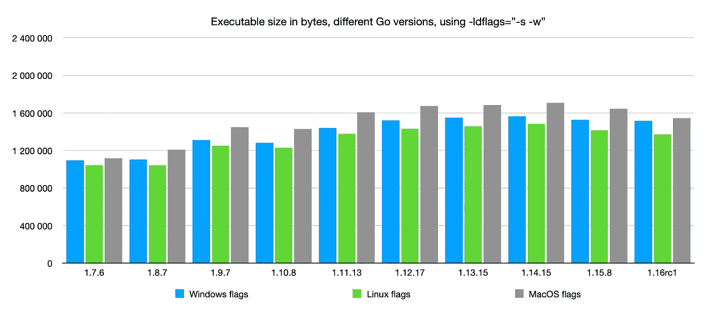
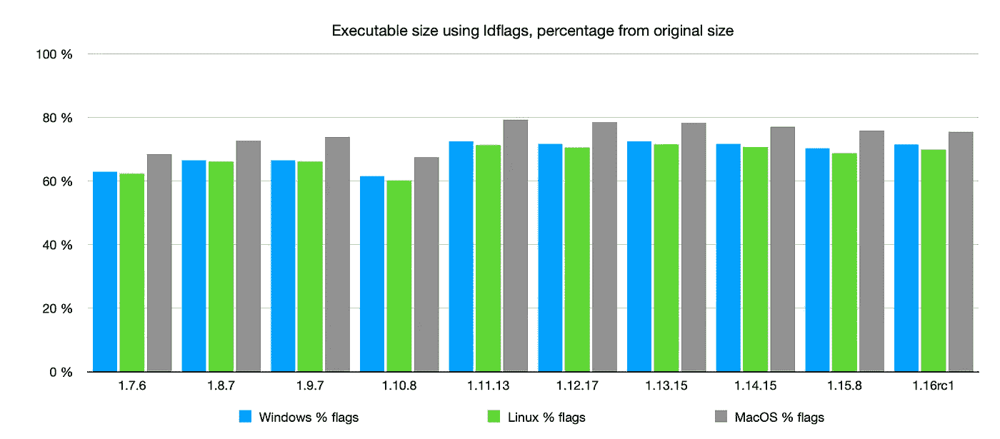
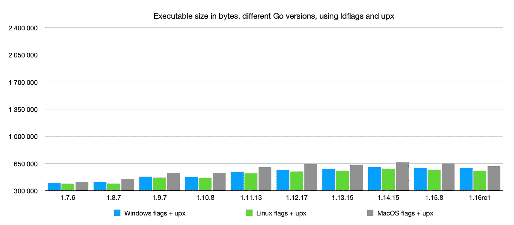
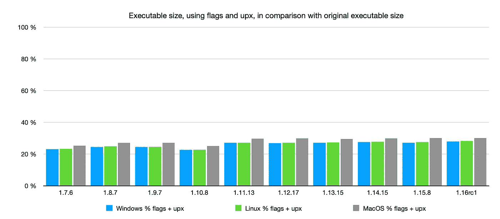
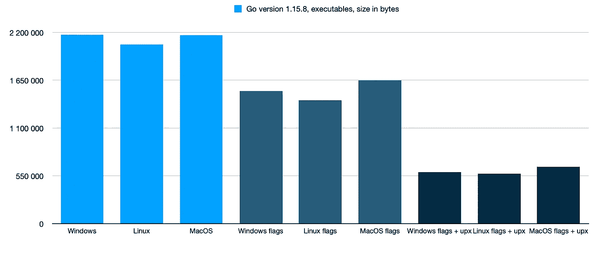

# Go 可执行文件的大小比较

> 原文：<https://itnext.io/size-comparison-of-go-executables-9b4ae2aaebb5?source=collection_archive---------1----------------------->

## 从版本 1.7.6 到 1.16rc1

由 Renee French 创建的原始地鼠图像，使用由 Maria Letta 创建的地鼠图像

Go 编程语言起源于 2007 年，于 2009 年公开亮相。和其他编程语言一样，它也在成长和变化。

在我们公司，我们经常使用 Go。我们的系统是不同微服务的组合，并部署在互联网上。每一次更新也通过互联网完成，测试通过互联网完成，配对开发通过互联网完成，…一切都通过互联网完成。

这就是为什么**我们喜欢让我们的二进制文件尽可能小。从一个角度来说，我们不是在浪费网络资源。从不同的角度来看，我们没有浪费时间，等待转移完成。**

我们做了两件事来缩小我们的二进制文件。起初，我们改变了我们的构建来使用`-ldflags=”-s -w”`。然后我们开始用 [upx](https://upx.github.io) 。

这两步都给了我们很大的帮助。

因为我们并不完美，仍然有一些安装运行遗留代码，由于各种原因没有更新。某天有人问了一个简单的问题。如果将一个 Go 版本与另一个进行比较，这些可执行文件有多少不同？**更新那些运行遗留代码的安装有意义吗？**

因此，我们从*大小的角度*对 Go 可执行文件进行了比较。因为我们从 1.7.x 版本开始在生产中使用 Go，所以这个比较也从 1.7.x 版本开始。

我们对每一个主要版本都做了比较，包括最新的次要版本。示例:使用 1.7.6 作为 1.7.x 的最新次要版本。

如果你想知道，我们到底为什么使用 Go，你可以在这里找到一些思路。

 [## 你应该尝试围棋的 7 个理由

### 原因，我们停止使用 Java 和 C#

itnext.io](/7-reasons-you-should-try-use-go-5fb4714015d1) 

一个简单的 Go 程序被用于这个比较。没什么花哨的，可能简单的 *Hello world* 就够了。

# Go 可执行文件的比较

下图按大小比较了可执行文件。

每个 Go 版本都有三个可执行文件:Windows 使用`GOOS=windows`，Linux 使用`GOOS=linux`，MacOS 使用`GOOS=darwin`。

显然，Linux 是这里的赢家。从 1.8.x 版本开始，它的可执行文件是最小的。

这里的好处是，从 1.10.x 版本开始，可执行文件的大小几乎没有显著增加。事实恰恰相反。最新的主要版本 1.15.8 的可执行文件比版本 1.14.15 稍小。而即将到来的 1.16x 版本甚至有更好的效果。

从版本 1.9.x(对于上面的代码)开始，可执行文件的平均大小约为 2MB。

如果您比较这些可执行文件的增长(它们与版本 1.7.6 有何不同)，您可以看到增长大约为 20–30%，在最近两个主要版本中略有下降。

# 添加 ldflags

通过添加`-ldflags=”-s -w”`，当构建可执行文件时，您可以看到所有版本的预期减少。你可以看出，下降非常显著。

从版本 1.9.x 开始，可执行文件的大小约为 1.2-1.6MB

当我们将新的可执行文件与旧的进行比较时，我们可以看到新的是原始大小的 60–80%。平均 70%。那还不错。事实上，那真的很好。

# 使用 UPX

UPX 是可执行文件的终极打包者。如果你熟悉 Zip、Rar 或其他，这个应用程序做一些类似的事情。它压缩可执行文件并从中生成不同种类的可执行文件。这个压缩的可执行文件仍然可以运行。当您运行它时，它会解压缩回原来的可执行文件(在内存中)，然后执行原来的文件。当您运行这个打包的可执行文件时，应该会有一点延迟，但是对于 Go 可执行文件来说，这种延迟是人类感觉不到的。

如您所见，这些打包的可执行文件小得令人难以置信。几乎都小于 0.6MB。

在这里，您可以看到这些新的可执行文件是原始大小的 23–30%。平均约为原始大小的 26%。

# 摘要

从*大小来看*，始终使用最新版本的 Go 是明智的。

平均来说，使用`ldflags`可以减少 70%的可执行文件。UPX 给你带来了更好的结果:平均高达原始大小的 27%。

我们从 2018 年开始在生产中使用`ldflags`和 UPX，没有任何问题，所以我建议你尝试一下。

这里是最后一个比较:1.15.8 版本的可执行文件。

# 更新:附加 UPX 信息

UPX 打包的可执行文件可以被一些杀毒软件检测为恶意软件，你应该知道这一点(谢谢 *nindustries* 和 *PaluMacil* )。

我测试了所有三个可执行文件。

这是一个 Linux 可执行文件的病毒总数结果的链接。这里没有假警报。

 [## 病毒总数

### 病毒总数

VirusTotalwww.virustotal.com](https://www.virustotal.com/gui/file/1c4c9cf6580b26172fbaff07cced0b0b87a2d7d9c0616c2b2a58fcba15f26034/detection) 

这是一个 Windows 可执行文件结果的链接。如你所见，这里有一些假警报。

 [## 病毒总数

### 病毒总数

VirusTotalwww.virustotal.com](https://www.virustotal.com/gui/file/ad352bfb5103608433ec4249678a533d619f29102c07b7d621ed90cd6677b025/detection) 

和一个 macOS 结果的链接，使它完整。这里没有假警报。

 [## 病毒总数

### 病毒总数

VirusTotalwww.virustotal.com](https://www.virustotal.com/gui/file/f8b696f49aad461ca0592ebe8b4d23f769c12a4601d7264cc20ddbb4496e61a3/detection) 

**在部署之前测试 UPX 打包的可执行文件是明智的。**

可能你还不太服气……因为，谁管你 10 秒还是 2.5 秒就把可执行文件转移了。但是如果你平均每天转账 100 次，那么一年就是 36 500 次。然后，您将 100 小时与 27 小时的可执行文件传输进行比较。你节省了 73 小时的网络流量和 73 小时的个人时间。

而这些时间可以用在更好的事情上:-)。