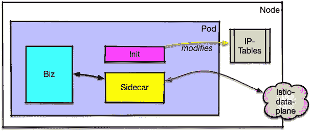
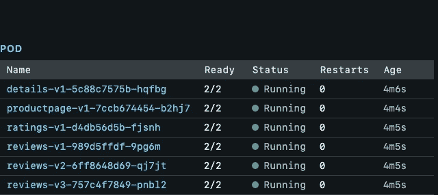
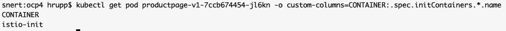
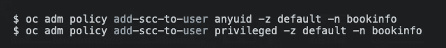
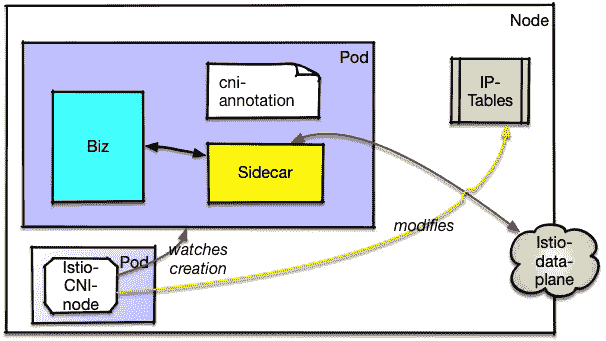
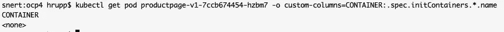
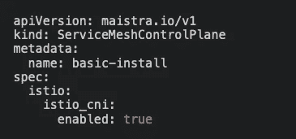

# 减少 Istio 中所需的权限

> 原文：<https://itnext.io/slashing-needed-permissions-in-istio-f05fe145698d?source=collection_archive---------8----------------------->

默认情况下，Istio 需要比大多数用户想要给他们的 pod 和容器更多的权限才能运行(查看 ContainerDays 2019 的这个演示)。从 Istio 1.2 开始，幸运的是有了一个解决方案。这篇文章试图解释减少所需权限的机制，从而增加你的网格的安全性。

让我们先来看看变化前的情况

吊舱里有一个边车的经典装置。

您会看到外部流量(红色箭头)进入 pod 到达 Sidecar(特使代理)，Sidecar 然后将请求转发到业务容器。为了实现这一点，有一个 Init 容器，它修改网络路由表(iptables ),将外部流量定向到 sidecar，然后让这个代理与业务容器对话。当您执行 *kubectl get pod* 时，您不会看到列出的 init-container，而只会看到应用程序容器:

kubectl get pod 的输出 pod 有两个用于商务和边车的容器

您可以使用带有输出格式的 *kubectl* (或 *kubectl describe pod* )来查看 init-container:

获取 pod 详细信息以列出初始容器

iptables 的修改只有在 init-container(以及整个 pod)使用 [NET_ADMIN](http://man7.org/linux/man-pages/man7/capabilities.7.html) 特权运行时才能起作用。这样做的缺点是，pod 中的每个容器都以 NET_ADMIN 的身份运行，恶意的业务代码也可能修改 iptables，这是我们不希望看到的，因为这可能会允许 pod 与其他 pod 进行通信，而这是 Kubernetes 配置最初禁止的。

最重要的是，init-container 坚持在特定的用户 id 下运行，这是 OpenShift 特别不喜欢的，因此需要授予应用程序额外的权限才能正常运行:

为用户命名空间设置安全上下文约束

## 介绍 Istio-CNI

要解决上述问题，我们需要从应用程序窗格中删除 init-container，并确保 iptables 无论如何都会被更改。

我们使用节点级别的帮助者 pod

一个新的组件 [*Istio-CNI 插件*](https://github.com/istio/cni) ，以 istio-cni-node DaemonSet 为代表(在 [Maistra](https://maistra.io/) 它被称为 istio-node)已经被引入了这个目的([我的一些同事去年已经写了这个想法](https://blog.openshift.com/increasing-security-of-istio-deployments-by-removing-the-need-for-privileged-containers/))。Istio-CNI 观察新的 pod，并通过检查[pod 是否满足某些标准(如具有 istio-proxy 容器或不在 excluded_namespaces 列表上](https://istio.io/docs/setup/kubernetes/additional-setup/cni/#identifying-pods-requiring-traffic-redirection))来确定它们是否应该是网格的一部分。如果是这样，助手窗格将更新 iptables。

在边车注射过程中，pod 已贴上标签，标签名称为*k8s.v1.cni.cncf.io/networks*，告知 Kubernetes 将 istio-system-istio-cni 网络连接到 pod。这使得 pod 等待，直到 Istio-CNI 网络出现(即，istio-cni-node pod 已经完成其工作)。Kubernetes 还更新配置以设置连接网络的状态。

网络建立后，pod 可以继续正常启动，之后边车和业务容器可以正常启动。

再次检查 pod，我们现在可以看到 pod 中不再有 init-container:

## 装置

Istio-CNI 不是开箱即用的，但是你必须明确地安装它。

安装时在 Maistra 上启用 Istio-CNI

[Maistra](https://maistra.io/) 下游[项目](https://github.com/maistra)允许在 TP12 中打开 Istio-CNI，之后将默认启用 Istio-CNI。对于 TP 12，您只需将两行 Yaml 添加到控制平面配置中，如上图所示。

## 结论

随着 Istio-CNI 的引入和使用，用户业务代码不再需要任何特权。Istio-node 仍然需要 NET_ADMIN 权限，但它被视为一个平台 pod，就像 Kubernetes 中的许多其他平台一样——没有用户可以直接修改的部分。