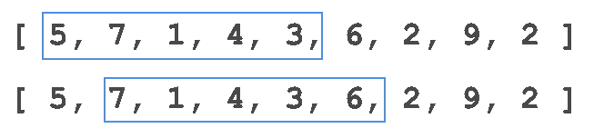
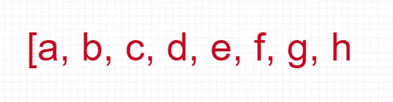
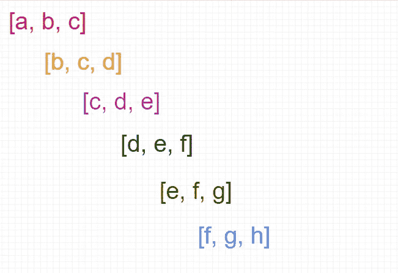
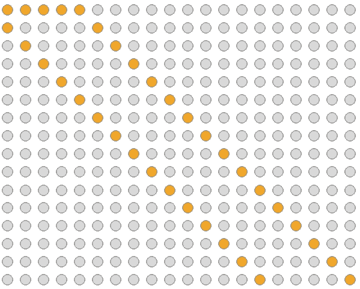

# 滑动窗口算法技术

> 原文：<https://itnext.io/sliding-window-algorithm-technique-6001d5fbe8b3?source=collection_archive---------0----------------------->

# 介绍

滑动窗口是一种数据结构和算法的问题解决技术，用于应用数组或列表的问题。在 **O(n )** 或 **O(n )** 中使用强力方法解决这些问题是没有痛苦的。然而，**滑动窗口**技术可以将时间复杂度降低到 **O(n)** 。



图 1:寻找 5 个连续数字的最大和的滑动窗口技术。

滑动窗口技术背后的基本思想是将两个嵌套循环转换成一个循环。

以下是识别此类问题的一些基本线索:

*   问题将基于数组、列表或字符串类型的数据结构。
*   它将要求在数组或字符串中查找子范围，必须给出最长、最短或目标值。
*   它的概念主要基于这样的想法，比如完美地满足给定条件的事物的最长序列或最短序列。

假设您有一个如下所示的数组:



图 2:值的数组

一个尺寸为 3 的**滑动窗口将在它上面运行，如下所示:**



图 3:大小为 3 的滑动窗口(3 个项目的子列表)

# 解决滑动窗口问题的基本步骤

我认为与其说它是一种算法，不如说它是一种技术。这是一种可以在许多算法中使用的技术。下面是解决与滑动窗口技术相关的问题的基本步骤:

*   使用 hashmap 或 dictionary 来计算特定的数组输入，并坚持使用外部循环向右增加窗口。
*   将一个放入循环中，通过向右滑动来减少窗口边。这个循环会很短。
*   根据问题陈述存储当前最大或最小窗口大小或计数。

滑动寻找五个连续元素的最大和的例子。

```
[ 5, 7, 1, 4, 3, 6, 2, 9, 2 ]
```



图 4:寻找五个连续元素的最大和的滑动窗口技术

滑动窗口技术有许多问题陈述。

# 大小为 k 的最大和子阵列

给定一个正整数数组和一个正数 *k* ，求任意相邻的大小为 *k* 的子数组的最大和。

```
**Input**: [3, 5, 2, 1, 7], k=2**Output**: 8
```

**说明:**这里子数组[1，7]是最大和的和。

解决方案:

```
def getMaxSum(arr, k):
    maxSum = 0
    windowSum = 0
    start = 0

    for i in range(len(arr)):
        windowSum += arr[i]

        if ((i - start + 1) == k):
            maxSum = max(maxSum, windowSum)
            windowSum -= arr[start]
            start += 1

    return maxSum
```

# 计算变位词的出现次数

给定一个单词和一个文本，返回该单词的变位词在文本中出现的次数。

```
**Input**: text = gotxxotgxdogt, word = got**Output** : 3
```

**解释:**单词— got，otg，ogt 是 got 的变位词。

**解决方案:**

```
def countAnagram(text, word):
    w = len(word) 
    count = 0
    ana = ''
    d = {} for i in range(w):
        ana += text[i] if isAnagram(ana, word):
        count += 1

    for i in range(1, len(text)):
        ana = ana[1:] + text[i]

        if ana not in d and isAnagram(ana, word):
            count += 1
            d[ana] = 0
        d[ana] = 0

    return count
```

是变位词 Util:

```
def isAnagram(s, word):
    if len(s) != len(word):
        return False

    d = [0] * 26
    for c in s:
        d[ord(c) - ord('a')] = 1

    for c in word:
        if d[ord(c) - ord('a')] == 0:
            return False

    return True
```

采用不同方法的解决方案:

```
def getCountOccurances(text, word):
    wHeap = [0] * 26
    textHeap = [0] * 26
    start = 0
    count = 0

    for c in word:
        wHeap[ord(c) - ord('a')] += 1

    for i in range(len(text)):
        textHeap[ord(text[i]) - ord('a')] += 1
        if (i - start + 1) == len(word):
            if textHeap == wHeap:
                count += 1

            textHeap[ord(text[start]) - ord('a')] -= 1
            start += 1

    return count
```

# 所有 k 长连续子阵列的最大和最小平均值之差

```
**Input**: arr[ ] = {3, 8, 9, 15}, K = 2**Output**: 6.5
```

**说明:**所有长度为 2 的子阵列分别为{3，8}、{8，9}、{9，15}，它们的平均值分别为(3+8)/2 = 5.5、(8+9)/2 = 8.5、(9+15)/2 = 12.0。

因此，最大值(=12.0)和最小值(=5.5)之差为 12.0 -5.5 = 6.5。

**解决方案:**

```
def getMinMaxDiff(arr, k):
    currSum = 0
    minSum = float("inf")
    maxSum = 0
    start = 0

    for i in range(len(arr)):
        currSum += arr[i]

        if (i - start + 1 == k):
            avg = currSum / k
            maxSum = max(avg, maxSum)
            minSum = min(maxSum, minSum)
            currSum -= arr[start]
            start += 1

    diff = maxSum - minSum
    return diff
```

# 查找包含“k”个不同字符的字符串中最长的子字符串

```
**Input**: s = 'abcbdbdbbdcdabd'
k = 2**Output**: bdbdbbd
```

**解决方案:**

```
def getLongest(s, k):
    high = 0
    windows = set()
    freq = [0] * 128
    low = 0
    end = 0
    start = 0

    while high < len(s):
        windows.add(s[high])
        freq[ord(s[high])] += 1

        while len(windows) > k:
            freq[ord(s[low])] -= 1
            if freq[ord(s[low])] == 0:
                windows.remove(s[low])

            low += 1

        if end - start < high - low:
            end = high
            start = low

        high += 1

    return s[start:end + 1]
```

# 在数组中查找范围“k”内的重复项

```
**Input**: nums = [5, 6, 8, 2, 4, 6, 9]k = 2**Ouput**: False
```

**解决方案:**

```
def getDuplicates(nums, k):
    d = {}
    count = 0
    for i in range(len(nums)):
        if nums[i] in d and i - d[nums[i]] <= k:
            return True
        else:
            d[nums[i]] = i

    return False
```

# 求大小为 k 的最小和子数组

```
**Input**: arr = [10, 4, 2, 5, 6, 3, 8, 1]k = 3**Output**: 11
```

**解决方案:**

```
def getMinSum(arr, k):
    currSum = 0
    minSum = float("inf")
    start = 0

    for i in range(len(arr)):
        currSum += arr[i]

        if (i - start + 1 == k):
            minSum = min(minSum, currSum)
            currSum -= arr[start]
            start += 1

    return minSum
```

# 不包含任何元音的最长子字符串的长度

```
**Input**: s = "codeforintelligents"
**Output**: 3**Explanation**: 'nts' is the longest substring that doesn't contain any vowels.
```

**解决方案:**

```
def getLongestSubstring(s):
    vowels = ['a', 'e', 'i', 'o', 'u']
    result = ""
    maxResult = ""
    for i in range(len(s)):
        if s[i] not in vowels:
            result += s[i]
            print(result)
            if len(result) > len(maxResult):
                maxResult = result
        else:
            result = ""

    return len(maxResult)
```

# 计算每个 k 长度子数组中出现的负元素

```
**Input**: arr = [-1, 2, -2, 3, 5, -7, -5], K = 3**Output**: 2, 1, 1, 1, 2
```

**解决方案:**

```
def getCountNegatives(arr, k):
    lst = []
    start = 0
    count = 0

    for i in range(len(arr)):
        if arr[i] < 0:
            count += 1

        if (i - start + 1 == k):
            lst.append(count)
            if arr[start] < 0:
                count -= 1

            start += 1

    return lst
```

# 最小尺寸子阵列和

```
**Input**: target = 7, nums = [2,3,1,2,4,3]**Output**: 2Explanation: The subarray [4,3] has the minimal length under the problem constraint
```

**解决方案:**

```
def minSubArrayLen(target, nums):
    currSum = 0
    start = 0
    count = 0
    minCount = float("inf")

    for i in range(len(nums)):
        currSum += nums[i]

        while currSum >= target:
            minCount = min(minCount, i - start + 1)
            currSum -= nums[start]
            start += 1

        if minCount == float("inf"):
            return 0

    return minCount
```

# 最长重复字符替换

给你一个字符串 s 和一个整数 k，你可以选择字符串中的任何一个字符，把它改成任何其他大写的英文字符。您最多可以执行此操作 k 次。

```
**Input**: s = "ABAB", k = 2**Output**: 4Explanation: Replace the two 'A's with two 'B's or vice versa.
```

**解决方案:**

```
def characterReplacement(self, s, k):
        freq = {}
        maxRepeatLetterCount = 0
        windowStart = 0
        maxLength = 0

        for i in range(len(s)):
            if s[i] not in freq:
                freq[s[i]]= 0

            freq[s[i]] += 1
            maxRepeatLetterCount = max(maxRepeatLetterCount, freq[s[i]])
            if (i - windowStart + 1 - maxRepeatLetterCount) > k:
                freq[s[windowStart]] -= 1
                windowStart += 1

        maxLength = max(maxLength, i-windowStart + 1)

        return maxLength
```

# 对排序数组中不同的绝对值进行计数

```
**Input: ** { -1, -1, 0, 1, 1, 1 }**Output:** The total number of distinct absolute values is 2 (0 and 1)
```

**解决方案:**

```
def getCountDistinct(arr):
    count = 0
    d = {}
    for item in arr:
        if item >= 0 and item not in d:
            d[item] = 1
            count += 1

    return count
```

# 字符串置换

给定两个字符串 s1 和 s2，如果 s2 包含 s1 的排列，则返回 true，否则返回 false。

换句话说，如果 s1 的排列之一是 s2 的子串，则返回 true。

```
**Input:** s1 = "ab", s2 = "eidbaooo"
**Output:** true
**Explanation:** s2 contains one permutation of s1 ("ba").
```

**解决方案:**

```
def checkInclusion(self, s1, s2):
    numbers = [0]*26
    numbers2 = [0]*26

    for c in s1:
        numbers[ord(c) - ord('a')] += 1

    for index in range(0, len(s2)):
        numbers2[ord(s2[index]) - ord('a')] += 1

        if index >= len(s1) - 1:
            if numbers == numbers2:
                return True

            numbers2[ord(s2[index - len(s1) + 1]) - ord('a')] -= 1

    return False
```

# 查找字符串中的所有变位词

```
**Input**: s = "cbaebabacd", p = "abc"**Output**: [0,6]**Explanation**:The substring with start index = 0 is "cba", which is an anagram of "abc".The substring with start index = 6 is "bac", which is an anagram of "abc".
```

**解决方案:**

```
def findAnagrams(s, p):
    target = [0] *  26
    result = []
    count = [0] * 26
    start = 0

    for c in p:
        target[ord(c) - ord('a')] += 1

    for i in range(len(s)):
        count[ord(s[i]) - ord('a')] += 1
        if i - start == len(p):
            count[ord(s[start]) - ord('a')] -= 1
            start += 1

        if count == target:
            result.append(start) return result
```

# 最大平均子阵列 I

给定一个由 n 个元素组成的 num 的整数数组和一个整数 k。

找到长度等于 k 的具有最大平均值的连续子阵列，并返回该值*。任何计算误差小于 10–5 的答案都将被接受。*

```
***Input:** nums = [1,12,-5,-6,50,3], k = 4**Output:** 12.75000**Explanation:** Maximum average is (12 - 5 - 6 + 50) / 4 = 51 / 4 = 12.75*
```

***解决方案:***

```
*def findMaxAverage(self, nums, k):
    st = 0
    max_sum = float('-inf')
    win_sum = 0.0

    for i in range(len(nums)):
        win_sum += nums[i]
        if i >= k-1:
            max_sum = max(win_sum, max_sum)
            win_sum -= nums[st]
            st += 1

    return max_sum/k*
```

# *k 半径子阵列平均值*

*构建并返回长度为 n 的数组 avgs，其中 avgs[i]是以索引 I 为中心的子数组的 k 半径平均值。*

```
***Input:** nums = [7,4,3,9,1,8,5,2,6], k = 3
**Output:** [-1,-1,-1,5,4,4,-1,-1,-1]*
```

***解决方案:***

```
*def getAverages(self, nums, k):
    if k == 0:
        return nums

    n = len(nums)
    ans = [-1] * n
    prefSum = [0] * n

    for i in range(0, n):
        if i == 0:
            prefSum[0] = nums[i]
        else:
            prefSum[i] = prefSum[i-1] + nums[i]

    for i in range(k, n-k):
        if i-k-1 < 0:
            ans[i] = (prefSum[i + k])//(2*k + 1)
        else:
            ans[i] = (prefSum[i + k] - prefSum[i - k - 1])//(2*k + 1)

    return ans*
```

# *具有不同字符的大小为三的子字符串*

*如果没有重复的字符，字符串是好的。*

*给定一个字符串 s，返回 s 中长度为 3 的好的子字符串的数量。*

*请注意，如果同一个子字符串多次出现，则每次出现都要计数。*

*子串是字符串中连续的字符序列。*

```
***Input**: s = "xyzzaz"**Output**: 1**Explanation**: There are 4 substrings of size 3: "xyz", "yzz", "zza", and "zaz".The only good substring of length 3 is "xyz".*
```

***解决方案:***

```
*class Solution(object):
    def countGoodSubstrings(self, s):
        """
        :type s: str
        :rtype: int
        """
        k = 3

        if k > len(s):
            return 0

        freq = {}
        count = 0
        start = 0

        for i in range(len(s)):
            if s[i] not in freq:
                freq[s[i]] = 0
            freq[s[i]] += 1

            if i >= k - 1:
                if len(freq) == k:
                    count += 1

                freq[s[start]] -= 1
                if freq[s[start]] == 0:
                    del freq[s[start]]

                start += 1

        return count*
```

# *最频繁元素的频率*

*元素的频率是它在数组中出现的次数。*

*给定一个整数数组 nums 和一个整数 k。在一次操作中，可以选择 nums 的索引，并将该索引处的元素递增 1。*

*在执行最多 k *个操作*后，返回*一个元件的最大可能频率。**

```
***Input:** nums = [1,2,4], k = 5**Output:** 3**Explanation:** Increment the first element three times and the second element two times to make nums = [4,4,4].4 has a frequency of 3.*
```

***解决方案:***

```
*class Solution(object):
    def maxFrequency(self, nums, k):
        """
        :type nums: List[int]
        :type k: int
        :rtype: int
        """
        len_nums = len(nums)
        nums.sort()
        max_freq = 1
        freq = 1
        left = 0
        ops = k

        for right in range(1, len_nums):
            ops -= (nums[right] - nums[right - 1]) * freq
            freq += 1
            if ops >= 0:
                max_freq = max(max_freq, freq)
            else:
                while ops < 0:
                    ops += nums[right] - nums[left]
                    left += 1
                    freq -= 1

        return max_freq*
```

# *最大擦除值*

*给你一个正整数 num 的数组，你想删除一个包含唯一元素的子数组。擦除子数组得到的分数等于它的元素之和。*

*返回*擦除一个子数组所能得到的最高分数。**

*如果数组 b 形成了 a 的连续子序列，即如果它等于 a[l]，a[l+1]，…，a[r] for some (l，r)，则称它是 a 的子数组。*

```
***Input**: nums = [4,2,4,5,6]**Output**: 17**Explanation**: The optimal subarray here is [2,4,5,6].*
```

***解决方案:***

```
*class Solution(object):
    def maximumUniqueSubarray(self, nums):
        """
        :type nums: List[int]
        :rtype: int
        """
        m = {}
        final = 0
        summ = 0
        l = 0

        for i in range(len(nums)):
            if nums[i] in m:
                index = m[nums[i]]
                while l <= index:
                    del m[nums[l]]
                    summ -= nums[l]
                    l += 1

            m[nums[i]] = i
            summ += nums[i]
            final = max(final, summ)

        return final*
```

# *子字符串出现的最大次数*

*给定一个字符串 s，根据以下规则返回任何子字符串的最大出现次数:*

*   *子字符串中唯一字符的数量必须小于或等于 maxLetters。*
*   *子字符串大小必须介于 minSize 和 maxSize 之间。*

```
***Input**: s = "aababcaab", maxLetters = 2, minSize = 3, maxSize = 4**Output**: 2**Explanation**: Substring "aab" has 2 ocurrences in the original string.It satisfies the conditions, 2 unique letters and size 3 (between minSize and maxSize).*
```

***解决方案:***

```
*class Solution(object):
    def maxFreq(self, s, maxLetters, minSize, maxSize):
        """
        :type s: str
        :type maxLetters: int
        :type minSize: int
        :type maxSize: int
        :rtype: int
        """
        cnt = {}
        res= 0

        for i in range(0,len(s)-minSize+1):
            sub = s[i:i + minSize]

            if len(set(sub)) <= maxLetters:
                if sub not in cnt:
                    cnt[sub] = 0

                cnt[sub] += 1
                res = max(res, cnt[sub])

        return res*
```

# *大小为 K 且平均值大于或等于阈值的子数组的数量*

*给定一个整数数组 arr 和两个整数 k 和 threshold。*

*返回*大小为 k 且平均值大于或等于阈值的子数组*的数量。*

```
***Input:** arr = [2,2,2,2,5,5,5,8], k = 3, threshold = 4**Output:** 3**Explanation:** Sub-arrays [2,5,5],[5,5,5] and [5,5,8] have averages 4, 5 and 6 respectively. All other sub-arrays of size 3 have averages less than 4 (the threshold)**.***
```

***解决方案:***

```
*class Solution(object):
    def numOfSubarrays(self, arr, k, threshold):
        """
        :type arr: List[int]
        :type k: int
        :type threshold: int
        :rtype: int
        """
        start = 0
        windowSum = 0
        count = 0

        for windowEnd in range(len(arr)):
            windowSum += arr[windowEnd] 
            if windowEnd >= k - 1:
                if (windowSum/k) >= threshold:
                    count+=1
                windowSum -=arr[start]
                start += 1

        return count*
```

# *包含所有三个字符的子字符串的数量*

*给定一个仅由字符 *a* 、 *b* 和 *c* 组成的字符串 s。*

*返回至少包含一次所有这些字符 *a* 、 *b* 和 *c* 的子字符串的数量。*

```
***Input:** s = "abcabc"**Output:** 10**Explanation:** The substrings containing at least one occurrence of the characters *a*, *b* and *c are "*abc*", "*abca*", "*abcab*", "*abcabc*", "*bca*", "*bcab*", "*bcabc*", "*cab*", "*cabc*"* and *"*abc*"* (again)*
```

***解决方案:***

```
*class Solution(object):
    def numberOfSubstrings(self, s):
        """
        :type s: str
        :rtype: int
        """
        count, left = 0, 0
        map = {x:0 for x in "abc"}

        for right in range(0,len(s)):
            map[s[right]] += 1

            while map["a"] and map["b"] and map["c"]:
                map[s[left]] -= 1
                left += 1

            count += left

        return count*
```

# *您可以从卡中获得的最高点数*

*有几张牌排成一排，每张牌都有相应的点数。点数在整数数组 cardPoints 中给出。*

*在一个步骤中，您可以从该行的开头或结尾抽取一张牌。你必须拿 k 张牌。*

*你的分数是你所拿的牌的分数之和。*

*给定整数数组 cardPoints 和整数 k，返回您可以获得的最大分数*。**

```
****Input:** cardPoints = [1,2,3,4,5,6,1], k = 3**Output:** 12**Explanation:** After the first step, your score will always be 1\. However, choosing the rightmost card first will maximize your total score. The optimal strategy is to take the three cards on the right, giving a final score of 1 + 6 + 5 = 12.**
```

****解决方案:****

```
**class Solution(object):
    def maxScore(self, cardPoints, k):
        """
        :type cardPoints: List[int]
        :type k: int
        :rtype: int
        """
        best = score = sum(cardPoints[:k])

        for i in range(1, k+1):
            score = score - cardPoints[k-i] + cardPoints[-i]
            best = score if score > best else best

        return best**
```

# **绝对差值小于或等于的最长连续子阵列**

**给定一个整数数组 nums 和一个整数极限，返回最长的非空子数组的大小，使得这个子数组的任意两个元素之间的绝对差小于或等于极限*。***

```
****Input**: nums = [8,2,4,7], limit = 4**Output**: 2**Explanation**: All subarrays are:[8] with maximum absolute diff |8-8| = 0 <= 4.[8,2] with maximum absolute diff |8-2| = 6 > 4.[8,2,4] with maximum absolute diff |8-2| = 6 > 4.[8,2,4,7] with maximum absolute diff |8-2| = 6 > 4.[2] with maximum absolute diff |2-2| = 0 <= 4.[2,4] with maximum absolute diff |2-4| = 2 <= 4.[2,4,7] with maximum absolute diff |2-7| = 5 > 4.[4] with maximum absolute diff |4-4| = 0 <= 4.[4,7] with maximum absolute diff |4-7| = 3 <= 4.[7] with maximum absolute diff |7-7| = 0 <= 4.Therefore, the size of the longest subarray is 2.**
```

****解决方案:****

```
**class Solution(object):
    def longestSubarray(self, nums, limit):
        """
        :type nums: List[int]
        :type limit: int
        :rtype: int
        """
        if not nums:
            return 0
        if len(nums) == 1:
            return 1l = 0
        r = 1
        cur_mx = nums[0]
        cur_mn = nums[0]
        max_l = 1

        while l <= r and r < len(nums):
            cur_mx = max(cur_mx, nums[r])
            cur_mn = min(cur_mn, nums[r])if cur_mx - cur_mn <= limit:
                max_l = max(max_l, r - l + 1)
            else:
                if nums[l] == cur_mx:
                    cur_mx = max(nums[l + 1:r + 1])
                if nums[l] == cur_mn:
                    cur_mn = min(nums[l + 1:r + 1])
                l += 1

            r += 1

        return max_l**
```

# **给定长度的子字符串中元音的最大数量**

**给定字符串 s 和整数 k。**

**返回长度为 k 的 s 的任意子串中元音字母的最大数量。**

**英语中的元音字母是(a，e，I，o，u)。**

```
****Input**: s = "abciiidef", k = 3**Output**: 3**Explanation**: The substring "iii" contains 3 vowel letters.**
```

****解决方案:****

```
**class Solution(object):
    def maxVowels(self, s, k):
        """
        :type s: str
        :type k: int
        :rtype: int
        """
        vowels = ['a','e','i','o','u']
        ans = 0
        win = ''
        v = 0

        for char in range(k):
            win += s[char]

            if s[char] in vowels:
                v+=1

        ans = max(ans,v)

        for char in range(len(s)-k):
            win += s[char+k]
            if s[char] in vowels:
                v-=1
            if s[char+k] in vowels:
                v+=1
            ans=max(ans,v)
        return ans**
```

**另一种方法:**

```
**def getMaxVowels(s, k):
    vowels = ['a', 'e', 'i', 'o', 'u']
    temp = ''
    isVowel = True
    start = 0
    maxCount = 0

    for i in range(len(s)):
        if s[i] in vowels:
            temp += s[i]
        else:
            isVowel = False

        if (i - start + 1 == k or isVowel == False):
            maxCount = max(maxCount, len(temp))
            if isVowel == False:
                temp = ''
                isVowel = True
            else:
                temp = temp[1:]
                start += 1

    return maxCount**
```

# **找到两个不重叠的子数组，每个子数组都有目标和**

**给定一个整数数组 arr 和一个整数目标。**

**您必须找到 arr 的两个不重叠的子数组，每个子数组都有一个和相等的目标。可能有多个答案，所以你必须找到两个子数组长度之和最小的答案。**

**返回两个所需子数组长度之和的最小值，如果找不到这两个子数组，则返回-1。**

```
****Input**: arr = [3,2,2,4,3], target = 3**Output**: 2**Explanation**: Only two sub-arrays have sum = 3 ([3] and [3]). The sum of their lengths is 2**
```

****解决方案:****

```
**class Solution(object):
    def minSumOfLengths(self, arr, target):
        """
        :type arr: List[int]
        :type target: int
        :rtype: int
        """
        INF = len(arr) + 1
        best_at_i = [INF]*len(arr) 
        best = INF 
        curr_sum = 0 

        left = 0
        for right in range(len(arr)):
            curr_sum += arr[right]

            while curr_sum > target and left <= right:
                curr_sum -= arr[left]
                left += 1

            if curr_sum == target:
                best = min(best, best_at_i[left-1] + right - left + 1)
                best_at_i[right] = min(best_at_i[right-1], right - left + 1)
            else:
                best_at_i[right] = best_at_i[right-1]

        if best == INF:
            return -1
        return best**
```

# **删除一个元素后 1 的最长子数组**

**给定二进制数组 nums，应该从中删除一个元素。**

**返回结果数组中只包含 1 的*的最长非空子数组的大小*。如果没有这样的子数组，则返回 0。****

```
***Input**: nums = [1,1,0,1]**Output**: 3**Explanation**: After deleting the number in position 2, [1,1,1] contains 3 numbers with value of 1's.*
```

***解决方案:***

```
*class Solution(object):
    def longestSubarray(self, nums):
        """
        :type nums: List[int]
        :rtype: int
        """
        windowStart = 0
        hashmap = {x: 0 for x in nums}
        max_length = 0

        if 0 not in hashmap.keys():
            return len(nums) - 1

        for windowEnd in range(len(nums)):
            hashmap[nums[windowEnd]] += 1

            if hashmap[0] > 1:
                hashmap[nums[windowStart]] -= 1
                windowStart += 1

            max_length = max(max_length, windowEnd - windowStart)
        return (max_length)*
```

# *将 X 减少到零的最少操作*

*给定一个整数数组 nums 和一个整数 x。在一次操作中，您可以从数组 nums 中移除最左边或最右边的元素，然后从 x 中减去它的值。请注意，这将修改数组以供将来操作使用。*

*如果可能，返回*将* x *减少到正好* 0 *的最小操作数，否则返回* -1。*

```
***Input**: nums = [1,1,4,2,3], x = 5**Output**: 2**Explanation**: The optimal solution is to remove the last two elements to reduce x to zero.*
```

***解决方案:***

```
*class Solution(object):
    def minOperations(self, nums, x):
        """
        :type nums: List[int]
        :type x: int
        :rtype: int
        """
        S = sum(nums)
        left = right = curr = 0
        ans = -1

        while right<len(nums):
            curr += nums[right]
            right+=1
            while left<len(nums) and curr>S-x:
                curr-=nums[left]
                left+=1
            if curr == S-x:
                ans = max(ans,right-left)

        return len(nums) - ans if ans!=-1 else ans*
```

# *在预算内获得相等的子字符串*

*还会给你一个整数 maxCost。*

*返回 s 的子字符串的最大长度，该长度可以更改为与 twith 的对应子字符串相同，并且开销小于或等于 maxCost。*

*如果 s 中没有子串可以转换为 t 中相应的子串，则返回 0。*

```
***Input:** s = "abcd", t = "bcdf", maxCost = 3
**Output:** 3
**Explanation:** "abc" of s can change to "bcd". That costs 3, so the maximum length is 3.*
```

***解决方案:***

```
*class Solution(object):
    def equalSubstring(self, s, t, maxCost):
        """
        :type s: str
        :type t: str
        :type maxCost: int
        :rtype: int
        """
        diff = [abs(ord(s[i]) - ord(t[i])) for i in range(len(s))]
        summ = 0
        low = length = 0

        for i in range(len(s)):
            summ += diff[i]

            while low < i and summ > maxCost:
                summ -= diff[low]
                low += 1
            if summ <= maxCost:
                length = max(length, i-low+1)

        return length*
```

# *坏脾气的书店老板*

*有一个书店老板，他的店开了 n 分钟。每分钟都有一些顾客进入商店。给定一个长度为 n 的客户整数数组，其中 customers[i]是在第 I 分钟开始时进入商店的客户数量，所有这些客户在该分钟结束后都离开了商店。*

*有几分钟，书店老板脾气暴躁。给你一个二进制数组 grumpy，其中如果书店老板在第 I 分钟脾气不好，grumpy[i]为 1，否则为 0。*

*书店老板脾气暴躁的时候，那一分钟的顾客不满意，反之，则满意。*

*书店老板知道一个秘密技巧，可以让自己连续几分钟都不暴躁，但只能用一次。*

*返回全天可以满足的客户的最大数量。*

```
***Input:** customers = [1,0,1,2,1,1,7,5], grumpy = [0,1,0,1,0,1,0,1], minutes = 3
**Output:** 16
**Explanation:** The bookstore owner keeps themselves not grumpy for the last 3 minutes. 
The maximum number of customers that can be satisfied = 1 + 1 + 1 + 1 + 7 + 5 = 16.*
```

***解决方案:***

```
*class Solution(object):
    def maxSatisfied(self, customers, grumpy, minutes):
        """
        :type customers: List[int]
        :type grumpy: List[int]
        :type minutes: int
        :rtype: int
        """
        n = len(customers)
        res = 0

        for i in range(n):
            if grumpy[i] == 0:
                res += customers[i]
        sum1 = 0        
        for i in range(minutes):
            if grumpy[i] == 1:
                sum1 += customers[i]

        result = sum1
        for r in range(minutes, n):
            if grumpy[r] == 1:
                sum1 += customers[r]
            if grumpy[r - minutes] == 1:
                sum1 -= customers[r - minutes]
            result = max(sum1, result)

        return res + result*
```

# *最大连续一 III*

*给定二进制数组 nums 和一个整数 k，如果最多能翻转 k 个 0，则返回数组中连续 1 的最大数量。*

```
***Input**: nums = [1,1,1,0,0,0,1,1,1,1,0], k = 2**Output**: 6**Explanation**: [1,1,1,0,0,1,1,1,1,1,1]Bolded numbers were flipped from 0 to 1\. The longest subarray is underlined.*
```

***解决方案:***

```
*class Solution(object):
    def longestOnes(self, nums, k):
        """
        :type nums: List[int]
        :type k: int
        :rtype: int
        """
        start, end, n, max_consecutive = 0, 0, len(nums), 0

        while end < n:
            if nums[end] == 0:
                if k > 0:
                    k -= 1
                else:                  
                    max_consecutive = max(max_consecutive, end - start)
                    if nums[start] == 0:
                        k += 1
                    start += 1
                    continue
            end += 1*
```

# *带和的二元子阵列*

*给定二进制数组 nums 和一个整数目标，返回非空子数组的数量和目标。*

*子数组是数组的连续部分。*

```
***Input**: nums = [1,0,1,0,1], goal = 2**Output**: 4**Explanation**: The 4 subarrays are bolded and underlined below:[1,0,1,0,1][1,0,1,0,1][1,0,1,0,1][1,0,1,0,1]*
```

***解决方案:***

```
*class Solution(object):
    def numSubarraysWithSum(self, nums, goal):
        """
        :type nums: List[int]
        :type goal: int
        :rtype: int
        """
        cumSum = 0
        result = 0

        hashMap = {0:1}

        for x in nums:
            cumSum += x

            val = cumSum - goal
            if (val) in hashMap:
                result += hashMap[val]

            hashMap[cumSum] = hashMap.get(cumSum, 0) + 1

        return result*
```

# *重复子阵列的最大长度*

*给定两个整数数组 nums1 和 nums2，返回出现在这两个数组中的子数组的最大长度。*

```
***Input**: nums1 = [1,2,3,2,1], nums2 = [3,2,1,4,7]**Output**: 3**Explanation**: The repeated subarray with maximum length is [3,2,1].*
```

***解决方案:***

```
*class Solution(object):
    def findLength(self, nums1, nums2):
        """
        :type nums1: List[int]
        :type nums2: List[int]
        :rtype: int
        """
        nums2_str = ''.join([chr(x) for x in nums2])
        max_str = ''
        res = 0

        for num in nums1:
            max_str += chr(num)
            if max_str in nums2_str:
                res = max(res,len(max_str))
            else:
                max_str = max_str[1:]

        return res*
```

# *最长湍流子阵*

*给定一个整数数组 arr，返回 arr 的最大湍流子数组的长度。*

*如果比较符号在子阵列中的每对相邻元素之间翻转，则子阵列是湍流的。*

```
***Input:** arr = [9,4,2,10,7,8,8,1,9]
**Output:** 5
**Explanation:** arr[1] > arr[2] < arr[3] > arr[4] < arr[5]*
```

***解决方案:***

```
*class Solution(object):
    def maxTurbulenceSize(self, arr):
        """
        :type arr: List[int]
        :rtype: int
        """
        n = len(arr)
        ans = 1
        anchor = 0

        for i in range(1, n):
            c = cmp(arr[i-1], arr[i])
            if c == 0:
                anchor = i
            elif i == n - 1 or c * cmp(arr[i], arr[i+1]) != -1:
                ans = max(ans, i - anchor + 1)
                anchor = i

        return ans*
```

# *按顺序排列的所有元音中最长的子串*

*给定一个由英文元音组成的字符串单词，返回单词中最长的漂亮子串的长度。如果不存在这样的子字符串，则返回 0。*

*子串是字符串中连续的字符序列。*

```
***Input:** word = "aeiaaioaaaaeiiiiouuuooaauuaeiu"
**Output:** 13
**Explanation:** The longest beautiful substring in word is "aaaaeiiiiouuu" of length 13.*
```

***解决方案:***

```
*class Solution(object):
    def longestBeautifulSubstring(self, word):
        """
        :type word: str
        :rtype: int
        """
        res = 0
        i = 0
        seen = set()

        for j in range(0,len(word)):
            if j > 0 and word[j] < word[j-1]:
                seen = set()
                i = j

            seen.add(word[j])
            if len(seen) == 5:
                res = max(res,j-i+1)

        return res*
```

# *水果放进篮子里*

*你正在参观一个农场，农场里从左到右排列着一排果树。这些树由一个整数数组`fruits`表示，其中`fruits[i]`是`ith`树生产的**类型**的水果。*

*你想收集尽可能多的水果。然而，业主有一些你必须遵守的严格规则:*

*   *你只有**两个**筐，每个筐只能装一个**单式**水果。每个篮子可以装多少水果没有限制。*
*   *从你选择的任何一棵树开始，你必须从每棵**树(包括起始树)中挑选**恰好一个水果**，同时向右移动。摘下的水果必须放在你的篮子里。***
*   *一旦你到达一棵树，树上的水果装不下你的篮子，你必须停下来。*

*给定整数数组，返回****最大*** *可以采摘的水果数量*。**

```
****Input:** fruits = [1,2,1]
**Output:** 3
**Explanation:** We can pick from all 3 trees.**
```

****解决方案:****

```
**class Solution(object):
    def totalFruit(self, fruits):
        """
        :type fruits: List[int]
        :rtype: int
        """
        length = len(fruits)
        left, right, current = 0, length - 1, {}
        currentLength, longestLength = 0, 0

        for right in range(0, length):
            current[fruits[right]] = current.get(fruits[right], 0) + 1

            while len(current) > 2:
                current[fruits[left]] -= 1
                if current[fruits[left]] == 0:
                    del current[fruits[left]]
                left += 1   

            currentLength  = right - left + 1
            longestLength = max(longestLength, currentLength)     

        return longestLength**
```

# **结论**

**滑动窗口技术背后的主要思想是将两个嵌套循环转换成一个循环。通常，该技术帮助我们将时间复杂度从 **O(n )** 或 **O(n )** 降低到 **O(n)** 。**