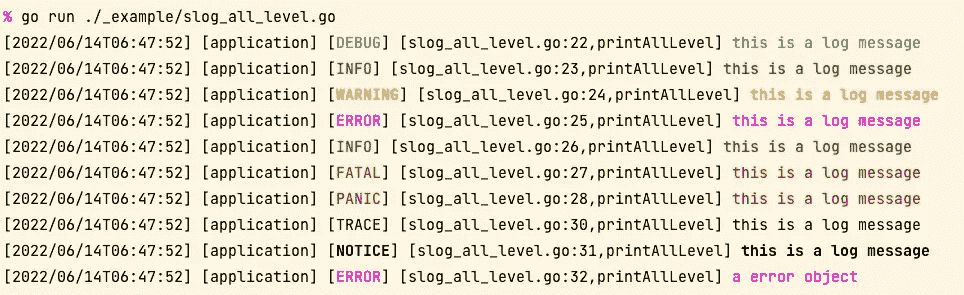

# slog——轻量级、可配置、可扩展的 Go 日志库

> 原文：<https://itnext.io/slog-lightweight-configurable-extensible-go-logging-library-b338139cce4b?source=collection_archive---------4----------------------->

一个轻量级的、可配置的、可扩展的 Go 日志库



# [特性](https://inhere.github.io/en/blog/gookit-slog-intro#features)

*   简单，无需配置即可直接使用
*   支持通用日志级处理。例如:`trace` `debug` `info` `notice` `warn` `error` `fatal` `panic`
*   根据需要支持`Handler` `Formatter`的任何扩展
*   支持同时增加多个`Handler`日志处理，将日志输出到不同的地方
*   支持自定义日志消息`Formatter` 内置`json`和`text`两种日志记录格式`Formatter`
*   支持定制构建日志消息`Handler`
*   内置的`handler.Config` `handler.Builder`可以方便快捷地构建所需的日志处理程序

## 内置的通用日志写处理程序

具有内置的通用日志写处理程序

*   `console`输出日志到控制台，支持彩色输出
*   `writer`输出日志到指定的`io.Writer`
*   `file`将日志输出到指定文件，可选择启用`buffer`缓冲写入
*   `simple`将日志输出到指定文件，不缓冲直接写入文件
*   `rotate_file`将日志输出到指定文件，支持按时间和大小分割文件，默认情况下`buffer`启用缓冲写入
*   看吧。/handler 文件夹以获得更多内置实现

# 将日志输出到文件[](https://inhere.github.io/en/blog/gookit-slog-intro#output-logs-to-file)

*   支持启用`buffer`写日志
*   支持通过`time`和`size`拆分日志文件
*   支持通过`gzip`配置压缩日志文件
*   支持通过`BackupNum` `BackupTime`清理旧日志文件

# Git 资源库[](https://inhere.github.io/en/blog/gookit-slog-intro#git-repository)

*   github:[https://github.com/gookit/slog](https://github.com/gookit/slog)
*   吉蒂:[https://gitee.com/gookit/slog](https://gitee.com/gookit/slog)

# 安装[](https://inhere.github.io/en/blog/gookit-slog-intro#install)

```
go get github.com/gookit/slog
```

# 快速启动[](https://inhere.github.io/en/blog/gookit-slog-intro#quick-start)

```
package mainimport (
    "github.com/gookit/slog"
)func main() {
    slog.Trace("this is a log message")
    slog.Debug("this is a log message")
    slog.Info("this is a log message")
    slog.Notice("this is a log message")
    slog.Warn("this is a log message")
    slog.Error("this is a log message")
    slog.Fatal("this is a log message")
}
```

**输出预览:**


# 记录到文件[](https://inhere.github.io/en/blog/gookit-slog-intro#logs-to-file)

使用`slog`将日志输出到文件非常方便，支持多文件、按时间拆分等。

```
package mainimport (
    "github.com/gookit/slog"
    "github.com/gookit/slog/handler"
    "github.com/gookit/slog/rotatefile"
)func main() {
    defer slog.MustFlush() *// DangerLevels contains: slog.PanicLevel, slog.ErrorLevel, slog.WarnLevel*
    h1 := handler.MustRotateFile("/tmp/logs/app_error.log", rotatefile.EveryHour,
        handler.WithLogLevels(slog.DangerLevels),
    ) *// NormalLevels contains: slog.InfoLevel, slog.NoticeLevel, slog.DebugLevel, slog.TraceLevel*
    h2 := handler.MustRotateFile("/tmp/logs/app_info.log", rotatefile.EveryHour,
        handler.WithLogLevels(slog.NormalLevels),
    ) slog.PushHandler(h1)
    slog.PushHandler(h2) *// add logs*
    slog.Info("info message text")
    slog.Error("error message text")
}
```

查看日志目录:

```
$ ls /tmp/logs
app_error.log
app_info.log
```

# 更多用法[](https://inhere.github.io/en/blog/gookit-slog-intro#more-usage)

> *更多用法请参见* [*自述*](https://github.com/gookit/slog/blob/master/README.zh-CN.md)

[](https://github.com/gookit/slog) [## GitHub - gookit/slog:📑轻量级、可配置、可扩展的日志库，用 Go…

### 📑用 Golang 编写的轻量级、可扩展、可配置的日志库。

github.com](https://github.com/gookit/slog) 

*原载于 2022 年 6 月 16 日*[*https://inhere . github . io*](https://inhere.github.io/en/blog/gookit-slog-intro)*。*