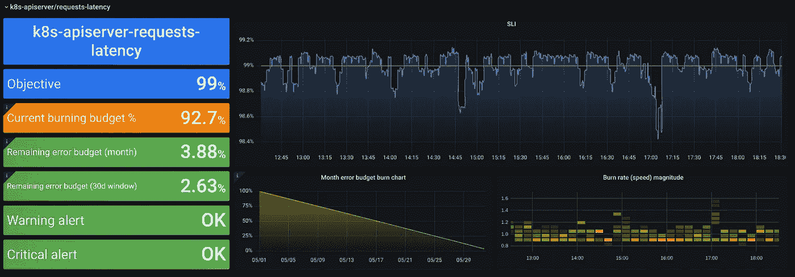
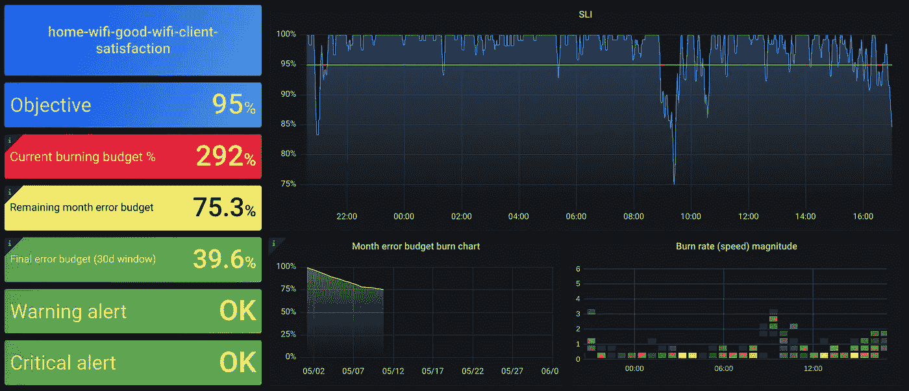
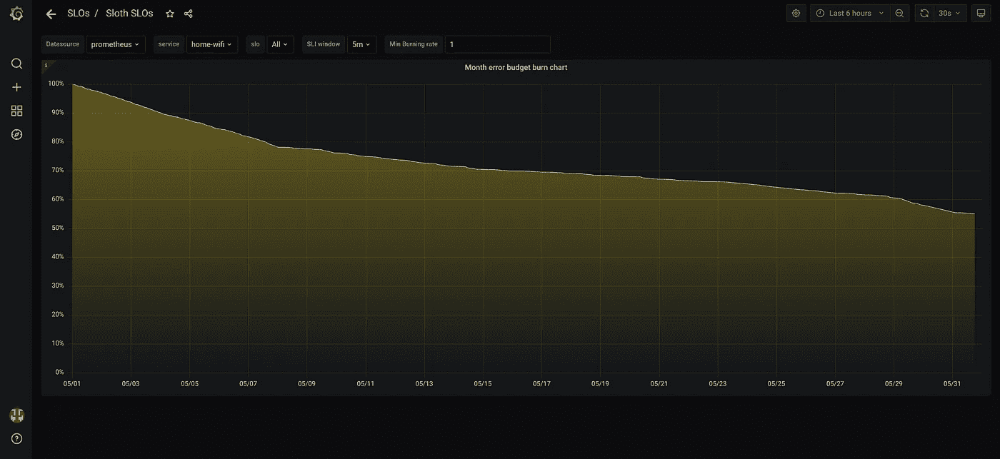

# SLOs 应该很简单，向 Sloth 问好

> 原文：<https://itnext.io/slos-should-be-easy-say-hi-to-sloth-9c8a225df0d4?source=collection_archive---------0----------------------->



库伯内特蜜蜂潜伏 SLO 与懒惰

和其他领域一样，在科技领域，每年都有一些热门词汇被说得比其他词汇多。一些例子:

*   2017 年:加密货币和区块链
*   2018:可观察性和追踪
*   2019:服务网格
*   2020 年:Gitops

今年，最流行的词是 SLO。

我相信你最近已经听说过*服务水平目标*(不仅仅是因为 [SLOConf](http://sloconf.com/) )。SLO 并不新鲜，如果你正在阅读这篇文章，很可能你已经熟悉 SLI、SLO、SLA、错误预算…行话。

除了这个时髦的词，SLO 是很棒的，如果你现在没有使用它们，尽可能地探索它们，因为我确信你会从中获得价值。

*现在我将讲述我是如何实现* [*Sloth*](https://github.com/slok/sloth) *的，所以如果你愿意，你可以直接跳到* [*Sloth 部分*](https://slok.medium.com/slos-should-be-easy-say-hi-to-sloth-9c8a225df0d4#4b95) *。*

# 很久很久以前…

我不知道 SLO 的确切创建时间，但是，当我开始对 SRE 文化着迷时，我被介绍给了他们，我第一次阅读它们是在《SRE》的第四章，一段时间后继续在《SRE 工作手册》上阅读。

对我来说，SLO 不仅仅是一个工具/框架，而是一种思考和应用可观察性的方式。2018 )，一种语言……一句话，*文化*。然而，每次我试图在多家公司向朋友、家人、同事解释时，都发生了同样的事情:

> 每个人都理解 SLO、术语、目的……但是他们中的很多人都很难应用它们，理解过程，或者以实际的方式应用它们。

# (2018–2019)服务水平操作员

那是 2018 年，我在 [Spotahome](https://www.spotahome.com/es) 工作，我是一名平台*工程师/SRE/写代码和做 ops 的人。我们想在公司里开始应用 SLO，那里没有太多的 SLO，我们想让它变得简单，所以人们不需要考虑所有现有的 SLO 条款。*


我们创建了一个 Kubernetes 运营商，其服务的 SLOs 被定义为 [CRD](https://kubernetes.io/docs/concepts/extend-kubernetes/api-extension/custom-resources/) 。我们把它命名为 [*服务等级操作员*](https://github.com/spotahome/service-level-operator) *。*CRD 很简单:给我一个关于全部事件(例如请求)的查询，给我一个关于错误事件(例如请求 5xx)的查询，操作员将得到一个定期计算的比率(0-1 ),并使用一些度量惯例将其交给 Prometheus。

操作员工作得很好，我们有非常简单的控制面板，让我们快速了解情况，但是，没有时段窗口指标、警报、SLO 元数据信息…我们缺少许多关于 SLO 的信息，但作为第一步非常好。

# (2019–2020 年)阿萨蒂托

2019 年底，我跳槽到了一家名为 [Cabify](https://cabify.com/) 的新公司。公司的一些团队已经在应用 SLO 并实施它们。然而，在创建这些 SLO 普罗米修斯规则时，有许多容易出错的手动任务。甚至，我们开始创建普罗米修斯单元测试来确保这些手工创建的普罗米修斯规则！**那是纯粹的** [**辛劳**](https://sre.google/sre-book/eliminating-toil/) **。**


我想到了这一点，以及我们如何做些事情来改善流程，并在公司内部启动了一个新项目。Asadito，生成创建 SLI 记录规则和基于 SLO 的警报所需的所有 Prometheus 规则的 CLI([多窗口多烧录](https://sre.google/workbook/alerting-on-slos/))。主要思想是简单性和灵活性，以提高 SLO 的采用和当时 SLOs 的使用。

换句话说，我利用我在创建服务级别操作员时获得的一些经验，并对其进行改进，以适应该公司的需求。

多个团队开始使用这个工具，突然间我们在公司范围内实现了 SLO 的标准化(只有想要使用它的团队)，你可以发现所有不同团队的 SLO，我们有了一个通用的 SLO·格拉夫纳仪表板，一个易于理解 SLO 规格的存储库…

这是我在 2018 年与服务级别操作员一起做的事情的一个非常好的演变，并成功地工作。


成功！

# 《懒惰》

我已经不在这些公司了。现在是 2021 年，我仍然认为人们在实施 SLO 时有困难，不应该是这样。此外，我认为我在过去的公司里在这方面做出了积极的贡献，所以…

在经历了*服务级别操作员*和 *Asadito* 之后，我想要类似的东西，并且可以为每个人所用，并且喜欢我在空闲时间开发的所有东西，OSS。

**打招呼** [***懒惰***](https://github.com/slok/sloth) **！**


> 懒惰很容易为普罗米修斯制造技能等级。易于理解和维护。

是 CLI 吗？它是 Kubernetes 控制器/操作器吗？。两者兼而有之，它适应你，所以你可以选择如何使用它。

Sloth spec 试图移除所有困难的配置部分，这些部分让人们在以实用的方式应用 SLOs 时感到吃力:奇怪的错误预算公式、不同的时间窗口、不同形式的可视化图形…

懒惰注重简单，有安全的默认设置，目的是能够为 90–95%的人工作(这就是营销！).如果你在 5-10%，我很抱歉，不管怎样，很可能你已经创建了自己的工具或自定义 SLO 规则。

让我们看一个 SLO 的例子，懒惰会给你带来什么。

## 投机

从规范中可以看出，我们为一个服务定义了多个 SLO，这背后的想法是每个服务都应该有自己干净简单的 SLO 清单。这有两个目的:

*   每个服务都有 SLO。
*   记录的服务 SLO。

每个 SLO 都有一个 ID、SLO 的目的/目标(例如 *99.9%* )、一个 SLI，在本例中是一个 SLI *事件*类型(还有一个*原始* SLI 类型)，最后是可选的警报块，用于启用/禁用自动[多窗口多燃烧](https://sre.google/workbook/alerting-on-slos/)警报生成。

SLI 的普罗米修斯查询，在查询中需要一个模板化的变量， *{{。window}}，* SLOth 会将生成的规则扩展到所需的 SLOs 窗口(例如 5m、1h、3d……)。

## 确认

当 Sloth 生成 SLO 规则时，它会验证规范，包括 SLI 查询、选项……因此错误 SLO 的反馈循环会尽可能快，并且您不会以错误的 SLO 结束，也不会花费 3 小时创建一个简单的 SLO。

## 用法(CLI)

如果你把它作为一个常规的 CLI 来使用，例如对于 *gitops* ( *Ding！2020* ):

```
sloth generate -i ./myservice-slo.yml
```

## 用途(Kubernetes 控制器/操作员)

如果树懒作为控制器运行，你可以用 *Kubectl* 自动提交一个类似的清单(它是一个 [CRD](https://github.com/slok/sloth/tree/main/pkg/kubernetes/api/sloth/v1) ),树懒控制器将生成规则，并将它们存储为普罗米修斯规则，供[普罗米修斯操作者](https://prometheus-operator.dev/)使用。

您可以使用以下命令运行控制器:

```
sloth kubernetes-controller
```

获取 k8s 集群中创建的 SLO 及其状态:

```
kubectl get slos --all-namespaces
```

## 普罗米修斯法则

懒惰产生的普罗米修斯规则是标准化的。这将使所有 SLO 的可发现性变得容易，不缺乏信息，并且有一个统一的 SLO 系统。

这些规则可以分为 3 个方面:

*   SLI 录音规则。
*   SLO 元数据记录规则。
*   多窗口-多燃烧警报规则。

您可以使用这个 Prometheus 查询获得 Sloth 生成的所有指标:

```
count({sloth_id!=””}) by (__name__)
```

## 仪表盘

如前所述，所有 SLO 共享相同的统一实现，因此我们可以创建一个通用的 [Grafana 仪表板](https://grafana.com/grafana/dashboards/14348)来显示所有 SLO 状态:



我的家庭无线体验 SLO 在树懒仪表板上。

正如你已经知道的，Sloth 删除了 SLOs 的配置棘手的部分，并假设安全的默认值，如月(30d)时间窗口。这样，仪表板上就有一个错误预算消耗图，可以看到每月的预算情况，并据此做出决定(我想也可以设置为每周 7 天。如果你认为这将是有趣的，请使用评论或 GH 问题)。



我的家庭 wifi 体验 SLO 错误预算月烧毁图表。

## 警报

我们谈到了[多窗口多燃烧](https://sre.google/workbook/alerting-on-slos/)警报，Sloth 实现了谷歌描述的标准，它们对于大多数情况来说足够好，因为它跟踪缓慢和快速的基于预算燃烧的错误警报。Sloth 将创建两种类型的警报(每种都可以启用或禁用):

*   **寻呼(关键)警报**:马上注意
*   **票(警)警**:有些东西不太对，现在不用着急，有空再看一眼。

你不需要考虑如何设置警报，因为与其他事情一样，Sloth 会在这些不同的情况下设置安全的默认时间窗口来发出警报。

# 将来的

而树懒的未来呢？

## OpenSLO

最近， [OpenSLO](http://openslo.com/) 已经作为 SLO 标准化规范发布。有趣的是，它是在树懒进化的同时被创造出来的，我们彼此并不了解。

目前，我正在尝试将树懒规格改为 OpenSLO 规格。我不认为这将是 100%兼容的(例如，OpenSLO 没有任何关于警报的内容)，但是，如果我们在 Sloth 上停止支持 OpenSLO，Sloths 的规范将会一直保持，并且由于其简单性和全功能规范而成为一等公民。

**更新(2021/06/30): OpenSLO 支持可用**

发布支持 OpenSLO 的 v0.5.0 版本

## SLI 插件

我对这个功能感到非常兴奋，很快就会推出，请在接下来的一周继续关注…

**更新(2021/06/10): SLI 外挂可用** [**最新树懒发布**](https://github.com/slok/sloth/releases/latest)

SLI 插件发布解释它们的推特帖子

这些是简单的 Go 文件，任何人都可以在树懒之外开发。Sloth 将在启动时加载(传递一些标志以从文件系统读取)。从那时起，任何 SLO 都可以在 SLI 规范部分引用这些 SLI 插件，而不用编写 Prometheus 查询。您可以想象这种可扩展性的威力，举几个例子:

*   在公司级别的存储库上共享公共 sli，这可以由一个团队或一组有经验的人来维护。
*   基于社区的 SLI 库(公共库、框架、库、应用程序)。
*   复杂的普罗米修斯 SLI 查询使它们变得简单。
*   避免在团队或公司的多个服务上重复查询…
*   使用 SLI 插件学习，并作为例子来创建自己的。
*   SLIs 上查询的有效性和安全性。

Sloth 将有一个公共的 SLI 存储库，人们可以对其进行贡献，并且可以比以前更容易地设置 SLOs。

# 结论

我很快地介绍了树懒能为你做什么，在[树懒文档](https://github.com/slok/sloth)上你可以更深入地阅读所有特性。

三言两语，我喜欢说树懒:

> 使 SLO 的应用变得简单易行。

如果可以，尝试一些服务，你有[预构建的二进制文件](https://github.com/slok/sloth/releases/latest)，只需下载，创建一个简单的规范并生成你的普罗米修斯规则，在不到 5 分钟的时间内，你就可以启动并运行该服务的 SLO，)

如果你能给我反馈，意见，或者如果你或你的公司已经在使用它…我将不胜感激！这种反馈激励了我很多。你可以用下面的评论或者 GH 问题:)

感谢你的阅读，并祝你快乐！


再见！

哦，我忘了…

区块链！*(丁！2017)* ，服网！*(丁！2019).*