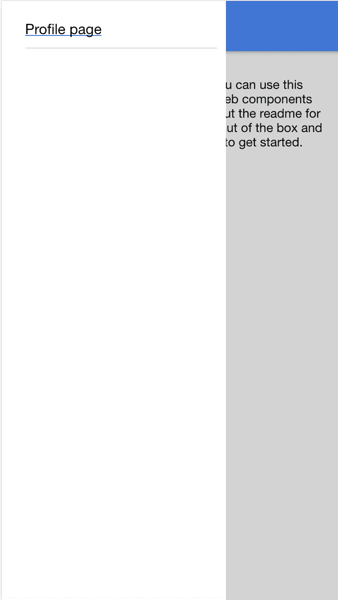
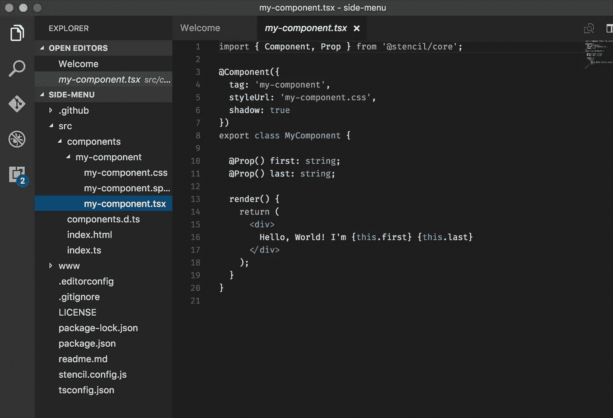
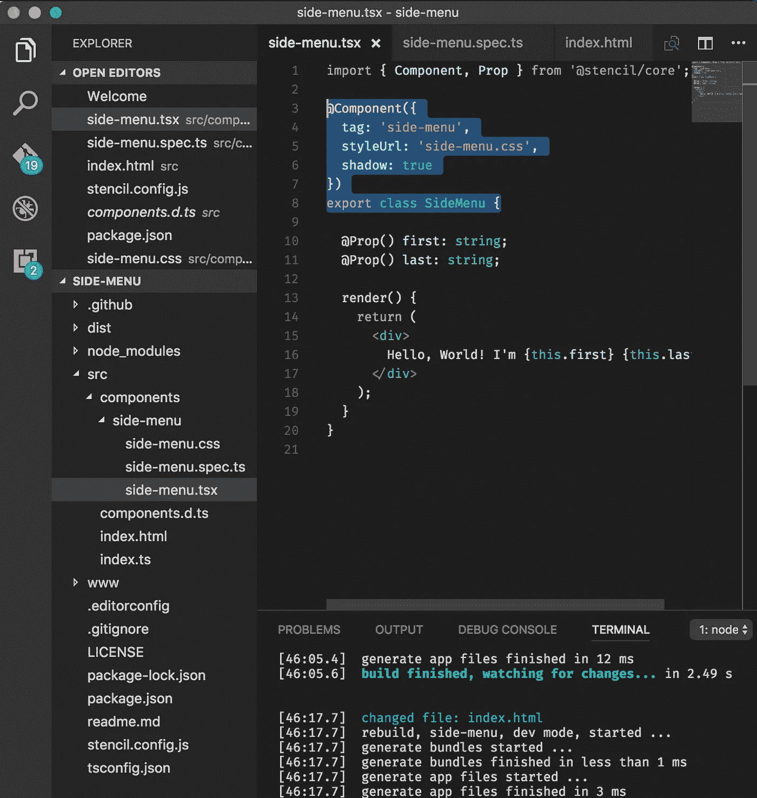
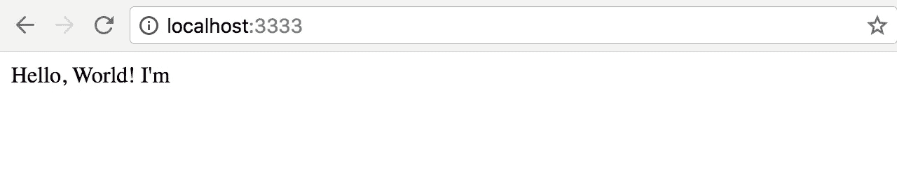
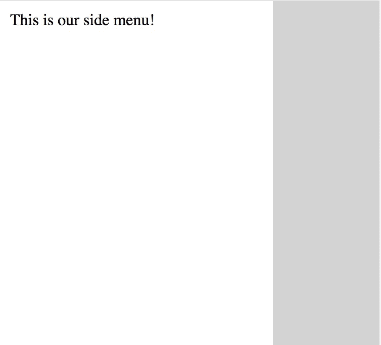

# 使用事件、监听和<slot>创建带有模板的侧菜单组件</slot>

> 原文：<https://itnext.io/creating-a-side-menu-component-with-stencil-using-events-listen-and-slot-ed06c612bc6?source=collection_archive---------0----------------------->

[*点击这里在 LinkedIn 上分享这篇文章*](https://www.linkedin.com/cws/share?url=https%3A%2F%2Fitnext.io%2Fcreating-a-side-menu-component-with-stencil-using-events-listen-and-slot-ed06c612bc6)

为了在游戏中保持领先，我努力做的一件很棒的事情就是增加新的技能和工具。只要有可能，我也会试着在上面撒一点魔法，以确保一切都很棒，这就是模板发挥作用的地方。

> “神奇的、可重用的 web 组件编译器”——Stenciljs.com

最后，没有一个 javascript 框架出自一个团队，他们把钱花在了他们的嘴上，并发布了他们自己用 Stencil 构建的组件。

这个工具无疑提供了一些魔力，因为当您可以构建在任何地方集成的定制组件时，开发人员最终可以摆脱对哪个前端框架在许多地方变动的担心。

为了将这种魔力付诸实践，我们将制作一个配菜菜单，这在任何水疗中心都是很常见的元素。如果你正在寻找成品，我已经在 github 中链接了组件回购。

[https://github.com/thielCole/stencil-side-menu](https://github.com/thielCole/stencil-side-menu)



集成到 Ionic-PWA-Toolkit 中的示例侧菜单

# **模板启动项目**

开始构建模板组件的一个很好的资源(特别是如果你想构建一个独立的组件)，是[模板组件启动器](https://github.com/ionic-team/stencil-component-starter)。导航到您希望项目所在的目录，并按照说明进行操作。

```
// Installing the Stencil App Starter
git clone [https://github.com/ionic-team/stencil-component-starter.git](https://github.com/ionic-team/stencil-component-starter.git) *side-menu* 
cd side-menu
git remote rm origin
npm install
```

它们给了你一个很好的框架，你的目录结构应该看起来像这样。



my-component.tsx 和文件结构

我们的第一个目标是将所有组件重命名为侧菜单，从 MyComponent 到 SideMenu(侧菜单)。不要认为这是一个简单的步骤。在你把所有的文件和文件夹从 my-component 重命名为 side-menu 后，有四个文件需要修改。

```
// side-menu.tsx
@Component({
  tag: 'side-menu',
  styleUrl: 'side-menu.css',
  shadow: true
})
export class SideMenu {
...// index.html
<!DOCTYPE html>
<html dir="ltr" lang="en">
<head>
  <meta charset="utf-8">
  <meta name="viewport" content="width=device-width, initial-  scale=1.0, minimum-scale=1.0, maximum-scale=5.0">
  <title>Stencil Component Starter</title>
  <script src="/build/side-menu.js"></script>
</head>
<body>
  <side-menu></side-menu>
</body>
</html>// stencil.config.js
exports.config = {
  namespace: 'side-menu',
  generateDistribution: true
};
exports.devServer = {
  root: 'www',
  watchGlob: '**/**'
}// package.json
"name": "side-menu",
"version": "0.0.1",
"description": "Stencil Component Starter",
"main": "dist/side-menu.js",
"types": "dist/types/index.d.ts","collection": "dist/collection/collection-manifest.json",
"files": [
  "dist/"
],
"browser": "dist/side-menu.js",
...
```

您最终的文件结构应该如下所示。



侧菜单的文件结构

现在，如果我们开始“运行 npm ”,我们实际上会得到一些东西！



您的第一个组件！

毫无疑问，需要改进的是在正确的目录中创建一个新组件的更简单的方法，但是对于一个测试版产品(Stencil 是测试版),我可以看到他们目前在做什么。

# **使其成为实际的侧菜单**

这里没有太多东西，但是现在你已经准备好开始构建你的组件了。侧边菜单有两个主要属性，第一，它重叠在当前视图的顶部，第二，它有一个灰色的背景(在移动设备上)。让我们在 side-menu.tsx 的 render()方法中创建这个视图

```
return (
<div class="side-menu">
  <div class="menu-background">
  </div>
  <div class="actual-menu">
    This is my main menu!
  </div>
</div>
);
```

现在我们有了配菜和背景。为了让一切变得漂亮，把这些样式添加到你的侧边菜单中

```
.side-menu {
 position: absolute;
 top: 0px;
 left: 0px;
 height: 100%;
 width: 100%;
 z-index: 20;
 background-color: transparent !important;
 padding: 0;
}.actual-menu {
 position: absolute;
 top: 0px;
 left: 0px;
 width: 250px;
 min-height: 100%;
 background-color: white;
 z-index: 30;
}.menu-button {
 width: 100%;
 margin: 0px;
 padding: 10px;
}.menu-background {
 position: absolute;
 background-color: rgba(38,38,38, 0.2);
 top: 0px;
 left: 0px;
 width: 100%;
 min-height: 100%;
 z-index: 5;
}
```

这将允许我们有一个侧菜单自动显示，看起来像这样。



你的第一道配菜

# **向组件添加事件**

现在我们有了一个看起来像侧菜单的自定义组件，我们还需要它像侧菜单一样工作。如果你看到我们当前的菜单，没有办法退出。通常，在移动设备上，如果您单击灰色背景区域，它会移除菜单并带您回到您正在查看的内容，因此我们将实现该功能。

为此，我们需要两个功能。首先，我们需要组件发出一个自定义事件，我称之为“backgroundToggle”。为此，我们将从@stencil/core 导入**事件**和**事件发射器**，并将其附加到菜单背景 div 的 onclick 事件。

```
// side-menu.tsx
@Event() backgroundToggle: EventEmitter;menuToggle(e) {
  console.log('Background toggled menu', e);
  this.backgroundToggle.emit(e);
}render() {
return (
      <div class="side-menu">
        <div class="menu-background" onClick={(e) => this.menuToggle(e)}>
      </div>
      <div class="actual-menu">
        This is my side menu!
      </div>
    </div>
  );
}
```

这允许 Stencil 将我们的事件 menuToggle 绑定到 div 菜单背景中的本地 onClick 事件。

# **监听事件**

因为我们正在构建一个独立的组件，我们不想假设我们知道当有人点击背景时用户想要做什么。相反，我们应该在我们的主 index.html 页面中实现一种监听该事件的方法，并使用它来隐藏我们的侧菜单。有两种方法可以做到这一点，第一种方法是实现 **Listen** 标签，如果你有一个类似 typescript 的 transpiler，就可以使用这个标签。

```
// index.html with transpiler
@Listen('backgroundToggle')
function toggleBackground(e) {
  console.log('recieved event', e);
  document.getElementsByTagName('side-menu')[0].style.display = 'none';
}
```

对我们来说不幸的是，Stencil 提供的 index.html 文件并没有以任何方式传输，所以我们需要确保使用 es5 特性来监听我们发出的事件。这也被认为是最佳实践，因为我们希望以最终用户可能实现的方式测试我们的组件，并且我们不能指望他们可能使用 TypeScript。

为了实现一个有效的监听器，我们使用了我们良好的 ole formed document . addevent listener 函数！

```
//index.html 
...
  <side-menu>
  </side-menu>
</body>
<script>
document.addEventListener('toggleBackground', function hideMenu(e) {
  console.log('Event Recieved');
  document.getElementsByTagName('side-menu')[0].style.display =   'none';
});
```

现在我们可以在主页上监听我们发出的事件，并在有人点击我们菜单的背景时做出相应的反应！

# **允许用户使用<插槽/>/T11 进行定制**

如果我们真的在构建一个可以在任何项目中使用的组件，我们不知道有人想要如何组织他们的菜单选项。可能有一个用户认证部分，一个简单的菜单项列表，或者一个关于某人正在看什么的信息对话。

```
<side-menu>
  <div class="example-button">This is a nav butt!</div>
</side-menu>
```

为了实现这种定制，我们需要允许用户将 HTML 作为菜单内容传递到侧边菜单，为此我们使用了非常强大的便捷的<slot>标签。当我们添加一个<slot>标签到我们的组件时，开发者在我们的定制标签中添加的任何 html 都将被添加到<slot>的位置。对我们来说，我们希望将它添加到“实际菜单”中(命名不是我的专长)。</slot></slot></slot>

```
<div class="actual-menu">
  </slot>
</div>
```

我无法强调这个槽标签有多强大。特别是对于侧边菜单，您会希望用户能够添加导航按钮和定制内容，没有它是不可能的。

# **总之**

模板组件编译器是一个令人难以置信的强大工具，它将使伟大的跨框架组件得以构建。标准化组件并在 React、Vue、Angular 或您喜欢的任何东西中提供这些组件的能力使它成为任何人(特别是 ionic)的一个非常有用的工具，这些人希望在团队、项目和企业之间开发和共享 web 组件，而不用担心下一个热门的前端框架。我个人非常兴奋能够开始使用和开源一些定制组件来改进社区。