# ASP.NET 核心应用程序的较小 Docker 映像

> 原文：<https://itnext.io/smaller-docker-images-for-asp-net-core-apps-bee4a8fd1277?source=collection_archive---------0----------------------->

## 尺寸缩减高达 70%

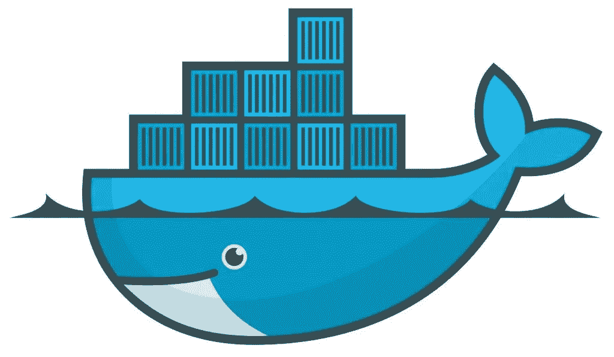

你有没有问过自己，为什么要让你的 Docker 图片尽可能的小？

1.  更大的图像意味着**更长的下载时间**。
2.  更大的图像意味着**更多的存储消耗**。
3.  较大的图像意味着图像中有**不必要的组件**。

因此，大型映像会导致集成和部署延迟，或者增加存储成本。

在这篇文章中，我将牢记效率来描述几种方法。Docker 上的 NET Core 部署。

## 1)脚手架工程

要开始在 Docker 上部署，我们需要一个示例项目。我将使用默认的 ASP.NET 核心 API 项目。您可以通过终端中的`dotnet new webapi -o MyWebApp`命令创建项目。

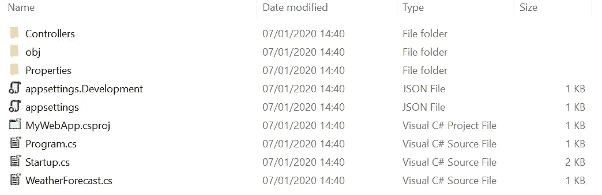

该命令将创建新的 ASP.NET 核心 Web API 项目

## 2)将项目发布为框架相关的应用程序

您可以将应用程序发布为[自包含应用程序或依赖于框架的](https://docs.microsoft.com/en-us/dotnet/core/deploying/)。在文章的这一部分，我们将把项目发布为框架相关的。

要发布，请在终端中输入以下命令:

```
dotnet publish -c Release -o ./publish
```

确保你发布的应用带有**发布概要**是很重要的。该选项将告诉。NET publisher 应该使用哪个配置文件。

## 2.1)使用 ASP.NET 核心运行时创建 docker 映像

创建一个`Dockerfile`，内容如下:

建立形象:

```
docker build -t web1 -f Dockerfile .
```

Docker 将构建图像并产生如下输出:

```
Sending build context to Docker daemon  1.807MB
Step 1/6 : FROM mcr.microsoft.com/dotnet/core/aspnet:3.1 AS runtime
3.1: Pulling from dotnet/core/aspnet
8ec398bc0356: Pull complete                                                                                             9584d2ef7ebe: Pull complete                                                                                             62b61706cd9b: Pull complete                                                                                             8f13df7c0cb1: Pull complete                                                                                             9c72d70b702b: Pull complete                                                                                             Digest: sha256:9f0aebb2e83a9f455e4ac123db10bc263e729e1faaf733709db04d0d6df2b77c
Status: Downloaded newer image for mcr.microsoft.com/dotnet/core/aspnet:3.1
 ---> a843e0fbe833
Step 2/6 : EXPOSE 80
 ---> Running in 870640b52084
Removing intermediate container 870640b52084
 ---> f9a31931a780
Step 3/6 : EXPOSE 443
 ---> Running in 7e477e68bd5a
Removing intermediate container 7e477e68bd5a
 ---> 7522ce7349fa
Step 4/6 : WORKDIR /app
 ---> Running in 7c4d3e1490a3
Removing intermediate container 7c4d3e1490a3
 ---> 784d7ff4e4bd
Step 5/6 : COPY ./publish ./
 ---> 5a7b9b9163c0
Step 6/6 : ENTRYPOINT ["dotnet", "MyWebApp.dll"]
 ---> Running in ce7cdd5dd2c4
Removing intermediate container ce7cdd5dd2c4
 ---> bc92fbe6e1b2
Successfully built bc92fbe6e1b2
Successfully tagged web1:latest
```

📔为了确保 web 应用程序工作正常，尝试通过命令`docker run -p 8080:80 web1`运行图像。然后导航到[http://localhost:8080/Weather](http://localhost:8080/WeatherForecast)查看 JSON 列表。

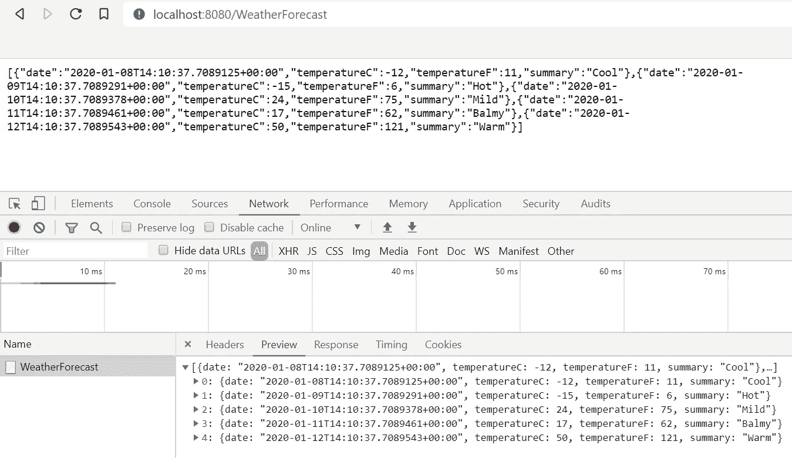

抽样输出

看起来图像运行良好，让我们来测量图像的大小。用`docker images`命令，你可以得到图片的列表。

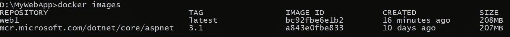

**207 MB** 用于 ASP.NET 核心应用基础映像，1 MB**用于网络应用。对于一个简单的 web 应用程序来说 **208 MB** 很大，**不是吗**？😲**

让我们检查图像，看看是什么使我们的图像大小为 208 MB:

```
docker history web1:latest# resultCREATED BY                                      SIZE               
/bin/sh -c #(nop)  ENTRYPOINT ["dotnet" "MyW…   0B
/bin/sh -c #(nop) COPY dir:36b502377fe8f29be…   289kB
/bin/sh -c #(nop) WORKDIR /app                  0B
/bin/sh -c #(nop)  EXPOSE 443                   0B
/bin/sh -c #(nop)  EXPOSE 80                    0B
/bin/sh -c aspnetcore_version=3.1.0     && c…   17.8MB
/bin/sh -c dotnet_version=3.1.0     && curl …   76.7MB
/bin/sh -c apt-get update     && apt-get ins…   2.28MB
/bin/sh -c #(nop)  ENV ASPNETCORE_URLS=http:…   0B
/bin/sh -c apt-get update     && apt-get ins…   41.3MB
/bin/sh -c #(nop)  CMD ["bash"]                 0B
/bin/sh -c #(nop) ADD file:04caaf303199c81ff…   69.2MB
```

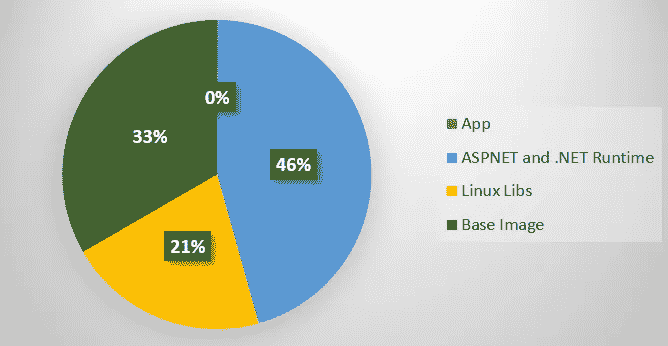

94 MB 用于。NET 和 112MB 用于基本映像和库。

## 3)将项目发布为独立的

在第 2 节中，我们将项目发布为框架相关的，我们看到图像大小约为 208 MB。

通过自包含部署，您可以部署应用程序和任何必需的第三方依赖项以及的版本。NET Core 来构建应用程序。要发布为独立的，请运行以下命令:

```
dotnet publish --runtime alpine-x64 -c Release --self-contained true -o ./publish
```

该应用程序将在 Linux docker 上运行，所以我选择了`linux-x64` runtime 进行部署。要查看 publish 命令支持的其他运行时，请阅读本文档。

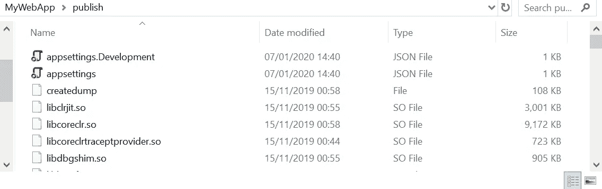

324 个文件和 93.2 MB

它将生成包含程序集等的 **324 个文件(93.2 MB)** 。为了在 docker 上运行它，我们需要一个 Linux 基础映像。有 Ubuntu，CentOS，OpenSuse，Alpine 等不同的基础镜像。

规模、安全、效率、社区是决定你需要哪一个的重要价值。

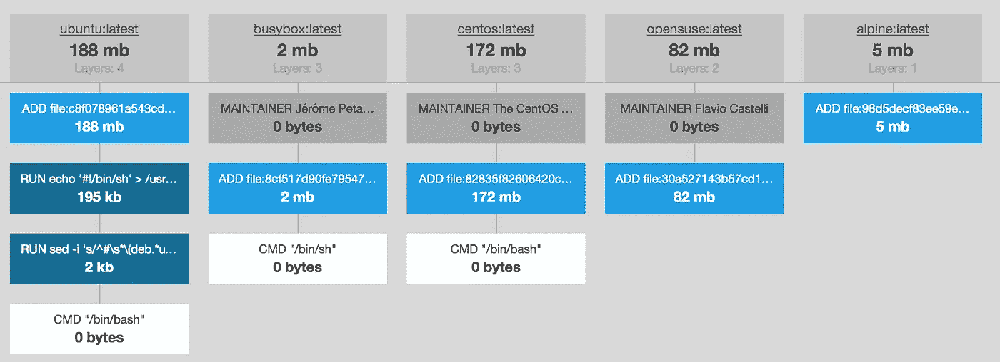

来源: [Docker 图片尺寸对比](https://brianchristner.io/docker-image-base-os-size-comparison/)作者[布莱恩·克里斯特纳](https://brianchristner.io/author/brian/)

如上图所示，Alpine Linux 是最轻的 docker 基础映像。它提供了安全性、简单性和资源效率！

> Alpine Linux 是一个独立的、非商业的、通用的 Linux 发行版，专为重视安全性、简单性和资源效率的高级用户而设计。
> https://alpinelinux.org/about/

## 3.1)使用 Alpine base 映像创建 docker 映像

创建一个包含以下内容的 Docker 文件:

我使用 alpine:3.9.4 作为 docker 的基础映像，在 Docker 文件中安装了一些库包。现在，如果你建立图像:

```
docker build -t web2 -f Dockerfile .
```

Docker 将构建图像并产生如下输出:

```
Sending build context to Docker daemon  296.2MB
Step 1/8 : FROM alpine:3.9.4
3.9.4: Pulling from library/alpine
e7c96db7181b: Pull complete                                                                                                               Digest: sha256:7746df395af22f04212cd25a92c1d6dbc5a06a0ca9579a229ef43008d4d1302a
Status: Downloaded newer image for alpine:3.9.4
 ---> 055936d39205
Step 2/8 : RUN apk add --no-cache     openssh libunwind     nghttp2-libs libidn krb5-libs libuuid lttng-ust zlib     libstdc++ libintl     icu
 ---> Running in 9471cd447603
fetch [http://dl-cdn.alpinelinux.org/alpine/v3.9/main/x86_64/APKINDEX.tar.gz](http://dl-cdn.alpinelinux.org/alpine/v3.9/main/x86_64/APKINDEX.tar.gz)
fetch [http://dl-cdn.alpinelinux.org/alpine/v3.9/community/x86_64/APKINDEX.tar.gz](http://dl-cdn.alpinelinux.org/alpine/v3.9/community/x86_64/APKINDEX.tar.gz)
(1/26) Installing libgcc (8.3.0-r0)
(2/26) Installing libstdc++ (8.3.0-r0)
(3/26) Installing icu-libs (62.1-r0)
(4/26) Installing icu (62.1-r0)
(5/26) Installing krb5-conf (1.0-r1)
(6/26) Installing libcom_err (1.44.5-r1)
(7/26) Installing keyutils-libs (1.6-r0)
(8/26) Installing libverto (0.3.0-r1)
(9/26) Installing krb5-libs (1.15.5-r0)
(10/26) Installing libidn (1.35-r0)
(11/26) Installing libintl (0.19.8.1-r4)
(12/26) Installing libunwind (1.2.1-r3)
(13/26) Installing libuuid (2.33-r0)
(14/26) Installing userspace-rcu (0.10.1-r0)
(15/26) Installing lttng-ust (2.10.1-r0)
(16/26) Installing nghttp2-libs (1.35.1-r1)
(17/26) Installing openssh-keygen (7.9_p1-r6)
(18/26) Installing ncurses-terminfo-base (6.1_p20190105-r0)
(19/26) Installing ncurses-terminfo (6.1_p20190105-r0)
(20/26) Installing ncurses-libs (6.1_p20190105-r0)
(21/26) Installing libedit (20181209.3.1-r0)
(22/26) Installing openssh-client (7.9_p1-r6)
(23/26) Installing openssh-sftp-server (7.9_p1-r6)
(24/26) Installing openssh-server-common (7.9_p1-r6)
(25/26) Installing openssh-server (7.9_p1-r6)
(26/26) Installing openssh (7.9_p1-r6)
Executing busybox-1.29.3-r10.trigger
OK: 53 MiB in 40 packages
Removing intermediate container 9471cd447603
 ---> 13d705c0f17d
Step 3/8 : EXPOSE 80
 ---> Running in 1e9629765f45
Removing intermediate container 1e9629765f45
 ---> 3e9b13c5f712
Step 4/8 : EXPOSE 443
 ---> Running in d203c44684f4
Removing intermediate container d203c44684f4
 ---> d28ff936ef66
Step 5/8 : WORKDIR /app
 ---> Running in c0e330d7f71e
Removing intermediate container c0e330d7f71e
 ---> 914a79994c12
Step 6/8 : COPY ./publish ./
 ---> f264c40e2341
Step 7/8 : RUN ["chmod", "+x", "MyWebApp"]
 ---> Running in a66b965fda5b
Removing intermediate container a66b965fda5b
 ---> 94e004ed94a7
Step 8/8 : ENTRYPOINT ["./MyWebApp", "--urls", "[http://0.0.0.0:80](http://0.0.0.0:80)"]
 ---> Running in ded6415d0e8b
Removing intermediate container ded6415d0e8b
 ---> 2686bfb52f0f
Successfully built 2686bfb52f0f
Successfully tagged web2:latest
```

该日志比前一个日志稍长；因为它将为 Alpine 安装一些所需的库。网芯。让我们来测量图像大小:

```
docker images
```

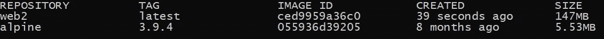

尺寸缩小了 29%

图像大小为 **147 MB，比上一张少了 61 MB** 。让我们检查一下图像层，看看 147 MB 是由什么组成的:

```
docker history web2:latest
```

总结后的结果应该是这样的:

```
CREATED BY                                      SIZE                
/bin/sh -c #(nop)  ENTRYPOINT ["./MyWebApp" …   0B
/bin/sh -c #(nop) COPY dir:eec964e257409b648…   97.8MB
/bin/sh -c #(nop) WORKDIR /app                  0B
/bin/sh -c #(nop)  EXPOSE 443                   0B
/bin/sh -c #(nop)  EXPOSE 80                    0B
/bin/sh -c apk add --no-cache     openssh li…   43.8MB
/bin/sh -c #(nop)  CMD ["/bin/sh"]              0B
/bin/sh -c #(nop) ADD file:a86aea1f3a7d68f6a…   5.53MB
```

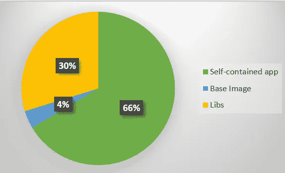

49.33 MB 用于基本映像和库，97.8 MB 用于应用程序

与之前的相比，我们通过使用一个轻量级的 Linux 映像来缩小映像的大小。的。NET runtime 加入自带 app，能不能做小一点？

## 4)组合独立和 IL-接头

IL-Linker 是什么？

> IL 链接器是一种工具，可以用来只传送一组程序运行可能需要的最少 IL 代码和元数据，而不是完整的库。
> 
> 各种 Xamarin 产品使用它来提取在 Android、iOS 和其他平台上运行应用程序所需的代码。
> 
> —[https://github.com/mono/linker](https://github.com/mono/linker)

IL-Linker 已经包含在中。NET SDK，因为[它说](https://github.com/dotnet/core/blob/master/samples/linker-instructions.md)它可以减少。净核心应用达到 50%。

要使用 il-linker，只需将`/p:PublishTrimmed=true`标志传递给 publish 命令。

```
dotnet publish -c Release -r alpine-x64 --self-contained true /p:PublishTrimmed=true -o ./publish
```

由于 IL 链接器进程的原因，这需要更长的时间。结果非同凡响！

*226 个文件和* ***53.3 MB*** *，简直是****45%******✌***

## *4–1)使用之前的文档对其进行归档*

```
*docker build -t web3 -f Dockerfile .*
```

*测量图像尺寸:*

*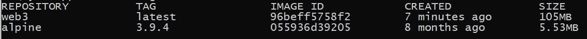*

```
*docker history web3:latest# result/bin/sh -c #(nop)  ENTRYPOINT ["./MyWebApp" …   0B
/bin/sh -c #(nop) COPY dir:80b91cb154520a076…   55.9MB
/bin/sh -c #(nop) WORKDIR /app                  0B
/bin/sh -c #(nop)  EXPOSE 443                   0B
/bin/sh -c #(nop)  EXPOSE 80                    0B
/bin/sh -c apk add --no-cache     openssh li…   43.8MB
/bin/sh -c #(nop)  CMD ["/bin/sh"]              0B
/bin/sh -c #(nop) ADD file:a86aea1f3a7d68f6a…   5.53MB*
```

*自带 55.9MB，Alpine 和 libs 49.33 MB。**比默认图像小 49.52%。***

## *5)移除阿尔卑斯山的 lib 和包装*

*我们为 Alpine 安装了所需的库。网芯。微软的这个文档说这些文档只是 RHEL6 需要的。既然我们使用的是 Alpine，那么让我们试着移除它们，看看会发生什么？*

```
*# RUN apk add --no-cache \ 
#     openssh libunwind \
#     nghttp2-libs libidn krb5-libs libuuid lttng-ust zlib \
#     libstdc++ libintl \
#     icu*
```

***第一次尝试:***

```
*Error loading shared library libstdc++.so.6: No such file or directory (needed by ./MyWebApp)
Error loading shared library libgcc_s.so.1: No such file or directory (needed by ./MyWebApp)*
```

*需要✔ [libstdc++](https://pkgs.alpinelinux.org/package/edge/main/x86_64/libstdc++) 包。*

***安装了 libstdc++ lib 的第二次尝试:***

```
*Failed to load �a)�V, error: Error loading shared library libintl.so.8: No such file or directory (needed by /app/libcoreclr.so)
Failed to bind to CoreCLR at '/app/'
Failed to create CoreCLR, HRESULT: 0x80008088*
```

*✔ [libintl](https://pkgs.alpinelinux.org/package/edge/main/x86/libintl) 包也是需要的。*

***安装了 libstdc++和 libintl 后再尝试:***

```
*Process terminated. Couldn't find a valid ICU package installed on the system. Set the configuration flag ystem.Globalization.Invariant to true if you want to run with no globalization support.*
```

*看来需要 [icu](https://pkgs.alpinelinux.org/package/edge/main/x86/icu) 包。你可以做两件事:*

1.  *沿着 **libstdc++** 和 **libintl 安装 **icu** 包。***
2.  *将应用程序配置为对区域性不变。(当然，如果全球化不是您的应用程序的选项)*

***与 icu 包一起的还有那两个:***

*带**所需**库的图像大小:94.8MB ***。*** **比上一款小 10.2 MB** 。*

*将应用程序配置为运行固定文化模式怎么样？*

*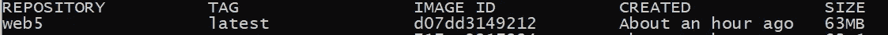*

*图像大小将为 **63MB** (可能的最小尺寸😉).现在您需要将一个环境变量传递给。NET for CultureInvarient 选项。*

*环境变量:**dot net _ SYSTEM _ GLOBALIZATION _ INVARIANT = 1***

```
*docker run **-e DOTNET_SYSTEM_GLOBALIZATION_INVARIANT=1** -p 8080:80 web5#result> docker run -e DOTNET_SYSTEM_GLOBALIZATION_INVARIANT=1 -p 8080:80 web5info: Microsoft.Hosting.Lifetime[0]
      Now listening on: [http://0.0.0.0:80](http://0.0.0.0:80)
info: Microsoft.Hosting.Lifetime[0]
      Application started. Press Ctrl+C to shut down.
info: Microsoft.Hosting.Lifetime[0]
      Hosting environment: Production
info: Microsoft.Hosting.Lifetime[0]
      Content root path: /app*
```

*工作正常，尺寸缩小了 70%左右的✌ ！*

## *结论*

*我喜欢 Alpine Linux 因为它真的很轻，而且部署速度更快。*

*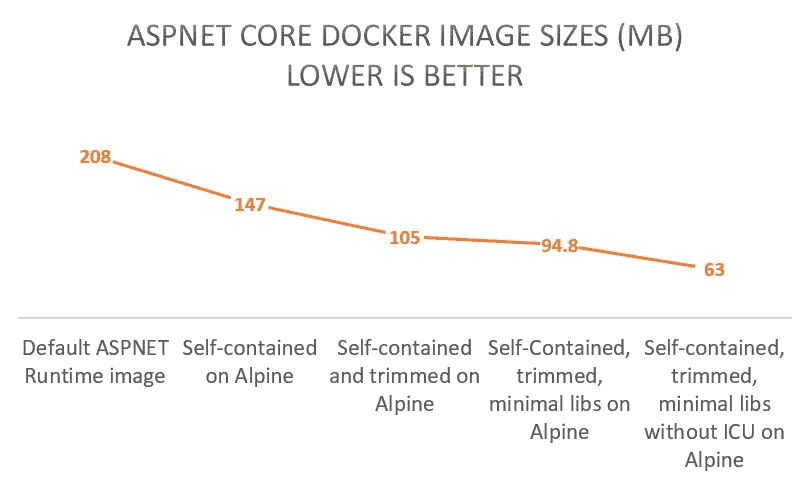*

## *你想要更多吗？*

*自包含部署将生成大量文件(+200 个文件)。我并不认为这是一件真正整洁的事情，另一方面，Docker copy 命令需要一点时间来复制 2-300 个文件。*

*publish 命令支持单文件部署，这意味着它将为整个应用程序生成一个二进制文件。*

*使用`/p:PublishSingleFile=true`标志，发布者将只发布一个二进制文件。*

```
*dotnet publish --runtime alpine-x64 -c Release --self-contained true -o ./publish */p:PublishSingleFile=true* /p:PublishTrimmed=true*
```

*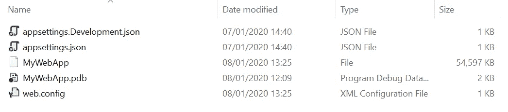*

*一个二进制文件+配置文件*

## *重要说明*

*如果你使用像`Assymbly.Load('System.Security')`这样的动态程序集加载，不要忘记配置 IL-Linker，也不要修改那些程序集。*

*在这种情况下，我们需要做的就是编辑 **csproj** 文件并添加:*

```
*<ItemGroup>
  <TrimmerRootAssembly Include="System.Security" />
</ItemGroup>*
```

## *更新 1:*

*有人提到我，微软已经为 SDK 和。基于 Alpine 的网芯。为什么我没有用它们？*

*例如，这是基于 Alpine 的 ASPNET 核心运行时的 [docker 文件](https://github.com/dotnet/dotnet-docker/blob/d4a9e799d047f3e86cd2730f48b689c371d38480/3.1/aspnet/alpine3.10/amd64/Dockerfile):*

```
*ARG REPO=mcr.microsoft.com/dotnet/core/runtime
FROM $REPO:3.1-alpine3.10# Install ASP.NET Core
RUN aspnetcore_version=3.1.0 \
    && wget -O aspnetcore.tar.gz [https://dotnetcli.azureedge.net/dotnet/aspnetcore/Runtime/$aspnetcore_version/aspnetcore-runtime-$aspnetcore_version-linux-musl-x64.tar.gz](https://dotnetcli.azureedge.net/dotnet/aspnetcore/Runtime/$aspnetcore_version/aspnetcore-runtime-$aspnetcore_version-linux-musl-x64.tar.gz) \
    && aspnetcore_sha512='fa5e4ae71134a8a6db4ad6a247d3e31406673e03f0a64f7faaad3d84cfb3b70d2cf69e9d9abc1f8688138907d4ddd37cd908669999d85a87892e164053c63847' \
    && echo "$aspnetcore_sha512  aspnetcore.tar.gz" | sha512sum -c - \
    && tar -ozxf aspnetcore.tar.gz -C /usr/share/dotnet ./shared/Microsoft.AspNetCore.App \
    && rm aspnetcore.tar.gzEXPOSE 80
EXPOSE 443# Copy 
WORKDIR /app
COPY ./publish ./ENTRYPOINT ["dotnet", "MyWebApp.dll"]*
```

*如果我构建项目框架依赖并构建这个 docker 映像，那么映像大小将为 **105MB** 。*

```
*docker history alp-1CREATED BY                                      SIZE     
/bin/sh -c #(nop)  ENTRYPOINT ["dotnet" "MyW…   0B
/bin/sh -c #(nop) COPY dir:36b502377fe8f29be…   289kB
/bin/sh -c #(nop) WORKDIR /app                  0B
/bin/sh -c #(nop)  EXPOSE 443                   0B
/bin/sh -c #(nop)  EXPOSE 80                    0B
/bin/sh -c aspnetcore_version=3.1.0     && w…   17.8MB
/bin/sh -c dotnet_version=3.1.0     && wget …   77.2MB
/bin/sh -c #(nop)  ENV ASPNETCORE_URLS=http:…   0B
/bin/sh -c apk add --no-cache     ca-certifi…   4.08MB
/bin/sh -c #(nop)  CMD ["/bin/sh"]              0B
/bin/sh -c #(nop) ADD file:fe1f09249227e2da2…   5.55MB*
```

*如您所见， **95MB 的。NET 和 ASPNET 核心， **4.08MB** 用于 libs， **5.55MB** 用于 Alpine 本身。在我的解决方案中，我只部署了部分代码。NET 是 app 所需要的，因为 IL-Linker 去掉了不必要/不用的部分。与 **105MB** 相比， **94MB** 或 **63MB** 更小。***

*当然，基于 Microsoft Alpine 的 docker image 对于部署来说是一个不错的选择，但是为您的项目选择什么始终取决于您自己。*

*祝您好运😉*