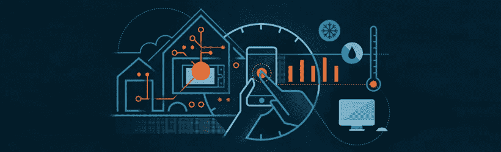
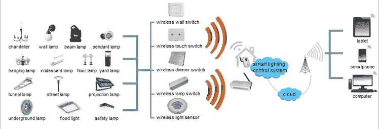
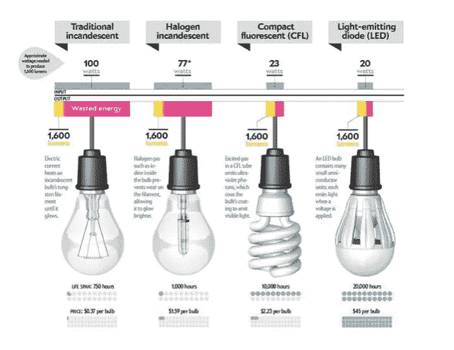

# 智慧城市系列:如何实现智慧照明

> 原文：<https://itnext.io/smart-cities-series-how-to-realize-smart-lighting-544175331baf?source=collection_archive---------2----------------------->

智能照明旨在提高能效，即最大限度地减少能源使用。据 Gartner [称，智能照明有可能将能源成本降低 90%](http://www.gartner.com/newsroom/id/3093717) 。它被定义为连接到网络的照明系统，可以从中央系统或通过云进行监控。这种技术已经被几家大公司所采用，并且在个人环境如住宅中越来越受欢迎。建筑已经不仅仅是一个你可以居住的地方，未来的智能建筑可以“和你一起思考”，理解你的需求并据此做出决定。虽然上一篇文章阐述了智能城市的总体前景，但本系列的这一部分将讲述智能照明的实现，以创造智能环境。

## 智能照明的 5 个阶段

为了成功实现最低的电力成本，除了实现安全性和改善办公环境，技术和服务提供商的照明产品经理还需要实施[智能照明的五个关键战略阶段](https://www.gartner.com/doc/3067420/market-trends-phases-smart-lighting?srcId=1-2994690285):

**第一阶段:LED 照明** 联网照明系统让你只需在智能设备上轻点几下就能控制照明。与 LED 相比，节能灯和白炽灯使用相对更多的能源来产生相同的光量，这使得 LED 使用更少的能源，寿命更长。除了这些降低的能源成本，由于制造技术的发展，发光二极管的生产成本也在不断降低。灯泡变得智能是因为使用了发光二极管(LED)，连接到 Wi-Fi，并结合了多种技术。

灯泡由 [Homedit](http://www.homedit.com/the-characteristics-of-energy-efficient-light-bulbs/)

**第二阶段:传感器和控制** 照明、运动传感器和荧光装置的预定定时器被广泛认为是降低能耗的方法。这些技术的例子包括在仪表板上控制照明环境的可能性和传感器连接系统，该系统可以使用[地理围栏灯泡](http://www.howtogeek.com/221077/htg-explains-what-geofencing-is-and-why-you-should-be-using-it/)通过 GPS/蓝牙检测您的位置[，如果传感器检测到您不再处于照明区域，则可以关闭灯光。能够感知日光并知道何时开灯/关灯的传感器可以避免由于日出和日落的时间变化而不必要地开灯。从智慧城市的角度来看，这项技术的应用范围更广；智能照明也被用于路灯和灯柱。汽车行业的公司正在](http://diginomica.com/2015/03/18/how-philips-lighting-mastered-smart-lights-and-turned-a-60-light-bulb-into-a-winner/)[为汽车](http://newatlas.com/ford-smart-headlight-hazards-safety/38535/)开发智能照明系统，使照明适应区域(GPS)和天气/自然照明环境(传感器)，从而提高安全性和效率。

**阶段 3:连接性** 根据 Gartner 的研究副总裁 Dean Freeman 的说法，通过连接前面讨论的阶段，将传感器/控制与照明结合起来，智能照明可以使成本/ [能源减少 25%至 50%](https://www.gartner.com/doc/3067420/market-trends-phases-smart-lighting?srcId=1-2994690285)。通过添加涉及分析和智能的第四和第五阶段，减少量有可能增长到 90%。

**阶段 4:分析** 通过分析照明能耗，可以检测模式并通过人工或计算机进行比较，从而优化照明使用。建筑经理可以分析商业办公室——政府路灯/公共区域照明和房主房屋——以收集关于职业、习惯和趋势的信息和内幕。根据结果的结果，可以采取措施最大限度地降低成本，甚至提高乘员的安全性和环境，这可能是前面提到的汽车行业的情况。

**第五阶段:智能** 智能照明解决方案可以通过添加大数据和[人工智能](http://iotevent.eu/wp-content/uploads/2016/09/Cisco-Smart-Connected-Lighting-IoT-AI-Workshop-LpS-2016.pdf)变得更加智能。这意味着连接的照明设备网络[应该持续捕获数据并与其他网络](http://www.atelier.net/en/trends/articles/turning-street-lighting-system-gathering-big-data_425042)共享数据。实体或设备不仅可以分析结果，还可以识别照明使用中的异常情况，并对未来的能耗进行[预测分析](http://www.ibmbigdatahub.com/blog/building-smart-business-four-pillars-predictive-analytics)，从而进一步降低照明能耗。智能城市的这一趋势催生了一种服务交付模式，在这种模式下，照明服务以订阅为基础收费，而不是通过一次性付款，这种模式被称为[照明即服务](http://www.philips.com/a-w/about/news/archive/standard/news/press/2015/20150416-Philips-provides-Light-as-a-Service-to-Schiphol-Airport.html)。

## **结论**

为了取得最高水平的成功并最大限度地降低照明成本，需要实施所有五个阶段。LED 照明、传感器、控制和连接的阶段现在是已知的和使用的解决方案。通过增加涉及大数据和人工智能的分析和智能两个阶段，可以优化使用，这使得闪电和能源的节省增加到 90%成为可能。借助这些解决方案，智能照明提供商将能够[利用传感器数据和分析对物联网的影响](http://www.gartner.com/newsroom/id/3093717)。物联网生成的信息(如所讨论的智能照明解决方案的五个阶段)创造价值的方式，代表了智能技术的[根本转变](https://www2.deloitte.com/content/dam/Deloitte/us/Documents/financial-services/us-dup-smart-buildings-how-iot-technology-aims-to-add-value-for-real-estate-companies.pdf)为实现智能城市做出贡献。