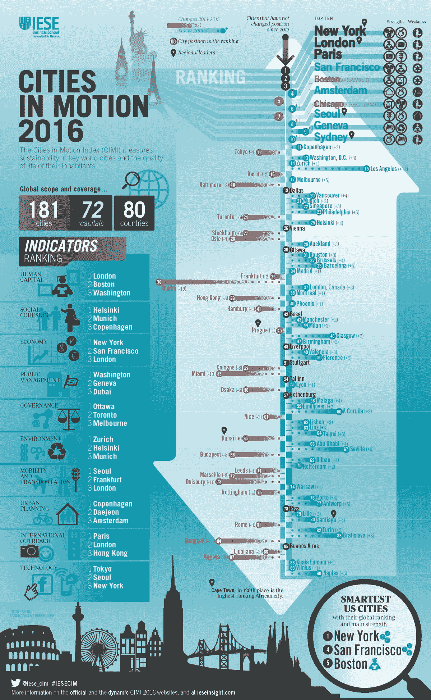

# 智能城市:智能城市的原则是什么？

> 原文：<https://itnext.io/smart-cities-wat-zijn-de-principes-van-een-slimme-stad-124e969522d5?source=collection_archive---------4----------------------->

在智能城市(Smart Cities)中，欧洲是世界的榜样。欧洲的城市往往更拥挤，更好的公共交通，鼓励骑自行车或走路。此外，他们往往更注重可持续发展和注重环境的解决方案，或许是最重要的，是一种公民更关心和参与发展更可持续和更智能城市的文化。

尽管如此，在诸如“智能城市”的顶级国际城市(例如“T0”【香港】，在机场及其农业部门也有无线电频率识别(rfi)的实验。

## 聪明城市的基本原则是什么？

诺基亚最近发布了“T2”智能城市 playbook“T3”，这是一份战略文件，为城市和市政当局提供了使其更智能、更安全和更可持续的具体指导。playbook 是根据全球 22 个最聪明城市的策略与进度所开发。

虽然研究显示城市之间存在显着差异，但已确定了一些普遍适用的点，例如:

*   成功的智能城市与政府和第三方合作，为数据的使用制定了开放和透明的规则(所有智能城市都依赖这些规则)。城市因此成为免费数据和(付费)商业数据的提供者。
*   许多发展到“智能城市”的城市都致力于向政府内外的用户开放信息和通信技术(信通技术)和物联网。避免在政府部门之间建立"筒仓"。
*   积极参与“智能城市”计划的政府(及其外部合作伙伴)非常有效，特别是那些能够清楚地看到其成果的举措，如智能照明和智能停车位。
*   “智能城市”基础架构必须具有可扩展性，以适应未来的增长和发展。此外，还必须确保政府和私人数据都受到保护。
*   与具有创新能力和技术平台的技术合作伙伴合作的城市，可避免供应商锁定。

## 我们在哪里看到智能城市？

*信息学对任何商学院来说，第一次公开是在* [*洞察*](http://www.ieseinsight.com/doc.aspx?id=1819&ar=15&idioma=2)

“T6”运动指数中的“部分城市”一年一度的“T7”考察了构成“智能城市”的所有方面，如可持续发展和生活质量，还包括技术和凝聚力。根据该指数，纽约(美国)、伦敦(英国)和巴黎(法国)是世界上在各方面得分最高的三个城市。纽约在经济发展方面名列第一，在技术方面名列第三。阿姆斯特丹在技术和城市规划方面名列第五。但是，所有城市在各方面仍有改进的馀地，如信息技术的美丽见解。

## 未来是什么？

到 2050 年，世界上大约 70%的人口居住在城市中心。因此，政府和其他利益攸关方必须做好充分准备，以满足日益增长的人口需求。智能信通技术和物联网平台在其中扮演着重要角色。它已经被广泛用于优化城市的服务和基础设施，节约成本，并促进城市内部的经济发展和社会互动。在接下来的文章中，我们将深入研究技术和数据输入。