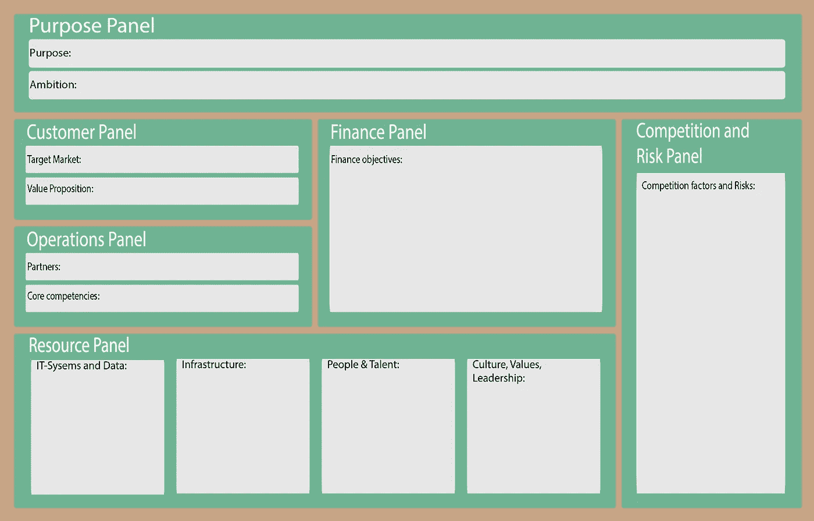
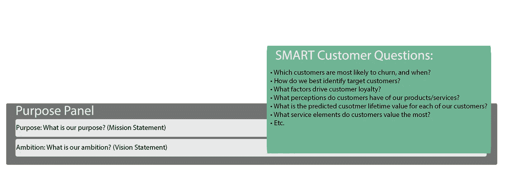
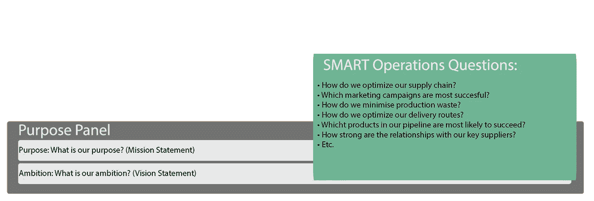
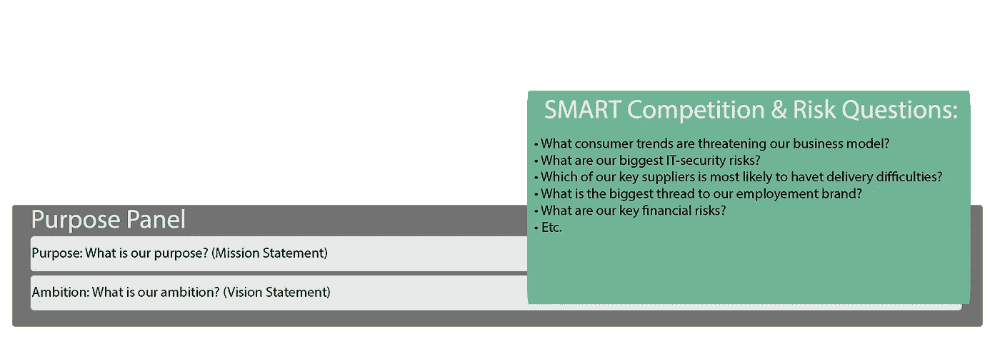

# 智能数据从策略开始

> 原文：<https://itnext.io/smart-data-begint-met-een-strategie-9b5ade9062c1?source=collection_archive---------6----------------------->

这是智能数据系列中的第二篇文章。系列中的其他文章如下所示:

> # 1:[关注更多数据或更智能地使用现有数据？大数据与智能数据](/focussen-op-meer-data-of-slimmer-gebruik-van-bestaande-data-big-data-vs-smart-data-5b9a306c873f)
> 
> #3、[数据只是数据。从指标和智能问题](/data-is-slechts-data-behaal-strategisch-voordeel-met-metrics-en-smart-questions-580a87c22887)中获得战略优势
> 
> #4: [通过分析将数据转换为有意义的洞察力](/transformeren-van-data-naar-betekenisvolle-inzichten-met-behulp-van-analyse-697772d6ddbf?source=user_profile---------1----------------)
> 
> #5、[利用强大的报告功能充分发挥大数据的潜力](/benut-het-volledige-potentieel-van-big-data-met-behulp-van-krachtige-rapportages-1c27ca0b121e?source=user_profile---------0----------------)

大数据是“智能革命”的核心。对于当今的组织来说，确定从这些数据中生成“业务价值”的方法是至关重要的。两周前，我简单地描述了“T8”智能数据模型“T9”。该模型由 t10 伯纳德 marr 开发，可帮助组织智能地开展业务，而不会丢失当今的大量数据。要将大数据转换为业务价值，首先要确定策略。本文全面介绍了智能策略委员会，它是确定策略的一个有用工具。

**智能策略委员会**

为了解组织对数据的需求，智能数据模型使用一个称为“策略委员会”的模型。作为一个具体的目标，本委员会希望了解实现业务目标所需的战略信息。仅仅知道一切的野心不会带来成功的策略。然后，我们可以使用“智能问题”来集中搜索数据以回答这些问题。此方法仅获取相关数据，并保留摘要。

*智能策略委员会(2015 年 11 月)*

**purpose 面板**

SMART strategy board 由六个面板组成，每个面板都充当智能问题的触发器。“purpose panel”建立了整体上下文，并作为组织的目标框架。根据组织的愿景和使命，将回答组织希望实现的目标。

**客户面板**

“客户小组”迫使组织了解客户当前所知道的信息，并了解为实现战略目标还需要获取哪些信息。将客户与组织策略联系起来，可以制定智能问题，并收集正确的数据来回答这些问题。「客户」面板分为两部分:

*   目标市场:组织的目标市场是哪一个？
*   价值主张:你将向这个市场提供什么产品或服务？

*智能客户问题(2015 年 11 月)*

**理财面板**

「财务」面板可让您了解目前策略的财务影响。这也是找出哪些信息缺失的关键所在。构建和回答“财务智能问题”最终必须回答如何实现财务目标的问题。其中的一些例子包括增加营业额或利润，组织的成长，或降低成本。

*智能财务问题(2015 年 11 月)*

**操作面板**

要确定执行策略所需的内部活动，需要了解两个组件:

*   合作伙伴:哪些供应商、分销商和其他合作伙伴为实现组织目标做出了重要贡献？
*   核心能力:在哪些方面我们需要精益求精，以执行您选择的策略？

与客户小组和财务小组一样，操作小组将确定智能问题的制定方法，从而了解需要获得哪些数据来回答这些问题。

*智能操作问题(2015 年 11 月)*

**资源面板**

“訧埭酦衔”枑鼎賸垀剒訧埭腔衙扴﹝。面板包含四个组件:

*   IT 系统与资料:执行策略时需要哪些 IT 系统与资料来源？
*   基础建设:需要哪些财产、机器或安装？
*   人与人才:我们要如何让我们的人正确？
*   文化、价值观和领导风格:什么样的价值观和领导风格有助于实现组织目标？

*智能资源问题(2015 年 11 月)*

**竞争与风险面板**

在制定路线图时，竞争对手和风险往往被遗忘。“竞争和风险”小组将关注这些潜在威胁。回答“智能问题”可以帮助您了解竞争、监管和其他风险的程度。

*智能竞争&风险问题(2015 年 11 月)*

**智能提问是成功策略的关键**

就像上一篇文章" T4 "中写的那样，大数据周围出现了巨大的跳跃。你可以在任何地方听到和读到关于大数据的成功故事。但是，实际情况是，大多数组织永远不会有财力、技术、能力或天赋，能够无限地将杂乱无章的数据集中的数据拼接到有用的数据上。Bernard Marr 认为制定智能问题是这些组织的责任。问题使我们的重点完全放在

[智能数据](https://www.amazon.com/Big-Data-Analytics-Decisions-Performance/dp/1118965833)只是回答问题所需的数据。一旦您知道了需要知道的内容，就可以使用相同的问题来确定要测量哪些数据(SMART 中的“m”)。在下一篇文章中，将在两周内发表，这一阶段将被广泛引用！

*原始出版于**www . LinkedIn . nl**上。*