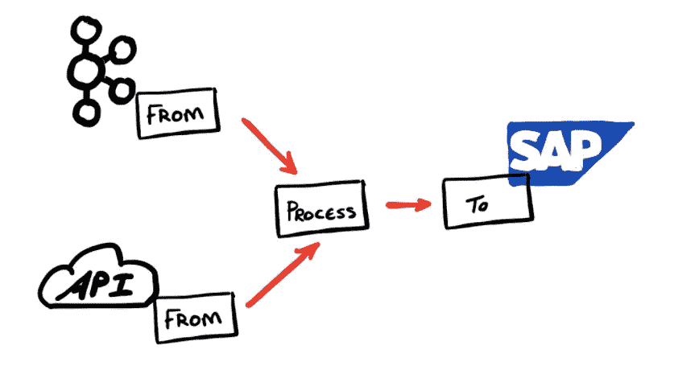
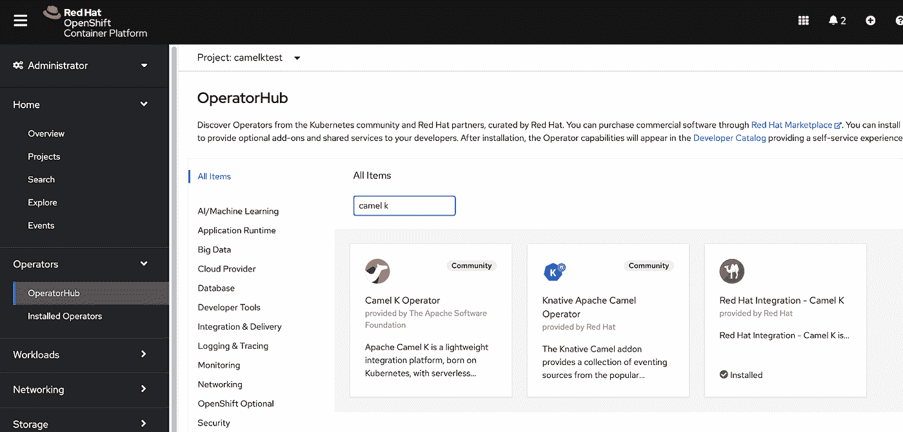

# 聪明的开发人员不编码

> 原文：<https://itnext.io/smart-developers-dont-code-2bf882568c37?source=collection_archive---------0----------------------->

或者，停止重新发明东西！


很久以前，当我还是一名年轻的初级开发人员时，有些事情就一直萦绕在我的脑海里。我当时正在开发一个应用程序的一部分，试图加快 web 应用程序中数据的访问速度。每次用户翻阅数据时调用数据库的第一次代码迭代。为了优化，我决定缓存最初返回的数据，这样就不会不断地返回数据库。明智之举。

所以，我花了几天时间想出了一个别人见过的最好的缓存 Java 代码的东西！我想出了复杂的算法来调用、存储、分页和驱逐这个用例的数据。

经过 5 天 5 夜的编码工作，我骄傲地见到了我的首席开发人员，并和他一起看了我的代码。我用算法的智慧迷惑了他。

令人困惑的是，我遇到的不是看到革命性的数据分页技术的祝贺，而是一声长叹和一个回顾的承诺。

第二天，领头的戴夫打电话给我说。"*我不知道你做了什么，但我已经删除了你所有的代码，只是将数据存储在一个列表中，这个列表会在每次新的搜索中刷新*"

他首先告诉我，我的代码被大规模过度设计，其次，他只是在做一些有模式和工具来解决相同问题的事情。

夹着尾巴，我接受了这一点，并上了我作为初级开发人员最大的一课，就像对后脑勺的重击！

**我在软件工程中最早学到的一课是——不要马上通过编码来解决问题！**


这让我想起了我最近与一位年轻开发人员的对话，他向我提出了他在 [Red Hat OpenShift](https://www.openshift.com/) 中使用代码的问题(声明:我在 Red Hat 工作)。在获得完整的细节后，他解释说，他已经编写了许多微服务，放在一堆 API 前面，这些 API 从各种来源读取数据，并根据来源对数据进行处理，然后发送到各个端点。他为自己为解决这个问题而构建的一套微服务感到非常自豪。有聚合器、翻译器和其他模式。

**我听着，叹了口气。**

我告诉他，这个解决方案真的很复杂，似乎有点过于复杂了！以一种礼貌的方式，我告诉他，人们已经解决了所有这些问题，而且解决了很多次。在这种情况下，我将他指向 Apache Camel，并告诉他，仅仅因为您正在构建微服务，并不意味着您需要构建微服务！

> **您正在构建微服务并不意味着您需要构建微服务！**

在这本书里，我们似乎总是认为我们需要重新发明一切。我完全支持改变我们使用技术方式的令人兴奋的新范例，但不是以扔掉东西为代价。


阿帕奇骆驼是许多不重复发明的例子之一！

我是 Apache Camel 的超级粉丝，无论是从集成者的角度还是从开源社区的成功角度来看。《骆驼》的故事是基于 Gregor Hophe 和 James Strachan 之间的对话。Gregor 写了集成圣经[企业集成模式](https://www.enterpriseintegrationpatterns.com/gregor.html)，这本书给了你作为一组模式的通用集成任务的设计… **你知道，所以你不需要重新发明相同的架构模式。**

James 是一名开源开发人员，也是 Groovy(该语言)的创始人，他和 Gregor 在一次会议上交谈，James 认为构建这些模式的可重用 Java 实现是一个不错的主意… **你知道，这样你就不必在需要做事情的时候写同样的代码**！Apache Camel 就是从这种对话中诞生的，它是一组实现集成模式的库。

# **回到我最近的对话！**

所以，我们看了一下 Red Hat Integration，它是 Apache Camel 加上一堆其他东西来部署和运行集成服务。我告诉他，他不仅可以做他需要的一切，而且这也符合他的微服务架构，看看 Camel K 等一些闪亮的新产品，他还可以让他的微服务得到服务…呃，无服务器！

> **无服务器集成微服务！！**

Camel K 是目前集成中最令人兴奋的东西。集成专家面临的一些最大挑战总是围绕着如何利用集成解决方案架构实现可伸缩性和可用性。像 CamelK 和 OpenShift 这样的工具正在处理这个问题的整个部署、运行和扩展方面。

Apache Camel 提供了模式和数百个适配器的实现。需要专业知识的事情是确定使用哪些连接器和模式，重要的是如何在可伸缩和可用的架构中部署组件以支持需求。

像 CamelK 这样的项目是一种新型的“kubernetes 本地”工具，它们希望利用 Kubernetes 的能力来利用 Kubernetes 平台的巨大规模和可用性。通过使用 Kubernetes 平台的强大功能，已经完成了定义和设计规模和可用性方面的一些困难工作…这样我就不需要重新发明规模和可用性了！

**什么是阿帕奇骆驼？**

好吧，就一个简单的问题，如果你以前没有看过[阿帕奇骆驼](https://camel.apache.org/)，那么它是一个令人敬畏的美丽的东西，它使连接和集成数百种不同的东西变得非常简单。

这是对阿帕奇骆驼的快速浏览。

1.  它提供了 60 多种集成模式的实现
2.  它有超过 350 个连接器
3.  太棒了

这是所有 camel 集成的基本前提。数据或调用来自某个地方的源，流入处理器执行某项操作，然后流向目的地。



FROM 和 TO 是 Camel 组件或适配器，用于连接从 AWS 本地服务到 CSV 文件到 SAP 到反应流再到 Kafka 连接器的各种技术…有 350 多个这样的组件！

**就这么简单！**

我要讲的一个故事是，Camel components 是展示开源软件社区和项目力量的绝佳方式。多年来，我一直是 Camel 的忠实粉丝，并且看到每个版本的组件数量都在增长。

**这就是开源的力量！**

发生的情况是，一个开发人员使用了 Camel，但是这个开发人员需要的组件在 Camel 中还不存在。因此，开发人员构建组件来解决他们的需求。作为一名优秀的开源公民，开发人员通过将该组件贡献回 Camel 源代码并包含在下一个 Camel 版本中来取悦 Camel 社区。现在，当您需要那个组件时，您不必构建它，因为它已经完成了…太棒了！

*有大量的资源可以帮助你了解骆驼，其中最好的一本是克劳斯·伊布松和乔纳森·安斯提的书，* [*骆驼在行动*](https://www.manning.com/books/camel-in-action) *这是骆驼的圣经。詹姆斯·斯特拉坎经常说他发明了骆驼，但是克劳斯让它工作了！也看看* [*汤姆·多诺霍的精彩文章*](https://tomd.xyz/camel-tutorial/) *关于骆驼的*

# **但是骆驼 K 呢！**

好的，我将很快向您展示一些很棒的东西(对像我这样的老集成黑客来说，这太棒了！).

我将用几行代码完成一个相当简单的集成任务。

我将创建一个[电报](https://telegram.org/)机器人，向电报通道发送补充信息。现在 Telegram 有一个 API 的负载，我可以用它来调用和发送消息到我可以使用的频道。

在 https://complimentr.com/[还有一项](https://complimentr.com/)[授权码](https://github.com/grantcodes)的赞美服务，它会回复赞美让你感觉良好:)


*哇，惊人的配色方案格兰特！*

现在，我想将这两种服务整合在一起，向我的电报朋友传递美好的问候。

那么，我要深入研究代码吗？

当然不是。快速浏览一下 [Apache Camel 连接器](https://camel.apache.org/camel-kafka-connector/latest/connectors.html)就可以发现，在我可以连接的大约 350 个不同组件中，我找到了 [Camel Telegram](https://camel.apache.org/components/latest/telegram-component.html) ，某个想要与 Telegram 通话的人已经写好了要连接的东西，这样我就不必再连接了**！**

一些常用的 Camel 组件将有助于对恭维服务的普通 HTTP 调用，我以一种轻率的方式说常用，因为实际上有一个 HTTP 组件可以处理我可能已经编码的所有事情，但是我不需要这样做！

因此，我将使用 [Camel Telegram](https://camel.apache.org/components/latest/telegram-component.html) 组件，接收来自机器人的消息，调用外部服务以获得称赞，然后将其发送回电报机器人。好吧，这不是最令人兴奋的事情，但也有一点乐趣

这是我想让机器人做的，发送一个名字，然后收到一个赞美。


我有一个可用的 kubernetes 集群，所以我将与 CamelK 一起使用。我正在使用 Red Hat OpenShift 和 CamelK 操作器进行设置。

这是我需要做的。

1 —下载 CamelK CLI。

2 —安装 CamelK 操作器

3 —运行我的代码

# 下载 CamelK CLI

因此，有大量的文章和文档在解释这一点，所以我不会进入大量的细节，但 CamelK CLI(或 kamel)本质上是您如何与 Kubernetes 平台(或更准确地说，平台上的 CamelK 自定义资源)进行交互，以部署集成(也有针对 VSCode 的 IDE 插件)。

CLI 使您能够安装 Camel K 操作符，以交互开发模式运行集成(运行集成代码的实时更新)等。

# **安装 CamelK 操作器**

CamelK 有许多 Kubernetes 运营商来构建、部署和运行集成。Kubernetes 操作符的全部意义在于抽象平台上运行的事物的复杂性，CamelK 在这方面做得非常好！因此，只需从 CLI 安装操作器

命令行使用:


或者，如果您正在 Openshift 中运行，那么您可以使用 Operators 选项卡来安装。



# **运行我的代码**

安装后，我现在可以从 IDE 或 CLI 将集成代码推送到我正在运行的 OpenShift 平台。

所以，让我们看看代码。请记住，我使用的是电报组件。查看组件，我只需要获取电报授权令牌并将其传递给组件，组件将读取来自机器人的消息。

```
from(“telegram:bots?authorizationToken=[YOUR TOKEN]”)
```

如果我添加一个简单的日志来查看路由的工作情况

```
from(“telegram:bots?authorizationToken=[YOUR TOKEN]”).to(“log:bots”)
```

我有两行代码。如果我将这些保存在一个名为 hello.groovy 的文件中，那么我就有了一个 groovy 脚本，它可以用作 CamelK 集成，将连接到我的 telegram bot，并将记录我键入的任何内容！

# **运行 hello.groovy**

这是最棒的部分。我希望我的两行 groovy 脚本作为可伸缩的集成组件部署和运行。这就是骆驼 K！从我的命令行，我只需运行:


使用 run 命令，我已经将我的两行 groovy 脚本转换成一个容器，在我的 OpenShift 集群上作为 Apache Camel route 部署和运行。

**什么是— dev 标志？**

添加— dev 标志后，我进入了一个奇怪的世界，在这里我可以对 hello.groovy 文件进行更改，这将自动反映在 OpenShift 集群中！让我的开发体验更加轻松。

# **完整的机器人**

您已经看到了 CamelK 有多棒，下面是我的“避免代码”groovy 脚本的其余部分。

```
from(“telegram:bots?authorizationToken=[YOUR TOKEN]”).setHeader(“USER”, body()).to(“https://complimentr.com/api?asGET=true “).transform().jsonpath(“\$.compliment”).setBody(simple("\${body} \${in.header.USER}”)).to(“telegram:bots?authorizationToken=[YOUR TOKEN]”)
```

*   我使用骆驼电报组件从电报通道接收消息
*   将名称作为标题隐藏在电报消息正文中发送
*   呼唤赞美 api
*   把原来的名字加到赞美词里
*   把赞美推回电报频道。

这是六行代码，通过重用组件来完成集成工作。

有一些非常出色的 Camel 集成模式，如聚合器、代理、动态路由，甚至更棒的 CamelK 东西，如无服务器、按需扩展到零的能力，这些都将帮助您不用编码！

聪明的开发人员不编码并不新鲜，它已经存在很久了。我们构建框架和工具的原因是为了将平凡的事情抽象化，从而更有效率。有时候，这是一个了解什么样的框架和工具可以帮助你不编码的案例。希望我已经给你们展示了另一个！


看看其他红帽人在[英国和爱尔兰社区网站](https://ukidevelopers.co.uk/)谈论什么