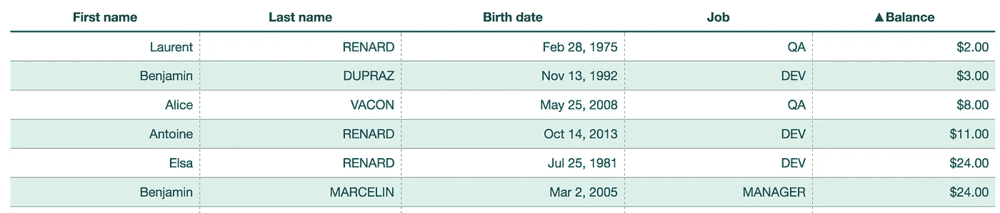
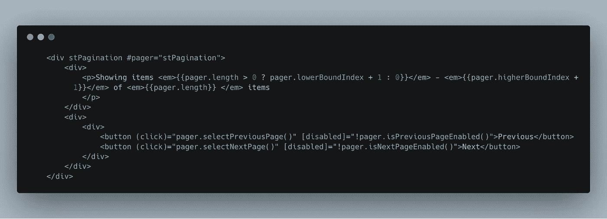
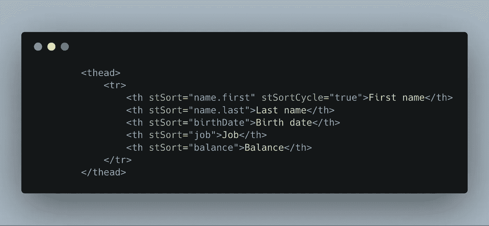
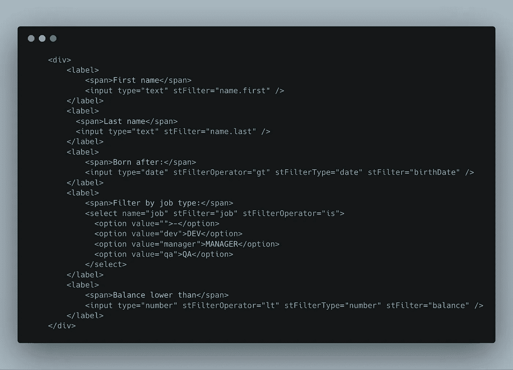

# 角度智能表—第 1 部分

> 原文：<https://itnext.io/smart-table-for-angular-part-1-515ef6cb2d0a?source=collection_archive---------4----------------------->



智能表格示例

[Angularjs 智能表格](https://github.com/lorenzofox3/Smart-Table)已经成为 angular js 社区在表格/网格组件方面的参考。[与其他流行的解决方案相比，它因其声明式方法和灵活性而受到称赞](https://stackoverflow.com/questions/21375073/best-way-to-represent-a-grid-or-table-in-angularjs-with-bootstrap-3#25734089)。

去年，利用我在这个项目中获得的经验，我创造了[智能桌面核心](https://smart-table.github.io/www/dist/)。我们的想法是提取您需要的逻辑来拥有一个智能集合，您可以用它来排序、过滤、搜索或创建分页和光标(在许多应用程序中非常常见的用例)。它没有绑定到任何 UI 框架，也没有绑定到表格/网格组件。事实上，我认为它更像是一个*交互式数据结构，*尽管创建表格/列表组件*非常方便。*

为了验证这个想法和设计，我很快为流行的 UI 框架创建了一些包装器( [Vanilla javascript、](https://github.com/smart-table/smart-table-vanilla) [React](https://github.com/smart-table/smart-table-react) 、[Vuejs](https://github.com/smart-table/smart-table-vue)——都附带了运行演示)。我还希望它专注于少数几个核心特性，使它非常轻量级，而它可以很容易地用常规的 Javascript 习惯用法如 mixins、decorators 等来扩展。这个需求也通过各种扩展得到了验证:

*   [smart-table-crud](https://github.com/smart-table/smart-table-crud) 扩展了数据结构 API 以提供 crud 功能。
*   [smart-table-perf](https://github.com/smart-table/smart-table-perf) 修饰了一种记录性能数据的方法。
*   [smart-table-server](https://github.com/smart-table/smart-table-server) 覆盖一个将业务逻辑移动到服务器的方法，而不对组件做任何更改。
*   [smart-tabler-virtualizer](https://github.com/smart-table/smart-table-virtualizer)使用智能表实例分页 API 来虚拟化一长串数据。

最近 [spudsoftware](https://www.spudsoftware.com/) 欣然同意赞助开发 [Angular](https://angular.io/) 框架的包装器，在这个系列中，我们将学习如何使用[新的 smart-table-ng](https://github.com/smart-table/smart-table-ng) 包来构建复杂的表格/列表组件。

该套装包括:

1.  一组工厂将帮助您创建可注入的服务。这些服务基本上是智能表核心实例，并将提供相同的 API。它们不同于它们所处理的数据源抽象。我们将在第二篇文章的[中探索当与有角度的内置抽象和模式相结合时，它会有多强大。](https://medium.com/@lorenzofox3/smart-table-for-angular-part-2-31ea5bd0c383)
2.  一组角度属性指令，帮助你以声明的方式快速创建表格/列表组件。我们将在第一篇文章中回顾这些指令。

# 辅导的

在第一个教程中，我们将创建一个组件来显示交互式用户列表。遵循下面的嵌入式 stackblitz，获得最终结果的运行示例。

[](https://stackblitz.com/edit/smart-table-ng-tutorial-1?embed=1&file=src/app/app.component.ts) [## smart-table-ng-tutorial-1-stack blitz

stackblitz.com](https://stackblitz.com/edit/smart-table-ng-tutorial-1?embed=1&file=src/app/app.component.ts) 

## 入门指南

一旦你安装了 smart-table-ng 包，不要忘记在你的根模块中导入***smart table module***。

在我们的教程中，我们将使用具有以下定义的用户列表:

```
interface Name {
  last: string;
  first: string;
}enum Job {
  ‘DEV’ = ‘dev’,
  ‘QA’ = ‘qa’,
  ‘MANAGER’ = ‘manager’
}interface User {
  name: Name;
  job: Job;
  birthDate: Date;
  balance: number;
}
```

你会注意到:

1.  ***名称*** 有嵌套属性
2.  ***作业*** 有一组有限的值(枚举)
3.  ***生日*** 是一种日期类型
4.  ***余额*** 是一个数字类型

我们的容器组件非常简单:

```
import { Component } from ‘@angular/core’;
import { SmartTable, of } from ‘smart-table-ng’;
import { users, User } from ‘./users’;const providers = [{ provide: SmartTable, useValue: of<User>(users)}];@Component({
  selector: ‘user-list’,
  templateUrl: ‘./user-list.component.html’,
  providers
})
export class UserListComponent {
}
```

您可能已经注意到了 ***提供者*** 字段。我们将在第二篇文章中讨论更多细节，但它基本上是使用已经定义为数组的用户列表创建一个作用于该组件的可注入智能表实例。

现在让我们看看我们的模板:

```
<div stTable #table=”stTable”>
  <div *ngIf="table.busy" class="loading-indicator">
    Loading...
  </div>
  <table>
    <thead>
      <tr>
        <th>First name</th>
        <th>Last name</th>
        <th>Birth date</th>
        <th>Job</th>
        <th>Balance</th>
      </tr>
    </thead>
    <tbody>
      <tr *ngFor=”let user of table.items">            <td>{{user.value.name.first}}</td>
        <td>{{user.value.name.last | uppercase}}</td>
        <td>{{user.value.birthDate | date}}</td>
        <td>{{user.value.job | uppercase}}</td>
        <td>{{user.value.balance | currency}} </tr>
    </tbody>
  </table>
</div>
```

这个模板使用了***【ST table】***指令，它允许你暴露一个模板变量***" # table】***

repeater 中使用的 ***项*** 指令属性将持有一个到当前显示用户的动态绑定。

***busy*** 属性是一个布尔值，它的值根据指令的繁忙状态而变化。例如，声明加载指示器是很有用的。在我们的例子中，它并不真正相关，因为所有的东西都是同步的。

## 页码

我们的用户列表实际上包含了一千个用户。把它们都显示出来是不明智的，所以我们要创建一个分页控件。我们只需要修改模板

```
<div stTable #table=”stTable”>
  <table>
    <thead>
      <tr>
        <th>First name</th>
        <th>Last name</th>
        <th>Birth date</th>
        <th>Job</th>
        <th>Balance</th>
      </tr>
    </thead>
    <tbody>
      <tr *ngFor=”let user of table.items">     <td>{{user.value.name.first}}</td>
        <td>{{user.value.name.last | uppercase}}</td>
        <td>{{user.value.birthDate | date}}</td>
        <td>{{user.value.job | uppercase}}</td>
        <td>{{user.value.balance | currency}}
      </tr>
    </tbody>
  </table>
  <div stPagination #pager="stPagination">
    <div>
      <p>Showing items <em>{{pager.length > 0 ? pager.lowerBoundIndex + 1 : 0}}</em> - <em>{{pager.higherBoundIndex +1}}</em> of <em>{{pager.length}} </em> items
      </p>
    </div>
    <div>
      <button (click)="pager.selectPreviousPage()" [disabled]="!pager.isPreviousPageEnabled()">Previous</button>
      <button (click)="pager.selectNextPage()" [disabled]="!pager.isNextPageEnabled()">Next</button>
    </div>
  </div>
</div>
```

如果您关注分页部分:



使用 stPagination 指令截取的代码

我们使用***【stPagination】***属性指令，借助变量 ***"#page"*** ，允许我们向模板公开分页 API。

特别是，我们可以访问以下属性:

*   ***长度*** :当前显示页面的长度。
*   ***lowerBoundIndex***和***higher boundindex***帮助我们将当前页面框在整个列表里面。

和方法

*   ***isPreviousPageEnabled***和***isNextPageEnabled***分别绑定到按钮元素的***【disabled】***属性。
*   ***选择上一页*** 和 ***选择下一页*** 允许我们分别选择上一页和下一页(如果有的话)。

page 指令还附带了上述代码片段中未使用的方法:

*   ***selectPage*** 方法直接选择给定页面。
*   ***Chang pagesize***如果您希望更改每页显示的项目数。

## 排序指令

***stSort*** 指令允许我们通过点击 HTML 元素来对数据进行排序。让我们修改模板，重点放在标题行上

```
<thead>
  <tr>
    <th stSort=”name.first” stSortCycle=”true”>First name</th>
    <th stSort=”name.last”>Last name</th>
    <th stSort=”birthDate”>Birth date</th>
    <th stSort=”job”>Job</th>
    <th stSort=”balance”>Balance</th>
  </tr>
</thead>
```



使用 stSort 指令的代码段

***stSort*** 属性指令被设置为一个*路径指针*字符串，指向对项目进行排序所依据的属性。它可以是一个*嵌套属性*，正如您在名字和姓氏标题中看到的。

单击时，标题会切换相关列的排序方向。如果您希望在第三次点击时取消排序方向而不是改变其方向，您可以添加 ***stSortCycle*** 属性。

该指令还根据排序方向向主机添加/删除一个 *css* 类名(*ST-sort-ASC*/s*t-sort-desc*)。

## 搜索项目

智能表格具有基本的全文搜索功能。您可以使用 ***stSearch*** 指令让输入元素搜索您的项目。让我们看看我们的模板:

```
<div stTable #table=”stTable”>
  <div>
    <label>
      <span>Search</span>
      <input type=”search” stSearch=”name.first, name.last, job”>
    </label>
  </div>
  <table>
...
  </table>
...
</div>
```

***stSearch*** 属性指令以逗号分隔的路径指针列表*作为参数，这些路径指针*指向您希望进行搜索的项目的属性。

该输入将以给定的去抖时间触发搜索，以确保搜索被有效地触发，并避免额外的无用调用(例如，当连接到服务器时)。您可以使用***stDebounceTime***属性修改去抖时间(值以毫秒为单位)。

输入是一个正则表达式模式。您可以通过***stSearchFlags***属性提供标志。如果出于某种原因，你想对 regexp 输入中的特定字符进行转义，你可以使用***stSearchEscape***属性。

## 过滤项目

全文搜索很好，但有时您希望对筛选项目的方式进行精细控制。 ***stFilter*** 属性指令在大多数情况下会满足您的需求:它使输入元素(或选择元素)成为您的数据收集的过滤控件。

我们现在的模板是:

```
<div stTable #table=”stTable”>
  <div>
  ... <label>
      <span>First name</span>
        <input type=”text” stFilter=”name.first” />
    </label>
    <label>
      <span>Last name</span>
      <input type=”text” stFilter=”name.last” />
    </label>
    <label>
      <span>Born after:</span>
      <input type=”date” stFilterOperator=”gt” stFilterType=”date” stFilter=”birthDate” />
    </label>
    <label>
      <span>Filter by job type:</span>
      <select name=”job” stFilter=”job” stFilterOperator=”is”
        <option value=””>-</option>
        <option value=”dev”>DEV</option>
        <option value=”manager”>MANAGER</option>
        <option value=”qa”>QA</option>
      </select>
    </label>
    <label>
      <span>Balance lower than</span>
      <input type=”number” stFilterOperator=”lt” stFilterType=”number” stFilter=”balance” />
    </label>
  </div>
  <table>
...
  </table>
...
</div>
```



stFilterType 指令的代码段

***stFilter*** 属性指令的值是一个路径指针，指向要用于过滤器的属性。同样，您可以拥有嵌套属性。

该指令将认为值类型默认为一个*字符串。*但是您可以通过 ***stFilterType*** 属性来更改类型。该值可以是*数字*、*布尔*、*日期*(或字符串)之一。

同样的，判断一个条目是否匹配的默认操作符是*“includes”*(对于字符串)。可通过***stFilterOperator***属性将其更改为以下之一:

*   *是*:严格相等(===)
*   *isNot* :对“是”的否定(！==)
*   *lt* :低于(<)
*   *gte* :大于等于(> =)
*   *gt* :大于(>)
*   *lte* :小于等于(< =)
*   *等于*:宽松等式(==)
*   *notEqualS* :“等于”的否定(！=)

更多详情，请参见[智能表核心文档](https://smart-table.github.io/www/dist/filter.html#factory)。

这些不同属性的各种组合会给你很多可能性。

同样，在过滤器操作被触发之前有一个去反跳时间，您可以通过 **stDebounceTime** 属性修改这个去反跳时间

# 结论

**Smart-table-ng** 非常有助于以**完全声明的方式快速创建一个非常复杂的列表控件。**然而你的数据集不太可能是一个静态数组，在[下一篇教程](https://medium.com/@lorenzofox3/smart-table-for-angular-part-2-31ea5bd0c383)中，我们将探索一些非常有趣的模式，包括抽象的**可观察的**和 Angular 框架附带的**依赖注入**的设计。

智能餐桌的发展仍在继续，在不久的将来你可能会看到一些突破性的变化。我还要感谢[*spud software*](https://www.spudsoftware.com/)*在开发过程中对我的赞助。*


spudsoftware 徽标