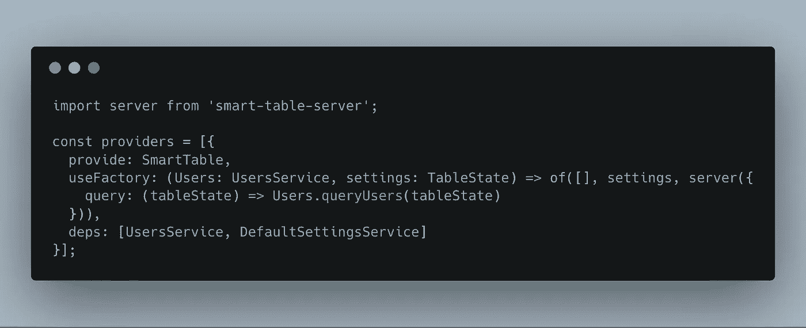

# 角度智能表—第 2 部分

> 原文：<https://itnext.io/smart-table-for-angular-part-2-31ea5bd0c383?source=collection_archive---------8----------------------->

在上一部分中，我们已经成功地以完全声明的方式创建了一个智能表格组件。在这一部分中，我们将探讨如何将工厂与角度依赖注入一起使用，以完成不同的需求。

大多数**智能表-ng** 属性指令依赖于注入的智能表实例。幸运的是，一旦在我们的组件层次结构中提供了实例，Angular 就会在任何需要的地方为我们注入实例。

在我们之前的教程中，由于“ 工厂的 ***”，实例是从一个静态数组创建的，并在用户表容器组件中提供。***

```
import { Component } from ‘@angular/core’;
import { SmartTable, of, SortDirection } from ‘smart-table-ng’;
import { users, User } from ‘./users’;const providers = [
  {provide: SmartTable, useValue: of<User>(users)}
];@Component({
  selector: ‘user-list’,
  templateUrl: ‘./user-list.component.html’,
  providers
})export class UserListComponent {
}
```

## 异步获取数据

> 作为一名开发人员，我希望在将数据插入智能表之前从服务器异步加载数据。

数据通常不会在运行之前可用，您更有可能将从服务器获取数据的责任委托给一个专用的服务。考虑下面的服务。

```
import { Injectable } from ‘@angular/core’;
import { users, User } from ‘./users’;@Injectable({
  providedIn: ‘root’
})
export class UsersService {

  fetchUsers(): Promise<User[]> {
    return new Promise(resolve => {
      setTimeout(() => resolve(users), 2000);
    });
  }}
```

该服务公开了一个***fetchUsers****，其中返回一个承诺，该承诺最终将与用户列表一起解析。这里的实现是一个细节，但是通过使用两秒钟的超时伪造了到服务器的往返。*

*好的一面是我们根本不需要改变组件，我们只需要改变智能表格的提供方式。*

```
*import { Component } from ‘@angular/core’;
import { SmartTable, from } from ‘smart-table-ng’;
import { UsersService } from ‘./users.service’;const providers = [{
  provide: SmartTable,
  useFactory: (Users: UsersService) => from(Users.fetchUsers()),
  deps: [UsersService]
}];@Component({
  selector: ‘user-list’,
  templateUrl: ‘./user-list.component.html’,
  providers
})
export class UserListComponent {
}*
```

*我们现在用的是*智能表厂。我们使用 angular[factory provider](https://angular.io/api/core/FactoryProvider)模式，这样我们可以要求注入器向负责创建智能表实例的函数注入可用的 UsersService。**

**[](https://stackblitz.com/edit/smart-table-ng-tutorial-1?embed=1&file=src/users/user-list.component.ts) [## smart-table-ng-tutorial-1-stack blitz

### 本教程展示了如何使用基于 Promise 的 API 从服务器加载数据

stackblitz.com](https://stackblitz.com/edit/smart-table-ng-tutorial-1?embed=1&file=src/users/user-list.component.ts) 

> 但是我的服务依赖于一个 HttpClient，它使用了一个基于 Observables 的 API

角度框架在很大程度上依赖于可观察的抽象。当涉及到产生和消费随时间产生的多个值时，Observables 非常方便，但是它也可以用于处理异步代码。这就是 [HttpClient](https://angular.io/guide/http) 所做的事情。

让我们改变我们的服务，让它使用一个基于可观察的 API 和一个后端的假交互。

```
import { Injectable } from ‘@angular/core’;
import { users, User } from ‘./users’;
import { of, Observable } from ‘rxjs/index’;
import { delay } from ‘rxjs/operators’;@Injectable({
  providedIn: ‘root’
})
export class UsersService {

  fetchUsers(): Observable<User[]> {
    return of(users)
      .pipe(delay(2000));
  }}
```

同样，这里的实现是一个细节，只是帮助我们假装与服务器交互。

来自 工厂的智能表 ***对承诺起作用，但也对可观察到的东西起作用，所以**我们没有什么要改变的** e***

## 为我们的指令使用默认值/初始值

> 我希望我的用户在默认情况下按 balance 属性排序。我还想过滤掉所有余额高于 2000 美元的用户，这样我就可以优先关注余额较低的用户。

在某些情况下，您可能希望将默认设置应用到智能表，或者从存储系统(如区域存储)恢复以前的状态。

的 ***和*** 工厂的 ***都将初始[表状态](https://smart-table.github.io/www/dist/table-state.html)作为第二个自变量。***

让我们改变我们的提供商来满足我们的用户故事的需求。

```
import { Component } from ‘@angular/core’;
import { SmartTable, from } from ‘smart-table-ng’;
import { UsersService } from ‘./users.service’;const providers = [{
  provide: SmartTable,
  useFactory: (Users: UsersService) => from(Users.fetchUsers(),{
    search: {},
    slice: { page: 1, size: 10 },
    filter: {
      balance: [{ operator: ‘lt’, type: ‘number’, value: 2000 }]
    },
    sort: {
      pointer: ‘balance’,
      direction: ‘asc’
    }}),
    deps: [UsersService]
 }];@Component({
  selector: ‘user-list’,
  templateUrl: ‘./user-list.component.html’,
  providers
})
export class UserListComponent {
}
```

细心的读者会注意到我们使用了一个*硬编码的*初始表状态。但是我们可能需要它作为对注入器的依赖，或者从专用服务中获取它。类似于:

```
const providers = [{
  provide: SmartTable,
  useFactory: (Users: UsersService, config: SmartTableConfigService) => from(Users.fetchUsers(),config.getFor('users')),
    deps: [UsersService, SmartTableConfigService]
 }];
```

在下面的 stackblitz 中可以看到类似的方法:

[](https://stackblitz.com/edit/smart-table-ng-tutorial-2c?embed=1&file=src/users/user-list.component.ts) [## 智能表-ng-教程-2c - StackBlitz

### 导出到 Angular CLI 的 Angular 应用程序的启动项目

stackblitz.com](https://stackblitz.com/edit/smart-table-ng-tutorial-2c?embed=1&file=src/users/user-list.component.ts) 

这就是依赖注入的美妙之处，我们可以非常容易地交换提供的实体，并保持我们的组件/服务松散耦合。

## 将整个逻辑移至服务器

> 很好，但是我们的数据集已经显著增长，在用户的浏览器中加载所有数据已经没有意义了。我们的后端团队刚刚完成了处理过滤、搜索、排序和分页的灵活端点的开发。我想，我将不得不改变我的组件。

而答案是**没有**！

如果你读过之前的教程或[智能表核心](https://smart-table.github.io/www/dist/extend.html)文档，你就会知道智能表核心实例可以很容易地扩展，而且已经有相当多的扩展可用。幸运的是，我们可以在 smart-table-ng 中使用这些扩展(或者构建我们自己的扩展)。对于我们的用例，我们可能需要[智能表服务器](https://github.com/smart-table/smart-table-server)扩展。

> 注意:smart-table-server 扩展更多的是概念验证，但是您可以基于这个模型开发自己的服务器接口。

所以让我们回顾一下我们的组件文件。

```
import { Component } from '@angular/core';
import { SmartTable, of, TableState } from 'smart-table-ng';
import { UsersService } from './users.service';
import { DefaultSettingsService } from './default-settings.service';
import server from 'smart-table-server';const providers = [{
  provide: SmartTable,
  useFactory: (Users: UsersService, settings: TableState) => of([], settings, server({
  query: (tableState) => Users.queryUsers(tableState)})),
  deps: [UsersService, DefaultSettingsService]
}];
@Component({
  selector: 'user-list',
  templateUrl: './user-list.component.html',
  providers
})
export class UserListComponent {
}
```

专注于提供者部分。



提供者部分的代码片段

我们使用“ 智能表工厂的 ***”和一个空数组(实际上我们没有任何数据集，因为一切都将在服务器端完成)。第二个参数保持默认的表状态。然后你可以像处理[智能表格核心](https://github.com/smart-table/smart-table-core/)包一样传递一个智能表格扩展列表。***

在我们的例子中，我们使用智能表服务器扩展，它需要一个具有查询功能的对象作为参数。这个查询功能依赖于注入的 *UsersService。**query users*函数的实现与我们的教程无关，但在实践中，它应该将表状态转换为服务器可以理解的查询，并解析响应，以智能表可以理解的格式转换数据。

您可以在下面的 stackblitz 中看到结果:

[](https://stackblitz.com/edit/smart-table-ng-tutorial-2d?embed=1&file=src/users/user-list.component.ts) [## 智能表格-ng-教程-2d - StackBlitz

### 导出到 Angular CLI 的 Angular 应用程序的启动项目

stackblitz.com](https://stackblitz.com/edit/smart-table-ng-tutorial-2d?embed=1&file=src/users/user-list.component.ts) 

## 结论

在本教程中，我们建立在我们在上一个教程中开发的组件之上。使用智能表工厂和依赖注入，我们能够满足广泛的不同需求… **而无需更改组件中的一行代码。**

在下一集，我们将使用 Observables 来探索更高级的用例。

智能餐桌的发展仍在继续，在不久的将来你可能会看到一些突破性的变化。我还要感谢[*spud software*](https://www.spudsoftware.com/)*在开发过程中对我的赞助。*


spudsoftware 徽标**