# SMI:Kubernetes 上服务网格的灵活性和互操作性

> 原文：<https://itnext.io/smi-flexibility-and-interoperability-with-the-service-meshes-on-kubernetes-8cd88a4d8238?source=collection_archive---------5----------------------->

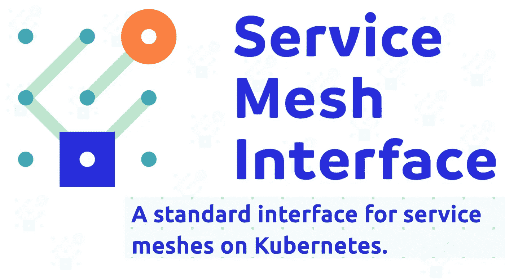

服务网格接口:服务网格的标准

像 CNI(容器网络接口)、CRI(容器运行时接口)、CSI(容器存储接口)和现在的 SMI(服务网格接口)这样的 Kubernetes 接口允许他们目标技术的多种底层实现。这使得相互竞争的供应商能够在一个公平的环境中创建特定的解决方案，并有助于防止用户被某个特定的解决方案所束缚。结果是竞争加剧，创新更加迅速；这对用户都有好处。这里的用户大多是指开发人员，尽管有多种选择，但仍需要一种可移植的 API 来以与提供者无关的方式使用，其中 SMI 提供的互操作性可以帮助与现有网格提供者集成的工具和实用程序的新兴生态系统。

微软和其他参与公司的 SMI 建立在维护公共 API 基线的行业概念之上，以支持容器生态系统中的可组合性和创新。定义一个可由各种提供商实施的通用标准，帮助他们实现最终用户的标准化和服务网格提供商的创新。SMI 旨在成为一个生态系统友好的解决方案，为用户使用和构建服务网格技术提供一致的 API。

# **服务网格接口——规范和 API 概述**

服务网格接口(SMI)规范包括四个 API 对象。有流量规格、流量目标、流量分割和流量指标。每个 API 对象都被扩展为 Kubernetes CRD(自定义资源定义)。

## 流量规格

一组资源，便于用户基于每个协议指定/定义流量结构。该资源定义了构建访问规则所需的基本流量结构。这些资源与访问控制配置协同工作/使用，以在协议级别管理流量。在这个规范中有两个实体(HTTP 和 TCP 路由),用户可以将流量与特定的协议 1:1 匹配。

## HTTPRouteGroup

该资源使用户能够描述 HTTP/1 和 HTTP/2 流量。

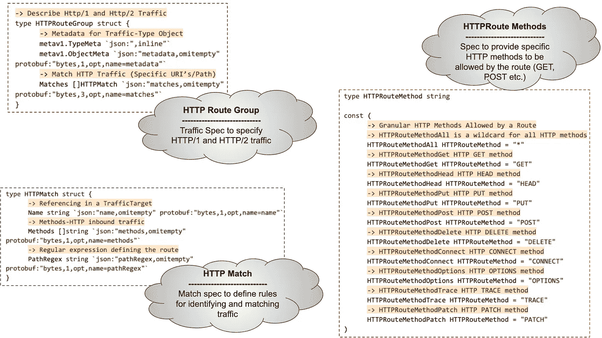

HTTP 路由组—分类/定义 HTTP1 和 HTTP2 流量

如下所示，使用 CRD 使一个 HTTPRouteGroup API 规范对 Kubernetes 可用，流量规范配置包括一个匹配规则:一个定义结构(路径等)的正则表达式。)和一个方法:http 方法(GET、POST、PUT 等。)

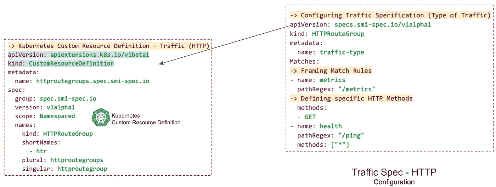

HTTP 路由组-Kubernetes CRD 和配置

## TCP 过程

用于描述 L4 TCP 流量的资源。这是一个简单的路由，它将应用程序配置为接收原始的非协议特定流量。

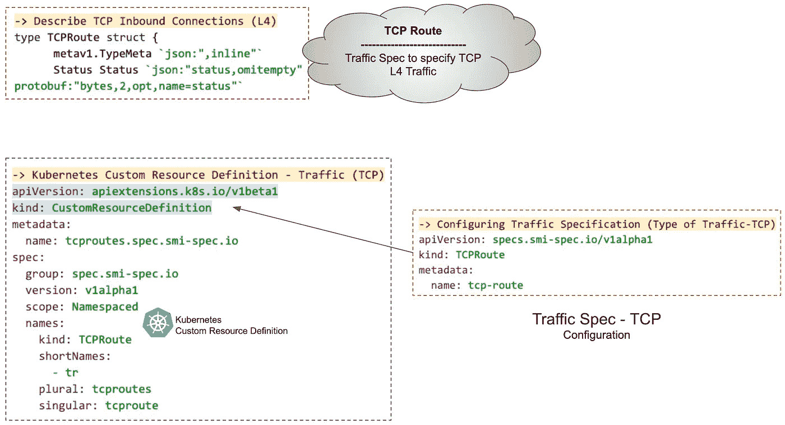

TCP 路由—分类/定义 TCP 流量(L4)和相应的 Kubernetes CRD &配置

流量规范定义了访问策略中使用的流量类型。访问规则是使用上面的流量结构定义的。

# 交通访问控制

流量访问控制资源用于定义应用程序的访问控制策略。有了这些资源，用户可以实现粒度策略规则，以允许使用服务帐户+选择器的服务之间的通信。

*   访问控制属于授权范畴，默认认证由底层实现处理(服务网格提供者，如 Istio、Linkerd、Consul、Maesh 等。).例如，Istio 使用 RBAC 创建 ServiceRole 和 ServiceRoleBinding 来提供授权。
*   SMI 规范中的访问控制是附加的，默认情况下**所有流量**都被**拒绝**。

## **流量目标规格**

TrafficTarget 规范—流量访问控制

流量访问控制有三个概念，每个概念都是通过 TrafficTarget 使用三个字段定义的:

1.  **Source** :流量的来源，反映在具体的 Pod 列表中(由选择器选择/分组)。目前，只有使用 ServiceAccount 的选择器支持它。目前不支持资源选择(如指定部署、指定服务)。
2.  **目的地**:流量的目标也反映在特定的 Pod 列表中(由选择器选择/分组)。目前，它还只支持使用带有 ServiceAccount 的选择器。
3.  **路由**:流量规范(HTTPRouteGroup，TCPRoute)，用于区分目的地提供的不同接入方式。

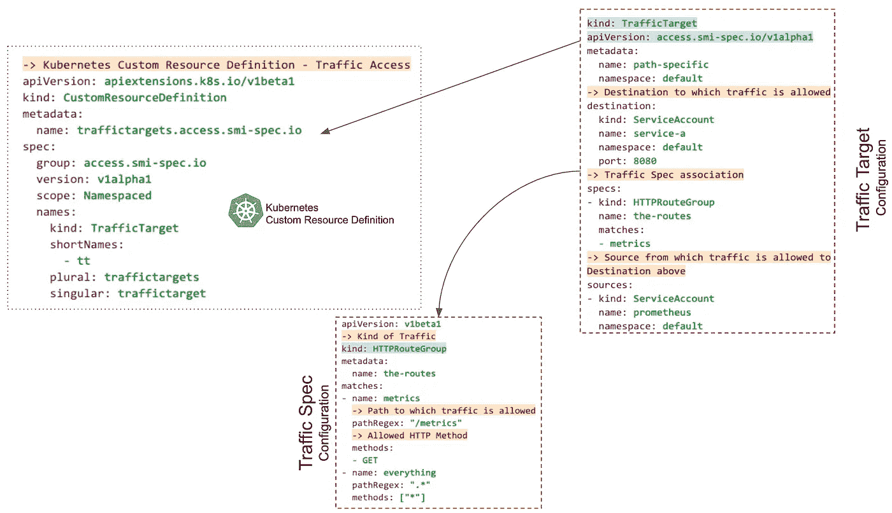

交通目标配置和相关的 Kubernetes

例如，假设一个应用程序中有三组不同的服务:网站服务、支付服务(核心应用程序服务)和 prometheus(度量服务)，用户希望定义访问控制策略来控制特定于应用程序(api)的服务通信和特定于应用程序的度量通信。

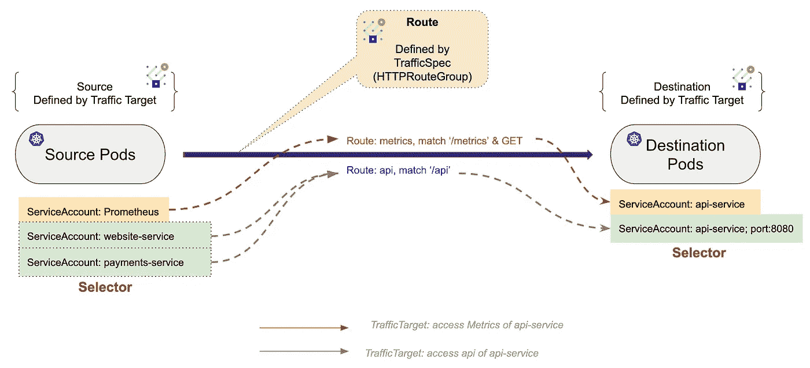

交通访问控制图解— SMI

上述场景需要两个允许的访问控制策略(TrafficTargets)，一个用于定义 web 和支付服务之间的 api 通信，另一个用于定义 prometheus 与 web 和支付服务的通信。创建以下规则集的示例工作流如下所示:

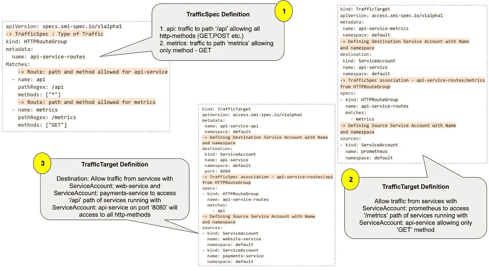

流量访问控制配置工作流

上述配置定义了两个访问控制规则:

1.  对于将 ServiceAccount 作为 api-service 运行的 pod，允许由 serviceAccount 作为 prometheus 的 pod 定义的 api-service-routes 中的度量路由
2.  对于使用 ServiceAccount 作为 api-service 运行的 pod，允许使用 serviceAccount 为网站服务和支付服务定义的 api-service-routes 中的 api 路由

将上述规则翻译成更简单的术语:

*   允许使用 ServiceAccount prometheus 运行的服务访问使用 ServiceAccount api-service 运行的服务的指标。
*   允许使用 ServiceAccount web-service 和 payment-service 运行的服务访问使用 ServiceAccount api-service 运行的服务的 api。

## 交通分流

流量分流资源用于实现同一应用程序不同版本的流量百分比分流。这是由像 Istio 这样的服务网格提供商提供的服务网格的流行/普遍特征集之一。然而，SMI 中流量分流的配置与 Istio 中的配置有很大不同。

流量分割包括三个概念:根服务:流量起始点；后端服务:根服务的子集；权重:控制流向每个后端服务的流量。

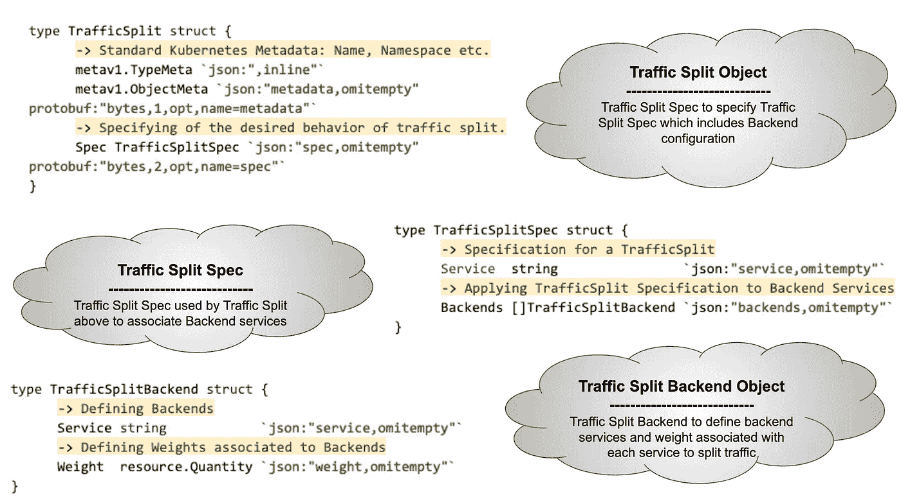

流量分流规范—流量分流

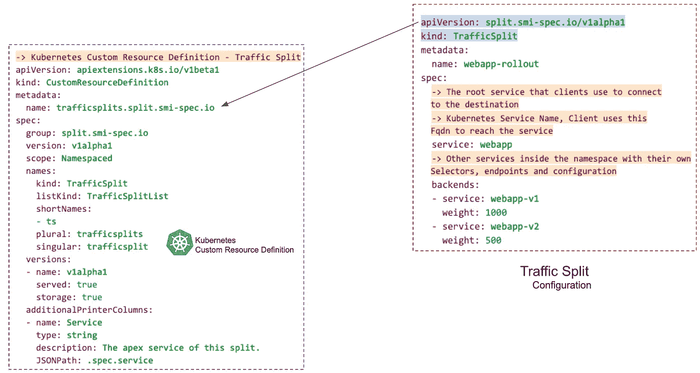

交通分流配置和相关的 Kubernetes

如上所示，流量分流配置需要一个根服务:webapp 和后端服务“webapp-v1”和“webapp-v2 ”,每个都有特定的权重。

例如，在一个用户拥有两个版本的 web 应用程序(v1 和 v2)的设置中，作为更新版本 SMI 流量分流配置的一部分，可以如下所示进行配置:

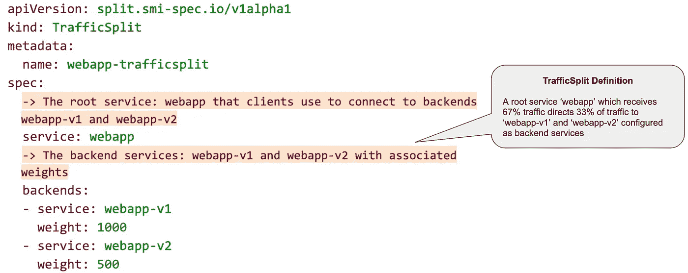

流量分流配置— Webapp — v1 和 v2 各占 50%的权重

*   “webapp”:在“spec.service”中指定的是根服务，根服务 FQDN 用作目标服务。
*   “webapp-v1”和“webapp-v2”是根服务背后的两个后端服务，通常是根服务的子集。

上述流量分流配置导致 33%的流量流向 webapp-v2(基于每个客户端)。权重可以是使用 SMI-TrafficSplit 的相对权重(例如，可以设置为 1:2 ),这与 Istio 不同，后者是一个严格的百分比，要求总计为 100。

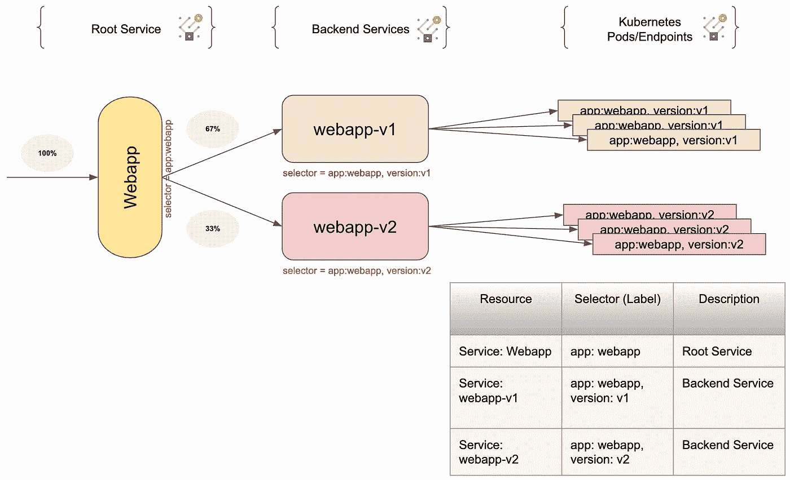

交通分流图— SMI

SMI TraffilcSplit 规则将大约 33%的流量重定向到“webapp-v2 ”,这是基于每个客户端的，而不是针对所有发往这些后端的请求的全局，因为这些后端可以接收来自其他 Kubernetes 服务的流量。

## SMI 与 Istio 中的流量分配(差异)

Istio 中的上述相同配置需要一个 VirtualService 和一个 DestinationRule，其中 DestinationRule 定义了区分不同流量目的地的子集。

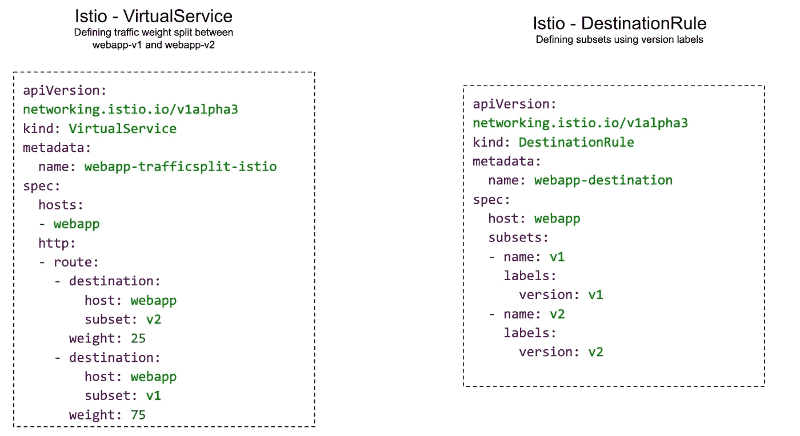

Istio 配置与 SMI 配置—流量分流

如上所述，SMI 中的后端服务和 Istio 中的子集在功能上几乎是等同的，但是 SMI 和 Istio 之间的根本区别在于，Istio 中的子集是一个虚拟的抽象对象，而 k8s 中没有物理资源。在 SMI 中，后台服务是真正的 k8s 服务资源。与 Istio 相比，SMI 需要额外的配置对象来拆分流量，用户必须为每个版本建立单独的 k8s 服务。

另一个是权重设置的细微差别。SMI 使用相对权重(例如，它可以设置为 1:2，就像上面 TrafficSplit -1000，500 中所示的那样)，而 Istio 是一个严格的百分比，需要总计 100。

## 流量指标

度量资源为工具提供了一个公共集成点，这些工具可以通过使用与 HTTP 流量相关的度量而受益。对于 CLI 工具、HPA 扩展或自动化 canary 更新可以使用的即时指标，它遵循`metrics.k8s.io`的模式。

指标与'*资源'*相关联。这些可以是 pod，也可以是更高级别的概念，如名称空间、部署或服务。除了资源，指标的范围还包括'*边'*。边代表流量的来源或目的地。这些边缘将度量限制为仅在`resource`和`edge.resource`之间的流量。`edge.resource`既可以笼统，也可以具体。在大多数情况下，一个空白的`edge.resource`将包含`resource`收到的所有流量的度量。

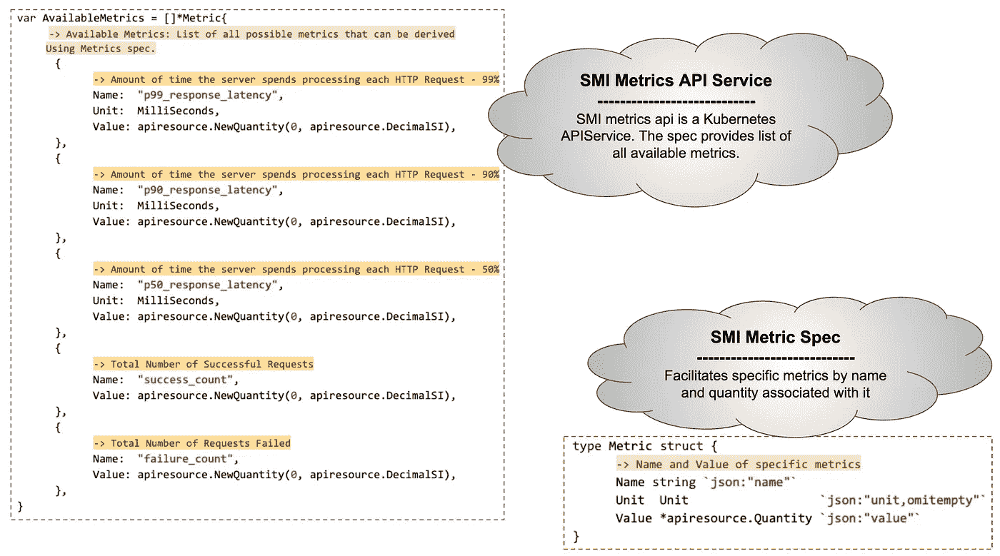

SMI —流量度量规范

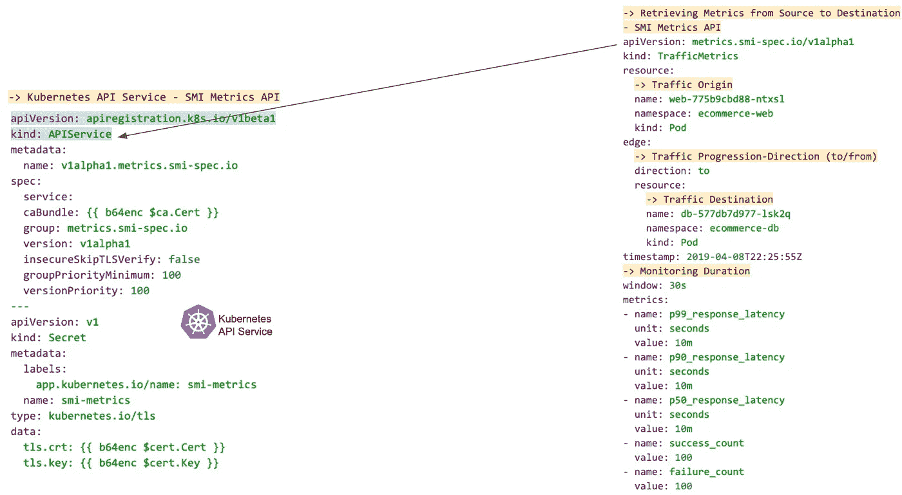

SMI —流量度量 CRD 和配置

# SMI 适配器

SMI 使服务网格提供商能够创建适配器，该适配器将 SMI 规范转换为平台特定的配置。这些是 Kubernetes 运营商，它们实施服务网格接口(SMI) [流量分割](https://github.com/deislabs/smi-spec/blob/master/traffic-split.md)、[流量访问控制](https://github.com/deislabs/smi-spec/blob/master/traffic-access-control.md)和[流量规格](https://github.com/deislabs/smi-spec/blob/master/traffic-specs.md)API，以配合供应商特定的服务网格实施。

SMI 定义了一组 CRD，当构建工具或使用像 Istio 这样的服务网格实现时，允许在其上构建一组公共接口。SMI 围绕那些通常定义的 CRD 构建逻辑，专门与 Istio 和其他提供者一起工作。多个供应商，如 Linkerd、Istio、Consul、Weave-Flagger 等。提供集成的适配器，以便与 SMI 配合使用。

# 试用— Istio SMI 适配器

Istio 的 SMI 适配器包括创建一个运营商(Kubernetes 部署)和所需的 CRD(流量目标、流量分流等。).

istio 适配器作为 Kubernetes 部署部署在 istio-system 名称空间中，如下所示，并不断轮询集群中创建的任何特定于 SMI 的对象，将其转换为 Istio 配置。

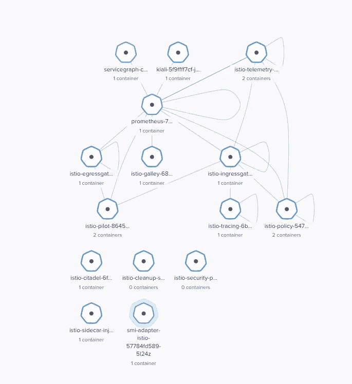

SMI-适配器-istio 部署 Kubernetes

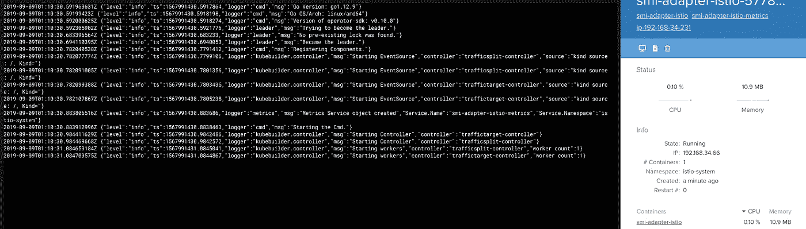

smi-adpater-istio 轮询配置对象

以 Istio 的传统 bookinfo 应用程序为例，检查如何使用 SMI adapter for Istio 管理 SMI 配置。Bookinfo 应用程序部署在标记为“istio-injection=enabled”的“default”命名空间中，并且创建了所需的 DestinationRules 和 VirtualService，以使用 RBAC 规则集访问 bookinfo 应用程序。

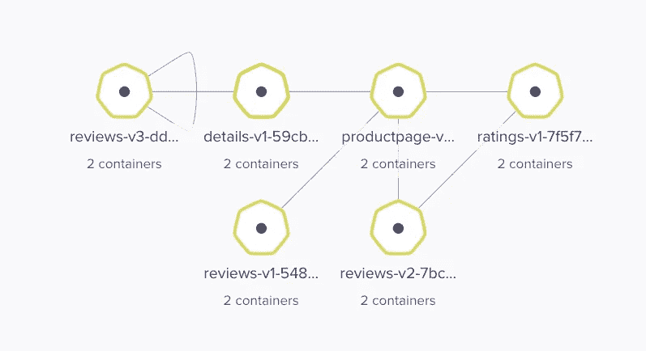

Bookinfo 应用程序示例

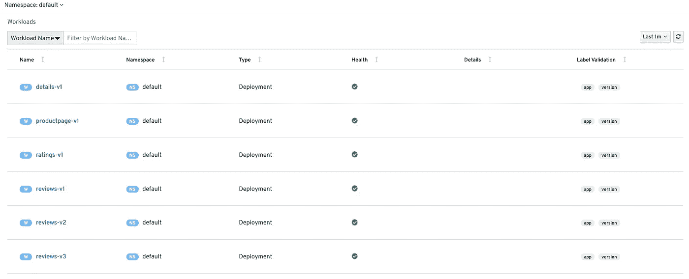

Bookinfo 应用程序个人服务

RBAC 在默认命名空间上配置有显式 productpage 策略，以允许访问创建的 productpage:

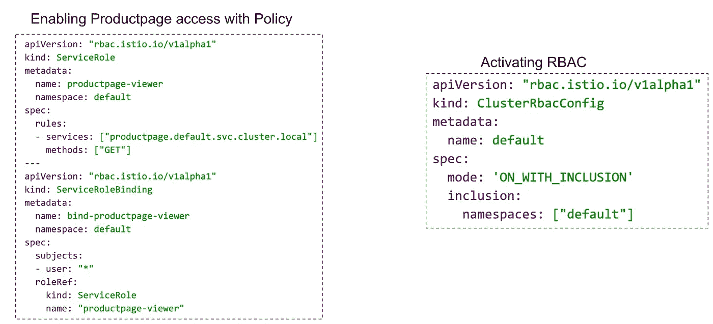

RBAC 激活和产品策略服务角色配置

如下所示，上面创建的 RBAC 和策略配置将服务角色和服务角色绑定配置到 productpage 服务。

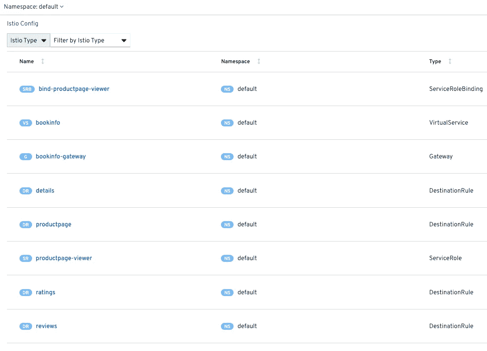

Istio 目的地规则和虚拟服务

由于 ServiceRole 和 ServiceRoleBinding 只为 productpage 创建，默认情况下禁止所有其他服务通信，因为 Istio 授权是“默认拒绝”，这意味着用户需要显式定义访问控制策略来授予对任何服务的访问权限。

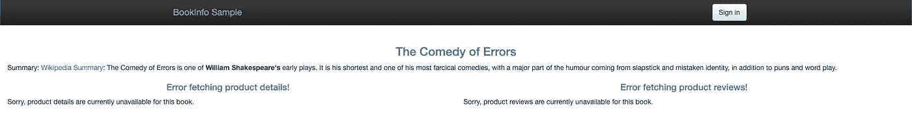

Productpage 无法检索详细信息和评论

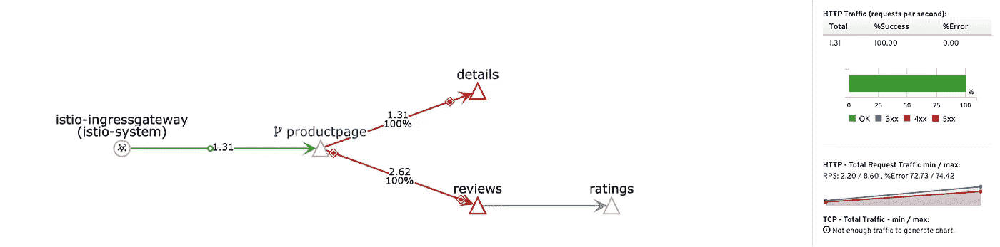

Productpage 无法检索详细信息和评论

## 流量访问控制— SMI Istio 适配器

使用 SMI 规范创建初始访问控制配置，以允许 bookinfo 应用程序中所有服务之间的流量，如下所示:

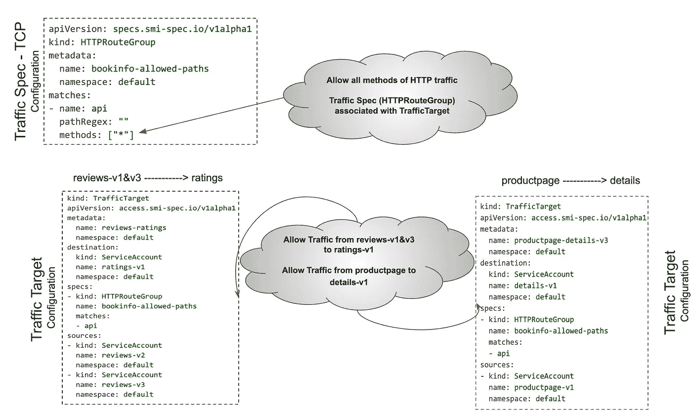

交通访问控制配置— Bookinfo 示例应用程序

定义了一组其他三个特定的流量目标，以允许从“产品页面”到“评论-v1”、“评论-v2”和“评论-v3”的流量，如下所示:

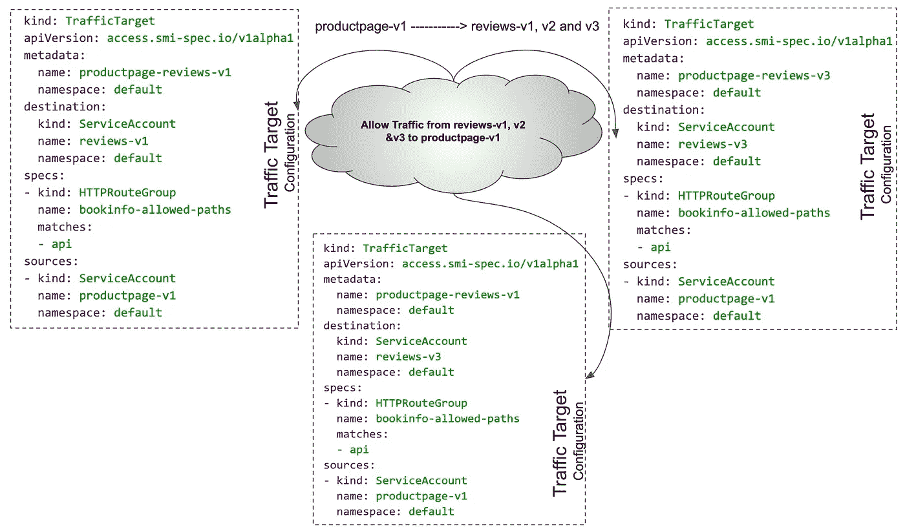

TrafficTarget 配置允许从产品页面到 reviews-v1、v2 和 reviews-v3 的流量

创建上述配置时，Istio 的 SMI adapter(operator)识别集群中创建的 SMI 特定对象，如下所示:

> httproutegroup.specs.smi-spec.io/bookinfo-allowed-paths 创造
> traffictarget.access.smi-spec.io/productpage-reviews-v1 创造 traffictarget.access.smi-spec.io/productpage-reviews-v2 创造
> traffictarget.access.smi-spec.io/productpage-reviews-v3 创造【T2 创造
> traffictarget.access.smi-spec.io/reviews-ratings 创造

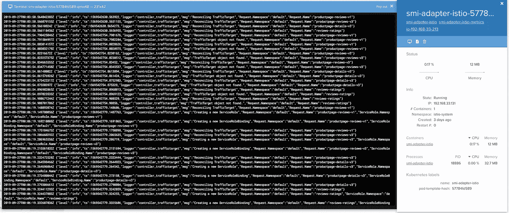

smi-adpater-istio 轮询配置对象

这将为应用程序中的所有服务创建 ServiceAccount 和 ServiceRoleBinding，从而允许应用程序在没有任何流量规则的情况下运行。

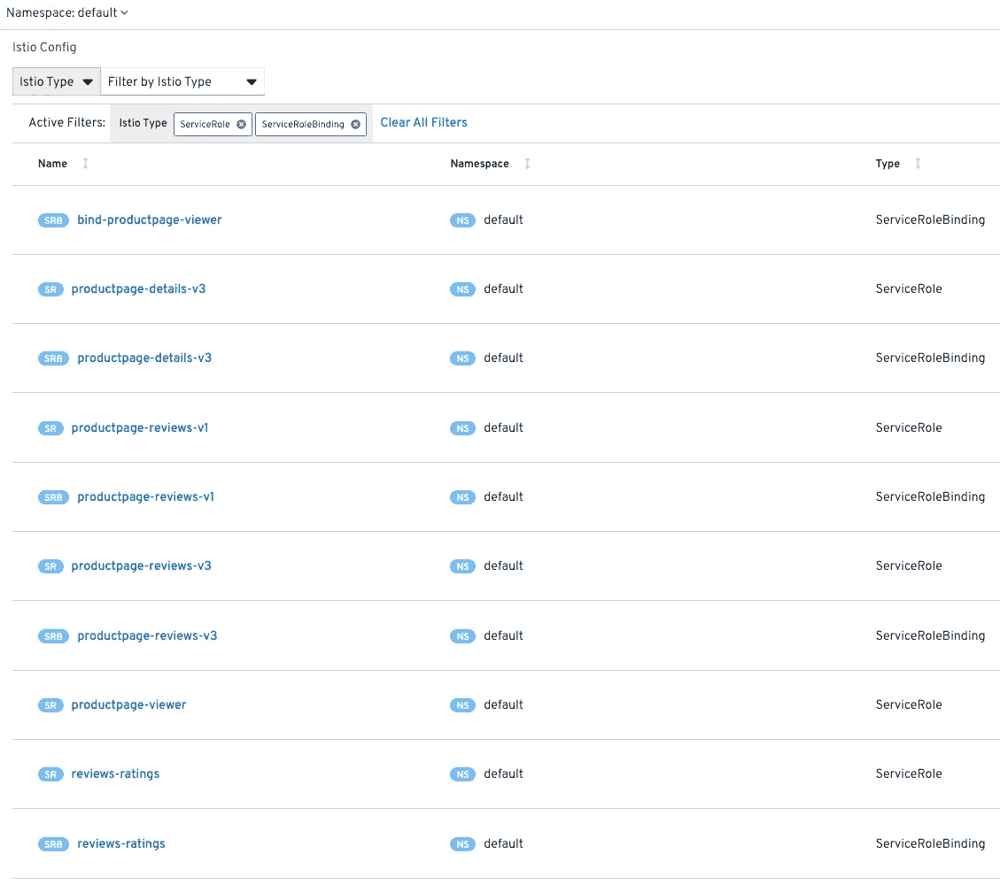

通过 SMI 规范在 Istio 中创建的 ServiceRoles 和 ServiceRole 绑定

访问控制策略—功能齐全的 bookinfo 应用程序

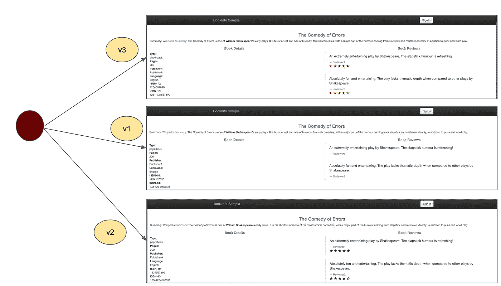

访问控制策略—访问所有服务的全功能 bookinfo 应用程序

创建流量目标以定义访问控制策略，从而允许流量从 reviews-v1 和 reviews-v3 流向 ratings-v1，禁止流量从 reviews-v2:

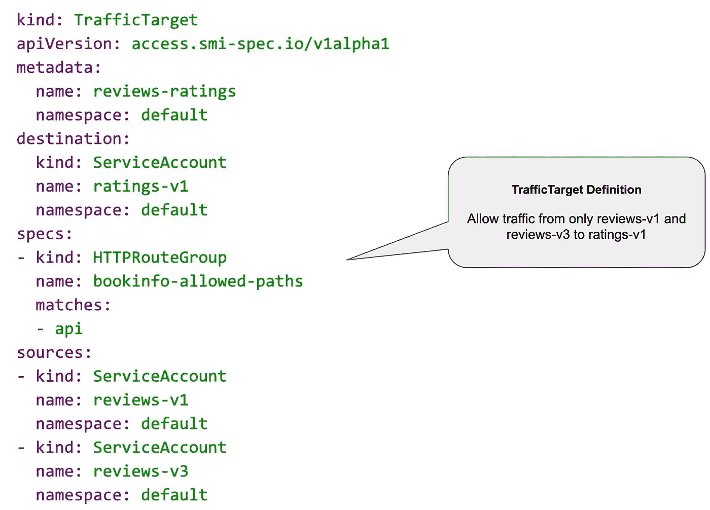

TrafficTarget —禁止流量查看的访问控制策略-v2

上述 SMI TrafficTarget 规范在底层 Istio 实现中创建了所需的 ServiceRole 和 ServiceRoleBinding，如下所示:

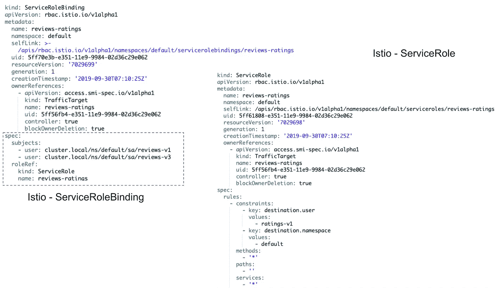

SMI 创建的 Istio 配置

使用上述配置，从评论到“评论-v2”的流量被禁止。

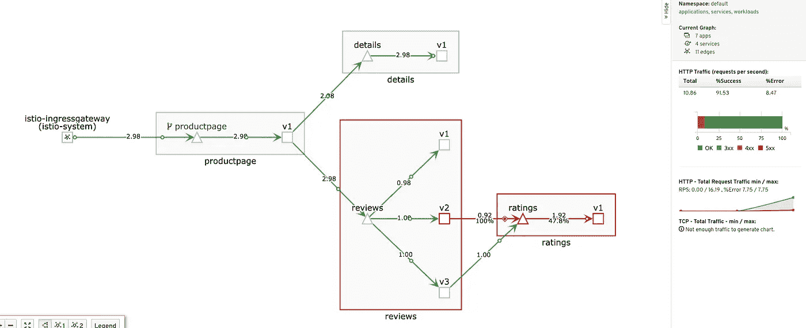

流量图—禁止流量查看的访问控制策略-v2

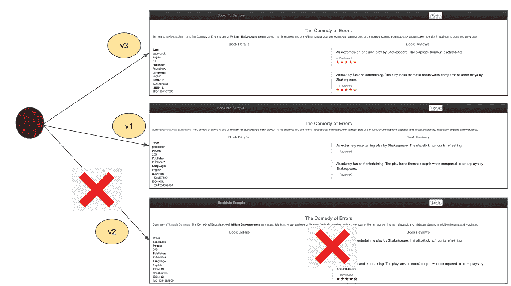

流量图—禁止流量查看的访问控制策略-v2

## 流量分流— SMI Istio 适配器

在下面的工作流中，最初部署了“bookinfo-application-v1”和“reviews-v1”以及“details-v1 ”,所有流量都指向 productpage 的“reviews-v1”。

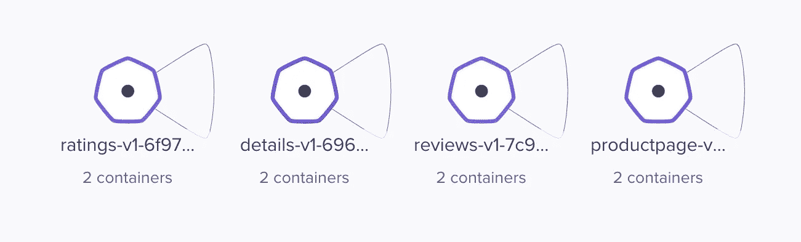

带有“评论-v1”、“评分-v1”和“详细信息-v1”的 Bookinfo 应用程序

如下图所示，浏览器中的 URL 不会显示任何`ratings`，因为`reviews v1`根本没有调用`ratings`服务。

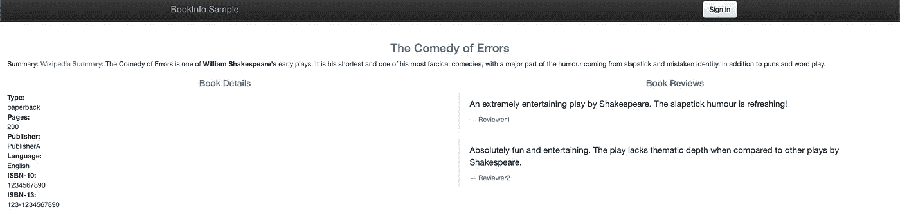

只有评论的 book info-v1

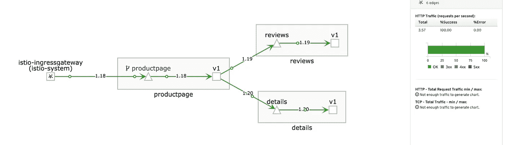

只有评论的 book info-v1

创建 SMI TrafficSplit 配置以允许所有流量“reviews-v1 ”,进而在底层 Istio 平台中创建虚拟服务。

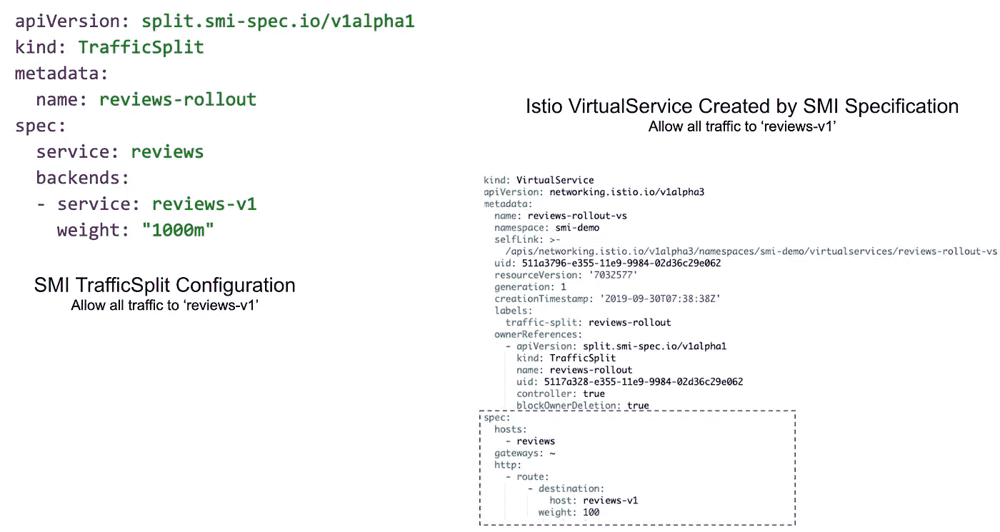

由 SMI 流量分割规范创建的 Istio VirtualService 流量至“reviews-v1”

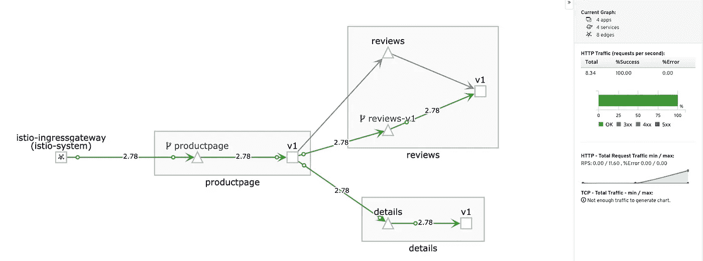

可视化—由 SMI TrafficSplit 规范创建的 Istio VirtualService

bookinfo 应用程序中添加了一项新服务“reviews-v2”。

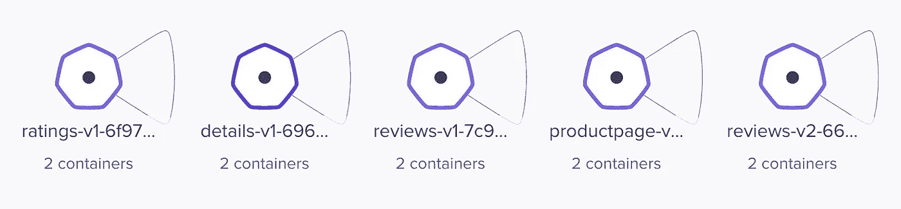

Bookinfo 评论-v2 新增内容

TrafficSplit 对象已更新，将 10%的流量分配给新添加的“reviews-v2 ”,如下所示:

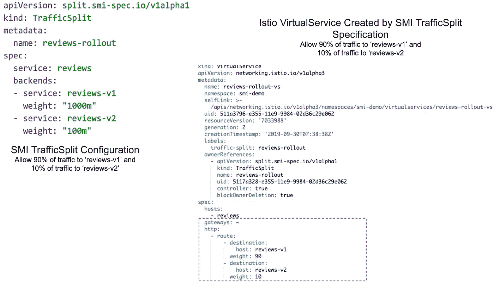

由 SMI 流量分割规范创建的 Istio VirtualService 的流量流向“点评-v1 ”, 10%的流量流向“点评-v1”

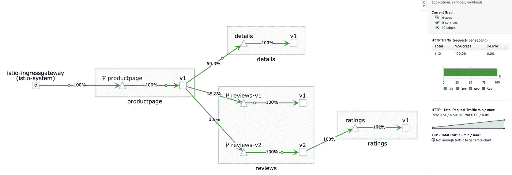

SMI 在 Istio 中创建的虚拟服务配置流量在 reviews-v1 和 v2 之间分割

更新 TrafficSplit 对象，将所有 100%的流量拆分到新添加的“reviews-v2 ”,如下所示:

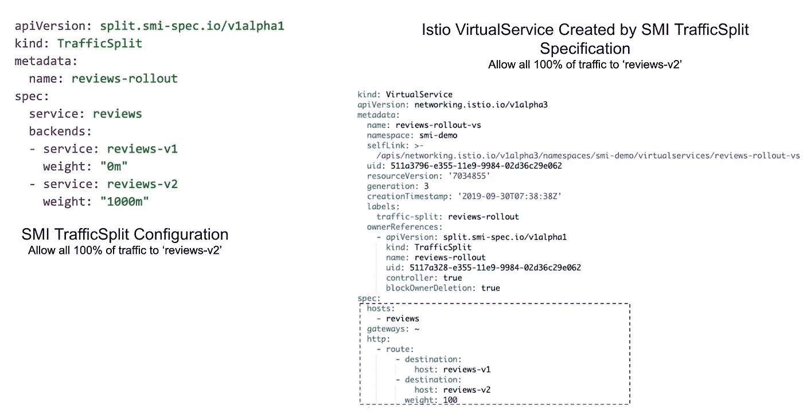

由 SMI 流量分割规范创建的 Istio VirtualService 流量至“reviews-v2”

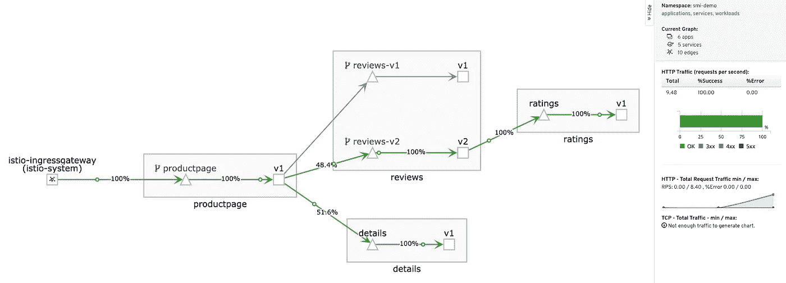

SMI 在 Istio 中创建的虚拟服务将 100%的流量分配配置为“reviews-v2”

SMI 让开发人员可以自由地使用服务网格功能，而不必受限于特定的实现(这将让您尝试使用 [Linkerd](https://linkerd.io/) 而不是 [Istio](https://istio.io/) ，而不会陷入别无选择的境地)。开发人员可以试验和更改实现，而不必更改他们的应用程序。总的来说，SMI 为供应商和社区生态系统带来了好处，提供了一组通用的功能，支持服务网格提供商的灵活性和创新。

考虑到 SMI 仍然是第一个版本，越来越多的服务网格供应商很有可能会遵循该标准，并为客户提供统一的 API 来实现灵活性和互操作性。希望 SMI 使服务网格空间民主化，提供一个跨多个平台的标准框架。