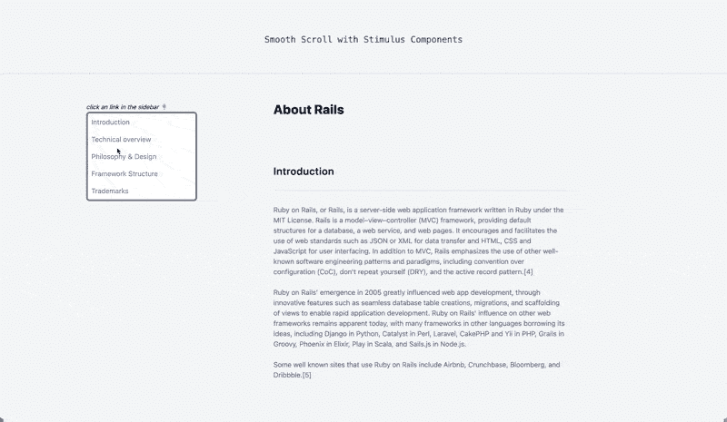
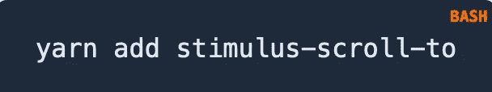
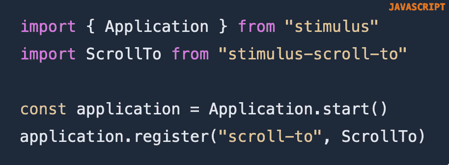
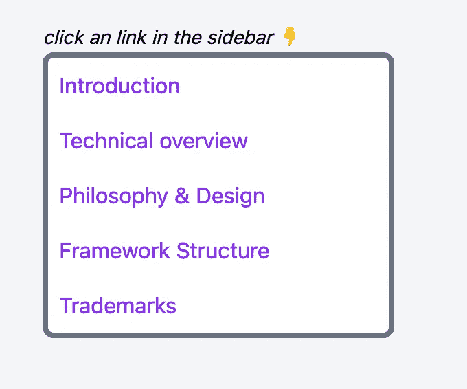
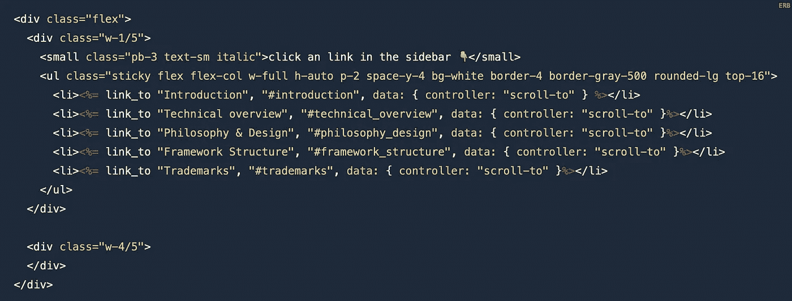
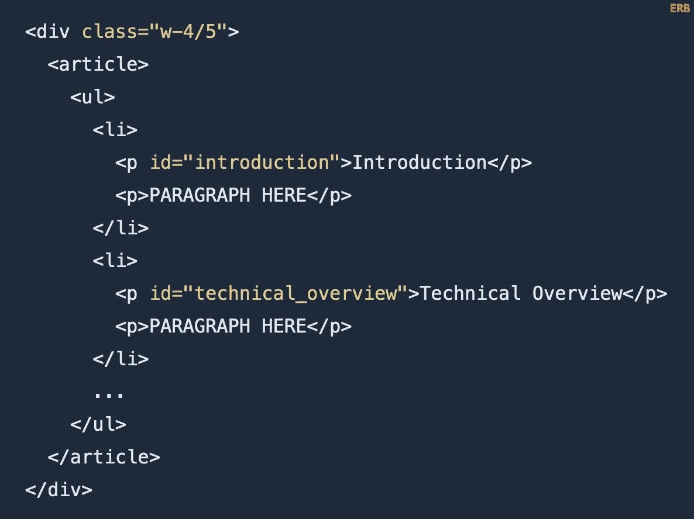

# 平滑滚动刺激

> 原文：<https://itnext.io/smooth-scroll-stimulus-b4378c20b735?source=collection_archive---------5----------------------->

优雅地滑动到页面的某一部分

这篇文章摘自 [Ruby on Rails 维基页面](https://en.wikipedia.org/wiki/Ruby_on_Rails)。

学习如何用 Ruby on Rails 和[刺激组件](https://github.com/stimulus-components)设置平滑滚动。这是一种简单明了的方式，可以让用户滑动到页面的不同部分。

# 开始之前

确保你安装了刺激装置。检查 package.json 文件或运行`yarn why stimulus`。如果尚未安装刺激装置，请遵循[文档](https://stimulus.hotwire.dev/handbook/installing)。

# 1.安装软件包

将[刺激滚动条](https://stimulus-components.netlify.app/docs/components/stimulus-scroll-to/)添加到您的项目中

# 2.添加刺激滚动到库

导入库

# 3.添加侧栏

示例侧栏

*   **data-controller = " scroll-to "**将导入的控制器作用于每个链接个体

link_to 中的标签(#)将在同一个页面上寻找匹配的 id:*# introduction->id = " introduction "*

# 4.添加内容

请注意，上面的代码片段是简化的，没有使用 CSS 类，以保持清晰的视图。

就是这样，平滑滚动现在起作用了！

感谢阅读！

这篇文章对你有帮助吗？
你可能也喜欢这些其他刺激:

*   [用刺激组件建造一个光廊](/build-a-light-gallery-with-stimulus-components-84ba56f3cee9?sk=927f8f7753ae4f073be84feaa8ac313e)
*   [用刺激组件构建一个旋转木马](https://medium.com/better-programming/build-a-carousel-with-ruby-on-rails-and-the-stimulus-components-library-22b1b5e1e682?sk=50c1b58f427632b403f8db8e7cad2aed)
*   [搜索自动完成刺激](/search-autocomplete-stimulus-4e941df54d39?sk=a09dbf0e1ca8cd2f544ba34b78f739f0)