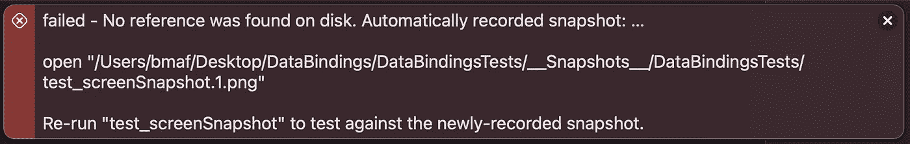
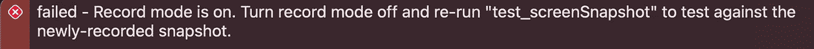
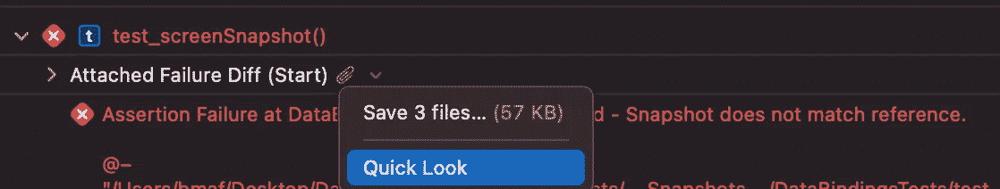

# iOS 上的快照测试

> 原文：<https://itnext.io/snapshot-testing-on-ios-fbe3e30e504f?source=collection_archive---------1----------------------->

## 也称为视觉回归测试。

我们知道可以在 iOS 上进行快照测试已经有一段时间了。最近，我的朋友 [Dariusz Rybicki](https://medium.com/u/ef3e61188cbd?source=post_page-----fbe3e30e504f--------------------------------) 向我介绍了 [SnapshotTesting](https://github.com/pointfreeco/swift-snapshot-testing) (来自 [Stephen Celis](https://medium.com/u/36377060ece2?source=post_page-----fbe3e30e504f--------------------------------) 和 [Brandon Williams](https://medium.com/u/6c5f26546203?source=post_page-----fbe3e30e504f--------------------------------) )，这就是我们今天要谈论的内容。


照片由[诺德伍德主题](https://unsplash.com/@nordwood?utm_source=unsplash&utm_medium=referral&utm_content=creditCopyText)在 [Unsplash](https://unsplash.com/s/photos/comparison?utm_source=unsplash&utm_medium=referral&utm_content=creditCopyText) 上拍摄

## 重要的事情先来

让我们从添加以下 swift 包开始:

```
[https://github.com/pointfreeco/swift-snapshot-testing](https://github.com/pointfreeco/swift-snapshot-testing)
```

然后，让我们创建一个简单的屏幕，并将`view.backgroundColor`设置为红色:

在我们的单元测试目标中，让我们创建一个测试类，`import SnapshotTesting`并为这个屏幕创建一个测试用例:

现在，如果我们运行测试，我们会看到一个错误，说在磁盘上没有找到引用。发生这种情况是因为在我们断言一切都没变之前，我们需要一些东西来比较。但是请注意，错误消息的最后一行指出，如果我们重新运行测试，它将与新记录的快照进行比较。



这意味着当我们没有指定我们是否正在记录，并且还没有为那个测试用例保存快照时，库会自动为它创建一个快照。我们可以在每个断言中用一个记录布尔参数内联指定它，或者只在这里的任何地方使用`isRecording = true`。

在后一种情况下，测试将失败，并显示以下消息:



## 万一真的失败了呢？让我们检查一下报告

每次我们运行测试时，我们都会在报告导航器上获得新的项目，即测试、日志和代码覆盖率。这次也不会有什么不同。为了强制我们的快照测试失败，我们只需设置`view.backgroundColor = .blue`，再次运行测试，并在报告导航器中选择最新的测试。



在这里我们可以看到，当快照测试失败时，我们有**附件**。如果我们看一看，我们会看到三个图像:

*   **红色:**这是参考快照，我们用它来进行比较，它与我们第一次记录快照时的外观完全相同。
*   **蓝色:**这是应用程序的当前结果。事实上，我们**故意把背景从红色改成蓝色，以使测试失败。**
*   **紫色:**这里，与预期结果不同的每个像素都被涂上紫色。因为整个当前屏幕看起来与预期的屏幕不同，所以它被完全高亮显示。