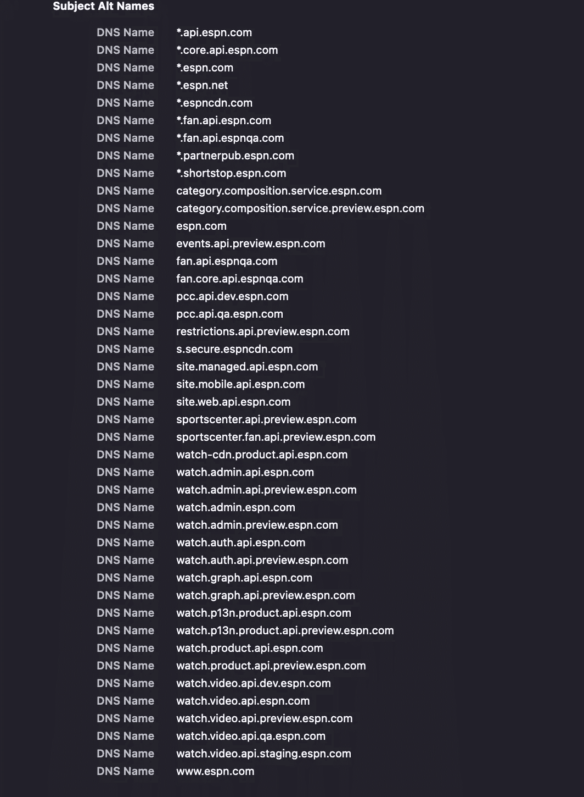
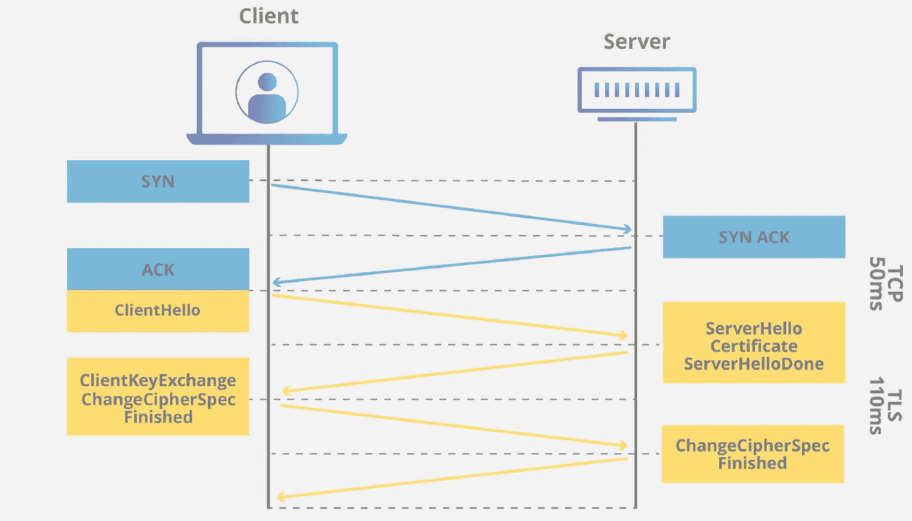
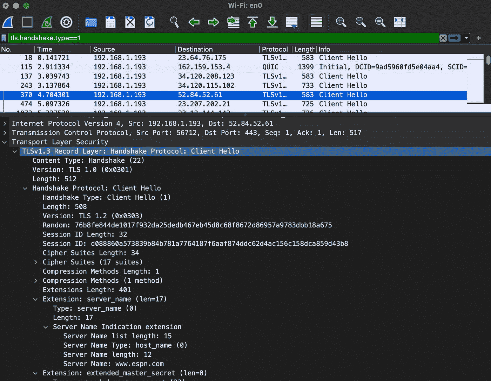
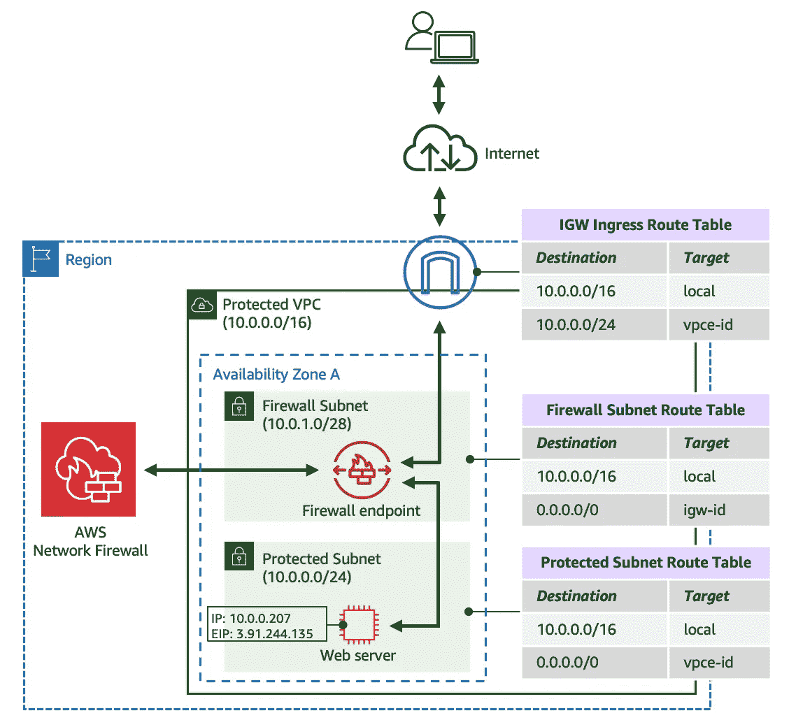
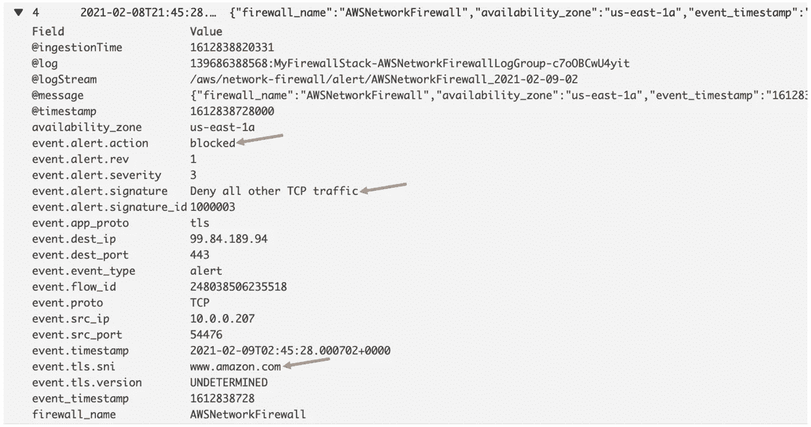
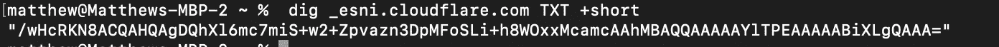
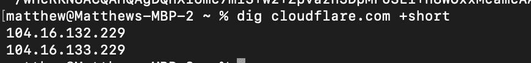

# SNI 如何成为安全与隐私的战场

> 原文：<https://itnext.io/sni-from-a-to-z-72deffe942e1?source=collection_archive---------0----------------------->

不用说，加密是信息安全的支柱之一。它最广为人知的应用之一是传输层安全性— TLS。Google 估计 95%的网络流量是 HTTPS，这只是 TLS 的一种使用方式——它可以与任何其他 TCP 协议一起使用，无论是本地的还是通过 StartTLS(它甚至开始在 UDP 和 QUIC 中使用)。人们很容易理所当然地认为 TLS 的开发投入了多少工程和脑力；多年来，它已经发展了很多，其最新版本是 1.3，由 IETF 在 2018 年的 RFC 8446 中正式定义。它包含了太多的复杂性和细微差别。

今天我们将讨论 TLS 的一个不太为人所知的方面:服务器名称指示——又名 SNI。它解决了许多有趣的问题，甚至引入了一些有趣的隐私问题。

它解决了什么问题？

我经常说，解释一项技术或软件的最佳方式是解释它试图解决什么问题，而不是解释它做什么。要对 SNI 做到这一点，我们必须回到 SSL/TLS 的开始。

当安全套接字层(SSL)在上世纪 90 年代由前技术巨头 Netscape 首次开发时，web 服务器只能“监听”单个套接字(也称为端口-IP 组合)上的 SSL 流量。

*补充说明:SSL 和 TLS 被很多人(包括我自己)交替使用，但 TLS 在技术上是正确的术语——你应该感谢微软造成的混乱。早在 20 世纪 90 年代末，网景公司和微软公司之间就爆发了一场“浏览器大战”——微软的 Internet Explorer 和网景的 Navigator。网景公司开发了 SSL，微软和其他公司也在开发自己的加密网络流量的解决方案。IETF 没有一堆不同的版本，而是组织了一次会议，就一个单一的全球标准达成一致。Netscape 的 SSL 更常用，但微软不希望 Netscape 在新协议上获得事实上的命名权——所以每个人都同意了一个新的协议名称，TLS。*

例如，如果您浏览 google.com，该套接字可能是 TCP 端口 443 上的 142.250.81.206。如果您在 TCP 端口 443 上浏览该 IP 地址，web 服务器只能加密流量并为该单一组合提供证书。如果你想托管另一个网站，你有 4 个选择:

1.  安装一台新的网络服务器——这是很昂贵的，因为在那个时代，它几乎总是一台物理服务器。这是假设你能从你的 ISP 那里得到一个额外的 IP 地址——如果你不能，你就不走运了。
2.  为该服务器上的 NIC(网络接口卡)分配一个额外的 IP 地址。如上所述，这取决于你是否能够获得一个新的公共 IP 地址。
3.  使用不同的端口——这并不吸引人，因为所有的浏览器都默认为 HTTP 使用端口 80，HTTPS 使用端口 443，除非在 URL 中指定了端口——所以要求用户除了域名之外还要记住端口是不友好的。继续在任何网站上尝试这种方法——只需在域名末尾加上:443——就像[https://google.com:443](https://google.com:443)——你会看到页面加载后端口会消失。想象一下，你必须记住 google.com 在 443，而 cloudflare.com 在 444。
4.  获得多域证书—多 SAN(主题别名)证书在 2000 年左右开始成为一种事物。多 SAN 证书非常常见，但几乎总是针对绑定到单个实体的域和子域。想象一下，如果你为多家公司托管网站；如果私钥泄露，所有这些域(以及公司)都将受到影响。

这些都是 espn.com 使用的证书上的 SAN 显然，它们都与 ESPN 相关联。

在 web 的早期，我们能够管理，但随着我们扩大规模并开始引入负载平衡器和内容交付网络(cdn)，如 Akamai、CloudFlare 和 AWS CloudFront，这很快成为一个问题。互联网需要一种方法让 web 服务器在一个套接字上使用多个证书。进入 SNI。

SNI 所做的就是当用户试图访问一个网站时，它会在 TLS 客户端 Hello 中粘贴一个扩展名(本质上是一个头),指定他们试图连接的域名。客户端 Hello 是建立安全加密过程中的第一个动作，也称为“握手”，因此是完全未加密的。它紧接在 TCP 握手之后发生，TCP 握手在客户端和服务器之间建立了稳定、可靠的连接。

这是我浏览 https://www.espn.com[的截图。](https://www.espn.com.)你可以看到在客户端 Hello 中包含了很多信息，包括服务器名称指示扩展——我们看到在底部附近指定了 www.espn.com 的——它与我的请求的域名相匹配。

补充说明:如果你仔细观察，你会发现在 UDP 而不是 TCP 上运行的 HTTP 的最新版本 QUIC 包括 TLS 握手。但那是未来的博客。

web 服务器检查每个证书中的所有 San，并选择符合请求的 San。Web 服务器也有一个默认证书，这是它们在没有与请求的 SNI 扩展相匹配的 SAN 证书的情况下发布的证书。然而，这通常会导致证书名称不匹配的错误，并且您的浏览器会发出血腥谋杀的尖叫。

这释放了负载平衡器和 cdn 的力量，因为现在它们可以为无限域托管安全流量。它还有助于减少在 TLS 握手期间传输的证书的大小，因为您现在可以使用较少数量的 San 来颁发证书。我们说的只是数千字节的数据，但是由于页面加载时间是搜索结果的一个因素($$仍然是最大的因素)，从商业原因和安全角度来看，去除每一点不必要的数据传输是很重要的。

## 企业安全如何利用这一点？

[正如我在其他博客](/cdk-once-more-unto-the-breach-f2673cf219a6)中提到的，控制出口流量是企业安全的基础，也是 SC-7 中概述的 FedRAMP 适度基线的[要求。为了限制暴露于恶意软件，每个安全网络(无论是企业还是政府)都有网络安全控制措施来监控用户和设备，防止他们访问未经授权的网站。将 IP 地址列入出口白名单是不可行的，因为网站的 IP 地址一直在变化，尤其是在公共云领域。由于 SNI 扩展是未加密的，网络防火墙可以检查出站 TLS 流量的 SNI 报头，以确定流量是否被允许流出。对于 Palo Alto 或 Fortinet 这样的 NGFWs，以及 AWS 网络防火墙都是如此。](https://wayfinder.digital/FedRAMP/SC007-FedRAMP.html)

[https://AWS . Amazon . com/blogs/security/hands-on-walk-of-the-AWS-network-firewall-flexible-rules-engine/](https://aws.amazon.com/blogs/security/hands-on-walkthrough-of-the-aws-network-firewall-flexible-rules-engine/)

## 隐私呢？

虽然您通过 TLS 传输的数据将始终被加密(文本消息、登录网站时的用户名和密码、网上购物时的信用卡号等)，但网络窃听者仍然可以了解您的流量。你的 DNS 请求过去总是不加密的，所以数据包嗅探器总是可以检测到“哦，马特的家庭路由器刚刚对 wikileaks.com 进行了 DNS 查询——所以很明显我们知道那栋房子里有人试图访问 Wikileaks . com”。但是现在，TLS 上的 DNS(DoT)和 HTTPS 上的 DNS(DoH)正在解决这个问题，并提供加密 DNS 流量的方法。然而，SNI 报头仍然是未加密的；TLS 客户端 Hello 应该启动发送方和接收方之间的对话，讨论如何对流量进行加密——哪些密钥、哪些算法等。SNI 在客户端 Hello 中被发送——在没有事先协商密钥和加密算法的情况下，如何加密东西？

问题的答案:“总是 DNS！！！!"

TLS 1.3 最初通过引入加密 SNI(ESNI)提供了一个解决方案。解决方案是在一个特殊的 TXT 记录中发布一个公钥，发送方用它来加密 SNI 报头。因此，如果我正在浏览 cloudflare.com，我的浏览器最初会发送一个名为 _esni.cloudflare.com 的 TXT 记录的 DNS 查找

因为从理论上讲，只有位于以下 IP 地址的服务器拥有相关的私钥来解密用 DNS 中公布的公钥加密的数据，所以我们可以确定，没有人能够在中间窥探我们的流量并得知我们去了 Cloudflare.com(当然，假设我们也使用 DoH 或 DoT 加密 DNS 请求)

然而，你不会再在野外看到太多 ESNI，因为它已经发展到加密整个客户端 Hello——称为 ECH。这个想法是为了最小化窃听者可以从你的流量中得到的信息量——他们仍然可以看到哈希，使用的算法等等。最终，ECH 使用与 ESNI 非常相似的方法，在 DNS 中以不同的记录类型 HTTPS(这是像 CNAME 一样的实际记录类型)发布密钥。然而，当 ECH 可用和不可用时，使用 ClientHelloInner 和 ClientHelloOuter 的想法增加了一些复杂性。如果您想了解更多相关信息，CloudFlare 发布了一篇精彩的博客。

这也增加了企业的复杂性。企业仍然希望监视和控制其网络上的流量。如果 SNI 报头不再以明文形式发送，他们将不得不依赖完全解密的中间人技术，如 SSL 转发代理，来检查出口流量——实施和维护这些技术并不有趣——证书实际上是为破解东西而设计的！但即使是这些人，也会和 ECH 有矛盾。SSL 转发代理通常有解密排除列表，您可以在其中列出希望防火墙对流量进行加密的域。当使用 mTLS 时(mTLS 不能被 SSL FP 解密)以及在敏感域(如银行和医疗)上，您通常会看到这种情况，因为您不希望您的公司防火墙检查该流量。但是如果你不知道一个域是什么，你怎么能把它排除在解密之外呢？

这需要将所有客户端配置为使用预定义的公钥进行所有 ECH 加密，私钥存储在您的防火墙上。或者只是通过政策完全禁止 ECH。

## 结论

正如我们所见，一个更复杂的系统(TLS)的一个小方面(SNI)在本质上常常是分形的。这也证明了在 InfoSec 中，当你实现一个新特性时，很少有 100%成功的；功能几乎总是伴随着权衡——在这种情况下，隐私与安全，这将永远是有趣的，永远是不断发展的。

Matthew 是领先的 AWS 网络安全合作伙伴 stackArmor 的高级解决方案总监，该公司为希望满足合规框架安全要求的客户设计定制解决方案:FedRAMP、NIST 800 系列、PCI-DSS、国防部 SRG、HIPAA、FISMA、FIPS 140–2(和 3)等。StackArmor 提供了一个经过 AWS 审核的解决方案，可以加速 FedRAMP ATO 的运行并降低 40%以上的成本。