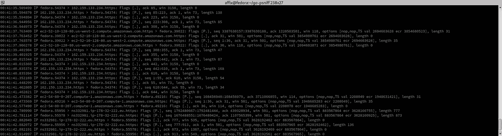

# 用 Go 嗅信用，用 libpcap 走一趟

> 原文：<https://itnext.io/sniffing-creds-with-go-a-journey-with-libpcap-73bc3e74966?source=collection_archive---------0----------------------->



在过去，要编写一个凭证嗅探器，你必须花很多时间学习 C 和 libpcap，这是非常耗时的，没有人真的想经历这些。

所以今天我们有了 GoLang，google 的静态类型语言，特别是 google 的 gopacket 库。

Gopacket 是一个引入包过滤和捕获的库。它附带了 libpcap 的 C 绑定、pfring 的 C 绑定、afpacket C 绑定和 tcpassembly。

# 在开始之前

在我们继续之前，我们需要安装一些东西，以及 golang ( [使用您选择的安装方法](https://golang.org/doc/install))和 libpcap(带有开发库)

> fedora/RHEL/CentOS 等…
> $ sudo dnf 安装 libpcap libpcap-devel
> Ubuntu/Debian/Kali/Parrot
> $ sudo apt 更新& & sudo apt 安装 libpcap-dev

现在我们有了我们的 dep，我们可以开始了

# 对包裹的剖析

在本教程中，我们将针对通过网络以纯文本形式发送的 FTP 凭据。我们可以使用 tcpdump 查看我们的目标流量。

tcpdump 在我们的命令行中打印出数据包的描述。我们可以使用 BPF (Berkely 包过滤)语法来定位 TCP 端口 21。一旦 tcpdump 运行，您就可以使用您选择的客户机连接到 FTP 服务器(我使用的是命令行 FTP 客户机

> $ sudo tcpdump tcp 和 port 21
> dropped privs to tcpdump
> …
> 00:17:09.312853 IP**<客户端>** .44860 > **<服务器>** 。ftp: Flags [P.]，seq 1:28，ack 321，win 501，options [nop，nop，TS val 4275069681 ecr 3350561499]，length 27: FTP: **用户<用户名>**
> 00:17:20.938293 IP**<客户端>**44860>ftp: Flags [P.]，seq 28:52，ack 374，win 501，options [nop，nop，TS val 4275081307 ecr 3350567300]，长度 24: FTP: **PASS <密码>**

查看 TCP Dump 的输出，我们可以看到数据包中的大量信息。然而，我们真正感兴趣的是客户端(src)、服务器(dst)和有效负载(突出显示的用户和通行证部分)。

要了解更多关于 Tcpdump 输出的信息，请查看这个[大师班](https://packetpushers.net/masterclass-tcpdump-interpreting-output/)。

# 让我们开始编码

为了便于说明，我们使用的所有变量都将被硬编码，如果您愿意，您可以对应用程序进行参数化。

## 安装

但是让我们从声明 iface、buffer 和 filter 变量开始。

如果接口是我们的接口，我的 FTP 服务器在 docker 中运行，所以我在我的 docker 接口上嗅探流量。

buffer 变量是我们的 1600 字节的缓冲区大小，这应该足以捕获各种大小的 TCP 包

该过滤器是我们的 BPF 过滤器，您可以更改它以匹配您将与 TCPDump 一起使用的任何过滤器

```
var (
  iface = “docker0”
  buffer = int32(1600)
  filter = “tcp and port 21”
)
```

现在我们需要包含一些库，大多数来自 go 标准库，但是我们需要 google/gopacket 和 google/gopacket/pcap

```
import (
  "bytes"
  "fmt"
  "log" "github.com/google/gopacket"
  "github.com/google/gopacket/pcap"
)
```

## 检测我们的界面

在我们开始捕获流量之前，我们需要检测我们的接口是否存在于系统中。为此，我们可以使用 [pcap 循环遍历我们的设备。FindAllDevs()](https://pkg.go.dev/github.com/google/gopacket@v1.1.19/pcap#FindAllDevs) 为了找到接口变量中定义的名称的匹配，所以让我们创建一个 deviceExists bool 函数

```
func deviceExists(name string) bool {
  devices, err := pcap.FindAllDevs() if err != nil {
    log.Panic(err)
  } for _, device := range devices {
    if device.Name == name {
     return true
    }
  }
  return false
}
```

现在我们可以在 if 语句中调用它，作为 main()函数的一部分

```
func main() {
  if !deviceExists(iface) {
    log.Fatal("Unable to open device ", iface)
  }
}
```

如果您在 iface var 中定义了一个不存在的接口，当您使用 go run 运行代码时，您将会得到一个致命错误，应用程序将会退出。

```
$ go run main.go
2020/11/30 20:05:04 Unable to open device docker1
exit status 1
```

## 捕获数据包

现在我们知道我们的接口存在，我们可以继续捕获数据包。为此，我们需要使用 pcap 打开一个实时的数据包流。这是使用 [pcap 完成的。OpenLive](https://pkg.go.dev/github.com/google/gopacket@v1.1.19/pcap#OpenLive) 我们可以在设备检查后将它添加到我们的主函数中。

```
handler, err := pcap.OpenLive(iface, buffer, false, pcap.BlockForever)if err != nil {
  log.Fatal(err)
}
defer handler.Close()
```

用于打开界面的参数有:

*   接口名称
*   缓冲区大小(快照长度)
*   [滥交模式](https://en.wikipedia.org/wiki/Promiscuous_mode)
*   超时( [10 毫秒](https://pkg.go.dev/github.com/google/gopacket@v1.1.19/pcap#BlockForever.))

现在我们可以使用 [pcap 设置我们的 BPF 滤波器。Handle.SetBPFFilter](https://pkg.go.dev/github.com/google/gopacket@v1.1.19/pcap#Handle.SetBPFFilter) 方法

```
if err := handler.SetBPFFilter(filter); err != nil {
  log.Fatal(err)
}
```

现在我们使用 gopacket 设置我们的包源，这是我们如何在一个循环中解析我们的包

```
source := gopacket.NewPacketSource(handler, handler.LinkType())
for packet := range source.Packets() {
  fmt.Println(packet)
}
```

现在，您可以使用 sudo 运行这段代码，并尝试验证您的目标 FTP 服务器

```
$ sudo go run main.goPACKET: 80 bytes, wire length 80 cap length 80 @ 2020-11-30 20:21:33.007534 +0000 GMT
- Layer 1 (14 bytes) = Ethernet {Contents=[..14..] Payload=[..66..] SrcMAC=02:42:9a:92:0a:55 DstMAC=02:42:ac:11:00:02 EthernetType=IPv4 Length=0}
- Layer 2 (20 bytes) = IPv4 {Contents=[..20..] Payload=[..46..] Version=4 IHL=5 TOS=16 Length=66 Id=51609 Flags=DF FragOffset=0 TTL=64 Protocol=TCP Checksum=6375 SrcIP=172.17.0.1 DstIP=172.17.0.2 Options=[] Padding=[]}
- Layer 3 (32 bytes) = TCP {Contents=[..32..] Payload=[..14..] SrcPort=33748 DstPort=21(ftp) Seq=3778718902 Ack=277870828 DataOffset=8 FIN=false SYN=false RST=false PSH=true ACK=true URG=false ECE=false CWR=false NS=false Window=502 Checksum=22618 Urgent=0 Options=[TCPOption(NOP:), TCPOption(NOP:), TCPOption(Timestamps:2890546481/2237472386 0xac4a3d31855d1e82)] Padding=[]}
- Layer 4 (14 bytes) = Payload 14 byte(s)PACKET: 66 bytes, wire length 66 cap length 66 @ 2020-11-30 20:21:33.007561 +0000 GMT
```

您可能同意这个输出几乎没有什么用处。所以让我们让它更有用一点。

## 收集凭据

从我们的 TCP 转储示例开始，我们讨论了如何使用 TCP 转储查看每个数据包中的用户和传递有效负载。我们可以使用这里的应用程序来简化这一过程。如果我们创建一个新的 harvestFTPCreds 函数。

该函数需要做的第一件事是使用[数据包确认应用层对数据包可用。ApplicationLayer()](https://pkg.go.dev/github.com/google/gopacket@v1.1.19#Packet.ApplicationLayer) ，否则我们将在某个时候得到一个 segfault

```
func harvestFTPCreds(packet gopacket.Packet) {
  app := packet.ApplicationLayer()
  if app != nil {
    // App is present
  }
}
```

现在我们可以提取我们的[有效载荷](https://pkg.go.dev/github.com/google/gopacket@v1.1.19#ApplicationLayer.Payload)和[目的 IP](https://pkg.go.dev/github.com/google/gopacket@v1.1.19#Flow.Dst) 地址

```
if app != nil {
  payload := app.Payload()
  dst := packet.NetworkLayer().NetworkFlow().Dst()
}
```

最后一部分是检查有效载荷是否包含我们的用户或使用字节传递。包含()

```
if app != nil {
...
  if bytes.Contains(payload, []byte("USER")) {
    fmt.Print(dst, "  ->  ", string(payload))
  } else if bytes.Contains(payload, []byte("PASS")) {
    fmt.Print(dst, " -> ", string(payload))
  }
}
```

现在我们的 harvest 函数完成了，我们可以返回到我们的 main 函数并替换 fmt。使用我们新的收割功能进行打印。

```
for packet := range source.Packets() {
  harvestFTPCreds(packet)
}
```

如果我们现在运行我们的代码，我们应该已经为我们的 FTP 服务器从网络接口嗅到了格式良好的用户/口令组合。

```
$ sudo go run main.go
172.17.0.2  ->  USER ftpuser
172.17.0.2 -> PASS ftppassword
```

# 结论

我希望这已经提供了丰富的信息，并展示了使用 golang 作为一种简单有效的方法来捕获、过滤和嗅探实时网络流量是多么容易。

我也希望这已经告诉了一点关于加密网络流量的重要性:)

感谢阅读这里是完整的源代码

[https://gist . github . com/affix/51 daf 036 faf 68593 fb6d 87 af 9 EBA 1 f 0f](https://gist.github.com/affix/51daf036faf68593fb6d87af9eba1f0f)