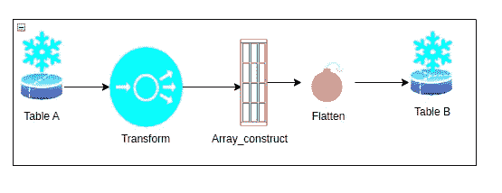

# 雪花脚本:从一个表到另一个表加载一百万行

> 原文：<https://itnext.io/snowflake-scripting-load-a-million-rows-table-to-table-b24d7621fbff?source=collection_archive---------1----------------------->

了解如何以最佳方式在表中插入多行。


罗伯特·卡茨基在 [Unsplash](https://unsplash.com/s/photos/million-color?utm_source=unsplash&utm_medium=referral&utm_content=creditCopyText) 上的照片

雪花正在以令人难以置信的低成本接管数据仓库领域，提供大量出色的产品和功能。

雪花以两种方式帮助组织，

1.  支持和提升创新。
2.  抑制技术债务和复杂性。

Snowflake 拥有精致的特性，令人瞩目，另一方面，文档则是另一个争论的话题。

存储过程是 SQL 世界中众所周知的怪兽，也是雪花提供的众多特性之一。雪花中的存储过程可以通过大量的编程语言来开发。

在本帖中，我们将看看如何使用雪花脚本优化地将一百万个修改过的行写入一个新表。

一种称为雪花脚本的语言特性使您能够用普通 SQL 创建通用脚本和存储过程。



图片由[作者](https://www.linkedin.com/in/jayachandra-sekhar-reddy/)

**设置所需的占位符:**

1.  创建表格

让我们构建两个示例表，因为数据库表是所有 SQL 操作的基础。

```
create or replace table snowflake_insert_main(col1 varchar, col2 number(30,0), col3 varchar);
create or replace table snowflake_insert_transformed(col1 varchar);
```

现在表格已经准备好了，让我们添加一些数据。

```
insert into snowflake_insert_main(col1) values ('Jay_Test', 5 , 'New_Val' ), ('Medium_Test', 8, 'New_Val1');
```

最直接、最流行的策略是这个 insert 然而，即使它很简单，当涉及大量插入时，它就变得复杂了。这同样适用于在表之间输入数据。

```
insert into snowflake_insert_transformed(col1) select col1 from snowflake_insert_main;
```

这个 insert 语句将把源表中每一行的值插入到目标表的一列中。

这将启动对雪花集群的插入请求，它将等待操作完成后再开始下一次插入。

当处理大量数据时，这一过程变得开销大且耗时。

当存在大量行时，读取、转换和写入将花费很长时间。为了手动选择要修改和加载的列，雪花有一个 for 循环。

```
BEGIN
  LET res RESULTSET := (select top 2 col1 from snowflake_insert_main);
  LET cur CURSOR for res;
      for row_variable IN cur DO
          LET my_table_value STRING := row_variable."col1";
          INSERT INTO snowflake_insert_transformed(col1) VALUES (:my_table_value);
      end for;
  END
```

这个循环给了操作者更多的控制，但是当处理数百万条记录时，这种推理就变得过度了。

这背后的基本原理是保留一个临时数据容器，将其展平，然后写入目标表。

在写之前，让我们利用一个数组来存储更改后的数据。

```
DECLARE
  tmp_array ARRAY default ARRAY_CONSTRUCT();
  rs_output RESULTSET;
BEGIN
  LET res RESULTSET := (select top 2 substr(col1, -4) from snowflake_insert_main);
  LET cur CURSOR for res;
      for row_variable IN cur DO
          LET my_table_value STRING := row_variable."col1";
          INSERT INTO snowflake_insert_transformed(col1) VALUES (:my_table_value);
      end for;
  END
```

上面的摘录显示了我们如何在加载之前转换结果集，并且只选择了字符串的最后四个字符。

解决这个问题的方法是将 100K 行的加载时间减少一半，从 6000 秒减少到大约 120 秒。

最后一个选项是使用我们的数组构造将数组展平成一个新表，然后选择所需的值，在单个集群调用中创建一个新表。

**完整代码:**

```
CREATE OR REPLACE PROCEDURE multi_insert_prod(my_val number(38,0))
RETURNS varchar
LANGUAGE SQL
EXECUTE AS CALLER
AS '
  DECLARE
  tmp_array ARRAY default ARRAY_CONSTRUCT();
  rs_output RESULTSET;

  BEGIN
  LET res RESULTSET := (select top 1000000 substr(col1, -4) from snowflake_insert_main);
  LET cur CURSOR for res;
      for row_variable IN cur DO
          let my_table_value STRING := row_variable."col1";
          tmp_array := ARRAY_APPEND(:tmp_array, my_table_value);
      end for;
  rs_output := (CREATE or REPLACE TABLE 
                  my_database.my_schema.snowflake_insert_transformed(col1) 
                  AS SELECT VALUE FROM TABLE(FLATTEN(:tmp_array));
  RETURN rs_output;
  END
';
```

## **结论:**

由于它让开发人员和工程师能够更好地控制只使用 SQL 的存储过程，雪花脚本是雪花最新特性列表中的一个新特性，正迅速受到欢迎。

这篇文章的重点是通过向数据分析师和工程师展示精彩的雪花功能来改善他们的思维过程，这些功能允许他们尽可能有效地执行表与表之间的批量加载，而雪花并没有默认提供这些功能。

我希望这篇文章能让开发者的职责和障碍变得更容易。

快乐学习…..😀😀

关注我了解更多信息:

【https://www.linkedin.com/in/jayachandra-sekhar-reddy/ 

[https://twitter.com/ReddyJaySekhar](https://twitter.com/ReddyJaySekhar)