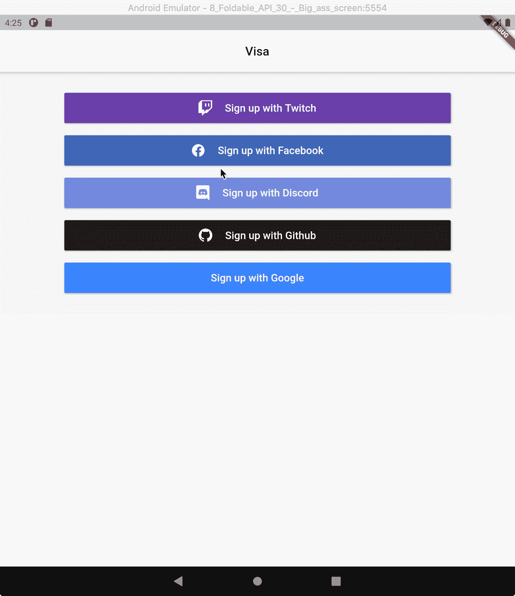

# 所以你想用 Flutter 进行社交登录(OAuth 2.0)

> 原文：<https://itnext.io/so-you-want-social-login-oauth-2-0-with-flutter-38f51ab02bba?source=collection_archive---------1----------------------->

## d̶e̶f̶i̶n̶i̶t̶i̶v̶e̶快速简易指南。

在 [Unsplash](https://unsplash.com?utm_source=medium&utm_medium=referral) 上由 [Austin Chan](https://unsplash.com/@austinchan?utm_source=medium&utm_medium=referral) 拍摄的照片

我知道你为什么在这里。你正在开发或计划开发一个应用程序，这将是继花生酱之后最伟大的事情。你选择了 Flutter，因为你着眼于未来，而 React Native 在 2021 年并不成功。你坐在你的机器前，脸上带着灿烂的笑容，准备改变世界。但首先，你如何实现社交登录？您在网上寻找 c̶o̶m̶p̶r̶e̶h̶e̶n̶s̶i̶v̶e 快速简单的解决方案，但没有找到。您所发现的是一些用于特定平台的库，而且，坦率地说，它们既不快速也不容易。是的，我知道你在想什么。不，我不是灵媒。我知道这些事情是因为，我就是你。

不久前，我从某人那里学到了一些东西:让简单的事情变得简单。没错。这是我写的每一行代码背后的指导原则。在网上搜寻可行的解决方案失败后，很明显这必须是一项定制工作。目标很简单:在 Flutter 中创建一些东西，让使用 **OAuth 2.0** 的认证尽可能简单。在我的应用程序中构建了这个功能后，我决定将它放入自己的包中，并与社区共享。开源的美妙之处。

那我们就开始吧。该库名为 [**签证**](https://github.com/e-oj/visa) (对贾里德·汉森的护照微微点头)。它建立一个 [**webview**](https://pub.dev/packages/webview_flutter) 用于使用适当的平台进行身份验证，并返回所有相关的 OAuth 数据，包括访问令牌。以下是如何通过脸书认证用户的方法:

**样品运行:**

这就是我几个月前在网上寻找解决方案时一直在寻找的东西:又快又简单。该示例显示了如何实现脸书登录，但是相同的模式适用于所有支持的平台。它们都实现了相同的接口。开箱即用支持以下平台:

*   脸谱网
*   谷歌
*   推趣
*   不调和
*   开源代码库

## 哦，不，我的平台不受支持…

不要害怕。 [**签证**](https://github.com/e-oj/visa) 旨在让第三方认证尽可能简单。其中一部分是使向库中添加 OAuth 2.0 提供者变得容易。这是通过 **Visa 接口**和 **SimpleAuth** 类实现的。下面是**界面**:

以及 **SimpleAuth** 类:

要添加新的 Oauth 提供者，只需创建一个实现 Visa 接口的类。下面是 DiscordAuth(一个内置提供程序)的代码:

仅此而已。如果您最终实现了一个新的提供者，请打开一个拉请求，以便我们可以在库中拥有它。查看 [**签证**](https://github.com/e-oj/visa) 文件了解更多技术细节。如果您发现任何错误，请在 [**问题**](https://github.com/e-oj/visa/issues) 页面报告。像这样走到最后干得不错。希望这个快速简单的解决方案能让你更快更容易地改变世界。

**👌谢谢你的时间。**

## 资源

[签证](https://github.com/e-oj/visa)、[App 样本(见 gif)](https://github.com/e-oj/visa/tree/master/test_app/lib) 、 [Github 问题](https://github.com/e-oj/visa/issues)