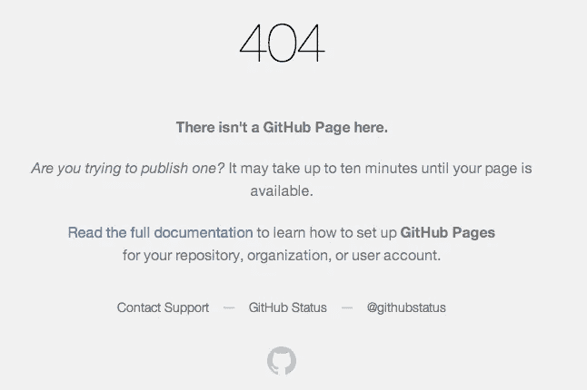

# 所以你想在 GitHub 页面上托管你的单页 React 应用？

> 原文：<https://itnext.io/so-you-want-to-host-your-single-age-react-app-on-github-pages-a826ab01e48?source=collection_archive---------0----------------------->


[*点击这里在 LinkedIn* 上分享这篇文章](https://www.linkedin.com/cws/share?url=https%3A%2F%2Fitnext.io%2Fso-you-want-to-host-your-single-age-react-app-on-github-pages-a826ab01e48)

**再想想！不…我只是在玩，这是可能的，但肯定需要一些配置来让你的路线渲染正确的组件。**

GitHub 有一个名为 GitHub [Pages](https://pages.github.com/) 的功能，只需点击一下按钮，就可以将 GitHub 存储库转换成一个活生生的网站……只要这个 repo 是 **a)** 只用前端代码(Javascript、CSS 和 HTML)编写的，并且显然 **b)** 不是用 React 编写的。如果你最近像我一样完成了一个 React 单页应用程序，当用户导航到某些 URL 时，它大量使用 React 的路由器 Dom 库来呈现某些组件，那么这个指南就是为你准备的。

简单的背景故事(跳到标题为“**快速指南”的部分，给那些被激怒了，现在就想知道答案的人！”经过几天的激烈讨论，我终于把我的后台托管在 Heroku 上了。事情正在好转！至少我是这么认为的😠。当我试图在 GitHub 页面上建立我的网站时，我过去在这方面取得了一些成功(见我的受特朗普启发的 Duolingo 应用程序[这里](https://bmcilhenny.github.io/chylingo/html/)或我的 wave forecast 网站，关于泽西海岸最好的 dang city，又名 Strathmere 的移动友好[网站](https://bmcilhenny.github.io/projectstrathmere2/#))，但因为我使用 React 来构建这个特定的应用程序，我需要添加一些额外的代码行，以确保 GitHub 可以根据用户在我的网站上采取的行动来识别我的组件。**


在所有的荣耀中。仅供参考:动画花了我几个世纪的时间(它们在刚刚录制的 GIF 上看起来很奇怪。Urg…)

# 那些被激怒了，现在就想知道答案的人的快速指南！

因此，您已经构建了 React 应用程序，它在本地机器上看起来很棒。厉害！现在让我们把它放到网上。

1.  确保您的本地项目附带了一个远程 GitHub 存储库。参见他们的[文档](https://help.github.com/articles/adding-a-remote/)获取说明。

2.运行 npm 安装

```
$ npm install
```

这确保您安装了最新版本的 npm 和 node.js。即使我用 Rails 运行我的后端，我还是会在没有它的情况下出现奇怪的错误。

3.运行 npm 运行构建

```
$ npm run build
```

这将创建一堆 Javascript、HTML 和 CSS 文件，GitHub 将使用这些文件将您的项目转换为 GitHub 页面可以处理的文件结构。


图片来自 [FreeCodeCamp](https://medium.freecodecamp.org/surge-vs-github-pages-deploying-a-create-react-app-project-c0ecbf317089) ，学习发展的绝佳资源。他们也有令人难以置信的播客。看看他们。

你会看到类似这样的^.

4.抓取整个“homepage”行，并将其添加到您的 package.json 中

```
“homepage” : “[http://yourgithubname.github.io/y](http://bmcilhenny.github.io/trivia-front-end)ourreponame",
```

这条线将把你正在创建的分支和你想要激活的回购联系起来。

5.再次运行 npm 运行构建。

```
$ npm run build
```

您将看到控制台中的以下代码与上次相比有所变化。现在的内容是:

```
blah blah blah"scripts": {
//..
**“deploy”: “gh-pages -d build”
}**
```

您将需要获取我在上面加粗的那行代码，并将其添加到 package.json 文件中的“scripts”键下:

```
“scripts”: {
 “start”: “react-scripts start”,
 “build”: “react-scripts build”,
 “test”: “react-scripts test — env=jsdom”,
 “eject”: “react-scripts eject”,
 “predeploy”: “npm run build”, **“deploy”: “gh-pages -d build”**
 }**//bold means I added this line. Do it.**
```

6.运行 npm 运行部署。

```
$ npm run deploy
```

这不仅会使用 GitHub gh-pages 插件自动将当前 repo 推送到远程 repo 上的一个新分支(或者，如果您以前运行过该命令，将会更新该现有分支上的文件),而且还会自动切换您的 repo 设置以打开 GitHub 页面，并设置 GitHub 页面将用于将您的应用程序呈现到“gh-pages”分支的 repo，该分支会将您的所有普通 React javascript 转换为它可以读取的代码。

现在是有趣的时候了。如果您导航到您的 GitHub pages 站点(npm run deploy 命令将告诉您导航到哪里以查看您成功部署的站点)，您会看到什么？如果您和我一样，没有设置根路由，那么您将会看到 404 错误。



7.创建一个根路由，并将 basename = { process . env . public _ URL }作为 prop 添加到 BrowserRouter 组件中。

这就是我开始恐慌的地方，因为在将这个组件添加到我的 BrowserRouter 并重新配置我的根路由之前，当我导航到我的 repo GitHub 页面链接时，什么也没有显示。在控制台中嗅了一会儿之后，我发现了一个 404 错误，告诉我组件“Home”不能被渲染。为什么我的应用在本地运行得非常好，但在服务器上却不行？进入神秘、飘渺的 **process.env.PUBLIC_URL** 。如果您 console . log(" Your process.env.PUBLIC_URL "，process . env . public _ URL)并导航到正确的 GitHub Pages URL，您将在控制台中看到“/yourreponame”。一条线索！

因此，我在 index.js 文件中将 basename 属性添加到我的路由器(别名来自 BrowserRouter ):

```
import React from ‘react’;
import ReactDOM from ‘react-dom’;
import ‘./index.css’;
import App from ‘./App’;
import GameOver from ‘./components/GameOver’;
import StartGame from ‘./components/Home’;
import ‘semantic-ui-css/semantic.min.css’;
import { BrowserRouter as Router } from ‘react-router-dom’;ReactDOM.render(<Router **basename={process.env.PUBLIC_URL}**>< App /></Router>, document.getElementById(‘root’));
```

然后，我导航到我的 App.js 文件来更改我的根路径，它最初看起来像这样:

```
import React from 'react';
import ReactDOM from 'react-dom';
import './index.css';
import App from './App';
import 'semantic-ui-css/semantic.min.css';
import { BrowserRouter as Router} from 'react-router-dom';ReactDOM.render(<Router basename={process.env.PUBLIC_URL}>< App /></Router>, document.getElementById('root'));// I added the code basename={process.env.PUBLIC_URL} so that in my App.js file I could map my components to certain routes in my App render() function like so:render() {
    console.log(this.state);
    console.log("This is the process.env", process.env.PUBLIC_URL)
    // debugger
    return (
      <div>
        <Route exact path={`/gameover`} component={GameOver} />
        <Route exact path={`/new`} render={ (routerProps) => < NewUser routerProps={routerProps} />} />
        <Route exact path={`/edit`} render={ (routerProps) => < EditUser routerProps={routerProps} />} />
       ** <Route exact path={`/home`} render={ (routerProps) => < Home routerProps={routerProps} setUpGame={this.setUpGame} />} />**
        <Route exact path={`/gametime`} render={ (routerProps) => < QuestionContainer user1Id={this.state.user1Id} user2Id={this.state.user2Id} gameId={this.state.gameId} routerProps={routerProps}/>} />
      </div>
    );
  }
```

看到上面的粗线了吗？这确实是我的登录页面，也是当用户导航到我的链接时我想要显示的内容。我不得不将 path={'home'}更改为{'/'}。这意味着当路由的路径与' process . env . public _ URL '(reponame+'/')匹配时，它将呈现 Home 组件。当我改变的时候，我的登陆页面出现了！

```
<Route exact path={`/`} render={ (routerProps) => < Home routerProps={routerProps} setUpGame={this.setUpGame} />} />
```

太棒了。我的路线设置正确。回到 **process.env.PUBLIC_URL。** Stack Overflow 告诉我 process.env.PUBLIC_URL 是 node.js 库的一部分，是一个动态生成的 URL，它会根据您的开发模式而变化，无论您是在本地使用应用程序(在这种情况下， **process.env.PUBLIC_URL** 很可能是 [http://localhost:3000/](http://localhost:3000/) 或类似的东西)，还是在 GitHub pages([http://bmcilhenny.github.io/trivia-front-end](http://bmcilhenny.github.io/trivia-front-end))等实际生产服务器上。

这就把我带到了这篇冗长的博客的下一部分:

# 我与 GitHub Pages 血战的心得

1.  GitHub Pages 不够智能，无法开箱即用地使用 React 的 Route 组件。做了一些简单的配置，花了几个小时盯着各种论坛和[文档](https://github.com/facebook/create-react-app/blob/master/packages/react-scripts/template/README.md#github-pages)，我终于让我的路径工作并渲染了正确的组件，尽管出于某种原因，当我手动导航到某些 URL，如“[https://bmcilhenny.github.io/trivia-front-end/edit](https://bmcilhenny.github.io/trivia-front-end/edit)”时，我无意中遇到了 404 错误。我可以通过主页上的导航条找到这条路线，但是刷新后 GitHub 仍然显示 404 错误。我又花了一个小时才意识到这是 GitHub 的问题，不是我的。由于 GitHub 将你的 React 应用程序转换成类似 GitHub 的 repo 的方式，它总是依赖 index.html 文件来渲染。因此，您需要向您的 index.html 文件添加一个脚本，以便巧妙地从 index.html 文件重定向到正确的组件。
2.  如果您正在使用 react-router-dom 库中的 Link 组件，并希望链接回您的登录页面(可能是“返回主页”按钮)，我尝试了这些选项，但没有成功:

```
//1\. I tried: <Menu.Item as={Link} to={process.env.PUBLIC_URL} >
//2\. and this: <Menu.Item as ={Link} to=”/” > to no avail.
```

直到我将链接指向= " "，它才真正呈现出正确的组件，这对我来说没有意义，但是嘿，有时候编程就是这样。

在感觉像是用头撞了一个世纪最坚硬最粗糙的砖墙之后，我终于能够让我的前端 React 应用程序托管在 GitHub 页面上，至少我是这样认为的。

## 处理非根路线上的硬刷新

正如生活中大多数事情的解决方式一样，直到我在没有任何指导的情况下解决了这个问题，我才发现 React 应用程序中的 README.md 文件是这样的:

```
#### Notes on client-side routingGitHub Pages doesn’t support routers that use the HTML5 `pushState` history API under the hood (for example, React Router using `browserHistory`). This is because when there is a fresh page load for a url like `[http://user.github.io/todomvc/todos/42`](http://user.github.io/todomvc/todos/42`), where `/todos/42` is a frontend route, the GitHub Pages server returns 404 because it knows nothing of `/todos/42`. If you want to add a router to a project hosted on GitHub Pages, here are a couple of solutions:* You could switch from using HTML5 history API to routing with hashes. If you use React Router, you can switch to `hashHistory` for this effect, but the URL will be longer and more verbose (for example, `[http://user.github.io/todomvc/#/todos/42?_k=yknaj`](http://user.github.io/todomvc/#/todos/42?_k=yknaj`)). [Read more]([https://reacttraining.com/react-router/web/api/Router](https://reacttraining.com/react-router/web/api/Router)) about different history implementations in React Router.
* Alternatively, you can use a trick to teach GitHub Pages to handle 404 by redirecting to your `index.html` page with a special redirect parameter. You would need to add a `404.html` file with the redirection code to the `build` folder before deploying your project, and you’ll need to add code handling the redirect parameter to `index.html`. You can find a detailed explanation of this technique [in this guide]([https://github.com/rafrex/spa-github-pages](https://github.com/rafrex/spa-github-pages)).
```

虽然您可以在本地将 browserHistory 推送至类似“/”的路径，但您无法访问 GitHub 上的 browserHistory。如果你在应用程序中的任何地方使用 browserHistory.push，你会想要移除它，并将其更改为 Redirect to="route "或 Link to="route "。

供您参考:当您在像“/newuser”这样的特定路由器路由上进行硬刷新时，您会看到一个 404 错误。因为 GitHub pages 只能读取一页，也就是 index.html 文件，所以它不知道 **"/newuser"** 的存在。React Router 实际上所做的是欺骗您的浏览器，使其认为它在一个实际的新地址，而实际上它所做的只是改变 url 内的文本，而不是客户端的 url 位置。这就是为什么他们推荐转投 [**历史**](https://stackoverflow.com/questions/36289683/what-is-the-difference-between-hashhistory-and-browserhistory-in-react-router) 的原因。

过程进行了 8.5 小时，考虑到当时的情况，再次改变我的路线*似乎是一项艰巨的任务，所以我选择了[这条不太好的路线，而不是](https://github.com/rafrex/spa-github-pages)。某个天使写了 2 个脚本来处理这些硬刷新，这样如果你的浏览器遇到 404 错误，它会自动被推回到 index.html 文件(也就是你的根路径)，然后导航到你调用硬刷新的正确的“/路径”。*

*在这里查看我完成的项目。大声喊出来 [Josh Stillman](https://www.linkedin.com/in/josh-stillman/) 他是一个合乎逻辑的忍者伙伴，并与我合作在 4 天内解决这座山。*

**我的临别赠言:这绝对是* ***而不是*** *托管 React 应用的最佳方式。虽然我没有尝试过，但是我非常怀疑 GitHub 页面是否能够处理用户认证，但是嘿，这个世界以神秘的方式运行。**

**

*你已经走了这么远？非常感谢阅读！我总是在我的博客和项目上寻找反馈。不要害怕留下评论或给我发消息。也在向软件开发职业过渡的旅程中？我很乐意连接上[*Linkedin*](https://www.linkedin.com/in/bmcilhenny/)*。**

*喜欢我的写作吗？查看我的其他文章👇在下面。*

*[](https://medium.com/@bmcilhen/recreating-twitters-like-effect-with-with-mo-js-86af491c25a1) [## 用 mo.js 重现 Twitter 的“赞”效应

### 当我在 10 月份开始使用 Flatiron 时，我从来不认为自己是后端战士。如今，我倾向于…

medium.com](https://medium.com/@bmcilhen/recreating-twitters-like-effect-with-with-mo-js-86af491c25a1) [](https://medium.com/@bmcilhen/connecting-amazons-s3-to-your-heroku-hosted-rails-app-or-d6290f622162) [## 将 AWS 的 S3 连接到 Heroku 托管的 Rails 应用程序，或者…

### 1)不要浪费 7 天时间让你的 AWS 反复被黑，2)不要重新格式化你的 production.rb 文件 100…

medium.com](https://medium.com/@bmcilhen/connecting-amazons-s3-to-your-heroku-hosted-rails-app-or-d6290f622162) [](https://medium.com/@bmcilhen/sql-alchemy-pythons-activerecord-accb8645b500) [## SQL 炼金术:Python 的 ActiveRecord

### 巨人肩膀上的思考随笔

medium.com](https://medium.com/@bmcilhen/sql-alchemy-pythons-activerecord-accb8645b500) [](https://medium.com/@bmcilhen/a-coding-challenge-review-converting-a-number-of-base-10-to-its-inverse-binary-complement-and-95366f79fc39) [## 编码挑战回顾

### 将基数为 10 的数转换成它的反向二进制补码，在 JavaScript 中分离数组，天哪，我不…

medium.com](https://medium.com/@bmcilhen/a-coding-challenge-review-converting-a-number-of-base-10-to-its-inverse-binary-complement-and-95366f79fc39) [](https://medium.com/@bmcilhen/css3-grid-or-flexbox-a6f66558c1d9) [## Css3 网格或 Flexbox

### 不共戴天的敌人还是不可能的朋友？跟我来一场 CSS 时代的冒险

medium.com](https://medium.com/@bmcilhen/css3-grid-or-flexbox-a6f66558c1d9) [](https://medium.com/@bmcilhen/how-to-get-ruby-up-and-running-with-twilio-fast-twilio-trial-version-7c327632eef9) [## 如何快速启动并运行你的 Ruby 应用——Twilio 试用版

### Flatiron 为期 4 个月的强化网络开发项目有点像道场:每两周有一次评估…

medium.com](https://medium.com/@bmcilhen/how-to-get-ruby-up-and-running-with-twilio-fast-twilio-trial-version-7c327632eef9)*