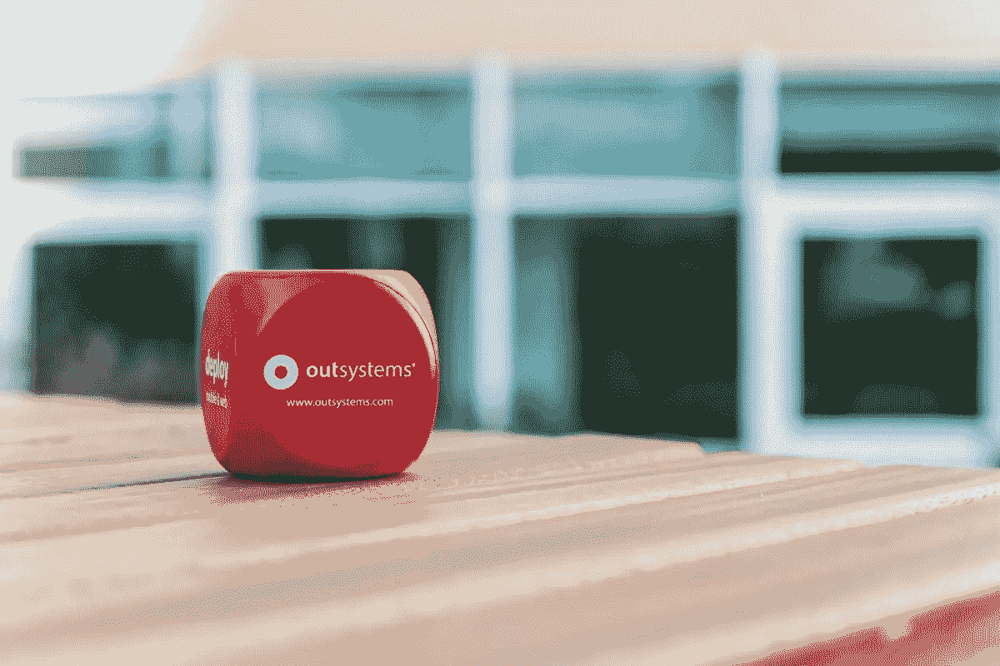

# 软件是一种乐趣:我的日常工作如何变成了使用外部系统的休闲追求

> 原文：<https://itnext.io/software-as-pleasure-f9ef4cad230c?source=collection_archive---------6----------------------->

欢迎我的朋友来我在 medium 的第一篇文章。这是第一次，我决定开始告诉你我的一些动机，以及 [OutSystems](http://www.outsystems.com) 如何在几个方面改变了我的日常生活。*我保证，接下来的帖子会更专业。*

我是一名软件工程师，已经工作了 20 多年，我已经用几种语言开发了软件:C#，java，php，Powerbuilder，Delphi。我尝试了最不同的框架、加速器和任何一种工具来让我的日子更快乐。

我与 OutSystems 的联系始于 2012 年，当时我在巴西的一家公司担任创新经理。我们正在研究改造开发工厂的新方案。因此，我们开始评估一些“神奇工具”来决定最佳替代方案。经过一些失败的尝试和大量的时间损失。在上一次会议上，当我们几乎没有希望解决我们的业务。我们第一次与外部系统取得联系。

我离开那次会议时很惊讶，但我感觉到了不对劲。我问自己:“真的有可能做到他们承诺的一切吗？”。一个月后，他们邀请我们参加一个公开的训练营，以了解更多关于这个平台的信息，并试图说服我们继续下去。在很短时间内，我们已经成为一个概念验证和试点项目，面临着巨大的挑战。我们能够与同一个团队几乎从零开始重建，算上学习路径，这是一个不完整的五年项目。

在那段时间里，我已经不能再用其他语言去思考发展了。他们给我们的每一个挑战，我们总是首先尝试使用这个平台。这是一条自然的道路。每一天我都更渴望发现更多关于它的东西。OutSystems platform 恢复了我再次开发软件的动力。在平台之前，我没有耐心*一点点摆弄，*重新发明轮子创建相同的通用逻辑和更多，痛苦关注所有浏览器。最后，我高兴地醒来去做我的工作，因为我知道我可以成为一个伟大的工作者，并在一天或一周结束时提供一些真正有用的东西。

当我离开那个有机会见到平台的公司时。我为巴西的独家 OutSystems 经销商工作了几年，现在我非常接近平台在葡萄牙里斯本诞生的地方。

这是我与 OutSystems platform 合作的一个故事。我在这个频道的计划不是讲故事。我想如果我做了，你会很无聊。在下一篇文章中，我将开始我的技术内容，并尝试与你分享什么是可能的，并尝试让你分享我今天工作时的感受。

**下一篇:**在外部系统
*中做惊人的报告这将是一篇由 3 部分组成的文章，第 1 部分:使用*[*forge 组件创建报告，第 2 部分:将*](https://www.outsystems.com/forge/component/1414/simple-reports/) [*简单报告与 HTML 结合成 PDF*](https://www.outsystems.com/forge/component/1771/simple-reports-with-pdf/) *，第 3 部分:使用* [*StimulSoft 的复杂报告。JS*](https://www.outsystems.com/forge/component/3062/stimulsoft-reports-js/) *伪造组件(外部付费框架)*

*Fábio Fantato 是一个住在里斯本的巴西人，从事专家咨询工作@ Do IT Lean | OutSystems MVP |热爱创新、电影、技术、烹饪、观光和书籍。*

[**精益生产——您可以依靠的系统专家！**](http://doitlean.com/)