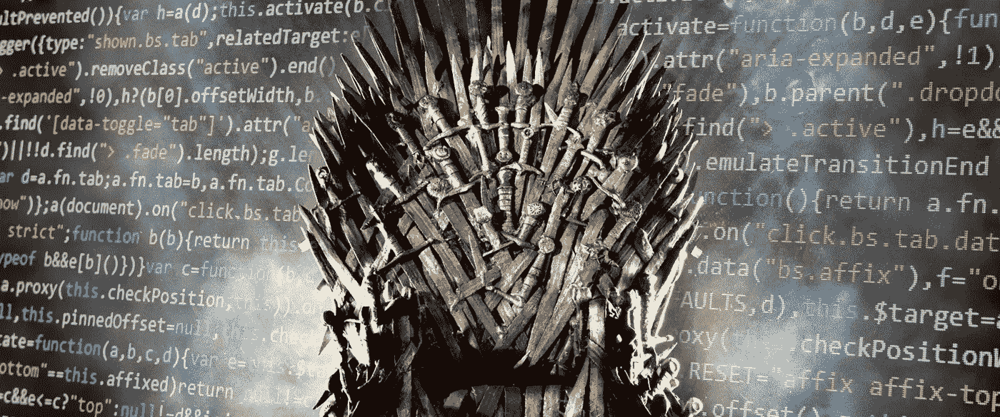
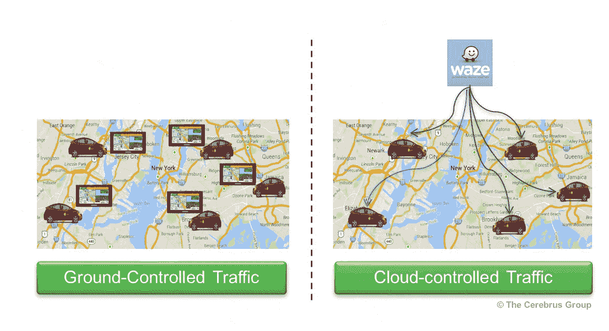
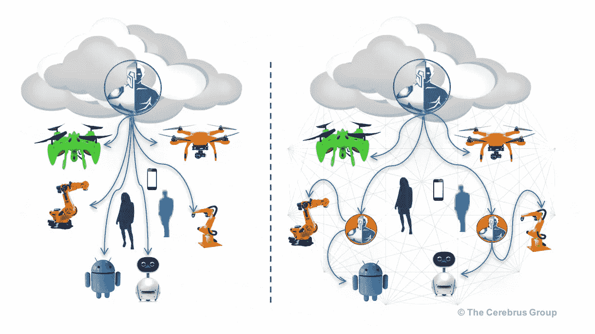
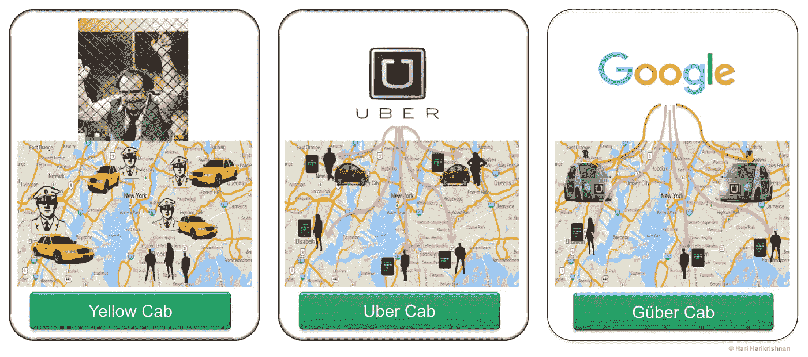
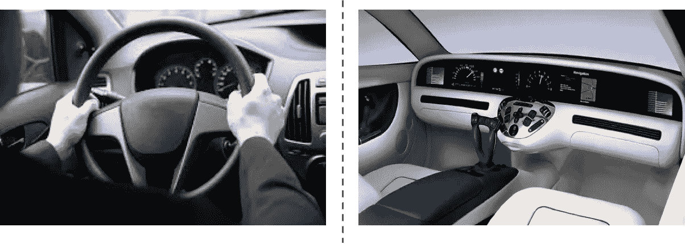

# 软件定义的控制是一场权力的游戏

> 原文：<https://itnext.io/software-defined-control-is-a-game-of-thrones-5262c483bef2?source=collection_archive---------1----------------------->

SDx(软件定义的一切)与软件无关。这是关于控制权的转移。

我们听说软件正在吞噬我们日益数字化的世界。无处不在的互联设备和软件使我们能够随心所欲地改变控制。如果你不小心管理，这种权力的转移会抢了你生意的风头。

以下是科技实现控制权转移的五种方式:

1.  **地到云**
2.  **分散到集中**
3.  **云去边来**
4.  **公司到生态系统**
5.  **人对机器**

上面的前四个越来越复杂。最后一种是最简单的，但也是最有争议的。

## 控制权转移:从地面到云端

几乎被遗忘的是我们的 Garmin 和 Magellan GPSs，它们友好的(或恼人的)声音指引着我们的运动。我们已经将控制权委托给来自云端的更智能的声音。汽车全球定位系统业务已经破产。

> 公理:如果某样东西可以从云端控制，它就会是，也应该是。

## 控制转移:从分散到集中

在电信和网络世界，控制权已经转移了几十年。在网络和电信领域，他们说，“控制平面与数据平面是分离的”。一旦分离，控制可以在地面或云中。分布式网络决策变得集中化(“**软件定义的**”)。软件定义的网络发展类似于生物进化得更加智能。关于这个话题的更多信息，请点击这里。

> 如果控制转移发生在复杂的电话网络和互联网上，它也会发生在你的机器人业务或割草机业务上。

## 控制转移:云到边缘

在工业自动化领域，控制权正在转移。你的无人机或机器人正在连接到一个中心位置，可能在云中。从云中，你可以**协调无人机和机器人**来完成工作，比如监视和安全。这显示在左下方。但是还有更多…

当此类终端的数量增加或您将它们部署到关键任务需求时，您将需要将控制权转移到业务的边缘，如右图所示和本文所述([邻近计算:Edgy，Edgier，Edgiest](https://medium.com/iotforall/whats-proximity-computing-4b713ecf3666) )。这给创新带来了威胁和机遇，更不用说网络层和应用层的架构挑战了。

## 控制权转移:公司到生态系统

这是所有控制转移(MOACS？)。它将所有先前的场景包含在一个宏观的控制转移中。你把人类调度员数字化了。你精心安排了生态系统，然后你用自动化来消灭剩下的人类。更多关于数字化转型的信息，请点击这里(优步[和路易·德·帕尔马](https://goo.gl/0XJSj6))。

嘲笑这个莫阿克斯(所有控制转移之母)是你的危险。如果你这样做，你可能会发现自己被数字价值链所取代。

## 控制转移:从人到机器

由于对就业的影响，这是近十年来最敏感的话题。当你把这看作是人对机器的控制权转移时，这并不是最复杂的。

无论哪个行业，技术带来的控制权转移都将导致深刻的权力转移。你如何适应它并在业务中利用它将决定你的成功。

如果你不这样做，你对企业的控制将会像统治七大王国的人一样短暂。