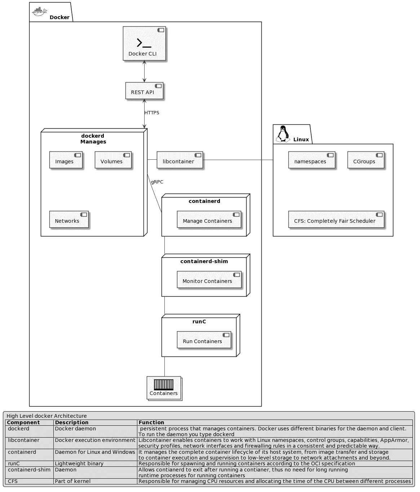
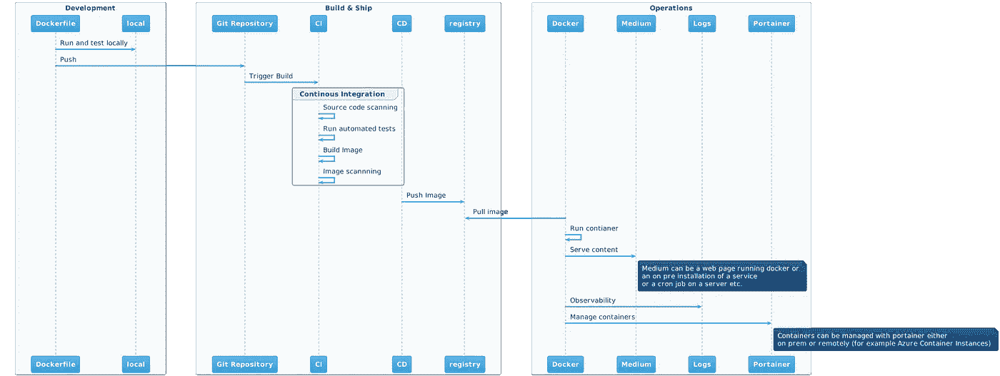
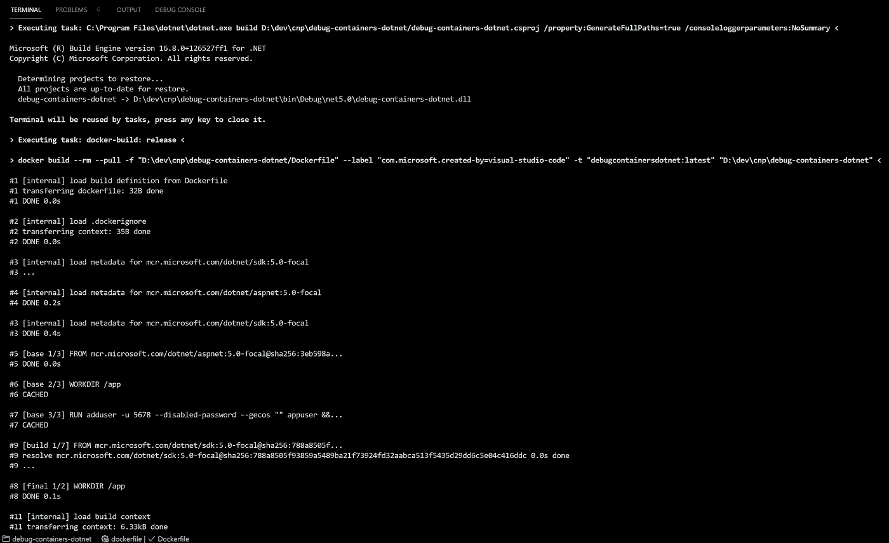
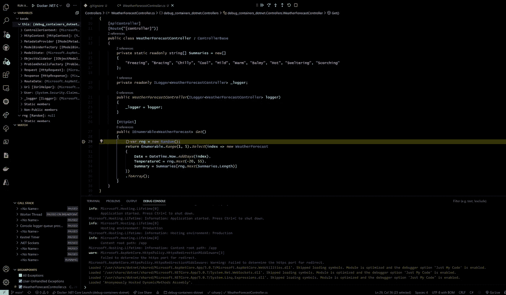
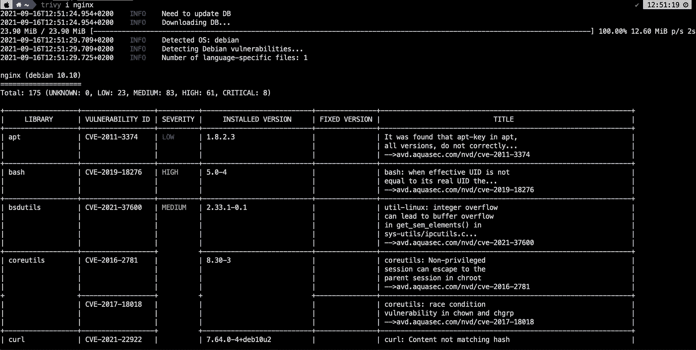
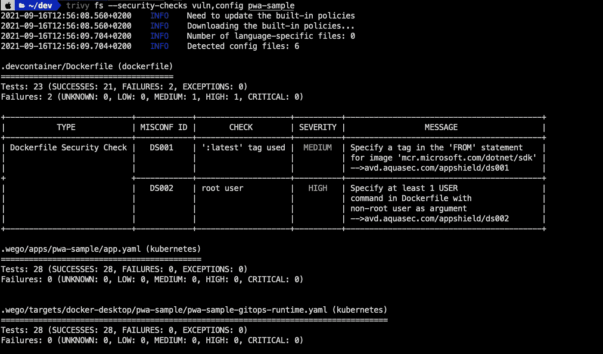
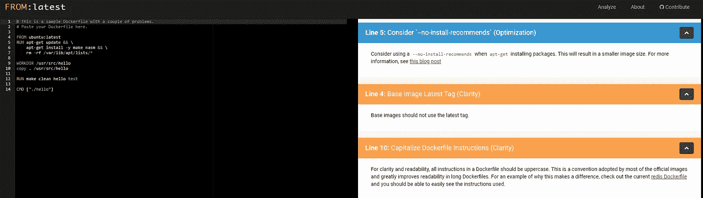
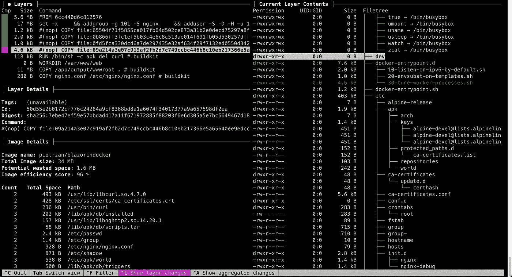
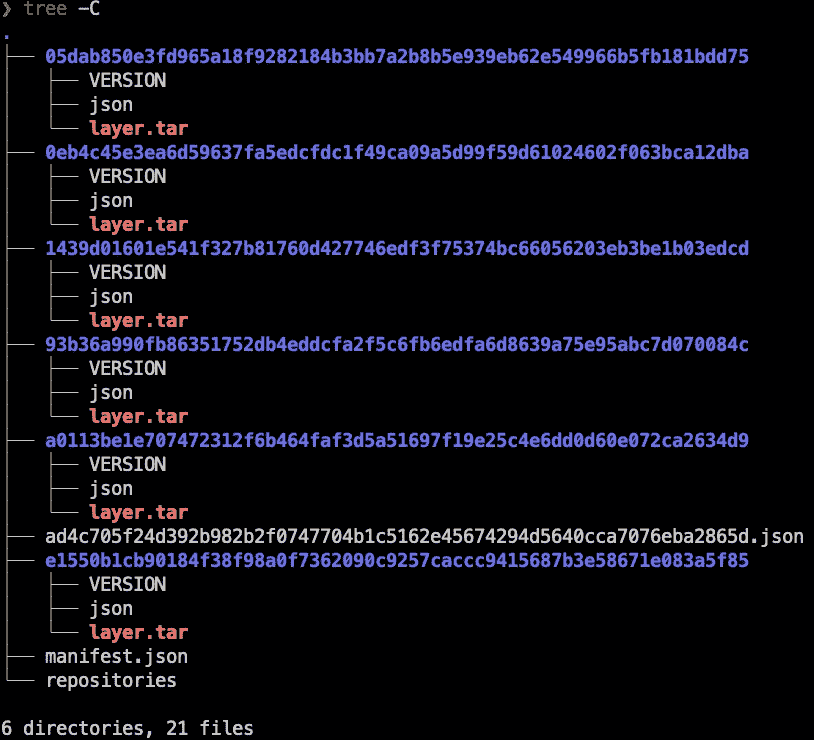

# 容器中的软件开发——一本食谱

> 原文：<https://itnext.io/software-development-in-containers-a-cookbook-2ba14d07e535?source=collection_archive---------0----------------------->


布雷特·乔丹在 [Unsplash](https://unsplash.com/s/photos/seafood-cookbook?utm_source=unsplash&utm_medium=referral&utm_content=creditCopyText) 上的照片

## 开发容器化软件指南

## 介绍

本文描述了在容器化工作负载的整个生命周期中的容器化最佳实践；重点是**发展**和**安全。**我们来看看:

*   容器图像设计指南
*   开发、调试和测试
*   安全最佳实践
*   CI/CD 管道
*   操作和维护

如果您是一名软件开发人员**开始您的容器开发之旅，您会发现它非常有用。即使是高级开发人员也可能到处学到一些技巧。**

此外，还有针对安全专业人员**以及自动化工程师**或 SREs (Ops)的内容。****

> 一点免责声明，如果你的头衔是 DevOps 工程师，请不要觉得被冷落了。你一定会从这篇文章的内容中受益。只是 DevOps 不是一个头衔既不是一个角色也不是一个团队，而是一种哲学和文化。不幸的是，在大多数公司中，DevOps 实际上意味着自动化工程和软操作(主要是配置和处理 Kubernetes 和其他复杂的软件)。因此，如果你在某处读到“自动化工程师”，那意味着 DevOps 工程师。

本文档旨在作为开发和运行容器化软件的框架和指南。这篇文章仅仅是关于容器的，如果你对容器编排感兴趣，看看我之前的两篇博客，[用 Kubernetes 编排容器](/how-to-be-a-devops-maestro-containers-orchestration-guide-b2cf884eaed1)和[在 Kubernetes](/best-practices-for-developing-on-kubernetes-8fbdbba12538) 上开发。

有很多内容需要讨论，所以让我们开始吧！

# 基本原则

## 基本定义和概念

> 容器

容器是容器映像的运行时实例。容器是一个标准的 Linux 进程，通常通过使用 cgroups 和名称空间来进一步隔离。

> 容器图像

从最简单的定义来看，容器映像是一个从注册服务器下载的文件，在启动容器时用作本地挂载点。

> 容器主机

容器主机是运行容器化流程的系统，通常简称为容器。

> 集装箱发动机

容器引擎是一个软件，它接受用户请求，包括命令行选项，提取图像，并从最终用户的角度运行容器。集装箱引擎有很多，包括 docker、RKT、CRI-O、LXD 等。

> 图像注册表

注册服务器本质上是一个奇特的文件服务器，用于存储 docker 存储库。通常，注册服务器被指定为一个普通的 DNS 名称和一个可选的要连接的端口号

## 概观

本文档假定您对 Docker 和 Docker CLI 有基本的了解。要学习或复习与容器相关的概念，请参考官方文档:

*   [Docker 文档](https://docs.docker.com/)
*   [米兰蒂斯文件](https://docs.mirantis.com/welcome/)

> [*米兰蒂斯 2019 年 11 月收购 Docker Enterprise*](https://techcrunch.com/2019/11/13/mirantis-acquires-docker-enterprise/?guce_referrer=aHR0cHM6Ly93d3cuZ29vZ2xlLmNvbS8&guce_referrer_sig=AQAAAChqDhj765aUpAQfg-rkCWE0kB-4eAJn0VdTGsf35u6hGrL6scvqoLar-_xYPJazylmp15VqXquNq69HWpYx3cepSnXSSUTirYLSMJEbPuBhQOfS4blsGLwsULwWzxK8iaH3zb2KplXRwnpdfMu9iz5Azc2czZr9T5bFwq0AIeN3&guccounter=2)

请注意，由于大多数开发活动将从“docker stack”(docker CLI、docker CE、docker desktop 等)开始，所以大多数时候我们将参考 docker 工具。每个提到的组件都有很多替代方案。例如，podman、buildah、buildpacks 和许多其他技术都不是来自 Docker 公司。

容器操作系统也是如此，一些 windows 容器超出了本文的范围。

## Docker 架构概述

有关 docker 架构的详细信息，请参考 Docker 或 Mirantis 文档。这里有一个解释高级 docker 架构及其组件的方便的图表。



*来源*:

*   [案卷号](https://docs.docker.com/engine/reference/commandline/dockerd/)
*   [集装箱](https://containerd.io/)
*   [runc](https://github.com/opencontainers/runc)
*   [libcontainer](http://jancorg.github.io/blog/2015/01/03/libcontainer-overview/)
*   [集装箱垫片](https://medium.com/faun/docker-containerd-standalone-runtimes-heres-what-you-should-know-b834ef155426)

## 容器生命周期

当您开始开发容器化的工作负载时，与开发常规软件有很多相似之处，但也有一些关键的区别。下图提供了容器化工作负载生命周期各个阶段的简化视图。



## Docker CLI 语法

Docker CLI 具有以下语法:

语法:`docker <docker-object> <sub-command> <-options> <arguments/commands>`

**示例** : `docker container run -it ubuntu`

## 容器层

默认情况下，所有 docker 图像层都是不可变的(只读)。当使用`docker run`命令创建一个容器时，会创建一个额外的可变(读写)层。**该层仅在容器寿命期间存在，一旦容器退出**将被移除。当修改正在运行的容器中的任何文件时，docker 会创建文件的副本，并在保存更改之前将其移动到容器层(写入时复制)。作为图像一部分的原始文件永远不会改变。

## 从 CLI 访问远程 Docker 主机

在您想要访问 docker 主机的机器表单上，设置变量:

```
export DOCKER_HOST="tcp://<docker-host-ip>:2375"
```

> *Docker 默认端口:*
> 
> 2375 —未加密的流量
> 
> 2376 —加密流量。
> 
> ***重要*** *:此设置仅用于测试/游乐场目的。它将使 docker 主机在网络上可用，默认情况下没有认证。*

## 以非超级用户身份使用 docker CLI

1.  创建码头工人组:`sudo groupadd docker`
2.  创建一个你想使用 docker 的非根用户:`sudo useradd -G docker <user-name>`
3.  更改该用户主组:`sudo usermod -aG docker <non-root user>`
4.  注销并使用 docker 用户登录。
5.  可选—重新启动 docker 服务:`sudo systemctl restart docker`

# 发展

强烈推荐使用带有 Docker 插件的 VS 代码进行容器开发。

> [*这里的*](https://www.digitalocean.com/community/tutorials/how-to-use-the-docker-plugin-for-visual-studio-code) *是一个很好的关于热设置和使用 Docker 扩展与 VS 代码*的写法
> 
> [*阅读构建 Dockerfiles 的最佳实践*](https://docs.docker.com/develop/develop-images/dockerfile_best-practices/)

## 快速创建 Dockerfile 文件存根

如果您使用带有 Docker 扩展的 VS 代码，您可以为您的项目快速创建一个 *Dockerfile* 存根。

*   用 VS 代码打开包含项目的文件夹
*   转到命令面板 Ctrl+Shift+P 并键入`Docker: Add Docker Files to Workspace`
*   从下拉框中选择您的语言，并回答几个问题
*   您的 docker 文件将在您当前所在的目录中生成
*   确保调整文件，但是模板已经很好了

## 如何调试映像构建过程

要构建映像，您可以使用 docker CLI `docker build --progress=plain -t imagename:tag -f Dockerfile .`或使用 VS Code Docker 扩展来完成同样的工作

> *`*--progress=plain*`*标志创建到 stdout 的详细输出，并且在使用 Docker 扩展时默认启用。**

**

*当创建一个 *Dockerfile* 时，每个新的命令，如 RUN、ADD、COPY 等，都会创建一个新的中间容器，您可以在其中执行和调试。*

> **如果 docker 主机支持使用* `*buildkit*` *(从 1.18 版本起)的新构建机制或使用 docker build 的旧构建机制，调试步骤会有所不同。Buildkit 调试相对复杂，因此在运行 docker build 命令之前，使用* `*DOCKER_BUILDKIT=0*` *更容易切换到 docker 构建方式。此设置将临时将内部版本切换到旧版本。**

## *使用旧版本调试 Dockefile 构建过程的步骤*

*   *克隆测试存储库，或者使用 Dockerfile 创建一个包含您想要调试的错误的新存储库*
*   *运行遗留构建命令`DOCKER_BUILDKIT=0 docker build --rm=false -t wrongimage -f Dockerfile.bad .`*
*   *这个 Dockefile 产生一个错误，文件夹丢失*

```
*Step 17/19 : WORKDIR /app ---> Running in 21b793c569f4 ---> 0d5d0c9d52a3 
Step 18/19 : COPY --from=publish /app/publish1 . 
COPY failed: stat app/publish1: file does not exist*
```

*   *请注意，在错误的正上方有一条消息，中间图像 ID 为 0d5d0c9d52a3*
*   *由于我们使用了标志`--rm=false`，中间图像不会被删除，我们可以使用`docker image ls`将其列出*
*   *让我们以交互模式从这个图像开始一个新的容器`docker run -it 0d5d0c9d52a3 sh`*
*   *在容器内部，我们可以看到没有创建所需的文件夹*

## *如何调试运行在容器中的应用程序*

*当一个`launch.json`文件存在并且包含关于如何启动和调试 docker 容器的指令时，在容器中运行的应用程序可以直接从 IDE 中调试。*

> **强烈建议使用* [*带 Docker 扩展名*](https://github.com/microsoft/vscode-docker) *的 VS 代码，轻松将* [*Dockerfile 和调试设置添加到项目*](https://code.visualstudio.com/docs/containers/debug-netcore) *中。**

*   *[点击此处](https://dev.azure.com/GRD-EMEA/Cloud%20Native%20Platform/_git/debug-containers-dotnet)查看已经设置好的 ASP.NET 核心 WebAPI 项目示例*
*   *克隆项目*
*   *`cd`进入项目目录*
*   *`code .`打开 VS 代码*
*   *选择`docker: initialize for debugging`并按照向导进行操作*
*   *切换到`Run and Debug`视图 Ctrl+Shift+D*
*   *选择`Docker .NET Launch`*
*   *在控制器中设置断点*

**

## *使用多阶段构件*

*在多阶段构建中，您创建一个中间容器——或阶段——带有所有必需的工具来编译或生成您的最终工件(即最终的可执行文件)。然后，您只需要将结果复制到最终的映像中，而不需要额外的开发依赖、临时构建文件等等。*

*精心制作的多阶段构建只包括最终映像中最少的所需二进制文件和依赖项，而不构建工具或中间文件。这减少了攻击面，减少了漏洞。*

*它更安全，而且还减小了图像尺寸。*

*考虑下面 Dockerfile 构建一个 go API。文件注释中解释了多阶段构建的使用。你自己试试！*

## *使用发行版图像*

*使用最低要求的基本容器来遵循 Dockerfile 最佳实践。*

*理想情况下，我们会从头开始创建容器，但是只有 100%静态的二进制文件才有效。*

*发行版是一个不错的选择。它们被设计成只包含运行 Go、Python 或其他框架所需的最小库集。*

## *使用 docker-slim 来确保你的形象尽可能的瘦*

*容器映像应该很小，并且只包含容器化的工作负载正确工作所需的组件/包。这很重要，有两个主要原因:*

*   *安全性:通过删除不必要的包使图像变小，大大减少了攻击面*
*   *性能:较小的图像启动速度更快*

> *[*docker-slim*](https://github.com/docker-slim/docker-slim)*自带多种选项。它支持瘦身图像，扫描 docker 文件等。最好的方法是按照* [*演示设置*](https://github.com/docker-slim/docker-slim#demo-steps) *中的步骤开始。**

## *机密信息和秘密*

*使用`.dockerignore`将不必要的文件排除在构建容器之外。它们可能包含机密信息。*

*Docker 默认使用 [biuildkit](https://github.com/moby/buildkit) 来构建图像。buildkit 的特性之一是能够使用`RUN --mount=type=secret`将秘密装载到 docker 映像中。这适用于在映像构建过程中需要使用秘密的场景，例如从 git 获取凭证等。*

*以下是如何检索和使用机密的示例:*

*   *创建一个秘密文件或环境变量:`export SUPERSECRET=secret`*
*   *在 docker 文件中添加`RUN --mount=type=secret,id=supersecret`，这将使`/run/secrets/supersecret`下的图像中的秘密可用*
*   *像这样用你的秘密建立形象:*

```
*export DOCKER_BUILDKIT=1docker build --secret id=supersecret,env=SUPERSECRET .*
```

*这将从环境变量 SUPERSECRET 安全地添加到容器中。检查图像历史或分解图层不会揭示这个秘密。*

## *使用多个 docker 文件*

*考虑为不同的目的创建单独的 docker 文件。例如，您可以拥有一个预先安装了测试和扫描工具的专用 docker 文件，并在本地开发阶段运行它。*

> **记住，你可以通过传递* `*-f*` *标志从不同的 docker 文件建立镜像，例如**

```
**docker build -t -f Dockerfile.test my-docker-image:v1.0 .**
```

## *使用 docker-compose 旋转多个容器*

*[Docker-compose 规范](https://compose-spec.io/)是一个以开发人员为中心的标准，用于定义云和平台无关的基于容器的应用程序。不要使用`docker CLI`直接从命令行运行容器，考虑创建一个`docker-compose.yaml`来描述组成应用程序的所有容器。*

> **请注意，用 docker compose 规范描述的应用程序是完全可移植的，所以你可以在本地或 Azure 容器实例中运行它**

## *使用 Kompose 将 docker-compose 文件转换为 Kubernetes 清单*

*如果你已经有一个 docker-compose 文件，并且需要一个生成 Kubernetes YAML 文件的启动，使用 kompose。*

*`kompose`允许从`docker-compose.yaml`文件到本地 Kubernetes 清单文件的快速转换。*

> **你可以从* [*首页*](https://kompose.io/) 下载 Kompose 二进制文件*

## *使用 composerize 从 docker 运行命令快速创建 docker 合成文件*

*Docker run 命令可以快速表示与容器交互的命令式风格。另一方面，Docker-compose 文件是一种提供的声明式风格。*

*[compose](https://github.com/magicmark/composerize)是一个简洁的小工具，可以快速地将一个冗长的`docker run`命令转换成一个`docker-compose.yaml`文件。*

> **compose 可以从 CLI 或基于网络的界面*[](https://www.composerize.com/)**生成 docker-compose 文件。***

**下面是一个从我的一个图像转换 docker 运行命令的例子:**

****

## **通过容器控制资源利用**

****CPU****

**每个容器的默认 CPU 份额是 1024**

****选项 1:** 如果主机有多个 CPU，可以给每个容器分配一个特定的 CPU。**

****选项 2:** 如果主机有多个 CPU，可以限制容器可以使用多少 CPU。**

**值得注意的是，容器编排器(如 Kubernetes)提供了声明性的方法来限制每个运行时单元的资源使用(在 Kubernetes 中是 pod)。**

****记忆****

****选项 1:** 运行带有`--memory=limit`标志的容器来限制内存的使用。如果一个容器试图消耗比它的限制更多的内存，系统将杀死它，并以内存不足异常(OOM)退出进程。默认情况下，容器将被允许使用与内存限制相同的交换空间，实际上是内存限制的两倍。当然前提是交换空间在主机上没有被禁用。**

## **仅映射您想要打开的端口**

**端口映射总是从主机到容器，因此`-p 8080:80`将是主机上端口 8080 到容器上端口 80 的映射。**

> ***提示:在生产中运行容器时，最好使用带有静态端口的“-p”选项。***

## **使用 trivy 扫描图像漏洞**

**使用开源图像时，扫描安全漏洞至关重要。幸运的是，有很多商业和开源工具可以帮助完成这项任务。**

> **[来自 Aquasecurity 的 trivy】](https://www.aquasec.com/products/trivy/)**

**使用 trivy 是琐碎的；)`trivy image nginx`揭示了一个带有 CVEs 链接的漏洞列表**

****

**此外，除了扫描图像，trivy 还可以搜索 other 文件和其他配置中的错误配置和漏洞。**

**下面是对一个示例项目的简单扫描结果:**

****

## **在 Dockerfile 上使用棉绒**

**作为开发过程的一部分，确保你的 docker 文件有良好的林挺规则。**

**一个很好的例子是 Replicated 开发的一个叫做[的简单工具。](https://www.fromlatest.io/#/)**

**以下是该工具的屏幕截图及建议:**

****

> ***考虑在你选择的编辑器中安装林挺插件，并在你的 CI 流程中运行林挺。***

## **使用潜水检查图像**

**Docker 和类似的工具提供了检查图像的选项。**

**`docker inspect [image name] --format` -该命令将以 JSON 格式显示图像信息。**

> ***您可以通过管道将命令输出到* `*jq*` *并查询结果。例如，如果你有一个 nginx 图像，你可以很容易地查询像这样的环境变量***

**然而，这种信息是相当初步的。要更深入地检查图像，使用[潜水](https://github.com/wagoodman/dive)**

****

**遵循您的系统的安装说明。Dive 显示了用于创建图层的图像内容和命令的详细信息。**

## **分解图像**

**如果您不能安装像 dive 这样的工具，可以使用这个简单的方法来分解容器映像。**

**容器图像只是包含其他文件作为层的 [tar 文件](https://en.wikipedia.org/wiki/Tar_(computing))。**

**以下是如何提取和保存 Nginx 图像并检查其内容:**

```
**docker save nginx > nginx_image.tar mkdir nginx_image cd nginx_image tar -xvf ../nginx_image.tar tree -C**
```

**每一层对应 Dockerfile 中的命令。提取一个`layer.tar`文件将显示该层的文件和设置。**

****

## **考虑签名和验证图像**

**供应链攻击最近越来越频繁。可信且可验证的源代码和可追溯的[软件材料清单](https://en.wikipedia.org/wiki/Software_bill_of_materials)对于整个生态系统的安全性和完整性至关重要。**

**您可以使用来自 [SigStore 项目](https://www.sigstore.dev/)的工具为您的图像签名**

> ***Sigstore 是* [*Linux 基金会*](https://www.linuxfoundation.org/) *的一部分，将自己定义为“软件签名、验证和保护的新标准”。***

**SigStore 旗下有很多工具，但我们感兴趣的是 [Cosign](https://github.com/sigstore/cosign) 。遵循 Cosign repo 中的安装步骤。**

**以下是如何签名您的图像并将其推送到 Docker hub:**

```
**cosign generate-key-pair #this will generate 2 files, one with private and one with public key cosign sign -key cosign.key <dockeruser/image:tag>**
```

# **建造和运输**

**由于标准化的打包(映像)和运行时(容器)，运送容器化的软件变得更加容易和更加简化。CI/CD 和系统自动化工具极大地受益于此。**

**如今，管道遵循**“X-As Code”**运动，被表示为 YAML 文件，并与源代码文件一起托管在 git 存储库中。**

**这些 YAML 文件的确切语法因提供商而异。Azure DevOps、GitHub、GitLab 等都会有它们的变种。**

**然而，有几个关键的组成部分。以下是 Azure DevOps 的 YAML 管道文件示例，包含最重要的定义:**

*   ****资源**:管道运行所需的额外资源。可以是其他管道、图像存储库等**
*   ****触发**:如何触发流水线，只能针对特定的分支，拉取请求等**
*   ****路径**:对于触发器分支/PR，源代码工作的路径是什么**
*   ****变量**:为了方便起见，大多数管道运行程序会提供一种将变量注入管道的方法**
*   ****池**:运行管道作业的虚拟机或容器**
*   ****阶段**:流水线的连续阶段，阶段是作业的逻辑分组**
*   ****作业**:阶段内的另一个分组级别**
*   ****任务**:对工件/源代码执行的实际活动**

**一般来说，CI/CD 管道还有更多的内容，这里的重点是实际上从项目的开始就包含一个管道。**

## **使用 Kaniko 或 Buildah 构建图像**

**为了增加安全性，考虑使用 [Kaniko](https://github.com/GoogleContainerTools/kaniko) 或 [Buildah](https://buildah.io/) 代替 Docker 在管道中构建图像。**

**这两个工具都不依赖于 Docker 守护进程，并且完全在用户空间中执行 Docker 文件中的每个命令。这使得在不能轻松或安全地运行 Docker 守护进程的环境中构建容器映像成为可能，比如标准的 Kubernetes 集群。Kaniko 更倾向于在 Kubernetes 集群中构建图像，而 Buildah 只处理 docker 图像就可以了。**

## **在构建过程中实现图像扫描**

**图像扫描是指分析内容的过程和容器图像的构建过程，以便检测安全问题、漏洞或不良行为。**

> ***推荐:目前有三种主要的图像扫描工具***
> 
> ****Snyk****
> 
> **Sysdig**
> 
> **Aqua 我推荐使用 Snyk，更详细的对比请看[这个博客](https://codefresh.io/security-testing/comparison-snyk-aqua-security-sysdig/)**

**将图像扫描与 CI/CD 管道集成时，请遵循以下最佳实践:**

1.  **扫描来自构建管道(CI)的图像**
2.  **在从存储库中创建容器之前，扫描存储库中的图像(CI)**
3.  **扫描运行中的容器(CD)**
4.  **始终明确固定映像版本(不要使用“最新”或“暂存”标签)**

> ***关于如何使用 Synk 与 Azure Pipelines 集成图像扫描的详细说明，例如，请参见 Snyk 文档*[](https://support.snyk.io/hc/en-us/articles/360004127677-Azure-Pipelines-integration)**

# ***操作***

***如今，在原始容器上的操作(没有 orchestrator)主要发生在简单的工作负载或非生产环境中。物联网或边缘设备是一个例外，但即使在这些领域，Kubernetes 也迅速占据了主导地位。***

## ***装置***

***在 Linux 发行版上安装 docker 引擎非常简单。请遵循 Docker 文档中的[安装步骤](https://docs.docker.com/engine/install/)。***

***在 Windows Server 上安装 docker engine 有点困难，按照本教程[安装和配置所有的先决条件。](https://computingforgeeks.com/how-to-run-docker-containers-on-windows-server-2019/)***

> ****默认情况下，只有 windows 容器才会在 Windows 服务器上运行。Linux 容器必须额外打开(以上文档的一部分)****

**一旦 docker 主机安装完毕，您就可以使用 [Portainer](https://www.portainer.io/) 与显示器交互并排除故障。**

**根据您所处的环境选择[安装选项](https://documentation.portainer.io/v2.0/deploy/ceinstalldocker/)。**

****

***样本便携式仪表板***

> ***安装完成后，docker 会在* `*/var/lib/docker/*` *下创建一个文件夹，存储所有的容器、映像、卷和配置。Kubernetes 和 Docker Swarm 将集群状态和相关信息存储在*[*etcd*](https://etcd.io/)*中。默认情况下，etcd 在端口* `*2380*` *上监听客户端连接。***

## **使用瞭望塔更新图像**

**由于 docker 主机不提供自动图像更新，当图像被推送到您的图像注册表时，您可以使用[了望塔](https://containrrr.dev/watchtower/)自动更新图像。**

```
**docker run -d \ 
--name watchtower \ 
-e REPO_USER=username \ 
-e REPO_PASS=password \ 
-v /var/run/docker.sock:/var/run/docker.sock \ 
containrrr/watchtower container_to_watch --debug**
```

# **摘要**

**如今，开发容器化的工作负载是服务器端软件开发的主要模式。无论您是在处理 web 应用程序、API、批处理作业还是服务，都有可能在某个时候将“Dockerfile”添加到项目中。**

**当这种情况发生时，希望你已经收藏了这篇文章，并会在这里找到从一开始就做事情的灵感和指导。**

# **链接和资源**

1.  **[Docker Cheatsheet](https://github.com/wsargent/docker-cheat-sheet)**
2.  **[作曲规范](https://www.compose-spec.io/)**
3.  **[码头文件](https://docs.docker.com/)**
4.  **[米兰蒂斯文件](https://docs.mirantis.com/welcome/)**
5.  **[码头工人手册](https://www.freecodecamp.org/news/the-docker-handbook/)**
6.  **[Docker Deep Dive——奈杰尔·波尔顿著](https://nigelpoulton.com/)**