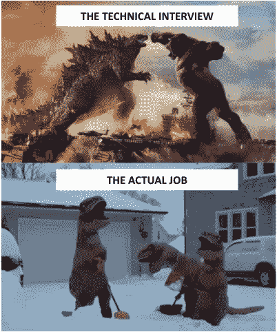
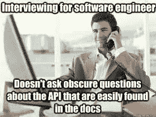
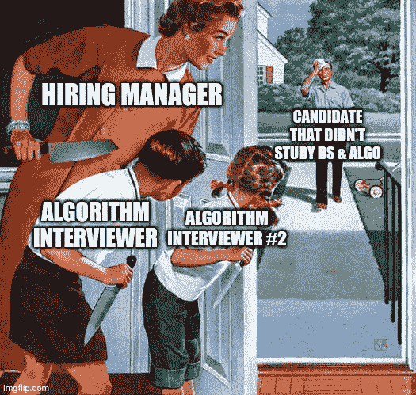
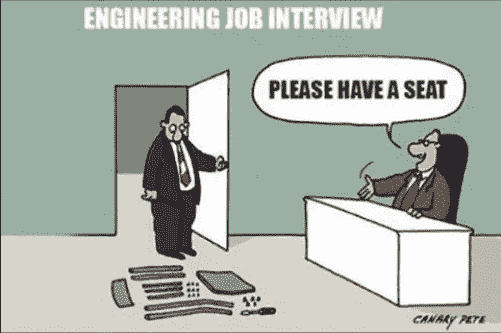
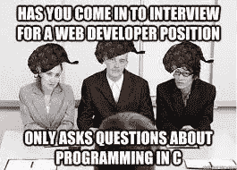
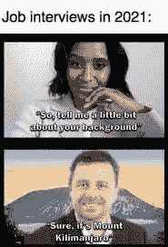

# 软件面试流程建议

> 原文：<https://itnext.io/software-interview-processes-recommendations-faf7e1d987c2?source=collection_archive---------1----------------------->


您好，在这篇文章中，我将与您分享我在一段时间内发生的一些看法，以便双方在软件面试中有良好的体验。

首先，不管面试结果如何，我认为面试应该对双方都有贡献。候选人应该能够通过学习新的东西来结束面试。这些东西可以是技术主题、过程、产品或方法。

另一方面，面试官应该学会分析不同性格的人，衡量不同的知识水平，引导主题，创造健康的交流环境。

在这一进程中，各方负有重要的责任。现在，让我们回顾一下我们将研究这些职责的主题。

## 初步的

我想提的第一个问题是，双方在面谈之前应该有关于对方的信息。

了解你将要面试的公司、团队和项目的信息包含了准备面试的重要线索，你可以预测你将会遇到什么。它可以让你提前准备一些面试时可以问的问题。

有了候选人的信息，可以让面试官有一个适合候选人水平和经验的面试，跳过枯燥的面试问题，直接通过候选人在之前项目中承担的任务和做过的工作来衡量他的动手经验。

这种初步准备也节省了面试时解释简历或团队所浪费的时间。

## 解决问题的能力

与其试图衡量你面试的候选人的知识，不如问一些揭示候选人解决问题能力的问题，这将有助于你看到你面试的人的能力。特定的信息，一段代码，一个框架的行为可能在那一刻不会浮现在脑海里，它可能会被遗忘。这并不意味着你面前的这个人是无知的。

面试者不应该忘记的一点是，他们必须在面试中展示他们解决问题的技巧。

## 不个性化流程

个性化流程意味着什么？面试中有哪些流程可以个性化？

对于参加面试的候选人来说，你应该考虑到向你提出的问题并不是让你无法回答，而是为了衡量你对某个主题了解多少。这些对立的想法会让你在面试中紧张，感到走投无路。

另一方面，面试官不应该对应聘者抱有自我满足的动机。如果不注重了解候选人知道什么，面试官不应该试图获得针对已经知道的主题的预先准备好的答案。请注意，你不是在争夺霸权。这里有一个非常重要的道德价值，在那一刻，你的公司给你的责任是把值得的人带到他们值得的位置上。你不能滥用这一职责。

另一件不应该个人化的事情是，不管面试过程如何，你应该描述你的问题(例如，一个在工作生活中与你有问题的人)而不要个人化，通过因果关系。那么如何做到这一点呢？比方说，当你被问到你感到不舒服的事情时，不要说“我对 A 感到不舒服，我不与他一起工作，他是如此如此”，而不是说“展示 x 行为导致 y 结果，这些负面结果扰乱了员工的动机/平静”，这表明你没有将问题个人化，相反，你赞成改进流程。

## 实事求是

是的，另一个重要的问题是要现实。接受面试的候选人应该首先确定他们对公司、工作环境以及将要共事的团队的期望(工资、附加福利、技术责任、文化)，还应该能够透明地表明他们可以将他们加入团队。从维持自己和对方的动力来说，这是一个重要的情况。他还应该意识到，假装做他还没有做过的事情不会给人留下好印象，因为这会削弱当前的团队活力。



另一方面，面试官不应该以一种不能满足求职者期望的方式来提高他们的期望。上面的图片总结了我要说的内容。一个加入团队的开发人员认为他将每天处理不同的技术挑战，当他一天只处理 crud 事务时，他将很快失去动力和热情。

## 几条建议

是的，到目前为止我们已经讨论了一般的话题。现在，我想简单地与你分享几个建议。

**开发者**:在开始解决向你提出的问题之前，先提问，了解问题的程度。设置限制。有多少用户将使用该系统？流程可以异步管理吗？高可用性，一致性优先级是什么…


**面试官**:你不应该把应聘者单独留在面试中。当你感觉到被采访者迷失的那一刻，你就必须承担起引导的角色。

**开发者**:问题没有单一正确的解决方案。有不同的方法。不要被骗以为对方在等你一个单一明确的回答。解读问题。



**面试官**:你不能用刻板的问题来衡量任何知识或能力。不要使用死记硬背的面试问题和技巧。

**开发者**:当你遇到一个你不知道的问题时，不要直接说你不知道就扔了。在最糟糕的情况下，试着通过提问找到方向，找出自己不知道的地方，这样你就可以想出解决的办法。否则，你产生解决方案的能力是无法衡量的。



**面试官**:应聘者不是你提问的犯人。他们不必记住你在工作场所专门学到的主题、工具或代码。意识到这一点后，衡量受访者针对某一主题的方法。不要试图衡量纯粹的知识。

**开发者**:实践主题如设计模式、微服务、数据结构、DDD、单元测试、架构、缓存、缩放、cap、消息代理、CI/CD。这些话题会在大多数面试中出现。



**面试官**:就某个考生不知道或不能正确回答的问题告知考生。你和你的公司都会在一个通过学到东西而离开面试的候选人眼中获得价值。这样，即使面试是负面的，双方都不会有损失。

**开发人员**:你将合作的团队、你将做的工作、使用的技术、开发的项目、做生意的方式、公司文化、事故管理……对你想到的任何事情提出问题。如果你不在一个快乐和富有成效的环境中工作，你就不会对自己或公司有益。



面试官:就你正在处理的问题提出问题，以便为你的团队找到合适的人，这可以让你招募到有相同观点和兴趣的人。如果你问乌托邦问题的人写道“只是垃圾”，他们会失望的。

**开发者**:对于一些你实际上一无所知的事情，不要假装你知道。这很容易理解，当然不会给人留下好印象。

面试官:从符合当前团队文化的人中选择你的同事。某人不会因为有技术知识就被纳入团队，也不会因为你发现他技术知识不足就被淘汰。技术知识可以以后再获得。

不要贬低你的旧公司或同事。如果你有问题，谈论“有问题的行为”,不要把它个人化。



**面试官**:获取候选人过去项目和兴趣的最新信息。不要问有趣的问题，如什么是固体，什么是工厂模式，对一个有经验的候选人谁工作过良好的项目。

**开发者**:会问一些问题来衡量你在一个主题上的经验。不要感到走投无路或被质疑。记住，在这个过程中，你可以提出反问题，你不必知道所有的事情。

感谢您阅读至此。另一篇文章再见。

```
**Want to Connect?**Twitter: [https://twitter.com/mstrYoda_](https://twitter.com/mstrYoda_)
Linkedin: [https://www.linkedin.com/in/emre-savc%C4%B1-70a849a6/](https://www.linkedin.com/in/emre-savc%C4%B1-70a849a6/)
Github: [https://github.com/mstrYoda](https://github.com/mstrYoda)This is a translation of [one of my Turkish articles](https://medium.com/@mstryoda/yazılım-mülakat-süreçleri-tavsiyeler-f1a4d70e8887).
```