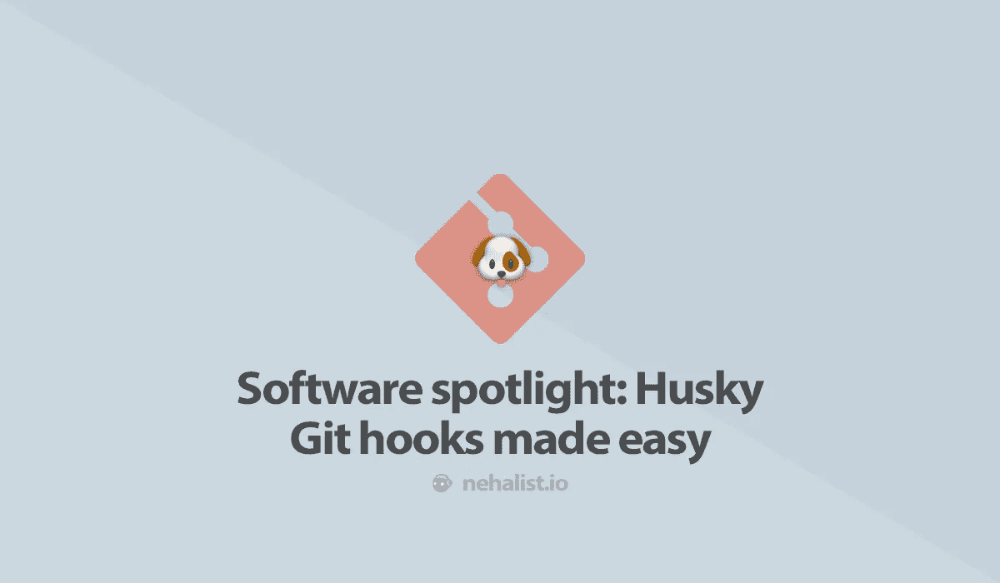

# 软件聚焦:Husky，git 挂钩变得简单

> 原文：<https://itnext.io/software-spotlight-husky-git-hooks-made-easy-dc326e6c9dbb?source=collection_archive---------5----------------------->



我几乎每天都偶然发现伟大的开源库或工具——其中一些拥有数以千计的 GitHub 之星，但我从未听说过它们。我想仅仅在 GitHub 上就有超过 1 亿个仓库的事实可以解释这一点。

然而，我总是喜欢在我的博客上做一些系列文章——我想展示我的一些发现是一个很好的方式——特别是因为其中一些已经成为我自己工作流程中的一个重要元素。

所以这是第一个(希望有很多！)**软件 spotlight，**特色[**Husky**](https://github.com/typicode/husky)**by**[**typicode**](https://twitter.com/typicode?lang=de)，一个开源库，方便创建 git 钩子的过程。****

# ****哈士奇，Git 挂钩变得简单****

****Husky 是一个简单的工具，它使得在你的`package.json`中轻松创建 [git 钩子](https://git-scm.com/book/uz/v2/Customizing-Git-Git-Hooks)成为可能。****

*   ****[储存库](https://github.com/typicode/husky)****
*   ****GitHub 上超过[15000 颗星](https://github.com/typicode/husky/stargazers)****
*   ****GitHub 上超过 160，000 个存储库使用(例如，webpack、babel、Next.js、create-react-app 等)****
*   ****每周超过[150 万次下载](https://www.npmjs.com/package/husky)****

# ****它的作用****

****Husky 允许您简单地在您的`package.json`中添加挂钩，而不是在您的`.git`目录中手动创建 git 挂钩，例如:****

```
**{
  ... your package.json
  "husky": {
    "hooks": {
      "pre-push": "npm test"
    }
  }
}**
```

****这将在每个`git push`之前执行`npm test`，如果`npm test`失败，推送将不被执行。****

****有时你可能想跳过钩子(例如，当在 WIP 分支上工作时)——这可以通过在 git 命令中添加`--no-verify`标志来轻松实现。****

****卸载 Husky 时，由 Husky 创建的挂钩将被移除。****

# ****它是如何工作的****

****在引擎盖下，Husky 只在安装时创建正常的 git 挂钩[。例如，如果您在`.git/hooks/pre-pull`中查看，您会发现一个由 Husky 生成的文件:](https://github.com/typicode/husky/blob/master/package.json#L16)****

```
**#!/bin/sh
# husky# Hook created by Husky
#   Version: 3.0.1
#   At: 8/2/2019, 9:53:34 AM
#   See: [https://github.com/typicode/husky#readme](https://github.com/typicode/husky#readme)# From
#   Directory: /<your-project>/node_modules/husky
#   Homepage: [https://github.com/typicode/husky#readme](https://github.com/typicode/husky#readme)scriptPath="node_modules/husky/run.js"
hookName=`basename "$0"`
gitParams="$*"[...]**
```

****这个生成的文件负责为执行的命令(在这里是`git push`)执行适当的钩子(在这里是:`pre-push`)。****

****如上所述，当哈士奇[被移除](https://github.com/typicode/husky/blob/master/package.json#L17)时，这些文件也被移除。****

# ****为什么要使用它****

****有人可能会说，一个适当的 CI 设置可能会做与 Husky 相同的事情，这一点我部分同意。但有一件事导致我们(这意味着我工作的公司)使用 Husky，即使我们的 CI 设置运行所有测试，林挺和相关的东西:我们的 CI 需要相当长的时间才能完成。一次构建需要 30 到 60 分钟——您不希望等那么久才收到通知，它实际上告诉您:****

> ****你的构建失败了，因为你忘记了一个空格。诺布。****

****我们的`pre-push`钩子只是运行`npm run lint`(链接所有`.ts`和`.scss`文件)来防止这种情况。对于 git 挂钩来说，花费的时间有点太多了，这也是我们选择林挺的原因。****

****一个额外的好处是，它使得在团队内部共享 git 挂钩变得非常容易，而不需要改变任何 git 配置。****

****如果你喜欢这篇文章，请留下👏，关注我上 [*推特*](https://twitter.com/nehalist) *并订阅* [*我的快讯*](https://nehalist.io/newsletter/) *。本帖原载于 2019 年 8 月 13 日* [*我的博客*](https://nehalist.io) *。*****