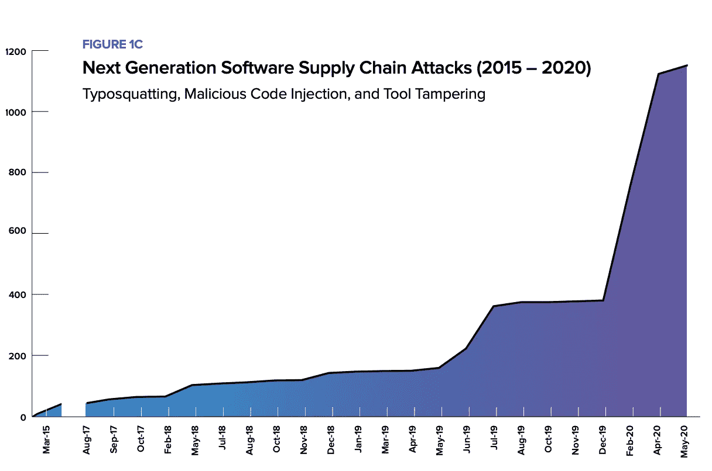
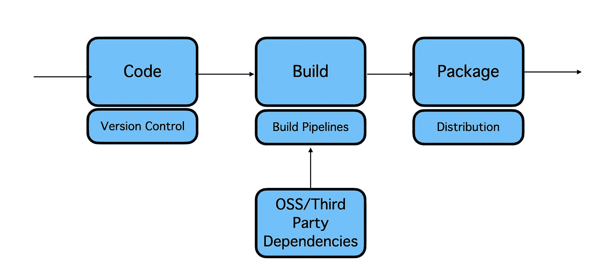
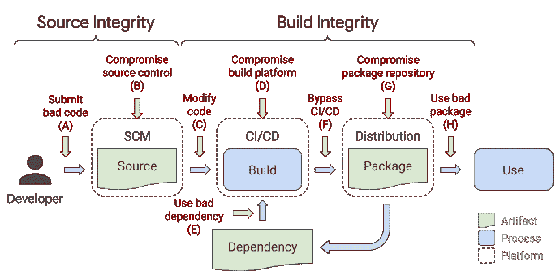
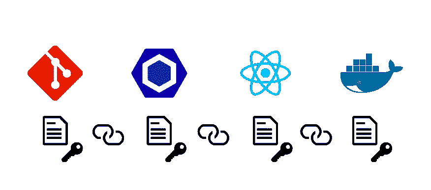
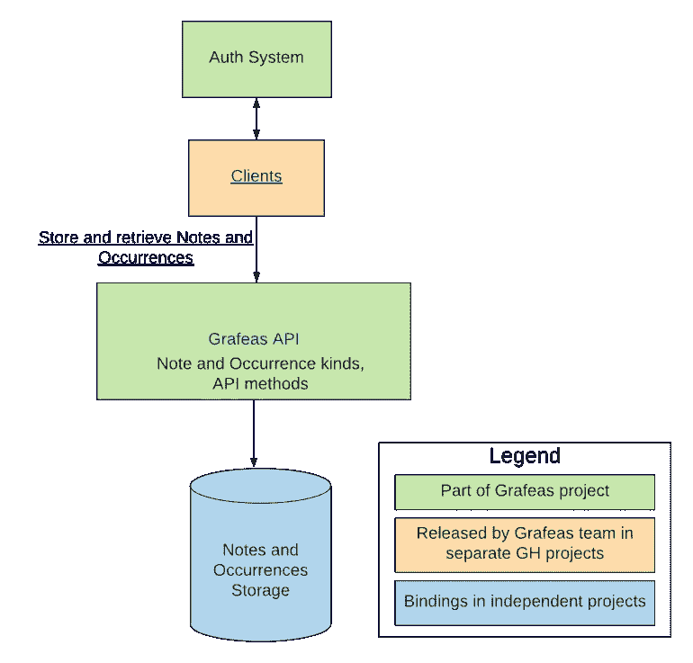
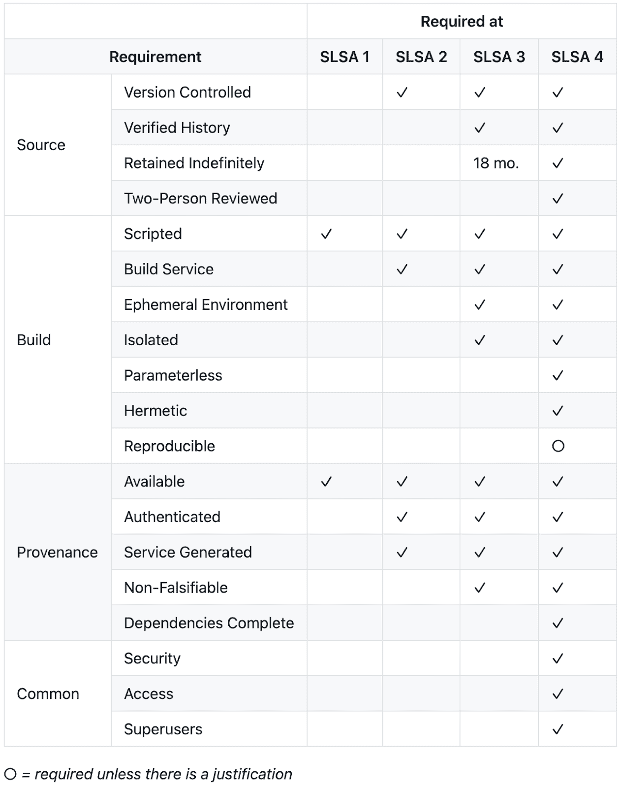

# 软件供应链&现代挑战

> 原文：<https://itnext.io/software-supply-chains-the-modern-challenges-e2d9e1ea8f6?source=collection_archive---------6----------------------->

软件供应链攻击最近越来越多。一项研究显示，仅在过去 3 年里，人口就猛增了 12 倍。

来源— [2020 年软件供应链状况报告](https://www.sonatype.com/hubfs/Corporate/Software%20Supply%20Chain/2020/SON_SSSC-Report-2020_final_aug11.pdf#page=7)

近来，软件开发和分发已经成为一个易受攻击的领域。最近类似[网络安全管理软件产品](https://www.solarwinds.com/sa-overview/securityadvisory) & [CodeCov](https://about.codecov.io/security-update/) 的攻击表明，攻击者正在利用软件供应链中的漏洞来最大化影响。

正如在[网络安全管理软件产品](https://www.solarwinds.com/sa-overview/securityadvisory)事件中所说——

> 网络安全管理软件产品和我们的客户是对我们系统的网络攻击的受害者，**在我们的 Orion 平台软件版本**中插入了一个漏洞(SUNBURST)，用于版本 **2019.4 HF 5、2020.2 未打补丁、**和 **2020.2 HF 1** ，如果该漏洞存在并被激活，可能会允许攻击者破坏运行 Orion 产品的服务器。

在 [CodeCov 的](https://about.codecov.io/security-update/)案例中—

> 2021 年 4 月 1 日，星期四，我们得知有人未经授权访问了我们的 [Bash Uploader](https://linkprotect.cudasvc.com/url?a=https%3a%2f%2fdocs.codecov.io%2fdocs%2fabout-the-codecov-bash-uploader&c=E,1,oOkST7MHQWUCYzutA7LDnCQw_Mud_piqrnkwHsUZqKtNi5v4xm9_dyPfGWYBI5PMTr-zIvzN0jBVNeNIrLG3bBUq7zREQwRhv79rHl93-Ilq&typo=1) 脚本，并在未经我们允许的情况下对其进行了修改。由于 Codecov 的 Docker 映像创建过程中的一个错误，参与者获得了访问权限**，该错误允许参与者提取修改我们的 Bash Uploader 脚本所需的凭证**。

在本文中，我将探讨软件供应链的概念，以及您可以做些什么来最小化这种攻击的机会。

# 什么是软件供应链？

简单来说—

> 软件供应链是影响你的软件产品的任何东西。从开发到 CI/CD 管道，直到代码被部署到产品中。

软件供应链—作者图片

# 什么是软件供应链攻击？

根据 NIST 的定义—

> 当网络威胁参与者渗透到软件供应商的网络中，并在供应商将其发送给客户之前使用恶意代码来危害软件时，就会发生软件供应链攻击。然后，受损软件会损害客户的数据或系统。

下图展示了典型的软件供应链以及每个阶段可能发生的攻击类型。

来源— [介绍 SLSA，一个供应链完整性的端到端框架](https://security.googleblog.com/2021/06/introducing-slsa-end-to-end-framework.html)

市场上已经有相当多的工具可以帮助你降低风险。

1.  你可以使用静态代码分析工具，如**sonar cube**来识别你的代码中潜在的漏洞。
2.  你可以使用像**white source**&**depend bot**这样的工具来识别开源/第三方库中的已知漏洞。
3.  您可以使用典型的 SAST/DAST 技术来识别已部署代码中的漏洞。
4.  您可以使用像 **Trivy** 这样的集装箱扫描工具来扫描集装箱图像。
5.  您可以使用 docker 容器签名工具**公证人**来签名您的图像。
6.  等等。

现有工具不能覆盖所有领域。因此，你会看到这仍然是一个值得关注的领域。

因此，我们需要一种新的工具来帮助保护其他人。

# 现代工具

你可以尝试一些有趣的工具，这里有一些介绍。

# 完全地

来源—[https://in-toto.io/](https://in-toto.io/)

In-Toto 是一个保护软件供应链完整性的框架。它旨在为整个供应链提供完整性、认证和可审计性。

在软件供应链中，In-toto 承担以下角色

*   **项目所有者**:定义软件供应链的布局
*   **职能人员**:执行供应链中的一个步骤，并提供一条链接元数据作为该步骤被执行的记录。
*   **客户端**:通过检查提供的布局和链接元数据，对最终产品进行验证。

toto 有三个组成部分——

*   生成和设计供应链布局的工具。项目所有者将使用该工具生成所需的供应链布局文件。
*   工作人员可用于创建步骤链接元数据的工具。
*   客户用来对最终产品进行验证的工具。

这种方式当然有助于维护软件供应链的完整性。

你可以在这里使用导游来了解和试用软件[。](https://in-toto.engineering.nyu.edu/)

# 格拉夫阿斯

Grafeas 是一个开放的工件元数据 API，用于审计和管理您的软件供应链。它为源代码、构建、测试、静态分析、部署和生产监控等阶段提供了元数据的规范表示。

来源—[https://github.com/grafeas/grafeas](https://github.com/grafeas/grafeas)

Grafeas 的架构非常简单。它提供了 API，用于从软件供应链的各个步骤中获取数据。它目前支持 PostgresSQL 或 Oracle 中的数据存储。客户端获取数据并将其提供给 API。

一旦收集了数据，Grafeas 可以帮助获得如下见解—

*   找到所有从已知引入了安全问题的特定 Github 提交构建的图像。
*   当已知某个构建器已被破坏时，查找由该构建器的某个版本构建的所有映像。
*   在我的项目中查找所有受 CVE-1234 影响的图像。
*   为我将对外发布的映像生成软件材料清单。

而这些特性让这个工具超级有趣。你可以从它的 [GitHub repo](https://github.com/grafeas/grafeas) 中试用这个工具。

Grafeas 可与 In-Toto 结合使用。

你可以在[这篇](https://medium.com/@eran.grin/grafeas-another-awesome-google-tool-f1e016a66c4b)来自 [eran grin](https://medium.com/u/195742e3f4de?source=post_page-----e2d9e1ea8f6--------------------------------) 的文章中读到更多关于 Grafeas 的信息。

# 克里蒂斯

Kritis 是一个开源解决方案，用于保护 Kubernetes 应用程序的软件供应链。这是 Grafeas 项目的一部分。它可以帮助创建策略来加强软件供应链的完整性。

例如，它有助于停止将映像部署到具有任何公开漏洞的 pod，除非这些漏洞出现在豁免列表中。

该项目还包含*签名者*，可用于创建 [Grafeas](https://github.com/grafeas/grafeas) 证明事件，以用于其他强制系统，如[二进制授权](https://cloud.google.com/binary-authorization/)。

# SLSA:软件产品的供应链层次

谷歌最近宣布了一个叫做 SLSA 的框架:软件产品的供应链层次。它是一个端到端的框架，用于确保整个软件供应链中软件工件的完整性。

如[网站](https://slsa.dev/)所述——

SLSA 提出了三个问题:

*   软件生产商希望保护他们的供应链，但不知道具体如何做；
*   软件消费者希望了解并限制他们暴露于供应链攻击的风险，但却没有办法这样做；
*   人工签名本身只能防止我们所关心的攻击的一个子集。

该框架定义了 4 个层次—

来源—[https://security . Google blog . com/2021/06/introducing-slsa-end-to-end-framework . html](https://security.googleblog.com/2021/06/introducing-slsa-end-to-end-framework.html)

这个项目还处于相当早期的阶段。他们最近发布了一个出处生成器的 PoC。你可以通过 Github 动作列表[试试这个](https://github.com/marketplace/actions/slsa-build-provenance-action-demo)。

# 结论

总之，随着威胁的增加，解决方案也在增加。你必须意识到并警惕这个地区发生的事情。

如果你知道这些很酷的工具，请在评论中告诉我！

# 参考

*   [防御软件供应链攻击](https://www.cisa.gov/publication/software-supply-chain-attacks)
*   [2020 年软件供应链状况报告](https://www.sonatype.com/hubfs/Corporate/Software%20Supply%20Chain/2020/SON_SSSC-Report-2020_final_aug11.pdf#page=7)
*   [https://slsa.dev/](https://slsa.dev/)
*   [https://grafeas.io/](https://grafeas.io/)

# 嘿，如果你喜欢这个故事，看看[中级会员](https://deshpandetanmay.medium.com/membership)！只要 5 美元/月！

*你的会员费直接支持我和你看的其他作家。你也可以在媒体上看到所有的故事。*

# [现在就成为中等会员吧！](https://deshpandetanmay.medium.com/membership)