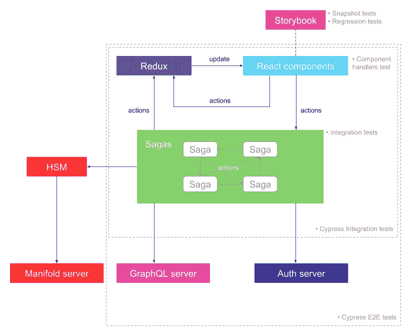
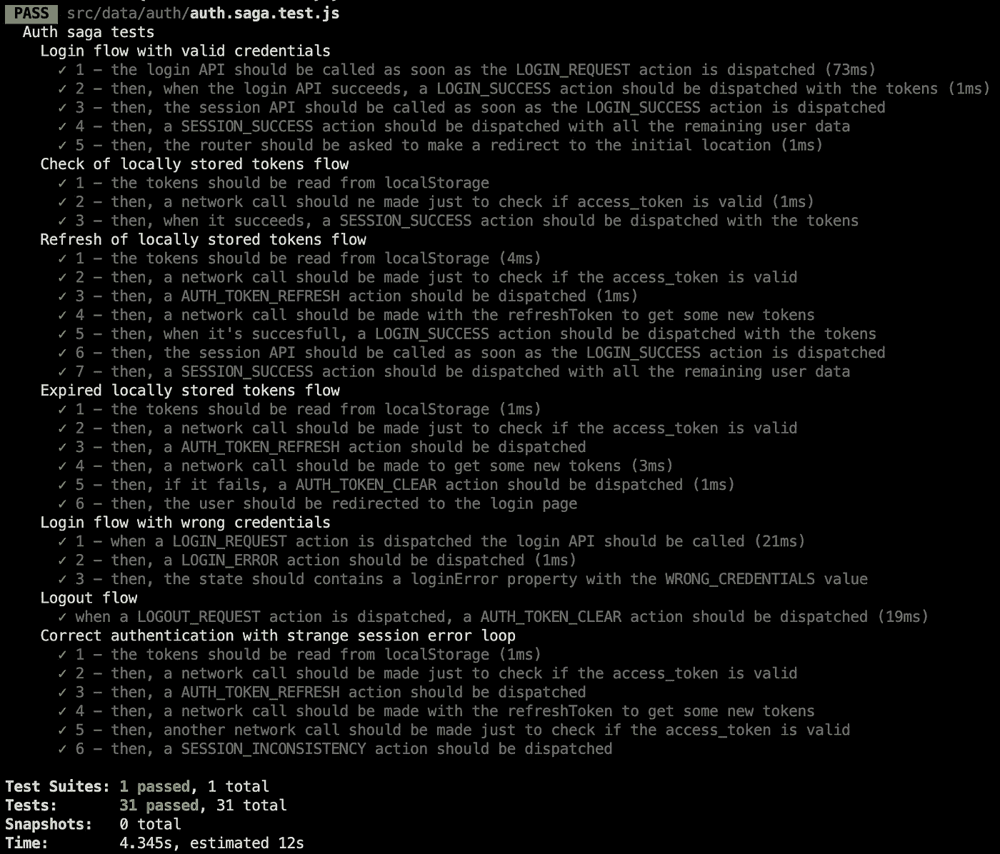

# 作为文档工具的软件测试

> 原文：<https://itnext.io/software-tests-as-a-documentation-tool-e1c463bad1be?source=collection_archive---------3----------------------->

为什么测试是讲述代码故事的完美方式。在此处或在 [dev.to](https://dev.to/noriste/software-tests-as-a-documentation-tool-36pl) 上阅读。

由[罗恩·迪亚](https://unsplash.com/photos/V29UWcALNko)在 [Unsplash](https://unsplash.com/s/photos/reverse?utm_source=unsplash&utm_medium=referral&utm_content=creditCopyText) 上拍摄的照片

我正在 GitHub 上做一个大的 [UI 测试最佳实践](https://github.com/NoriSte/ui-testing-best-practices?source=post_page---------------------------)项目，我分享这个帖子来传播它并有直接的反馈。

文档编制通常是困难的，它需要精确和细致的工作，并且需要团队的所有成员理解和重视编写好的文档。记录是无私的工作，对于无私，我的意思是奉献给其他开发者和未来的我们。

我曾经确信，测试方法是一种很好的方式，不仅可以确保我们编写了项目需要的代码，不仅可以保证我们不会引入回归，还可以记录代码和用户流(请记住，谁是前端开发人员)。最近，我的“测试即文档”的想法得到了又一次确认:**我搬到了一家新公司**，我几乎没有时间**告诉一个新的开发人员我到现在为止做了什么**。

# 将项目移交给新的开发人员

首先，看一看:

*   我正在开发的后台架构是用 React 开发的，并用 Cypress 和 Jest 进行了测试

[Conio](https://business.conio.com/) 后勤办公室的架构。

*   一些用户流量的视频

[Conio](https://business.conio.com/) Backoffice 的一些 UI 测试。

*   一些 Jest 测试的截图

[Conio](https://business.conio.com/) Backoffice 的一些集成测试。请注意，当时，我打破了一个黄金测试规则:没有测试应该共享状态。

说明项目做什么以及如何做的步骤是:

*   讲述一些关于项目和整个建筑的技术细节
*   要求新开发人员探索故事书的故事
*   要求新开发人员**运行并观看赛普拉斯测试**
*   要求新开发人员**运行并读取 Jest 测试的输出**
*   要求新开发人员阅读测试代码
*   衡量新开发人员对项目的理解，要求他改变和测试一些流程

交接进行得如此顺利，以至于我决定写这篇文章😊。新的开发者(一个相当聪明的人，我不得不承认，你好洛伦佐👋)让我很好地了解了用户流，并且**能够满怀信心地改变项目的大部分**(以及相关的测试)。尽管如此，他还是能够实现新的用户流，并对它们进行测试，就像我对项目的其他部分所做的一样。

# 好的和坏的部分

嗯，即使我对这次经历很满意，我也必须承认有些事情并不完美。我不是在谈论过程本身或使用测试作为文档工具的想法，而是我编写测试的方式。有些细节误导了应该阅读我的测试的开发人员的理解。让我们检查一下我写的测试的利与弊:

## 我的测试有哪些优点:

*   用 Cypress 从 UI 的角度测试一切:对于前端流程来说， **UI 比一切都重要**
*   有一本编好的故事书:用**故事书写故事已经在考验**！视觉测试很容易被 Storyshots 这样的插件冻结
*   简单的测试代码:测试代码必须非常简单。易于阅读、无条件、低抽象级别、良好的日志记录等。永远记住**测试必须减少阅读和理解代码**的认知负荷，因此它们的复杂度应该比要理解的代码低一个数量级
*   在代码和测试之间共享一些步骤“id ”:如果一个用户流很长，在代码和测试代码之间共享一些“步骤”可能是有用的(比如“/** #1 */”、/** #2 */”等注释)。)
*   对部分代码进行更多的低级测试(就像上面的截图中显示的一些传奇故事)，这些代码可能很难理解(因此很难更新或重构为更简单的版本)

## 我的测试有什么不好:

*   一些测试描述并不完美:在编写测试描述时，良好的讲故事技巧非常重要
*   没有利用**小黄瓜**来编写测试本身:我在开始的时候没有什么经验，所以我决定不考虑用小黄瓜编写 BDD 风格的测试。[看一看](https://cucumber.io/docs/gherkin/reference/)了解讲故事的优势
*   在不同的测试之间共享一些固定装置:固定装置是服务器响应的静态版本，当它们相同时回收它们的想法没有错，但是我应该更关心它们的名字。为注册和登录流使用“registration-success.json”装置(这只是一个例子，我在更复杂的情况下犯了这个错误)会给新开发人员留下一些疑问。这是那种被**冻结在编写代码**的开发人员的记忆中的东西(为什么你可以在两种不同的情况下使用相同的夹具？)，从公司的角度来看这是一件非常糟糕的事情

最后，编写测试允许您:

*   拥有描述良好的文档:测试的描述总是从用户的角度来写，而不是从开发人员的角度
*   轻松交接
*   避免依赖某些员工的历史记忆(比如你)
*   当阅读代码时，记录一些听起来“奇怪”或简单复杂的选择，但从用户的角度来看是完全合理的

更不用说明显的测试优势，比如无回归工作，利用一些自动化和快速的工具等等。😊

我渴望了解你在同一主题上的经历！请随意对它们发表评论🤗

嗨，👋我是斯特凡诺·马尼，我是一名热情而又遥远的**前端工程师**，一名**柏树大使**，一名**导师**。
我喜欢创造高质量的产品，测试和自动化一切，学习和分享我的知识，帮助他人，教学，在会议上发言和面对新的挑战。
你可以在 [Twitter](https://twitter.com/NoriSte?source=post_page---------------------------) 、 [GitHub](https://github.com/NoriSte?source=post_page---------------------------) 、 [LinkedIn](https://www.linkedin.com/in/noriste/?source=post_page---------------------------) 上找到我。你可以找到我最近所有的文章/演讲等等。这里。