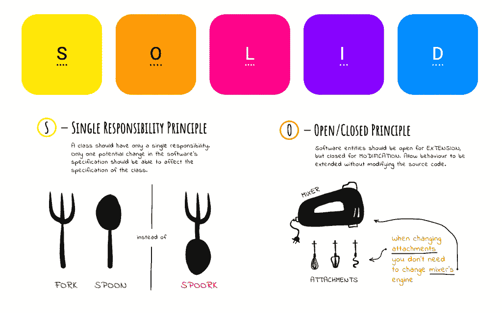
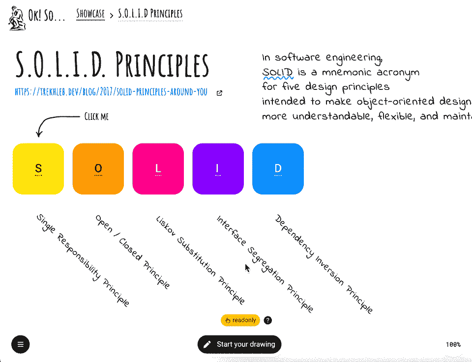
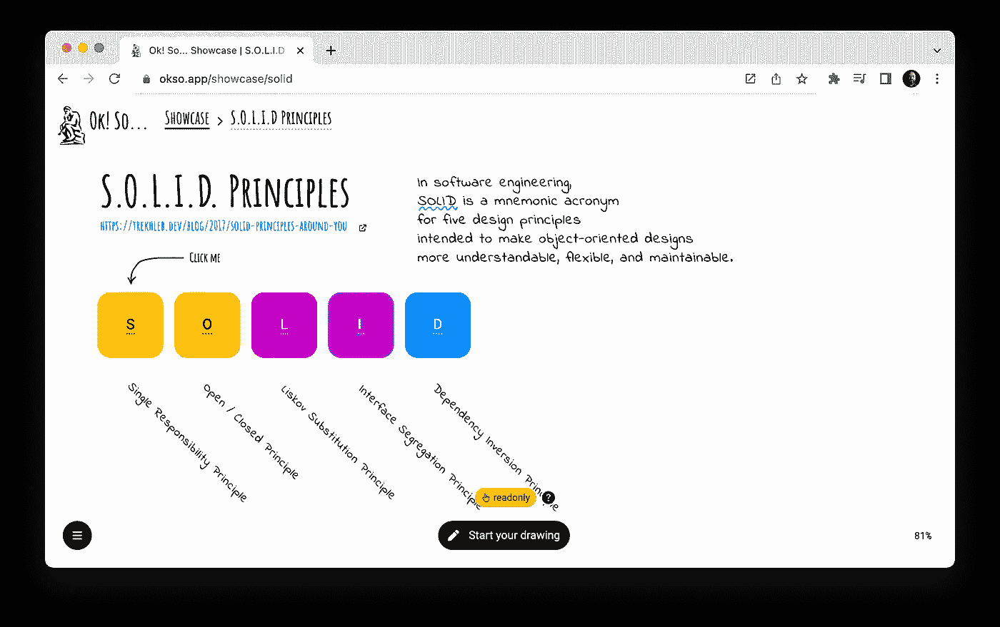
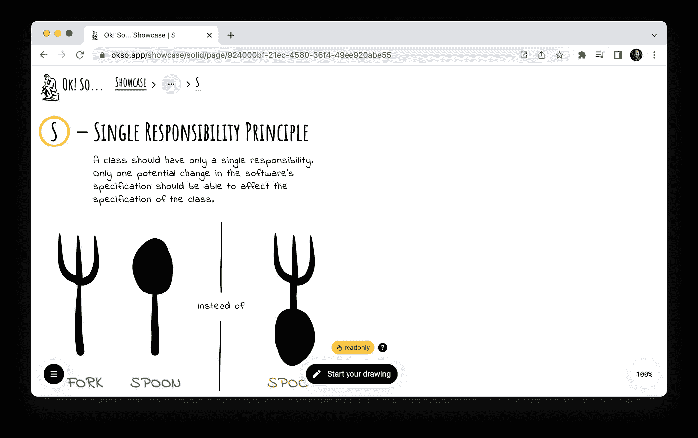
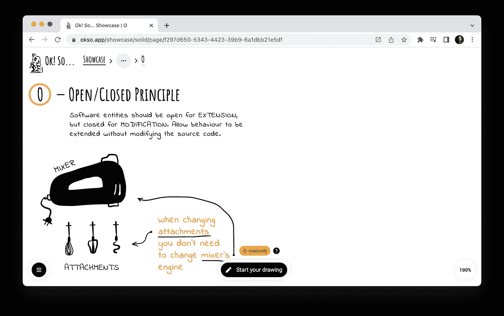
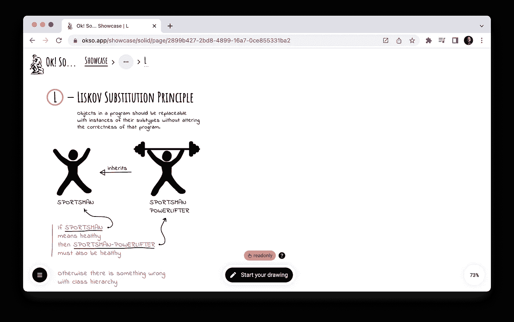
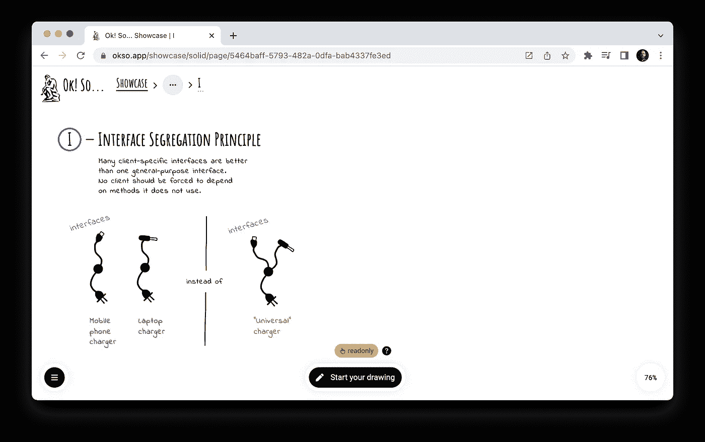
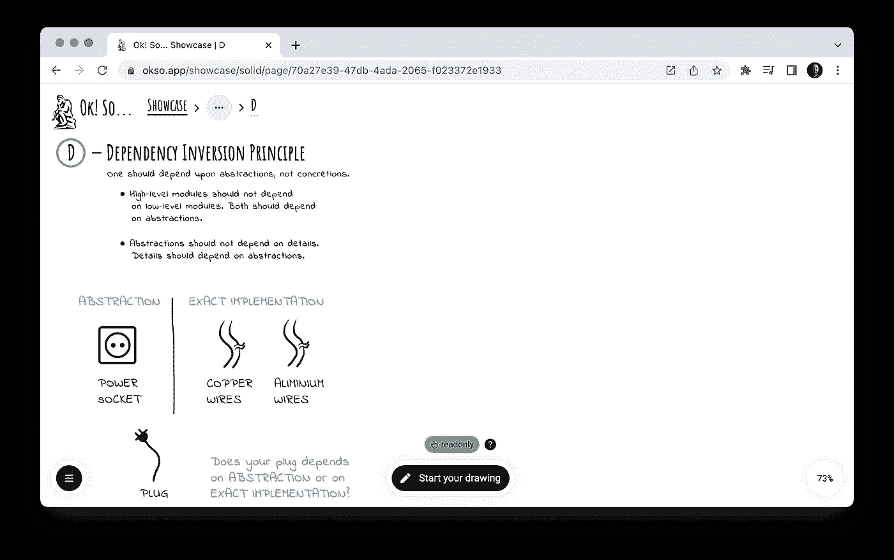

# 固体原理草图

> 原文：<https://itnext.io/solid-principles-sketches-a38865e771f0?source=collection_archive---------0----------------------->

我最近发布了一款极简主义的[绘图应用](https://okso.app)，可以让你做交互式(嵌套)草图。并且，作为我之前 [S.O.L.I.D .你身边的原则](https://trekhleb.medium.com/solid-principles-around-you-6db2f0e12139)文章的延续，我已经把它们组织成互动的[坚实的原则草图](https://okso.app/showcase/solid)。

看看我有什么:

因此，每个坚实的原则都有一个专用的草图页面，如下所示

# 单一责任原则

[SRP 草图](https://okso.app/showcase/solid/page/924000bf-21ec-4580-36f4-49ee920abe55)

一个类应该只有一个责任。软件规范中只有一个潜在的变化能够影响类的规范。

# 开/关原则

[OCP 素描](https://okso.app/showcase/solid/page/f297d650-5343-4423-39b9-6a1dbb21e5df)

软件实体应该对扩展开放，但对修改关闭。允许在不修改源代码的情况下扩展行为。

# 利斯科夫替代原理

[LSP 草图](https://okso.app/showcase/solid/page/2899b427-2bd8-4899-16a7-0ce855331ba2)

程序中的对象应该可以用其子类型的实例替换，而不会改变程序的正确性。

# 界面分离原理

[ISP 草图](https://okso.app/showcase/solid/page/5464baff-5793-482a-0dfa-bab4337fe3ed)

许多特定于客户端的接口比一个通用接口要好。不应该强迫任何客户端依赖它不使用的方法。

# 从属倒置原则

[倾斜草图](https://okso.app/showcase/solid/page/70a27e39-47db-4ada-2065-f023372e1933)

一个人应该依靠抽象，而不是具体。

*   高层模块不应该依赖低层模块。两者都应该依赖于抽象。
*   抽象不应该依赖于细节。细节应该依赖于抽象。

> 在未来，我计划在 [okso.app showcase](https://okso.app/showcase) 中添加更多像这样的可视化解释器。目前有一个[数据结构](https://okso.app/showcase/data-structures)草图可用，其风格与实体草图相似。我希望在一个地方有这样的可视化解释器会方便你。