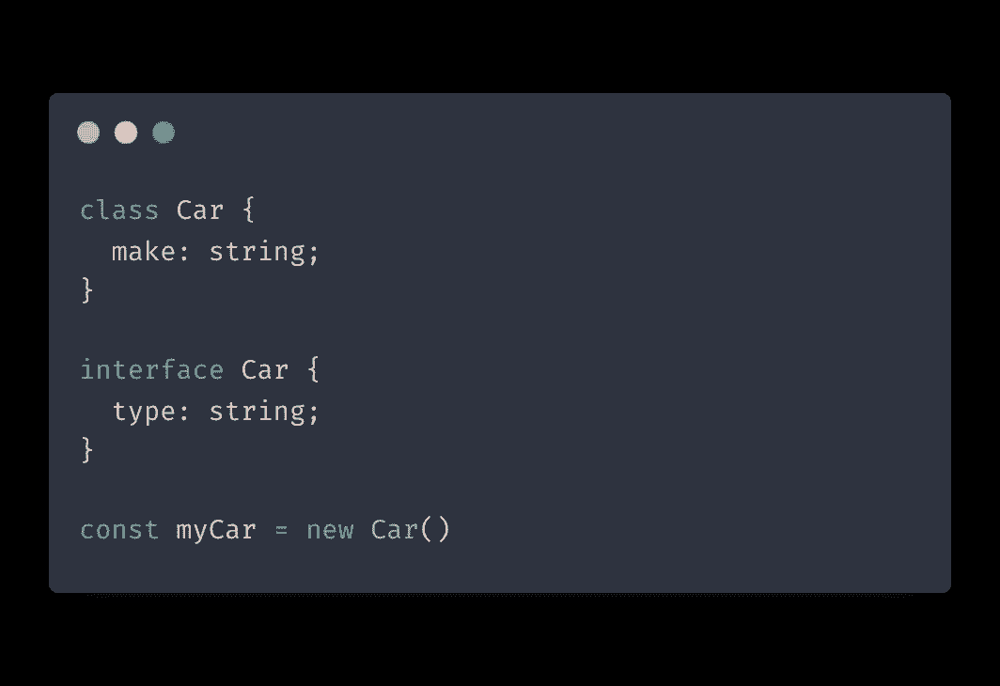
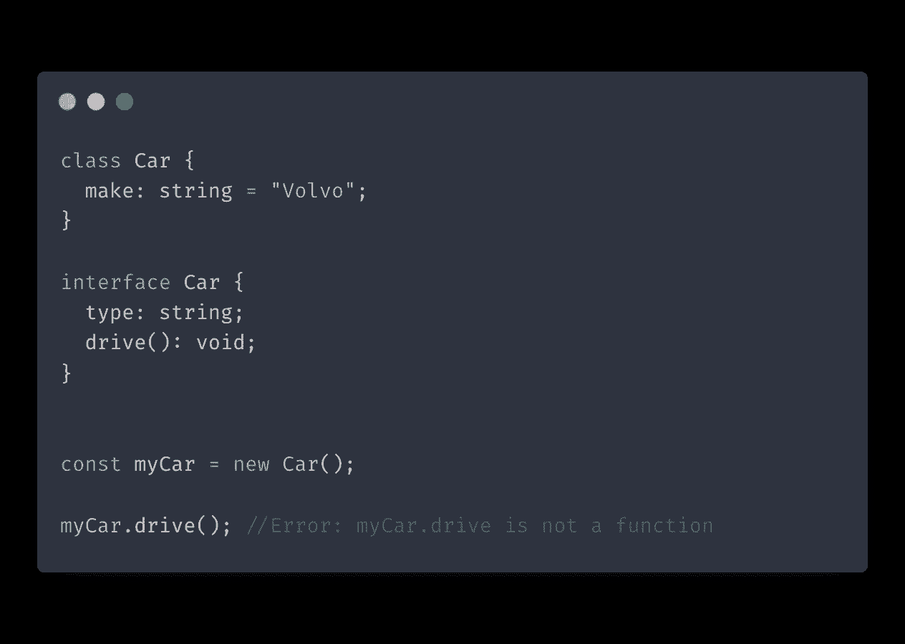
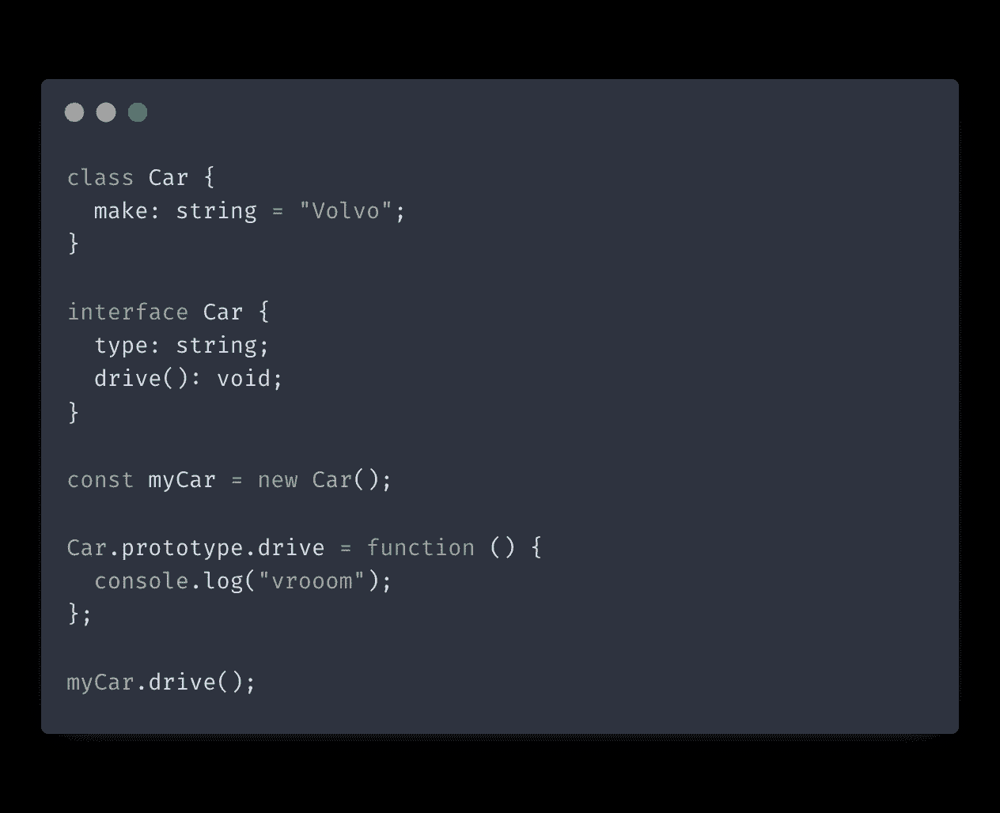
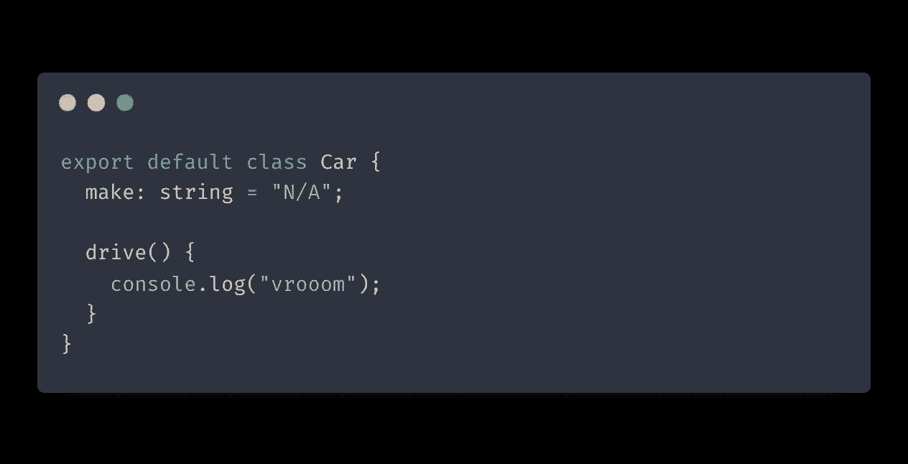
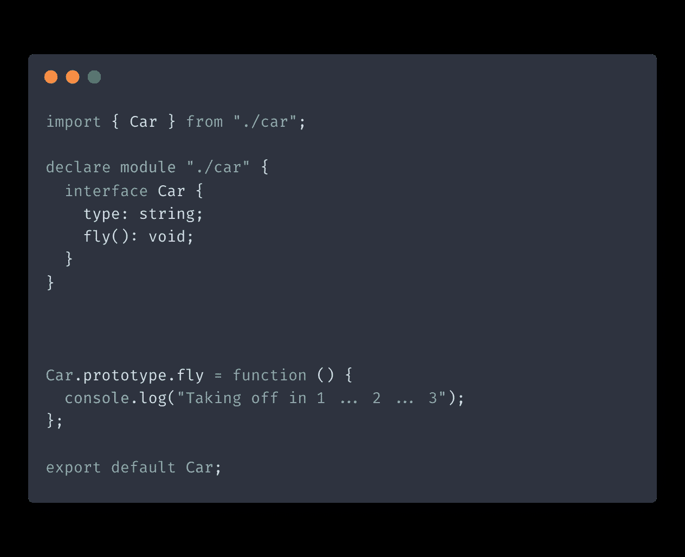
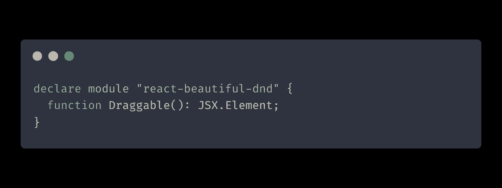
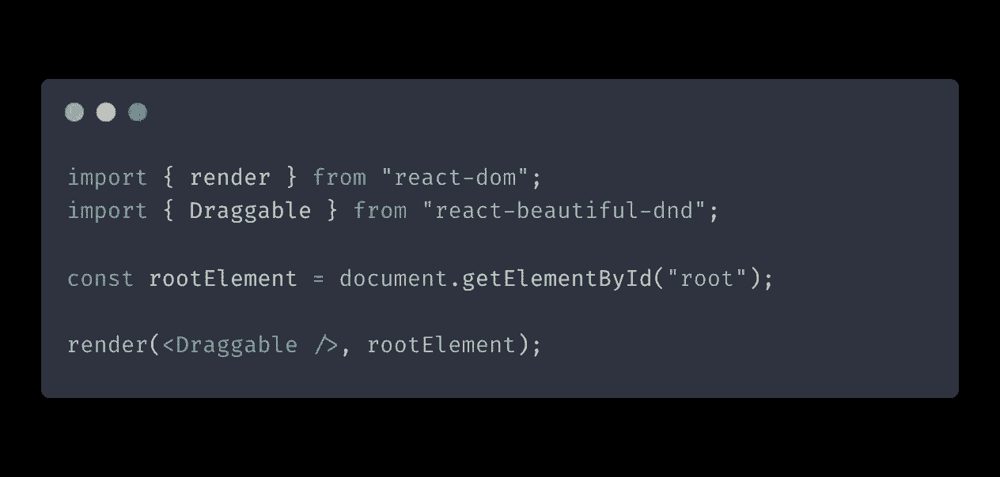

# 使用模块扩充解决 TypeScript 中的任何外部库错误

> 原文：<https://itnext.io/solve-any-external-library-error-in-typescript-with-module-augmentation-850be741fda2?source=collection_archive---------2----------------------->

本 TypeScript 教程将介绍我们如何使用模块扩充来解决在使用外部库时可能遇到的任何类型错误。当你遇到困难时，使用模块扩充来调整那些你无法访问的模块。

# TypeScript 中的声明合并

在我们深入研究模块扩充之前，让我们简要介绍一下声明合并在 TypeScript 中是如何工作的，因为它们遵循相同的基本原则。

TypeScript 使用声明合并将多个类型组合成一个合并的声明，前提是这些类型具有相同的名称。

您可以使用 TypeScript 来组合各种类型，例如相互之间的接口、枚举与枚举、命名空间与命名空间等等。例外情况是类合并，这是不允许的。

让我们简单介绍一个例子:

上面的代码定义了一个带有`make`属性的`Car` 类和一个带有`type`属性的`Car`接口。然后，我们创建一个 Car 实例，并将其赋给`myCar`常量。因此，`myCar`将同时包含`make`和`type`属性。

现在，如果我们尝试在接口中添加一个方法声明会怎么样呢？

如您所见，我们会得到一个错误，因为我们没有 drive 方法的实际实现。然而，我们可以使用`Car`原型添加一个:

您可能会想“为什么不创建一个同名的类，并初始化它们呢？”但是请记住，TypeScript 通常不允许您合并类。然而，你可以用 [mixins](https://www.typescriptlang.org/docs/handbook/mixins.html) 实现一个解决方法，但是这超出了本文的范围。

现在，在我们的`Car`实例上调用我们的方法`drive`将会工作，我们已经成功地合并了我们的类和接口！

# 模块扩充

现在我们知道了声明合并在 TypeScript 中是如何工作的，让我们看看模块增强如何帮助我们扩展外部模块。

我们通过创建一个新模块来实现这一点，该模块导入我们想要增强的模块，用定制功能增强它们，然后导出它们。

让我们看另一个例子。

首先，我们将创建一个`car.ts`模块:

现在让我们创建将增强`car.ts`的`augmented.ts`模块:

上面的代码将导入我们想要扩充的 TypeScript 文件，并创建与我们的类同名的`interface`。我们声明了一个新的公共接口，它添加了一个`fly`方法。添加这个之后，我们现在可以在我们的 TypeScript 实例上调用`fly`。

上面的代码还会在扩充 TypeScript 类后将其导出。现在我们可以在我们的`Car`实例中使用增强的`fly`方法了！

**注意:您不能增加默认导出，只能增加命名导出。原因是您需要通过导出名称来扩充导出，而** `**default**` **是一个保留字。**

# 使用全局增强扩展第三方模块

现在让我们看看如何使用全局模块增强来扩展第三方包中的模块。

全局增强技术类似于我们以前讨论过的模块增强，其工作原理如下:

*   检查要扩展的 TypeScript 模块的名称
*   创建相应的 d.ts 文件
*   扩充模块

让我们尝试用自定义类型扩展`react-beatiful-dnd`库。首先，我们将创建`react-beautiful-dnd.d.ts`文件并添加以下代码:

在上面的代码中，我们为来自`react-beautiful-dnd`的`Draggable`组件添加了一个类型声明。

这就是你真正需要的！现在，我们可以像这样在应用程序中使用我们的类型:

因为我们使用的是 TypeScript 自动获取的`d.ts`文件，所以我们可以像平常一样导入我们的库。

# 结论

在这篇文章中，我们通过例子学习了 TypeScript 中声明合并的基础知识。我们还讨论了模块增强和使用全局增强来扩展第三方模块，以解决您在使用类型时可能遇到的任何问题。我希望这篇文章对你有用！

如果你想获得更多的网络开发、反馈和打字技巧，可以考虑在 Twitter 上关注我，在那里我分享我学到的东西。

编码快乐！

*原载于 2022 年 1 月 5 日*[*https://isamatov.com*](https://isamatov.com/typescript-module-augmentation/)*。*