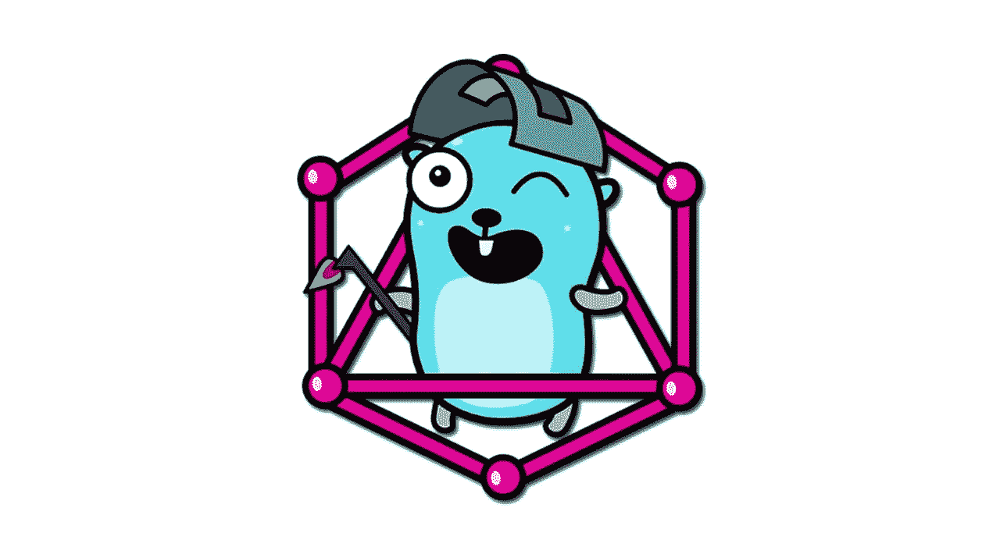

# 用 Go 解决一个图形问题

> 原文：<https://itnext.io/solving-a-graph-problem-with-go-f1049de33856?source=collection_archive---------0----------------------->



在过去的几天里，我一直在看现场模拟面试，尽管我并不想找新工作(我在谷歌很开心)，但我觉得有趣的是，这么多人都在为隐藏在一些复杂装饰背后的同一个问题而挣扎。

其中一个模拟问题是这样说的:

> 想象你有图像，你可以复制任何你想要的图像，创造另一个图像。新的图像(复制品)也可以被复制，等等。虽然新图像看起来一样，但名称不同，您还可以追溯到父图像。
> 
> 现在，我们想要删除所有的图像，但是如果图像有重复，我们就不能删除它。您必须实现一个返回图像删除顺序的函数。
> 
> 要实现的功能如下(在这篇文章中，我们对所有代码都使用 Go):

`func deleteOrder(imgs []*Image, cps []*CPOps) []*Image {...}`

```
type Image struct {
  Name string
}// CPOps represent a copy operation. 
type CPOps struct {
  ParentImage *Image //Original images being copied. 
  CpImages []*Image  //Copies of the original image.
}
```

> 该函数接收图像列表，以及它们之间的复制操作，然后它必须返回根据上述规则删除所有图像时必须遵循的顺序。

让我们看一个例子:

```
Images = [A, B, C, D]
CPOps = [
  {ParentImage:A, CPImages:[B, C]},
  {ParentImage:B, CPImages:[D]},
]
```

这是说，A 是原始图像，我们制作了两个副本，B 和 C，然后我们将 B 的副本制作成 D，我们函数`deleteOrder`的 out 应该是[D，B，C，A]或[D，C，B，A]或[C，D，B，A]。请注意，多种解决方案是可能的，但所有这些解决方案都是这样的，即只有在删除其副本后，才会删除每个图像。

# 解决问题。

这个问题是一个经典的拓扑排序算法，其中建立了对象之间的某种依赖关系。同样的问题以不同的措辞呈现给模拟面试的候选人，但在所有情况下，问题都可以归结为拓扑排序。

我们在这篇文章中提出的解决方案是这样写的，每一部分都可以独立解释。然而，为了节省时间，在面试中写一段可读性较差的代码是可以接受的。

## 构建图表

我希望到现在为止，读者可以意识到这是一个图表问题，这反过来应该是给面试官的第一个信号，表明候选人了解正在发生的事情。

如果我们使用上面的示例来构建图表，我们应该会得到如下结果:

```
A --> B --> D
 \  
  --> C
```

现在，让我们创建一个函数，给定输入，我们可以建立一个图形，可以用来解决这个问题。

构建图表

请注意，我们首先将所有节点(图像)添加到图中，这很重要，因为可能有从未被复制的图像，因此它们将永远不会出现在给定的关系中。然后，我们建立节点之间的依赖关系。

现在，我们可以实现算法的主要部分，拓扑排序。

## 拓扑排序

拓扑排序是一个简单的 DFS，它使用依赖关系作为有向边来遍历图，并返回相反的顺序。在我们的例子中，我们对依赖关系的逆序感兴趣，因为 A — > B，我们需要先删除 B，然后删除 A。

DFS 遍历给定初始节点的图。

DFS 遍历给定初始节点的图，并以相反的顺序返回依赖关系。`visited`变量跟踪我们已经在图中访问过的节点(为了不重复它们)，变量`path`跟踪反转的依赖关系。

既然我们已经有了一种构建图并遍历它的方法，我们必须马上把所有的东西放在一起。

`DeletionOrder`函数用给定的输入构建图形，对于每个没有被访问过的节点，执行`dfs`。`result`变量将包含正确删除顺序的图像名称。

其余的`DeleteOrder`函数(第 14 行等等)只是确保我们从图像名称中选择图像(在图形算法之外)。

大部分算法看起来并不复杂，但是很多人都没有解决这个问题，在我看来，在 45 分钟的采访中这是可行的。我观察到大多数人不能足够快地识别图形问题，以便有时间实现一个工作解决方案。

# 其他考虑

同一个问题可以有不同的方向，取决于面试官想怎么看。

例如，当图有数千个节点时，放大算法的问题是一个有趣的问题。尽管它们看起来很简单，但仍有一些棘手的情况需要考虑。

检测给定输入是否正确的问题也可能是一个有趣的问题。为了使图可排序，从而拓扑排序正确工作，图不能有圈。检测周期并不是一个特别复杂的问题，但是大规模的检测可能会有一些问题。

这些都是有趣的问题，读者应该花点时间思考一下它们以及每个问题的含义。

最后，在 45 分钟的面试中，只有在主要问题被正确编码后，才有时间解决其中的几个问题。然而，我们希望在这篇文章之后，读者可以看到一些问题，并很容易地将它们简化为可以使用拓扑排序解决的问题的图形类别。

祝你面试好运。