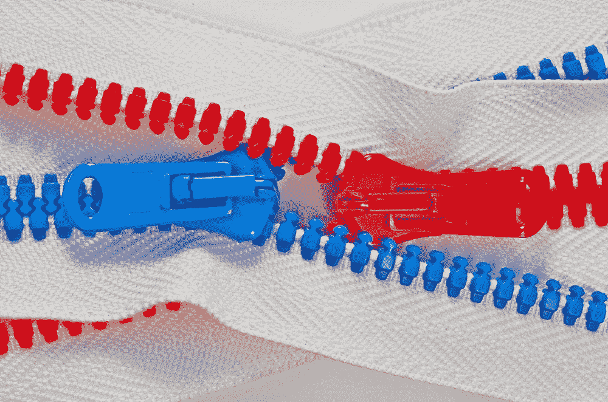
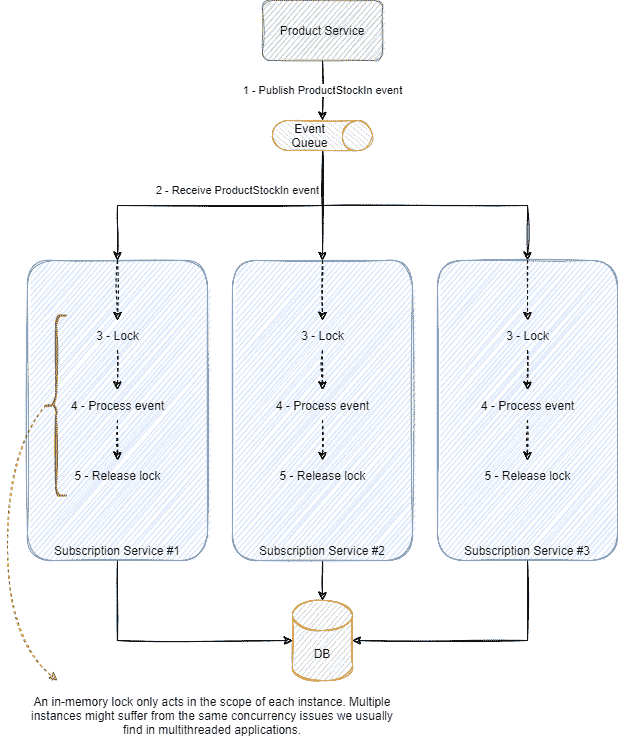
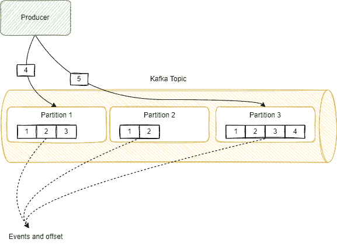

# 在事件驱动的微服务中解决并发问题

> 原文：<https://itnext.io/solving-concurrency-in-event-driven-microservices-79bbc13b597c?source=collection_archive---------0----------------------->

图片来自[托马斯·索贝克](https://unsplash.com/@tomas_nz)来自 Unsplash

富兰克林·罗斯福曾说:“我们倾向于过多考虑早起的鸟儿有好报，而对早起的虫子有坏报考虑不足。”。我从来都不是那种玩彩票的人。失败的几率大得惊人；实际上，[成为圣人(被封为圣徒)或美国总统](https://www.reviewjournal.com/business/20-things-more-likely-to-happen-to-you-than-winning-the-lottery/)的可能性比真的中彩票(例如，欧洲的欧洲百万彩票或美国的强力球)的可能性更大。

事件驱动服务中的并发性通常是一个有保证的反向彩票中奖。给定并发性问题发生的可能性极低，而且显然微不足道。然而，这一切都归结于你尝试的次数，由于服务消耗了大量的事件，一个不可能的事件变得几乎肯定。例如，我们曾经面临一个发生几率大约为百万分之一的问题。有问题的服务每秒处理大约 100 条消息，这意味着这个问题大约每小时发生三次。事件驱动服务旨在处理的巨大规模和吞吐量使得并发性问题变得异常可能。

并发问题或竞争条件是给定代码并行运行时发生的不必要或意外的行为，如果代码在单线程中运行，这些行为不会表现出来。对于程序员来说，处理并发性通常是不自然的，我们习惯于以单线程的方式对代码进行推理。检测并行运行的代码并使之安全，通常需要一个经验丰富、训练有素的头脑。此外，由于本地或开发和实际环境之间吞吐量的巨大差异，并发性问题并不明显，并且通常只在生产环境中显现出来。

火星漫游车

例如，NASA 有非常严格的[编码指南](http://pixelscommander.com/wp-content/uploads/2014/12/P10.pdf)和非常详细细致的[质量保证流程](https://www.fastcompany.com/28121/they-write-right-stuff)。毕竟，在地球之外调试某些东西与分析大多数生产问题并不完全相同(尽管有时感觉像是发生了某种超凡脱俗的事情)。大多数开发人员可能会忽略的暂时性错误通常是竞争情况的症状。在美国宇航局，类似的问题不能被忽视，它甚至可能不得不超越应用程序进行跟踪，开发人员甚至可能不得不深入到操作系统来找到根本原因。实际上，这关系到几百万美元。但是，即使有这样勤奋的过程，竞争条件往往是不可避免的。举例来说，我记得有一集，美国国家航空航天局[由于比赛条件](http://www.spaceref.com/news/viewsr.html?pid=23772)与火星探测器失去了联系。

并发问题的不可避免性和事件驱动服务的高吞吐量突出了从底层解决并发问题的深思熟虑的策略的需要。事件驱动服务的一个重要特性是能够通过添加同一服务的几个实例来进行水平扩展。由于不同的请求可能会路由到不同的实例，因此这种方法使通过像互斥、锁或信号量这样的内存锁来处理并发性的传统方法失效。分布式系统通常使用外部工具来管理分布式并发，如 Consul 或 Zookeeper。然而，使用事件驱动的服务可以引入一个完全不同的概念来处理并发性。端到端消息路由可以是一种非常有效且可伸缩的方法，通过设计(使用架构解决方案)来处理并发性，而不是通过实现(借助外部工具或在服务实现中)。

多年来，我们在 RabbitMQ 和 Kafka 的几个不同生产用例中尝试了几种不同的方法。我们最终通过设计来处理并发性，而不是通过实现来处理并发性，在提供这样做的用例中。这里有一些我们在生产中彻底使用过的解决方案，可以作为处理您自己的并发问题的灵感。

# 用一个例子说明并发性问题

让我们用一个例子来说明。假设我们有一个平台，销售在线产品，并允许用户订阅“新货”和“缺货”产品的通知。用户可以订阅接收电子邮件，短信等通知，每当股票被添加到所需的产品。保存产品和股票信息的服务在每次股票变化时发送一个事件。订阅服务必须了解产品何时从库存 0 变为 1，并在任何时候发送通知。下图说明了这种情况。

订阅服务处理 ProductStockIn 事件，以便在产品更改库存时做出反应。由于订阅仅在库存从 0 变为 1 时才相关，因此该服务保存每个产品当前库存的内部状态。ProductStockIn 事件的流程包括以下操作:

1.  产品服务发布事件
2.  订阅服务处理事件
3.  获取本地库存并验证库存是否从 0 变为 1
4.  获取当前订阅信息
5.  为每个订阅发送通知
6.  更新本地股票数据

在单线程思维中，这种方法可以说是有意义的，不会产生任何问题。然而，为了充分优化服务的资源并获得合理的性能，我们应该为服务添加并行性。如果服务处理两个或更多事件会发生什么？竞争条件可以使服务发布同一个订阅两次。如果服务处理两个股票变更事件(例如，从股票 0 到 1 和从股票 1 到 2)并同时运行步骤 3 中的验证，它将在两个事件中通过，产生一个竞争条件，因此，发送相同的通知两次。

处理这个问题的一个方法是用传统的并发处理方法(比如锁、互斥、信号量等)简单地锁定线程执行。然而，传统的方法只适用于单实例服务，如下所述。

因为内存中的锁仅由执行锁的实例共享，所以其他实例仍然能够同时处理其他事件。同一个产品的两个股票变更事件可以由不同的实例处理，即使两个实例都锁定了它们的执行，也只能在它们各自的实例中进行，没有什么可以阻止并发问题在两个实例中发生。由于事件驱动服务的一个重要属性是水平伸缩的能力，这些传统的方法对于这种环境来说是相当不够的。

本地锁的替代方法是使用数据库来防止并发问题。处理货币的一种典型的悲观方法(接下来将详细介绍悲观和乐观方法)是将操作包装在一个事务中。然而，通常没有一种直接的方法来保证跨外部依赖关系的事务一致性，而不会进入分布式事务的领域，而这正是我们最希望并且应该避免的。使用事务一致性也受限于支持它的技术，许多 NoSQL 数据库不提供与传统关系数据库相同的保证。

# 悲观者对乐观者

处理并发有两种方式:悲观和乐观。

悲观并发策略通过阻止对所需资源的并行访问来防止并发。他们假设会有并发性，因此限制了对资源的预先访问。这些策略应该应用于高并发用例，在这种情况下，两个进程很可能同时访问同一个资源。

开放式并发假设没有并发。当并发问题发生时，有一个策略来处理失败的操作，要么抛出一个错误，要么重试操作。开放式并发在并发机会较低的环境中表现最为突出。

悲观并发会影响性能，并限制解决方案的整体并行性。开放式并发具有出色的性能，因为它不锁定任何东西，只是对失败做出反应。在低并发环境中，几乎没有并发处理策略。但是，当并发的可能性很高时，重试操作的成本通常比限制对资源的访问要高得多，在这种情况下，您最好使用悲观并发。

# 卡夫卡主题剖析

Kafka 是一个流行的事件流平台。如果您使用它来支持简单的发布-订阅和事件流用例，并且不太关注它的内部工作方式，那么使用它的事件路由功能可能会错过一些强大的应用程序。

发布的事件被发送到主题。Kafka 主题(类似于队列，但是即使在消费之后也要保存每个事件，就像分布式事件日志一样)被划分为多个分区。下图展示了卡夫卡主题的剖析。

当一个应用程序将一个事件发布到一个给定的主题时，它被存储在一个特定的分区中。为了将事件分配给分区，Kafka 散列产生一个分区的密钥，当没有提供密钥时，它循环通过每个[分区](https://www.confluent.io/blog/apache-kafka-producer-improvements-sticky-partitioner/#:~:text=Fortunately%2C%20Kafka%20allows%20users%20to,a%20key%20that%20is%20null%20.)。但是，请注意，通过使用一个键，我们可以确保具有相同键的所有事件都将被路由到相同的分区，正如我们将看到的，这是一个关键属性。

消费者处理来自主题的事件。事件驱动的服务通常是水平可伸缩的，我们可以添加相同服务的更多实例来增加其吞吐量。因此，一个服务，例如我们在示例中讨论的订阅服务，可以有多个实例同时消费同一主题，容易受到我们之前讨论的并发问题的影响。一个分区由一个且仅一个服务实例使用。

卡夫卡保证每个分区都是有序的，但不是针对主题。这意味着，如果你发布一条关于某个主题的消息，不能保证消费者会收到每份订单的消息(尽管他们很可能会收到，除非发生网络分区或不常见的重新平衡)。然而，Kafka 保证在单个分区中排序。每个分区由一个使用者组中的一个且仅一个实例使用。

Kafka 是一个分布式事件流平台，被“分布式”这个关键词。分区被分配到一台机器上，这意味着一个主题可以物理地存储在多台机器上(以及它的副本以实现容错)。这实现了高可伸缩性和高可用性。但是，如果您处理分布式系统的时间足够长，您可能会知道保证跨多台机器的排序有多难，因此保证在一个分区中排序的约束条件并不是针对整个主题

然而，这三个属性并没有全部丢失:

*   一个分区由一个且只有一个服务实例使用，
*   具有相同路由关键字的事件被路由到相同的分区，
*   分区中的排序是有保证的。

可以成为真正有用的解决方案的基础。它可以提供工具来有序地消费事件，而不会出现并发问题，我们接下来会看到这一点。

# 通过设计处理并发性

正如我们所讨论的，我们可以应用悲观或乐观的解决方案来处理并发，然而，一种完全不同的方法是通过设计来处理并发。我们没有应用策略来处理并发性，而是将系统设计成完全没有并发性。这当然是一种非常理想的方法，但是在非事件驱动的解决方案中，这通常是不切实际的。通过利用我们之前讨论的三个属性，事件驱动的服务成为主要的候选，以享受通过设计方法实现并发的好处。

在事件驱动的服务中，通过设计来处理并发性的一个非常强大的方法是使用将事件路由到特定分区的能力。由于每个分区只被一个实例使用，我们可以根据路由关键字将每组事件路由到特定的实例。有了正确的路由键，我们可以设计我们的系统来避免在同一个实体范围内的并发性。

例如，我们如何将这个概念应用到我们讨论的产品和订阅服务的例子中呢？假设我们使用产品 id 作为路由关键字。根据我们刚刚讨论的属性，同一产品的所有事件都将被路由到同一个分区，并且由于一个分区仅由实例使用；该产品的所有事件将仅由一个实例处理。下图对此进行了说明:

产品 251 的事件中的所有库存保证由并且仅由订阅服务实例#1 消费。因为没有其他实例可以处理同一产品的事件，所以我们可以使用传统的方法来处理并发性，即使用进程内并发处理策略，如锁。**我们将分布式并发问题转化为进程内并发问题**，处理起来要简单得多。在订阅服务中，我们甚至可以通过将事件路由到特定线程来使用相同的策略。这种端到端的事件路由可以以一种特别可扩展和可持续的方式消除并发性。

由于卡夫卡保证在单个分区内排序，事件也是**排序的**。因此，我们也避免了处理无序事件的复杂性。

通过设计来处理并发性，我们将我们的系统架构成完全没有并发性。这种方法性能更高，更不容易出错，因为它不像悲观方法那样需要锁定特定的资源，也不像乐观方法那样需要重试操作。它也促进了新的特性，因为开发者不需要担心并发的边缘情况；我们可以假设并发性不存在。

# 结论

分布式系统中的并发性是一个棘手的问题，悲观和乐观的方法是一种选择，但它们通常意味着性能下降。尽管在某些用例中很有用，但由于涉及到锁定或重试，它们可能会危及微服务真正的可伸缩性。事件驱动的服务和将事件路由到特定服务实例的能力提供了一种从解决方案中消除并发性的优雅方式，通过设计解决并发性，我们为真正可水平扩展的系统提供了基础。

 [## 通过我的推荐链接加入 Medium—Hugo Rocha

### 作为一个媒体会员，你的会员费的一部分会给你阅读的作家，你可以完全接触到每一个故事…

medium.com](https://medium.com/@hugo.oliveira.rocha/membership)