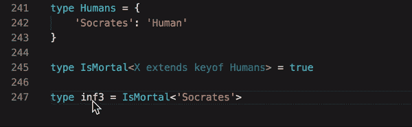
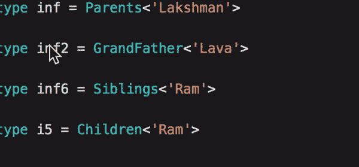
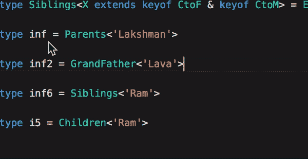
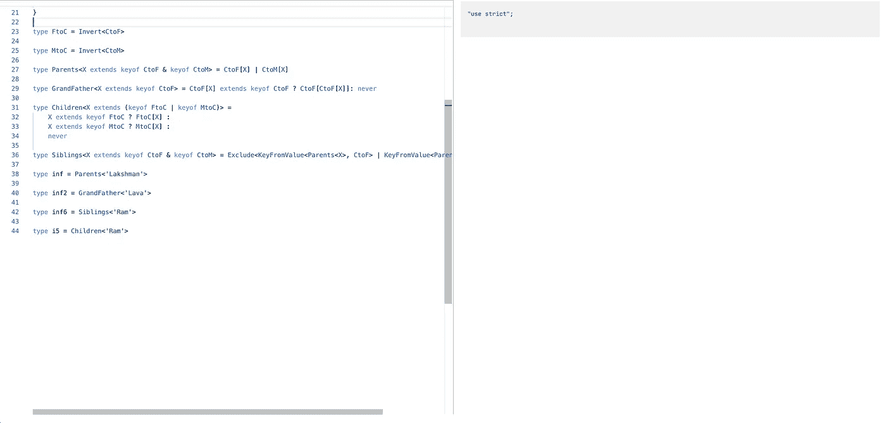

# 用打字稿中的 0 行程序解谜

> 原文：<https://itnext.io/solving-riddles-with-0-lines-of-program-b23994072dd0?source=collection_archive---------2----------------------->

# 事实和推论

考虑以下事实

*   所有的人都是凡人
*   苏格拉底是一个人

从以上事实很容易推断出苏格拉底是一个凡人。但是，如果存在一种能够从给定的事实中推断出结果的语言，那不是很神奇吗？

# 输入序言

Prolog 是一种逻辑编程语言。它的使用主要是在传统人工智能领域的学术研究。它给了我们一种语言，可以翻译上述逻辑语句时，可以查询。这种语言因此可以用来解决逻辑谜语！

```
mortal(X) :- human(X).
human(socrates).
```

上述语句是从英语到 prolog 的逻辑的直接翻译。如果我们质疑前提，

```
human(X)
```

给出以下结果

```
X = socrates
```

你可以在这个[网站](https://curiosity-driven.org/prolog-interpreter)试用 Prolog

# typescript——逻辑编程的独特竞争者

Typescript 是带有类型注释的 javascript 的上标。它给了我们一个非常高级的类型系统，可以消除使用普通 javascript 时可能出现的许多潜在错误。

但是拥有一个可证明的类型系统并不是 typescript 的目标(正如他们所说的)。

但是，我们能放弃 typescript 中的 prolog 吗？让我们在放弃梦想之前尝试一下吧！


# 将事实编码为类型

与 prolog 类似，事实可以在 typescript 中表示为类型。



在 typescript 中进行推断要简单得多。仅仅停留在类型上就能给出推断的结果。

让我们看看另一个例子的家谱。

```
type CtoF = {
    Ram: 'Dashrath',
    Lakshman: 'Dashrath',
    Lava: 'Ram',
    Kusa: 'Ram',
    Bharath: 'Dashrath'
}type CtoM = {
    Ram: 'Kousalya',
    Lava: 'Sita',
    Lakshman: 'Sumitra'
}
```

以上是孩子对父亲和孩子对母亲的事实模型。如您所见，与 prolog 的 mathy 语法相比，在类型中编码事实非常类似于创建一个键值对。

# 在类型系统中编码逻辑查询

让我们试着从事实中问出祖父

```
type GrandFather<X extends keyof CtoF> = CtoF[X] extends keyof CtoF ? CtoF[CtoF[X]]: never
```



同样，我们可以定义其他查询，如兄弟姐妹、父母等。这些例子也可以在 Prolog 入门部分找到。这是整个程序。

```
type KeyFromValue<V, T extends Record<PropertyKey, PropertyKey>> = {
  [K in keyof T]: V extends T[K] ? K : never
}[keyof T];type Invert<T extends Record<PropertyKey, PropertyKey>> = {
  [V in T[keyof T]]: KeyFromValue<V, T>
};type CtoF = {
    Ram: 'Dashrath',
    Lakshman: 'Dashrath',
    Lava: 'Ram',
    Kusa: 'Ram',
    Bharath: 'Dashrath'
}type CtoM = {
    Ram: 'Kousalya',
    Lava: 'Sita',
    Lakshman: 'Sumitra'
}type FtoC = Invert<CtoF>type MtoC = Invert<CtoM>type Parents<X extends keyof CtoF & keyof CtoM> = CtoF[X] | CtoM[X]type GrandFather<X extends keyof CtoF> = CtoF[X] extends keyof CtoF ? CtoF[CtoF[X]]: nevertype Children<X extends (keyof FtoC | keyof MtoC)> =
    X extends keyof FtoC ? FtoC[X] :
    X extends keyof MtoC ? MtoC[X] :
    nevertype Siblings<X extends keyof CtoF & keyof CtoM> = Exclude<KeyFromValue<Parents<X>, CtoF> | KeyFromValue<Parents<X>, CtoM>, X>type inf = Parents<'Lakshman'>type inf2 = GrandFather<'Lava'>type inf6 = Siblings<'Ram'>type i5 = Children<'Ram'>
```

以及更多的推论



# 点击诱饵标题推断

好吧，关于点击诱饵标题，我们只是写了这么多，它怎么算作 0 零线？如果复制粘贴[游乐场](https://www.typescriptlang.org/play)中的代码，可以看到右边生成的 js 代码什么都没有。从技术上讲，我们写了 0 行程序，而我们写的只是类型！



这个实验的关键是，

# “类型是事实& IDE 根据我们编写的约束从中推断出进一步的事实”

另一个类比是，当程序由运行时执行时，类型由类型检查器在编译时理解和推断，在我们的例子中是 IDE 本身。

像这样的系统被数学人称为**定理证明者**使用，许多其他语言可能会跟随这种趋势，在编译时推断事实，防止运行时灾难，如未捕获的异常、内存泄漏等。这种基于类型的工具对开发人员来说是一个福音，慢慢地向软件开发自动化迈出了一小步。

之所以能够用类型系统来表示逻辑，是因为一种叫做**库里—霍华德同构**的现象。你使用的每一种静态类型编程语言，你声明的类型是**定理**，而满足它们的程序是**证明**。一些语言利用了这一特性，而不是像 prolog 那样的逻辑，它们利用类型本身来证明它们的定理。其中包括精益、Coq、Idris 等，它们实现了各种类型的理论。